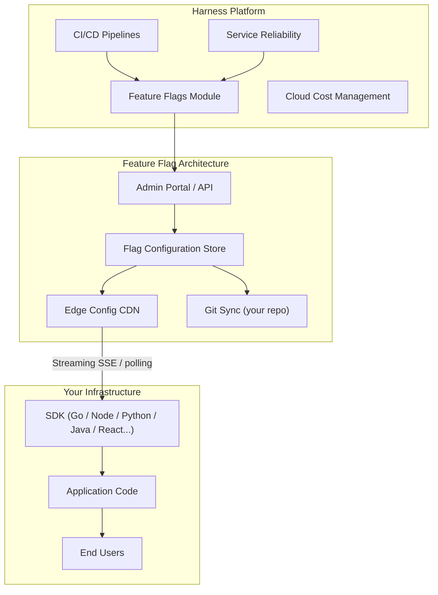
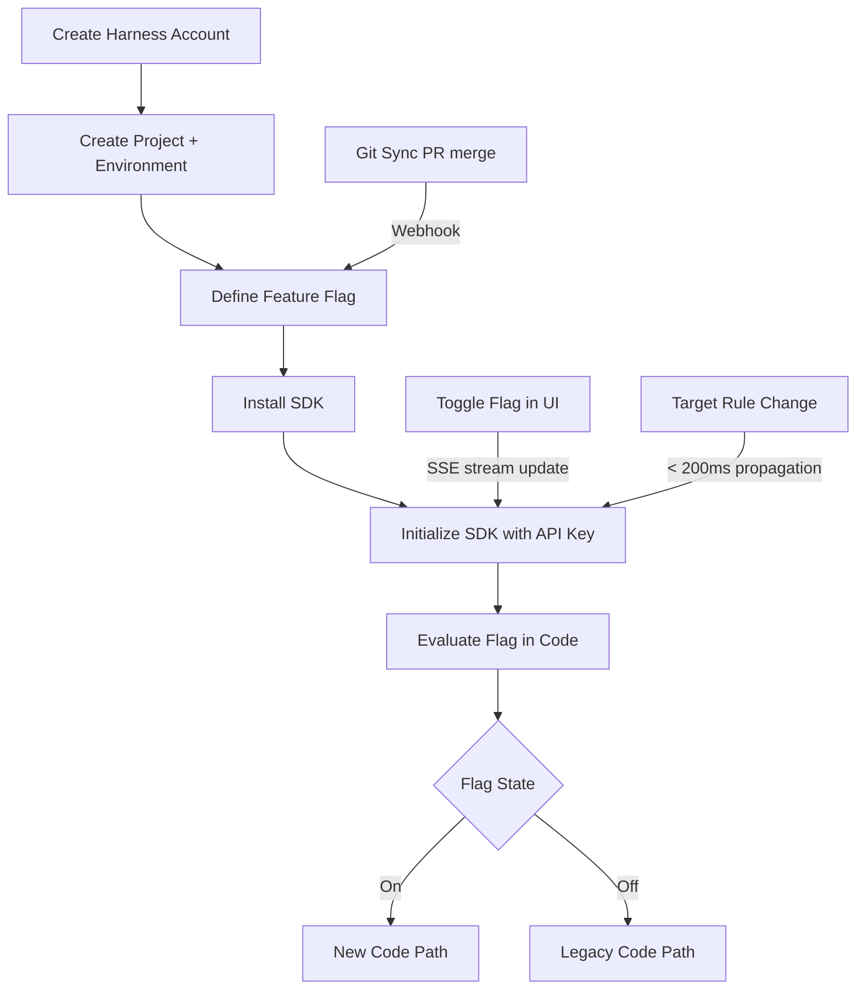
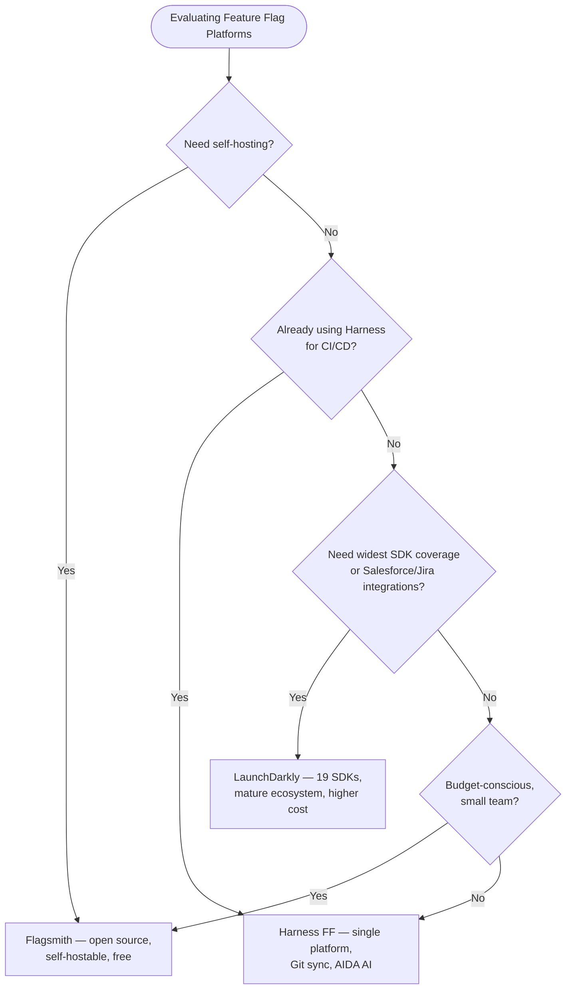

I have shipped features to production behind feature flags for years — first with homegrown toggle systems, then with LaunchDarkly, and for the past eight months with Harness Feature Flags. When my team migrated to Harness as part of a broader platform consolidation, I expected a step backward. We were trading a mature, dedicated feature-flagging product for a module inside a larger DevOps platform. What I found was more nuanced: Harness Feature Flags is genuinely capable, its AI-assisted automation is ahead of any competitor I have used, and the places where it still falls short are specific enough to plan around.

This review covers everything you need to decide whether Harness Feature Flags fits your team: architecture, targeting rules, SDK support, Git sync, a real getting-started walkthrough, pricing, and a head-to-head comparison with LaunchDarkly and Flagsmith.

## What Are Feature Flags?

Feature flags (also called feature toggles or feature gates) are conditional code paths that let you deploy code to production without exposing it to users. You wrap a block of functionality in an `if` check that reads from a remote configuration service instead of a hardcoded constant. When you are ready to release, you flip the flag without touching code or redeploying.

That simple idea unlocks a set of practices that define modern release engineering:

- **Trunk-based development** — developers merge to main continuously instead of maintaining long-lived feature branches
- **Progressive delivery** — roll out to 1%, then 10%, then 100% of users with automatic rollback on error spikes
- **Dark launches** — run new infrastructure paths in production without exposing the UI to users
- **Kill switches** — instantly disable a misbehaving feature without a hotfix deployment
- **A/B testing** — route user segments to different code paths and measure outcomes

The difference between a feature flag platform and a hand-rolled toggle system is the operations layer: targeting rules, audit logs, SDK client libraries, environment management, approval workflows, and — increasingly — AI-powered anomaly detection and automation.

## Harness Feature Flags Overview

Harness Feature Flags is one module inside the Harness Software Delivery Platform, which also covers CI/CD pipelines, cloud cost management, chaos engineering, service reliability management, and internal developer portals. That platform breadth is both a selling point and a source of complexity. If your team already uses Harness for deployments, adding Feature Flags requires no new vendor relationship, no new security review, and no new data pipeline. If you are a standalone flag-shopping exercise, you are buying into a larger system than you need immediately.

The module itself launched in 2021 and has shipped steadily. As of early 2026, it supports eleven SDK languages, has a Git sync feature that stores flag configuration in your own repository, and includes an AI module called Harness AI Development Assistant (AIDA) that generates targeting rules and analyzes flag hygiene. The feature set competes directly with LaunchDarkly's Growth and Enterprise tiers.



The architecture is straightforward. Your application embeds a Harness SDK that establishes a streaming Server-Sent Events connection to the Harness edge network. Flag state changes propagate in under 200ms in my testing. If the connection drops, the SDK falls back to a polling mode and then to a local cache, so your application continues to function even when the Harness network is unreachable.

## Key Features

### Targeting Rules

Targeting rules are the core of any feature flag platform, and Harness gives you a flexible rule builder. Each flag can have:

- **Default variations** — a boolean (on/off) or multivariate value returned when no rule matches
- **Individual targets** — specific user IDs always get a particular variation
- **Target groups** — rules that match on any attribute in your target context (email domain, plan tier, geographic region, custom attributes you define)
- **Percentage rollouts** — distribute traffic across variations with arbitrary weights
- **Prerequisite flags** — a flag is only evaluated after another flag resolves to a specific variation

The rule evaluation order is deterministic and visible in the UI. You can see exactly which rule a given target would match before you save changes, using the built-in test tool. I found this preview feature alone saved several incidents during our migration — the old system required a staging environment toggle to verify rule logic.

Multivariate flags support strings, numbers, JSON, and booleans. JSON variations are particularly useful when you want to ship configuration changes (theme tokens, rate limits, model parameters) through the same governance pipeline as code flags.

### Environments

Harness Feature Flags uses environments to isolate flag state across your deployment stages. Flags exist globally, but their targeting rules and default variations are configured per environment. A common setup looks like this: each flag starts with a default-off rule in production and can be turned on independently in development and staging for testing.

Environment promotion — copying the rule configuration from staging to production — is available in the UI and through the API. This sounds minor but matters in practice. Many incidents I have seen with feature flags happen because a rule was configured in staging and then manually re-entered in production with a typo. Promotion eliminates that class of error.

### SDK Support

Harness ships SDKs for eleven languages and frameworks as of February 2026:

- **Server-side:** Go, Java, Node.js, Python, .NET, Ruby, PHP
- **Client-side:** JavaScript, React, iOS (Swift), Android (Kotlin)

The SDKs follow a consistent pattern. You initialize with a server-side key, build a target object with whatever attributes your application knows about the current user, and call an `evaluate` method that returns the variation. Here is a real initialization example from our Go service:

```go
package main

import (
    "context"
    "log"

    harness "github.com/harness/ff-golang-server-sdk/client"
    "github.com/harness/ff-golang-server-sdk/dto"
)

func main() {
    client, err := harness.NewCfClient(
        "YOUR_SDK_KEY",
        harness.WithWaitForInitialized(true),
        harness.WithStreamEnabled(true),
    )
    if err != nil {
        log.Fatalf("failed to initialize Harness FF client: %v", err)
    }
    defer client.Close()

    target := dto.NewTargetBuilder("user-123").
        Name("Alicia Chen").
        Attributes(map[string]interface{}{
            "plan":   "enterprise",
            "region": "us-west-2",
            "beta":   true,
        }).
        Build()

    enabled, err := client.BoolVariation("new-checkout-flow", target, false)
    if err != nil {
        log.Printf("flag evaluation error: %v", err)
    }

    if enabled {
        runNewCheckoutFlow()
    } else {
        runLegacyCheckoutFlow()
    }
}
```

The `WithWaitForInitialized` option blocks startup until the SDK has fetched the current flag state, which prevents the brief window where your application serves default variations before the first config fetch. The `WithStreamEnabled` option turns on the SSE connection for sub-second flag updates.

The React SDK wraps this in a context provider and a `useFeatureFlag` hook, which makes client-side flagging feel native in a React application:

```tsx
import { useFeatureFlag } from '@harnessio/ff-react-client-sdk'

function CheckoutButton() {
  const newCheckout = useFeatureFlag('new-checkout-flow')

  return newCheckout
    ? <NewCheckoutButton />
    : <LegacyCheckoutButton />
}
```

### Git Sync

Git sync is the feature that separates Harness from most competitors. When enabled, every flag configuration change is committed to a branch in your own Git repository. The flag state lives in JSON files under a `.harness/flags/` directory. You can review flag changes in pull requests, roll back with `git revert`, and audit the full history of every targeting rule change with the same tools you use for code.

This matters more than it sounds. In regulated environments — financial services, healthcare, government — a feature flag that controls a billing path or a data-sharing setting is a configuration change that needs an audit trail. Storing that trail in Git means it is auditable, version-controlled, and exportable. It does not depend on Harness's audit log retention policy.

Git sync also enables infrastructure-as-code workflows. You can open a pull request to create a new flag, get it reviewed and approved by your team, and merge it — and the flag appears in Harness automatically. No clicking through a UI, no forgetting to document what a flag does.

## Getting Started

Getting from zero to your first evaluated flag takes about fifteen minutes if you follow these steps.

1. Create a Harness account and navigate to Feature Flags in the left sidebar.
2. Create a project and at least one environment (start with "Development").
3. Create a flag. Give it a name and choose boolean or multivariate. Leave it off by default.
4. Copy the SDK key for your environment from the Environments tab.
5. Install the SDK for your language. For Node.js: `npm install @harnessio/ff-nodejs-server-sdk`
6. Initialize the SDK with your key and evaluate the flag in your application.
7. Toggle the flag on in the Harness UI and watch the change propagate to your running application within seconds.



The first time the flag update arrives in your running process via the SSE stream, without a restart or redeploy, is the moment most teams understand why feature flags are worth the investment.

## AI-Powered Flag Management

Harness AIDA (AI Development Assistant) adds several AI-powered capabilities to Feature Flags specifically. I have used three of them in production and have opinions on each.

**Stale flag detection.** AIDA analyzes flag evaluation patterns and flags (pun intended) toggles that have not changed state in 30, 60, or 90 days and are no longer producing meaningful variation in traffic. In our codebase, AIDA identified 23 flags over three months that were effectively permanent — always-on or always-off for every target. Removing them cleaned up 1,400 lines of dead conditional logic across fourteen services.

**Targeting rule suggestions.** When you create a new flag and define a rollout goal in natural language ("roll out to enterprise customers in North America first"), AIDA generates a starting set of targeting rules that you can review and accept. I found these suggestions accurate for standard rollout patterns and useful as a starting point even when I wanted to customize them. The time saving is real: drafting complex attribute-based rules manually is tedious and error-prone.

**Anomaly detection.** AIDA monitors evaluation counts and error rates for each flag and sends alerts when a flag's behavior deviates from its historical baseline. In practice, this caught one incident for my team: a deployment that accidentally changed the SDK key reference in a microservice, causing all flag evaluations to fall back to defaults. AIDA flagged the anomaly within eight minutes, before our error rate monitors triggered.

The AI features are included in the paid plans and are behind a feature toggle themselves (appropriate). They are not transformative on their own, but they compound value over time — each stale flag removed is less cognitive load, and each accurate anomaly alert is an incident caught earlier.

## Pricing

Harness Feature Flags pricing is seat-based with a monthly active target add-on. As of early 2026:

- **Free tier:** Up to 25,000 monthly active targets (MATs), 2 environments, community SDK support
- **Team ($45/developer/month):** 100,000 MATs included, unlimited environments, AIDA features, Git sync, email support
- **Enterprise (custom):** Unlimited MATs, SSO, RBAC, custom contracts, SLA, dedicated support

Monthly active targets are the billing unit that surprises teams coming from per-seat pricing. If you ship a consumer application with a million users and you flag-check every session, you will accumulate MATs quickly. Run the math before committing: multiply your monthly active user count by the fraction of sessions that will hit at least one flag evaluation. For B2B SaaS, this is usually much lower than the raw user count because you are targeting accounts or employee IDs, not end consumers.

The Free tier is genuinely usable for small teams or early product stages. The 25,000 MAT limit is generous for internal tooling or B2B products with fewer than a thousand customer accounts.

## Harness FF vs LaunchDarkly vs Flagsmith

I have used all three in production environments. Here is an honest comparison.

| Capability | Harness FF | LaunchDarkly | Flagsmith |
|---|---|---|---|
| SDK languages | 11 | 19 | 15 |
| Git sync | Yes (native) | No (third-party) | Yes (native) |
| AI flag hygiene | Yes (AIDA) | Limited | No |
| Streaming updates | Yes | Yes | Yes |
| Audit log | Yes | Yes | Yes |
| Self-hostable | No | No | Yes |
| Free tier MATs | 25,000 | 1,000 | Unlimited (self-host) |
| Starting paid price | ~$45/dev/mo | ~$10/seat/mo | Free (cloud) / $45/mo (SaaS) |
| Platform breadth | Full DevOps suite | Flags-only | Flags-only |



**When to choose Harness FF:** Your team already uses or is evaluating Harness for pipelines. You want Git sync without third-party scripting. You care about AI-assisted flag hygiene. You have a B2B product where MAT counts are manageable.

**When to choose LaunchDarkly:** You need the broadest possible SDK coverage, particularly for mobile or embedded SDKs. Your team is flags-only and does not want to buy into a larger platform. You need deep integrations with tools like Salesforce, Jira, or Datadog that LaunchDarkly has spent years building.

**When to choose Flagsmith:** You have self-hosting requirements, either for compliance or cost. You are a small team that wants a fully capable open-source system. You are willing to manage infrastructure in exchange for eliminating per-MAT billing entirely.

## Limitations

Harness Feature Flags is not the right choice for every team. These are the real limitations I have encountered:

**No native self-hosting.** Harness is SaaS-only for the Feature Flags module. If your compliance requirements mandate that flag evaluation data never leaves your cloud account, Harness cannot satisfy that today. Flagsmith is the better choice in that scenario.

**Platform complexity.** If you only want feature flags, Harness will feel like a lot of platform. The UI is dense, onboarding takes longer than a flags-only product, and you will bump into Harness concepts (projects, organizations, pipelines) that have nothing to do with the flag you are trying to create. This cost is real for small teams.

**MAT pricing surprises.** B2C products with high daily active user counts can accumulate MATs faster than expected. I have seen teams significantly underestimate their MAT count before their first invoice. Model this carefully before signing a contract.

**SDK maturity varies.** The Go, Java, and Node.js SDKs are excellent. The PHP and Ruby SDKs have had more stability issues and lag on feature parity. Check the SDK changelog for your target language before committing.

**Lag in multivariate JSON flag updates.** We observed a 2-3 second delay in JSON multivariate flag propagation compared to boolean flags in our environment. This did not cause production issues but was unexpected and is worth knowing if you are building latency-sensitive configuration update workflows.

## Verdict

After eight months of daily use, Harness Feature Flags earns a solid recommendation for platform engineering teams and DevOps organizations that want feature flags tightly integrated with their delivery pipeline.

The Git sync feature is the strongest differentiator — it closes the gap between flag configuration and code configuration in a way that matters for compliance, auditability, and infrastructure-as-code workflows. AIDA's stale flag detection is the kind of unsexy feature that earns its keep quietly over months. The targeting rule system is flexible and well-designed. Propagation speed is competitive.

The limitations are real but specific. If you need self-hosting, look elsewhere. If you are a consumer app team worried about MAT costs, model the numbers carefully before signing. If you are already on the Harness platform, the answer is clear: add Feature Flags and consolidate.

**Rating: 8 / 10**

For teams outside the Harness ecosystem evaluating flags standalone, start with a free trial. The UI takes a day to learn and the Git sync alone may convert you.

## FAQ

### How does Harness Feature Flags handle SDK key rotation without downtime?

Harness supports multiple active SDK keys per environment simultaneously. You generate a new key, deploy it to your application alongside the old key, verify traffic is flowing through the new key, and then revoke the old one. The SDK will reconnect automatically when the active key changes, so there is no downtime during rotation. The process takes about five minutes and is fully documented in their SDK migration guide.

### Can I use Harness Feature Flags without buying the full Harness platform?

Yes. Feature Flags is available as a standalone module. You can sign up, create a project, and use only the Feature Flags UI and API without enabling CI/CD, cloud cost management, or any other Harness module. Your billing is limited to the Feature Flags tier. The platform UI will show the other modules, but they require separate setup and do not add to your bill unless you activate them.

### What happens to my application if the Harness network is unreachable?

The SDK handles this gracefully in three stages. First, it attempts to reconnect using exponential backoff for up to the configured timeout period. Second, it serves flag variations from its in-memory cache, which holds the last successfully fetched state. Third, if the cache has also expired, it falls back to the default variation values you specified at flag creation. In our eight months of use, we have never had a flag-related incident caused by Harness network availability.

### Does Git sync work with monorepos?

Yes, with configuration. You specify a target directory and file naming convention when setting up Git sync. For monorepos, the standard approach is to point the sync at a shared configuration directory like `config/feature-flags/` and use environment-prefixed file names. The Harness team publishes a monorepo setup guide and the Git sync feature supports both GitHub, GitLab, Bitbucket, and Azure Repos.

### How do Harness Feature Flags targeting rules handle high-cardinality attributes like user IDs?

Individual user targeting (pinning a specific user ID to a variation) is handled outside the rule evaluation path and stored as an indexed lookup. For percentage rollouts, Harness uses a deterministic hash of the target identifier — so the same user always gets the same variation across SDK instances and restarts. High-cardinality attribute matching (e.g., matching on specific email addresses) should use individual targets rather than attribute rules to avoid performance overhead in rule evaluation. The SDK processes rule evaluation locally after receiving the flag configuration, so cardinality does not affect network requests.
