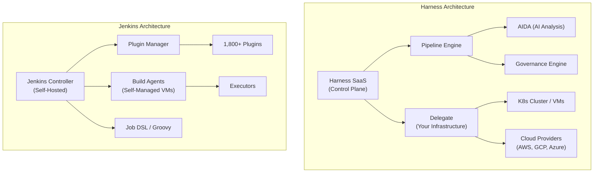
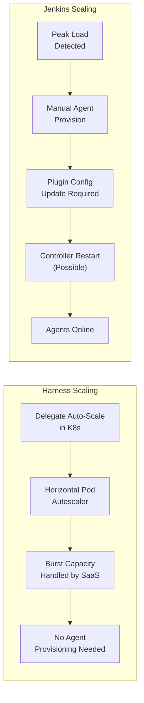
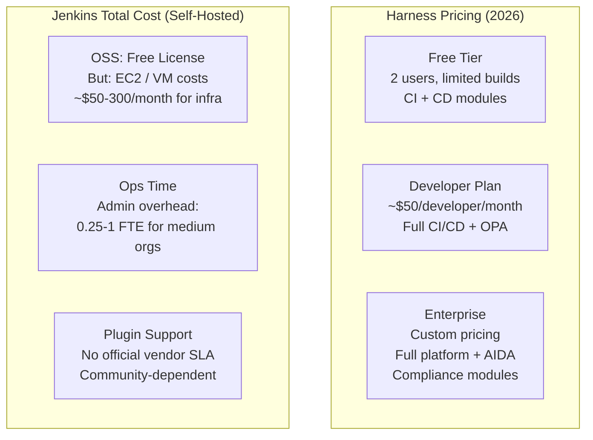
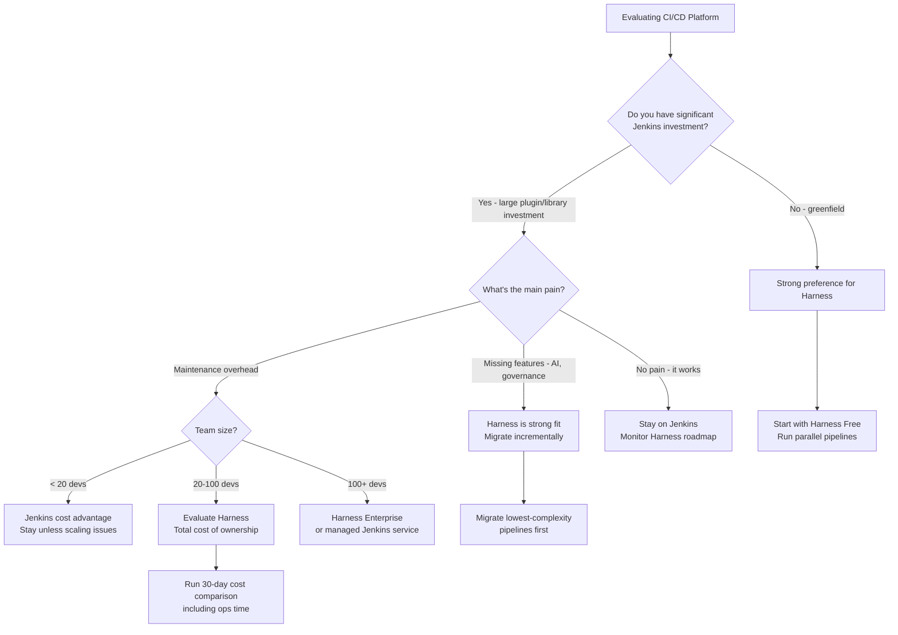

Jenkins has been the de facto CI/CD standard for over a decade. It powers pipelines at organizations of every size, boasts an ecosystem of over 1,800 plugins, and has more Stack Overflow answers than most developers will ever need. But the landscape has shifted. Cloud-native deployments, microservices sprawl, rising infrastructure costs, and the arrival of AI-assisted DevOps have exposed real gaps in a tool designed in the plugin-and-Groovy era.

Harness entered that gap with a purpose-built SaaS platform, an AI assistant called AIDA, and a strong pitch around developer experience. The question isn't whether Jenkins is still capable — it is. The question is whether the operational overhead, the plugin maintenance burden, and the absence of intelligent automation are costs your team is ready to keep paying.

We spent time running both platforms across realistic workloads — a Node.js microservice with Kubernetes deployments, a Python monolith with legacy Ansible scripts, and a Go service with multi-cloud targets — to give you an honest breakdown.

## TL;DR

> **Jenkins** wins for: teams with deep plugin customization, on-prem or air-gapped environments, maximum control over every pipeline element, and zero SaaS budget.
>
> **Harness** wins for: teams that need fast onboarding, built-in release governance, AI-assisted troubleshooting, and a managed platform that scales without a dedicated Jenkins admin.
>
> **For most growing engineering teams in 2026**: Harness is the better long-term bet if you can accept a SaaS dependency. Jenkins remains the right answer for highly regulated environments and teams with existing deep investment in the ecosystem.

---

## Quick Comparison

| Feature | Harness | Jenkins |
|---|---|---|
| **Pricing** | Free tier; paid plans from ~$100/month | Free (OSS); self-hosted infra costs apply |
| **Setup time** | Minutes (SaaS) | Hours to days (self-hosted) |
| **Pipeline syntax** | YAML (declarative) | Groovy (Jenkinsfile) |
| **AI features** | Harness AIDA (failure analysis, PR summaries) | None natively |
| **Plugin ecosystem** | ~200 native integrations | 1,800+ community plugins |
| **Cloud-native** | Built-in Kubernetes orchestration | Via plugins (fragile at scale) |
| **Scalability** | Auto-scales on managed infrastructure | Manual agent provisioning |
| **Self-hosted option** | Yes (Harness on-prem) | Yes (native) |
| **Governance & RBAC** | Enterprise-grade RBAC, audit logs | Manual or via plugin |
| **Best for** | Fast-moving teams, K8s-native orgs | Plugin-heavy, air-gapped, OSS budgets |

---

## Architecture: How Each Platform Thinks About Pipelines

The fundamental design philosophy diverges here, and it shapes everything downstream.

Jenkins was built as a server-and-agent model. A central controller dispatches jobs to worker agents — VMs, containers, or bare metal nodes you provision and maintain. The controller holds job configurations, plugin state, and build history. The agents do the actual work. This architecture made sense in 2011 and it still works, but it means you own the entire stack: controller uptime, agent fleet management, plugin compatibility, disk space for artifacts, and the Groovy knowledge to write and debug Jenkinsfiles.

Harness is architected as a SaaS-first, delegate-based system. Instead of you hosting everything, Harness runs the control plane and you install a lightweight "Delegate" — a Docker container or Kubernetes deployment — that connects outbound to the Harness cloud. Your secrets, your infrastructure, and your code stay in your environment. The delegate handles execution; Harness handles orchestration, UI, RBAC, audit logs, and AI analysis.



The practical difference: a Harness pipeline that targets a new Kubernetes cluster is configured via a YAML change and a delegate deployment. The equivalent in Jenkins involves installing the Kubernetes plugin, configuring cloud credentials, debugging the pod template YAML, and hoping the plugin version is compatible with your Jenkins version. Not impossible — just more friction.

---

## Setup and Configuration

**Jenkins first-run experience:** Download the WAR, run it, unlock it with a generated password, install the suggested plugins (or don't, and spend the next hour figuring out what you actually need), create your first admin user. The GUI configuration for a basic pipeline — source repo, build trigger, shell steps — takes another 30 minutes for someone who hasn't done it before. Configuration-as-code is possible with the JCasC (Jenkins Configuration as Code) plugin, but it's not the default path.

In a containerized environment, you'll also be writing your own Dockerfile for the controller, configuring persistent volumes for JENKINS_HOME, and setting up reverse proxy routing. None of this is hard, but it adds up to an afternoon of DevOps work before you've run a single build.

**Harness first-run experience:** Sign up, create an organization, install a Delegate into your cluster with a `kubectl apply` command, connect your GitHub repo via OAuth, and define a pipeline in YAML. Our first pipeline — a Docker build and push to ECR — was running in about 25 minutes from account creation.

The difference is not that Jenkins is difficult. It's that Harness ships the hard parts already done: the UI, the RBAC, the secret management, the audit logs, the notification routing. Jenkins gives you raw capability and expects you to assemble those pieces yourself, or find the right plugins to do it.

---

## Pipeline as Code: Jenkinsfile vs Harness YAML

This is where existing Jenkins teams feel the stickiest lock-in, and where newcomers to CI/CD will find Harness substantially easier.

**The Jenkinsfile (Groovy-based declarative pipeline):**

```groovy
pipeline {
    agent {
        kubernetes {
            yaml '''
                apiVersion: v1
                kind: Pod
                spec:
                  containers:
                  - name: maven
                    image: maven:3.8.1-jdk-11
                    command:
                    - sleep
                    args:
                    - 99d
            '''
        }
    }
    stages {
        stage('Build') {
            steps {
                container('maven') {
                    sh 'mvn clean package -DskipTests'
                }
            }
        }
        stage('Test') {
            steps {
                container('maven') {
                    sh 'mvn test'
                }
            }
        }
        stage('Deploy to Staging') {
            when {
                branch 'main'
            }
            steps {
                withCredentials([string(credentialsId: 'k8s-token', variable: 'TOKEN')]) {
                    sh 'kubectl apply -f k8s/staging.yaml'
                }
            }
        }
    }
    post {
        failure {
            slackSend channel: '#builds', message: "Build failed: ${env.JOB_NAME} #${env.BUILD_NUMBER}"
        }
    }
}
```

Groovy is expressive and powerful — but it's also a full programming language, which means your pipelines can (and do) accumulate complex logic, shared libraries, and edge cases that are hard to review and harder to debug. Groovy exceptions in Jenkinsfiles are notoriously opaque. If you've ever spent an afternoon on `java.lang.NullPointerException: Cannot get property 'changeSets' on null object`, you know what I mean.

**The equivalent Harness pipeline (YAML):**

```yaml
pipeline:
  name: Java Service Build and Deploy
  identifier: java_service_pipeline
  stages:
    - stage:
        name: Build and Test
        type: CI
        spec:
          cloneCodebase: true
          execution:
            steps:
              - step:
                  name: Maven Build
                  type: Run
                  spec:
                    image: maven:3.8.1-jdk-11
                    command: mvn clean package
              - step:
                  name: Run Tests
                  type: Run
                  spec:
                    image: maven:3.8.1-jdk-11
                    command: mvn test
    - stage:
        name: Deploy to Staging
        type: Deployment
        spec:
          deploymentType: Kubernetes
          service:
            serviceRef: java-service
          environment:
            environmentRef: staging
          execution:
            steps:
              - step:
                  type: K8sRollingDeploy
                  name: Rolling Deploy
                  spec:
                    skipDryRun: false
```

Harness YAML is more verbose for simple cases, but it scales more predictably. The schema is well-documented, the visual editor in the Harness UI generates valid YAML you can commit to your repo, and the error messages are specific enough to debug without a Groovy interpreter. Pipeline templates let teams define reusable stages that individual services can reference — a pattern Jenkins achieves through shared libraries, but with less ceremony.

For net-new teams, Harness YAML is easier to learn. For Jenkins veterans with large shared library investments, the migration has real cost — more on that below.

---

## AI and Intelligence Features

This is the clearest competitive divide in 2026, and it's widening.

**Harness AIDA (AI Development Assistant):** Harness's AI layer is woven throughout the platform — not bolted on as an afterthought. AIDA analyzes failed pipeline runs and surfaces root cause explanations in plain English. When a step fails, AIDA reads the logs, cross-references the pipeline configuration, and generates a natural language explanation of what went wrong and what to try next.

In our testing, AIDA correctly diagnosed a failed Docker build caused by a missing build argument (pointing to the specific line and the missing `--build-arg` flag), a Kubernetes deployment failure from a resource quota exceeded condition (including which namespace limit was hit), and a test failure that turned out to be a flaky integration test with a recommendation to check for network dependency.

Beyond failure analysis, AIDA offers:
- **PR pipeline impact analysis:** When a developer opens a PR, AIDA can predict which services are likely affected and which pipelines will need to run.
- **Policy recommendations:** AIDA flags pipeline configurations that violate security or governance best practices (hardcoded secrets, missing approval gates, public image pulls without pinned digests).
- **Cost anomaly detection:** Integrated with cloud cost data, AIDA can flag unexpectedly expensive pipeline runs or deployment configurations.

**Jenkins AI features:** None, natively. The Jenkins ecosystem includes third-party integrations with tools like Datadog, PagerDuty, and various log analysis platforms — but the "AI" layer is always something you assemble from external tools. There is no built-in failure explanation, no predictive impact analysis, no policy suggestion engine. You get raw logs and the accumulated knowledge of whoever manages your Jenkins instance.

This gap will matter more as teams grow. A senior DevOps engineer who knows Jenkins inside out can diagnose most failures quickly. Distributed teams with junior engineers or frequent pipeline changes get genuine value from AIDA's contextual explanations — it reduces the "post in Slack and wait for the Jenkins expert" cycle.

---

## Scalability and Cloud-Native Operations



Jenkins scaling is a solved problem — but it requires work you own. The Kubernetes plugin supports dynamic pod-based agents that spin up on demand, but configuring pod templates, resource limits, node selectors, and cleanup policies is non-trivial. At the controller level, Jenkins does not scale horizontally; there is one controller, and its availability is your team's responsibility. High-availability Jenkins (active/passive with a shared filesystem) is possible but requires external tooling and adds operational complexity.

Harness delegates auto-scale natively on Kubernetes. Add more replicas to your delegate deployment and Harness distributes work across them. The control plane — the part that would be your Jenkins controller — is Harness's responsibility. You don't operate it, patch it, or worry about its availability SLA. Harness publishes an SLA of 99.9% for the managed control plane.

For Kubernetes-native teams, Harness also ships native support for GitOps (via Argo CD integration), canary deployments, blue-green rollouts, and automatic rollback based on health checks — all configurable from the same YAML that defines the rest of your pipeline. Jenkins can do these things with the right combination of plugins and custom scripts, but the result is typically harder to audit and harder for new team members to understand.

---

## Pricing Comparison



Jenkins is free software. But "free" is the wrong frame for comparing CI/CD platform costs.

A realistic Jenkins cost model for a 50-developer team includes: EC2 or GCP instances for the controller and agent fleet (~$200-400/month at minimal scale), S3 or GCS for artifact storage, an ops engineer spending meaningful time on plugin updates and agent maintenance (conservatively 25-30% of a senior engineer's time at market rate), and the hidden cost of slow pipelines when the agent fleet is undersized during peak hours.

Harness pricing in 2026 starts with a free tier that covers basic CI/CD for small teams. The Developer Plan runs approximately $50 per developer per month and includes the full CI and CD modules, OPA-based policy enforcement, and AIDA features. Enterprise pricing is negotiated and includes compliance modules, advanced governance, and dedicated support.

The crossover math is real but depends heavily on your team size and existing cloud spend. For a 10-person team, Jenkins is almost certainly cheaper in pure dollar terms. For a 50+ person team where pipeline reliability, governance, and developer experience have compounding business value, Harness frequently comes out ahead when you include the operational overhead honestly.

---

## Plugin Ecosystem

Jenkins has 1,800+ plugins covering nearly every integration scenario imaginable: SCM systems, build tools, deployment targets, notification channels, security scanners, test reporting frameworks, and dozens of niche enterprise tools. If a CI/CD integration exists, there's almost certainly a Jenkins plugin for it. This is Jenkins' strongest ongoing advantage.

The cost of this breadth is fragility. Plugins are maintained by a mix of vendors, community members, and individual contributors. Plugin compatibility with your Jenkins version is not guaranteed. Upgrading Jenkins core occasionally breaks plugins you depend on. The plugin dependency graph can get complex in large installations, and debugging a failing plugin installation is a rite of passage most Jenkins admins have experienced.

Harness offers approximately 200 native integrations, covering the most commonly used tools in modern DevOps stacks: GitHub, GitLab, Bitbucket, AWS, GCP, Azure, Kubernetes, Terraform, Helm, Datadog, PagerDuty, Jira, and more. Coverage is strong for mainstream tooling. If your pipeline depends on a niche build tool or an unusual on-prem system, the Jenkins plugin library is deeper.

Harness also provides a plugin framework and supports running arbitrary Docker images as pipeline steps, which covers most integration scenarios that the native integrations don't. The experience isn't as seamless as a native plugin, but it works.

---

## Should You Switch? A Decision Guide



---

## Migration Path from Jenkins to Harness

If you decide to move, the migration is incremental — you don't need a big-bang cutover.

**Phase 1: Parallel pipelines (weeks 1-4).** Install the Harness delegate in your existing infrastructure. Recreate your two or three simplest pipelines in Harness YAML alongside the Jenkins equivalents. Run both, compare outputs, gain confidence in the Harness execution.

**Phase 2: Migrate new services first.** For any new service created during the migration period, build the pipeline in Harness natively. This gives you a growing Harness footprint without touching existing pipelines.

**Phase 3: Migrate complex pipelines.** Your Jenkins shared library logic and complex multi-stage pipelines require actual porting. Harness templates cover a lot of what shared libraries do, but custom Groovy logic in shared libraries needs to be rewritten as container steps or moved to script files. This phase is where migration timelines are commonly underestimated — budget 2-4 engineer-weeks per major shared library.

**Phase 4: Decommission.** Once all pipelines are running successfully in Harness, archive the Jenkins configuration (JCasC YAML) and shut down the controller. Keep the old agents available for 30 days in case of rollback needs.

The Harness documentation includes a Jenkins migration guide with field-by-field mappings for common Jenkinsfile patterns. It's not exhaustive, but it covers the most frequent cases and reduces the blank-page problem when porting a complex Jenkinsfile.

---

## Our Verdict

**Jenkins** is not a bad choice in 2026. It's a mature, battle-tested platform with an ecosystem that took fifteen years to build. If your team has deep Jenkins expertise, a large shared library investment, an air-gapped or regulated environment, or simply no appetite to pay for a SaaS CI/CD platform, Jenkins is still a rational default.

**Harness** is the right choice for teams that are scaling, moving to Kubernetes, dealing with pipeline reliability problems, or spending meaningful engineering time on CI/CD maintenance rather than product work. The AI features in AIDA aren't a gimmick — failure root cause analysis alone pays for itself in a team where "my pipeline failed and I don't know why" is a regular occurrence. The managed infrastructure and built-in governance make Harness particularly strong in organizations where compliance, auditability, and change management matter.

For teams choosing a CI/CD platform from scratch today, we'd start with Harness. The free tier is genuinely useful, the learning curve for YAML-based pipelines is shallower than Groovy for most developers, and the platform's trajectory — more AI features, better GitOps integration, continued enterprise governance tooling — is pointed in the right direction.

For teams with substantial Jenkins investment: you don't need to migrate. But you should budget the time for an honest cost accounting that includes ops overhead and the value of developer experience, not just infrastructure spend.

---

## Frequently Asked Questions

### Can Harness run fully on-premises without SaaS dependency?

Yes. Harness offers a self-managed (on-premises) edition that runs the entire control plane in your infrastructure. It requires Kubernetes for the management layer and is more complex to operate than the SaaS version, but it's a genuine option for air-gapped or highly regulated environments that can't route traffic to Harness's cloud. Jenkins retains an advantage in pure simplicity for on-prem deployments since it's a single JAR file with no orchestration overhead.

### How does AIDA handle sensitive log data during AI analysis?

Harness processes AI analysis on data that passes through its platform — which includes your build logs by design, since logs are the input for failure analysis. Harness's data processing agreement governs how this data is handled and retained. Teams with strict data residency requirements should review the DPA carefully, particularly for regulated industries. The self-managed edition processes AI analysis within your own infrastructure using Harness's AI services, which gives more control over data locality.

### Is Jenkins faster for builds than Harness?

Build speed is determined primarily by your build infrastructure, test suite size, and parallelism configuration — not by which CI/CD platform orchestrates the work. A well-tuned Jenkins setup and a well-tuned Harness setup running the same build steps on equivalent hardware will produce similar build times. What Harness typically improves is pipeline reliability (fewer flaky failures from plugin issues) and time-to-fix when failures do occur, rather than raw build speed.

### Can I use both Jenkins and Harness together?

Yes, and many organizations do during migrations. Harness can trigger Jenkins jobs as pipeline steps, and Jenkins can be configured to notify Harness of build outcomes via webhooks. A common pattern is to keep Jenkins for build steps where there's a large shared library investment and use Harness for the deployment and governance stages where its built-in features add the most value. It's not a permanent architecture — the overhead of running two platforms is real — but it's a viable migration bridge.

### What happens to our Jenkinsfiles if we migrate?

Jenkinsfiles don't directly translate to Harness YAML — the syntax and conceptual model differ enough that automated conversion tools produce incomplete results. The migration is a rewrite, not a transpilation. In practice, most Jenkinsfile logic maps to Harness concepts: `stages` become Harness stages, `steps` become Harness steps, shared library calls become either Harness template references or container-based script steps. The complexity is in custom Groovy logic that doesn't have a direct Harness equivalent and needs to be rethought, not just translated.
