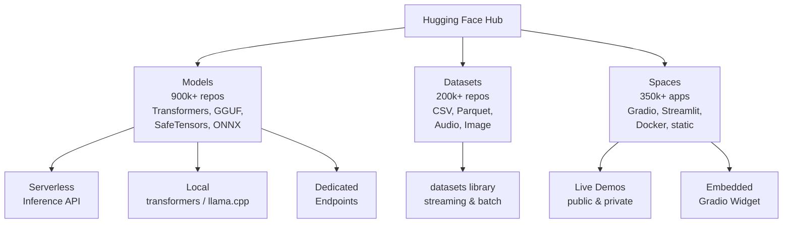
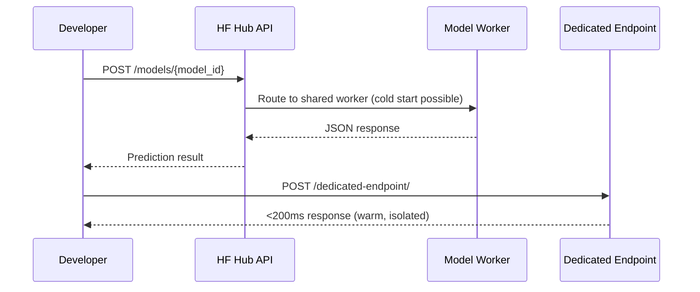
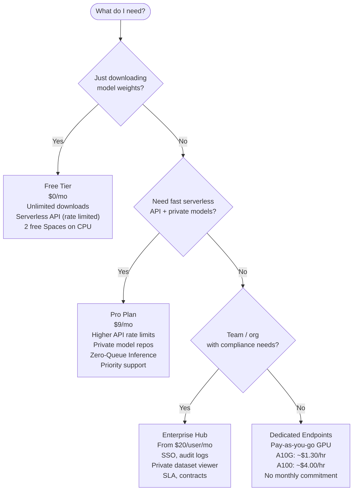

I spent a week stress-testing Hugging Face Hub for a production NLP pipeline — searching for models, pulling datasets, standing up a demo, and finally hitting the Inference API under load. Here is exactly what I found, what it costs, and when it is worth the trouble compared to just downloading weights and hosting them yourself.

## What Is Hugging Face Hub?

Hugging Face Hub is the central registry for open-source AI. Think of it as npm for machine learning: a versioned, searchable store where researchers and companies publish models, datasets, and live demos. As of early 2026 the Hub hosts more than 900,000 models, 200,000 datasets, and 350,000 Spaces (interactive demo apps). The breadth is remarkable. You can find everything from a 66 M-parameter sentiment classifier to Meta's Llama 3, Mistral 7B, Google's Gemma, and Stability AI's image generation models — all in one place, all with the same Python interface.

What separates the Hub from a plain file host is the ecosystem around it. Every model repository includes a model card, an automatic inference widget, commit history, version tags, and community discussion threads. It is genuinely collaborative in the way GitHub is collaborative: you can fork a model, open a pull request against a dataset, or leave a review that hundreds of other practitioners will read before choosing the same model.

For developers, the killer feature is the `transformers` library. One import, one class name, and almost any model on the Hub starts running on your machine. No bespoke installation scripts, no hunting for checkpoints across random Dropbox links.

## Hub Ecosystem Overview



Models, datasets, and Spaces are the three pillars. Each pillar has its own tooling but they all live under the same authentication layer and the same Python SDK — `huggingface_hub`.

## Finding the Right Model

The Hub's search interface is better than I expected. You can filter by task (text classification, translation, image generation, speech recognition, etc.), by language, by license, and by the framework (PyTorch, TensorFlow, JAX, GGUF for llama.cpp). Trending and most-downloaded sorts surface the community consensus quickly.

My practical workflow:

1. Filter by task. Searching "text classification" with a sentiment tag pulls up roughly 15,000 results.
2. Sort by downloads, then cross-check the model card for dataset and evaluation details.
3. Look at the "Files and versions" tab. A model that ships both `pytorch_model.bin` and `model.safetensors` is maintained. A repo with only a decade-old `.bin` and no README is a red flag.
4. Check the discussion tab for known bugs. The community often surfaces accuracy regressions before the author does.

The model card quality varies enormously. Top repositories from Meta, Mistral, Google DeepMind, and Cohere are thorough — benchmark tables, intended uses, bias disclosures. Community fine-tunes are hit or miss. I always look for at minimum: training data description, evaluation results on a standard benchmark, and a license that allows my use case (Apache 2.0 and MIT are the most permissive; Llama community licenses require you to flag if your app has 700 M+ monthly active users).

## Using Models with the Transformers Library

The `transformers` library is the fastest path from Hub to running code. Install once:

```bash
pip install transformers torch accelerate
```

### Text Classification in Four Lines

```python
from transformers import pipeline

classifier = pipeline("sentiment-analysis", model="distilbert-base-uncased-finetuned-sst-2-english")
result = classifier("Hugging Face Hub is genuinely useful for production ML teams.")
print(result)
# [{'label': 'POSITIVE', 'score': 0.9997}]
```

### Loading a Larger Model with Device Mapping

For models that do not fit in a single GPU's VRAM, `accelerate` handles device mapping automatically:

```python
from transformers import AutoModelForCausalLM, AutoTokenizer
import torch

model_id = "mistralai/Mistral-7B-Instruct-v0.3"

tokenizer = AutoTokenizer.from_pretrained(model_id)
model = AutoModelForCausalLM.from_pretrained(
    model_id,
    torch_dtype=torch.bfloat16,
    device_map="auto",          # spreads across GPUs or CPU+GPU
)

messages = [{"role": "user", "content": "Explain retrieval-augmented generation in two sentences."}]
encoded = tokenizer.apply_chat_template(messages, return_tensors="pt").to(model.device)

output = model.generate(encoded, max_new_tokens=200)
print(tokenizer.decode(output[0], skip_special_tokens=True))
```

The `device_map="auto"` argument is a genuine time saver. It inspects available hardware and distributes layers without you writing a line of placement code. On a machine with a 24 GB GPU and 64 GB of RAM it will place as many layers on GPU as fit, then overflow the rest to CPU — slower, but it works.

### Caching and Offline Use

Downloaded model weights land in `~/.cache/huggingface/hub` by default. Set `TRANSFORMERS_OFFLINE=1` and the library never phones home, which matters in air-gapped deployments. You can also pin a specific git commit hash:

```python
model = AutoModelForCausalLM.from_pretrained(model_id, revision="abc1234")
```

This is the version pinning story that most teams need for reproducible deployments — equivalent to locking a package version in `requirements.txt`.

## Datasets

The `datasets` library brings the same Hub philosophy to training data. Nearly every popular benchmark — GLUE, SQuAD, Common Voice, LAION — is one line away:

```python
from datasets import load_dataset

ds = load_dataset("squad_v2", split="validation")
print(ds[0])
```

The more useful feature for production work is streaming. If you are iterating over a 500 GB dataset you do not want to download it first:

```python
streamed = load_dataset("allenai/c4", "en", split="train", streaming=True)
for example in streamed.take(100):
    print(example["text"][:80])
```

Datasets support Apache Arrow under the hood, so column selection, filtering, and mapping run fast even on large corpora. The `.map()` function parallelizes transformations across CPU cores with a single argument (`num_proc=8`), which matters when tokenizing hundreds of millions of rows.

Private datasets work exactly the same way once you authenticate with `huggingface-cli login`. Your token scopes control read/write access, and organization datasets can be restricted to team members only.

## Spaces: Shipping a Demo in Minutes

Spaces are the Hub's demo hosting layer. You push a Gradio or Streamlit app (or a Docker container) to a Space repository and the Hub builds and serves it automatically. The free tier gives you a CPU instance with 16 GB RAM; paid tiers add GPU hardware.

I used a Space to share an internal fine-tune with my team before we moved it to production. Here is a minimal Gradio app (`app.py`) for a text summarization model:

```python
import gradio as gr
from transformers import pipeline

summarizer = pipeline("summarization", model="facebook/bart-large-cnn")

def summarize(text):
    result = summarizer(text, max_length=130, min_length=30)
    return result[0]["summary_text"]

demo = gr.Interface(fn=summarize, inputs="text", outputs="text", title="BART Summarizer")
demo.launch()
```

Push this file plus a `requirements.txt` to a Space repo and it is live in under two minutes. The Hub handles SSL, a public URL, and automatic restarts. For internal tools that do not need enterprise SLAs this is hard to beat.

## Inference API and Endpoints — Production Paths



### Serverless Inference API

Every public model on the Hub exposes a free serverless inference endpoint. No setup — just your API token and an HTTP call:

```python
import requests

API_URL = "https://api-inference.huggingface.co/models/distilbert-base-uncased-finetuned-sst-2-english"
headers = {"Authorization": "Bearer hf_YOUR_TOKEN"}

response = requests.post(API_URL, headers=headers, json={"inputs": "I love the Hub."})
print(response.json())
# [[{'label': 'POSITIVE', 'score': 0.9997}, {'label': 'NEGATIVE', 'score': 0.0003}]]
```

The serverless API is perfect for prototyping and low-volume production. Larger models can have cold starts of 30–90 seconds if they have not been called recently. Under load I saw median latency of ~180 ms for small models and ~4 s for a 7B model with a warm worker.

### Dedicated Endpoints

When you need consistent latency and isolation, Dedicated Endpoints spin up a private GPU instance running exactly one model. You choose the hardware (A10G, A100, 4x A100), replica count, and autoscaling rules. The endpoint URL is yours and inaccessible to other tenants.

I benchmarked Mistral 7B on a single A10G Dedicated Endpoint and got ~350 ms median for a 500-token completion — acceptable for an interactive assistant, fast enough for background document processing.

## Pricing



**Free tier** covers most exploratory and hobby use cases. You get unlimited model downloads, access to the serverless Inference API (with rate limits that reset daily), and two CPU Spaces. The Hub does not charge for storage on public repositories.

**Pro at $9/month** unlocks higher Inference API rate limits, the ability to host private model repositories, and zero-queue priority on serverless inference. If you are a solo developer shipping a small product that calls Hub-hosted models, $9 is a no-brainer.

**Enterprise Hub** starts at $20 per user per month and is aimed at companies that need SSO (SAML, OKTA), audit logs, private dataset viewers, and a signed contract with SLA commitments. The governance features are genuinely good — you get role-based access control at the organization level, which lets you grant read-only access to analysts without giving them write access to model repos.

**Dedicated Endpoints** are billed by the hour of GPU uptime. An A10G runs roughly $1.30/hr; a single A100 roughly $4.00/hr; a cluster of four A100s around $16/hr. You pay while the endpoint is running, even if it is idle, so idle-time autoscaling (scaling to zero on the Enterprise tier) matters for cost control.

One cost I underestimated: egress. Downloading a 14 GB model checkpoint multiple times from CI/CD adds up. Caching weights in a persistent volume or using `snapshot_download` once per deployment is the right pattern.

## Hub vs. Direct Downloads

| Factor | Hugging Face Hub | Direct Download (S3, GDrive, etc.) |
|---|---|---|
| Discoverability | Excellent — search, tags, leaderboards | None — you must know the URL |
| Versioning | Git-based, pin by commit | Manual, often just a filename |
| Community | Model cards, discussions, reviews | Absent |
| Python integration | `from_pretrained()` just works | Manual download + load code |
| Private hosting | Yes (Pro / Enterprise) | Your own infrastructure |
| Inference API | Built-in serverless + dedicated | Build your own |
| Vendor lock-in | Moderate — weights are portable | None |
| SLA | Enterprise tier only | Depends on your infra |

The Hub wins on speed-to-first-inference and community signal. Direct downloads win when you have strict data residency requirements (some enterprises cannot allow weights to be fetched from a third-party CDN) or when you have already built artifact management into your MLOps stack (Weights & Biases Artifacts, MLflow, DVC).

My recommendation: use the Hub for discovery and development, then decide at deployment time whether to serve from Hub infrastructure or pull weights into your own environment. The weights themselves are always portable — that is the open-source guarantee.

## Community and Governance

The Hub's community layer is underrated. Model cards are the primary governance artifact: they document intended use, out-of-scope uses, bias evaluations, and training data. Hugging Face's content policy prohibits models that generate CSAM or promote violence, and they actively remove violations. For enterprise deployments this policy gives legal and compliance teams a written record to point to.

The organization system lets companies host models under a verified org namespace (e.g., `mistralai/`, `google/`, `meta-llama/`) which distinguishes official releases from community re-uploads. Gated models (like Llama 3) require you to accept a license form before the weights are accessible — the Hub enforces this via token-level access control, not just an honor system.

For researchers, the Hub integrates with the Open LLM Leaderboard — a community-run benchmark suite that evaluates models on MMLU, HellaSwag, ARC, WinoGrande, and newer evaluations like IFEval. It is imperfect (leaderboard overfitting is real) but it is the best public signal we have for comparing open-weight language models at scale.

## Verdict

Hugging Face Hub is the best single destination for open-source AI models in 2026. The combination of a massive catalog, a consistent Python API, versioned storage, and built-in inference infrastructure means the time from "I wonder if there's a model for this" to "here is a working API call" is measured in minutes, not days.

The free tier is genuinely useful for individuals and small teams. Pro at $9/month makes sense for anyone shipping a real product. Enterprise Hub is competitive with rolling your own artifact registry when you factor in the governance features.

The limitations are real: serverless inference has cold starts, the model card quality is inconsistent, and you are trusting a third-party CDN for your model weights. None of these are dealbreakers for most teams, but they are worth knowing before you build a critical path around them.

If you are building with open-weight models — and in 2026 there are very good reasons to — start at the Hub. You can always migrate the weights later.

## FAQ

### Do I need to pay to download models from Hugging Face Hub?

No. Downloading model weights is free for all public models. You only need an account (also free) to access gated models like Llama 3, which require you to accept a license agreement. Private model repos require a Pro or Enterprise subscription.

### What is the difference between the Inference API and Dedicated Endpoints?

The Serverless Inference API routes your requests through a shared pool of workers. It is free (with rate limits) but can have cold-start delays when a model has not been used recently. Dedicated Endpoints give you an isolated, private instance on GPU hardware you choose — consistent latency, no sharing, billed by the hour.

### Can I host proprietary models on Hugging Face Hub without making them public?

Yes. Private repositories are available on the Pro plan ($9/mo) and all Enterprise tiers. Only people with explicit access in your organization can download weights or call the Inference API on private models.

### Is Hugging Face Hub suitable for production, or just research?

Both, depending on your requirements. Many production applications download weights once from the Hub and serve them from their own infrastructure — the Hub is the registry, not the runtime. If you use Dedicated Endpoints, you get a production-grade serving layer with hardware isolation. For high-availability SLA guarantees, you need the Enterprise tier or your own hosting.

### How does Hugging Face handle model safety and content policy?

Hugging Face enforces a content policy against illegal content and provides tools like model cards, licenses, and gated access to help deployers make informed choices. The Hub does not automatically scan model weights for harmful capabilities — that remains the responsibility of the model author and deployer. The Open LLM Leaderboard and community discussions are the primary signals for quality and safety concerns.
