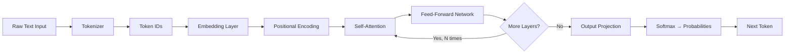
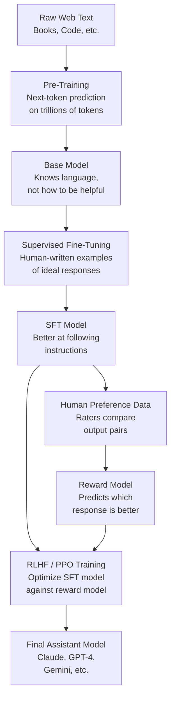
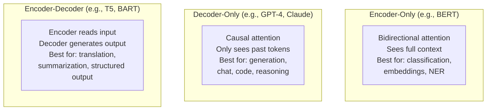

Every week I talk to developers who are shipping applications on top of GPT-4o, Claude, or Gemini without a clear mental model of what is actually happening inside the model. That is usually fine — you do not need to understand combustion to drive a car. But when things go wrong (and they will go wrong), having that mental model is what separates a developer who fixes the problem in an hour from one who spends a week blaming the API.

This guide is my attempt to give you the mental model. I will cover how transformers work, why the architecture produces the behavior you see in production, and what the underlying mechanics mean for the choices you make when you build with LLMs. No PhD required.

## The Big Picture: What a Language Model Actually Does

A large language model is, at its core, a function. You give it a sequence of tokens (more on tokens in a moment) and it gives you back a probability distribution over what token should come next. Everything else — the apparent reasoning, the code it writes, the summaries it produces — emerges from applying that one simple operation over and over again.

The "large" part matters because scale changes what the function can do. A small model trained on limited data learns shallow statistical associations. A large model trained on hundreds of billions of tokens learns something that, from the outside, looks remarkably like understanding. Whether it actually "understands" anything is a philosophy question I will leave alone. What I care about is that the behavior is useful and predictable enough to build on.

The transformer architecture, introduced in the 2017 paper "Attention Is All You Need," is the specific design that made scaling work. Before transformers, recurrent neural networks (RNNs) processed text one token at a time, which made them slow to train and bad at capturing long-range dependencies. Transformers process the entire sequence in parallel and use a mechanism called attention to let every token look at every other token simultaneously. That parallelism is why you can train GPT-4-scale models at all.

Here is the high-level flow of a transformer processing your prompt:

Each step has a job. Let me walk through them.

## Step 1: Tokenization — Breaking Text into Pieces

Before a transformer sees your text, it needs to convert it into numbers. The component that does this is the tokenizer, and it does not split on words or characters — it splits on *tokens*, which are subword units learned from the training corpus.

OpenAI's `cl100k_base` tokenizer (used by GPT-4) has a vocabulary of 100,277 tokens. Anthropic's models use a similar approach. Common English words map to a single token. Less common words get split. "Tokenization" might become `["token", "ization"]`. The word "supercalifragilistic" might become six or seven tokens. Code often tokenizes differently from prose — underscores, brackets, and whitespace all have their own tokens.

Why does this matter to you as a developer?

1. **Cost is measured in tokens, not words.** A 750-word document is roughly 1,000 tokens in English, but code and non-English text can be 2-3x denser in tokens.
2. **Long numbers and unusual identifiers cost more.** A UUID like `550e8400-e29b-41d4-a716-446655440000` might consume 15-20 tokens.
3. **The context window limit is a token limit.** When a model says it has a 128K context window, that is 128,000 tokens, not words.

Every token in your prompt and every token the model generates has an integer ID. Those IDs are what actually enter the model.

## Step 2: Embeddings — Turning Token IDs into Meaning

A token ID is just a number. The model needs to turn that number into something that carries semantic meaning. That is what the embedding layer does.

Each token ID maps to a high-dimensional vector — typically 768 to 12,288 floating-point numbers depending on model size. These vectors are not manually designed. They are learned during training. The remarkable thing is that the geometry of the embedding space encodes meaning: words with similar meanings cluster together, and relationships between words are encoded as vector offsets.

The classic example: the vector for "king" minus "man" plus "woman" is close to the vector for "queen." This is not programmed in — it falls out of training on enough text.

After embedding, the model adds *positional encodings* — another vector that encodes where in the sequence each token appears. Without positional information, the transformer would treat "the dog bit the man" and "the man bit the dog" as equivalent, since both contain the same tokens.

## Step 3: Self-Attention — the Core Mechanism

Self-attention is the part of the transformer that makes it genuinely different from everything before it. Here is the intuition.

Imagine you are reading the sentence: "The bank by the river overflowed during the flood." When you process the word "bank," your brain immediately reaches forward to "river" and "flood" to resolve the ambiguity — this is a riverbank, not a financial institution. You did not process the sentence left-to-right in isolation; you let every word inform the meaning of every other word.

Self-attention does exactly this, but formally and for every token in parallel.

For each token, the model computes three vectors:
- **Query (Q):** "What am I looking for?"
- **Key (K):** "What do I offer to others looking at me?"
- **Value (V):** "What information do I contribute if someone attends to me?"

The attention score between two tokens is computed as the dot product of one token's Query and another token's Key, scaled and passed through a softmax. This produces a weight between 0 and 1 for every pair of tokens. The output for each token is then a weighted sum of all the Value vectors in the sequence.

The formula looks like this:

**Attention(Q, K, V) = softmax(QK^T / √d_k) × V**

Where `d_k` is the dimension of the key vectors (used for scaling to prevent the dot products from getting too large).

In plain language: each token decides how much to "pay attention to" every other token in the sequence, then blends their information accordingly. A token at position 50 can directly attend to a token at position 1 or position 500 with equal computational cost. This is why transformers handle long-range dependencies so much better than RNNs.

## Step 4: Multi-Head Attention — Looking in Multiple Ways

One attention "head" can only focus on one type of relationship at a time. In practice, the model needs to track many things simultaneously: grammatical structure, entity references, semantic similarity, causal relationships.

Multi-head attention runs the attention mechanism several times in parallel with different learned Q, K, and V projection matrices. GPT-3 has 96 attention heads per layer. Each head can specialize: one might track subject-verb agreement, another coreference (which pronoun refers to which noun), another semantic similarity.

The outputs of all heads are concatenated and projected back to the model's working dimension. The model learns, through training, which kinds of relationships each head should track. This is not manually specified — it emerges from gradient descent.

The practical implication: when a model seems to "understand" that "it" in "the trophy didn't fit in the suitcase because it was too big" refers to the trophy (not the suitcase), that disambiguation is happening through multi-head attention tracking entity references across the context.

## Step 5: Feed-Forward Networks — Processing What Attention Found

After the attention layer blends token representations, a feed-forward network (FFN) processes each token independently. The FFN is a two-layer neural network with a large hidden dimension — typically 4x the model's working dimension.

If attention is the part of the transformer that gathers information from context, the FFN is where that information is processed and transformed. Research into individual neurons in these layers has found that specific neurons activate for specific concepts: some neurons track position, some track syntax, some seem to activate for factual associations.

The FFN is applied identically to every token position but with no cross-token interaction. That independence is why the forward pass can be parallelized so efficiently on GPUs.

## The Full Stack: N Layers Deep

A real transformer does not do this once. GPT-3 stacks 96 layers. Claude's models have undisclosed depths but similar scale. Each layer consists of:

1. Multi-head self-attention (with residual connection)
2. Layer normalization
3. Feed-forward network (with residual connection)
4. Layer normalization

The residual connections (adding the input to the output of each sub-layer) are critical for training stability — they let gradients flow directly through the network during backpropagation without vanishing.

Early layers tend to capture low-level patterns: syntax, common phrases. Middle layers capture semantic relationships. Later layers handle task-specific reasoning. This progression is why fine-tuning often only updates the later layers — the early layers encode general language structure that transfers across tasks.

## Training: Where the Model Gets Its Capabilities

Understanding inference is only half the picture. You also need to understand how a model acquires its behavior.

Training happens in three phases for most modern LLMs:

**Pre-training** is the computationally expensive foundation. The model is shown hundreds of billions of tokens from the web, books, code, and other text. At each step, it predicts the next token given all previous tokens, compares its prediction to the actual next token, computes the loss (cross-entropy), and updates its weights via backpropagation. Over trillions of gradient steps, the model gets better at this prediction task. As a side effect, it learns grammar, facts, code patterns, reasoning strategies, and more — because all of these are useful for predicting text.

Pre-training a GPT-4-scale model costs tens of millions of dollars in compute. It is not something you do at home.

**Fine-tuning** adapts the pre-trained model to a specific behavior or task. You might fine-tune on examples of correct question-answering, code in a specific style, or domain-specific documents. The model already knows language; fine-tuning teaches it what kind of outputs are expected. This is orders of magnitude cheaper than pre-training and is accessible through most major API providers.

**RLHF (Reinforcement Learning from Human Feedback)** is the step that turns a raw language model into a helpful assistant. Human raters compare pairs of model outputs and indicate which is better. A separate "reward model" is trained on these comparisons to predict human preference. The main model is then fine-tuned using reinforcement learning to maximize the reward model's score. This is why Claude and ChatGPT follow instructions helpfully instead of just predicting statistically likely continuations of prompts.

## Inference and Generation: How the Model Produces Text

When you call an API with a prompt, the model does not "think about" your request and then write a response. It generates one token at a time, appending each token to the context, and uses the now-longer context to predict the next one.

This is called **autoregressive generation**, and it has several important implications:

**Earlier tokens influence later ones, but not vice versa.** The model cannot go back and revise a token it already generated. This is why models sometimes back themselves into corners — they committed to a direction early on and cannot reverse it without being explicitly asked to.

**Temperature controls randomness.** Before sampling from the probability distribution, the model applies a temperature parameter that sharpens or flattens the distribution. Temperature 0 always picks the most probable next token (deterministic but repetitive). Temperature 1 samples proportionally from the distribution. Temperature 2 produces diverse but often incoherent output. Most production deployments use 0.7-1.0 for general tasks and 0 for code generation where determinism matters.

**The KV cache makes this efficient.** On every generation step, the model needs the keys and values for every previous token in the context. Rather than recomputing these from scratch at each step, the model caches them. This is the "KV cache" you will hear about in inference optimization discussions. It is why generating token 100 is not 100x slower than generating token 1.

**Streaming is just delivering tokens as they are generated.** When you use streaming mode in the API, you are receiving each token as the model samples it. The model is not generating the full response and then streaming it; it literally does not know token N+1 when it is generating token N.

## Context Windows: What They Mean in Practice

The context window is the maximum number of tokens the model can consider when generating the next token. GPT-4o has 128K tokens. Gemini 1.5 Pro supports up to 1 million tokens. Claude 3.5 Sonnet supports 200K.

Larger context windows do not mean the model uses all that context equally well. Research consistently shows that models attend more reliably to information at the beginning and end of the context than to information in the middle — sometimes called the "lost in the middle" problem. For RAG applications, this means putting the most critical retrieved chunks near the start of the context, not buried in the middle.

Context windows also have a major cost impact. Since attention is computed between every pair of tokens, the computational cost of the attention layers scales quadratically with sequence length. Halving your prompt length often more than halves your inference cost.

## Architecture Comparison Across Major Models

Not all transformers are identical. Models vary in size, context length, training approach, and architectural modifications.

Modern frontier models — GPT-4, Claude, Gemini, Llama — are all decoder-only. The encoder-decoder architecture (used by T5 and early translation models) has largely been superseded for general-purpose tasks. Encoder-only models like BERT are still heavily used for embeddings and classification tasks where you need a fixed-size representation rather than generated text.

The decoder-only architecture uses "causal" attention, which means each token can only attend to previous tokens, never future ones. This is enforced by masking out the upper triangle of the attention matrix during training. It is what makes autoregressive generation possible — the model has never seen the tokens it is about to generate, so its training distribution matches its inference behavior.

## Why This Matters for Developers

Knowing how transformers work changes how you make decisions when building LLM applications.

**Prompt structure affects attention.** Because self-attention lets every token influence every other, where you place important instructions in your prompt matters. System prompt instructions are usually at position zero — the model has read them by the time it processes anything else. Putting constraints at the end of a long prompt means they must compete with a dense context. Put critical constraints early, or repeat them.

**Token limits are not just billing issues.** If you stuff a massive document into the context and ask a question, you are asking the model to attend to relevant tokens buried among irrelevant ones. Retrieval-augmented generation (RAG) exists partly because focused, relevant context produces better results than long, noisy context even within the window limit.

**Temperature is a lever, not noise.** Use temperature 0 when you need reproducible outputs (structured data extraction, code generation, classification). Use higher temperatures when you want diverse or creative outputs. "Set temperature to 1 and just see what happens" is not a strategy — know what you are tuning and why.

**Fine-tuning changes behavior, not knowledge.** If you fine-tune a model on domain-specific documents, you are not directly adding facts to it. You are adjusting the probability distribution over outputs. For knowledge injection, retrieval is more reliable than fine-tuning. Fine-tuning is most effective for style, format, and response behavior.

**Context window degradation is real.** If you are building a long-running agentic loop where the context grows with each step, quality will degrade before you hit the hard limit. Build compaction strategies into your agent architecture: summarize past steps, prune irrelevant tool outputs, and reset the context at natural checkpoints.

**RLHF shapes what the model will and will not do.** The model's refusals, its preference for certain phrasing, its tendency to hedge — these are not random. They are downstream effects of the human preference data and reward model used during RLHF training. Understanding this helps you write prompts that work with the model's trained preferences rather than against them.

## FAQ

### Why does the model sometimes confidently state something false?

The model is not "looking things up" — it is predicting what text should come next given the context. During pre-training, it learned patterns from a corpus that included both accurate and inaccurate text. If a confidently stated falsehood appeared often enough in the training data, the model may reproduce that pattern. This is the mechanism behind hallucination. Grounding the model with retrieved facts (RAG) mitigates this because you are providing tokens the model must attend to, rather than relying on what it encoded during training.

### What is the difference between a base model and an instruction-tuned model?

A base model is the output of pre-training only. If you prompt a base model with "What is the capital of France?", it might respond with more quiz questions — because that is statistically what follows a question in its training data. Instruction-tuned models (also called chat or assistant models) have been fine-tuned with RLHF to respond helpfully to questions. When you call the Claude or GPT-4 APIs, you are always talking to an instruction-tuned model, not the base model.

### How does increasing model size (parameter count) improve capability?

More parameters means the model can store more complex associations in its weight matrices. Larger embedding dimensions, more attention heads, more layers, and larger feed-forward hidden dimensions all contribute to parameter count. Empirically, scaling model size alongside training data and compute follows predictable laws (Chinchilla scaling laws) — larger models trained on more data consistently generalize better to new tasks. The mechanism is not fully understood theoretically, but the empirical relationship is robust enough that it drove the development of GPT-3 (175B parameters), GPT-4 (estimated 1.8T), and similar frontier models.

### What does "context length" actually limit — input, output, or both?

Both. The context window is the total number of tokens the model can consider at once, which includes both the input tokens (your prompt plus any conversation history) and the output tokens the model has generated so far. If you have a 128K context window and your prompt consumes 120K tokens, the model can generate at most ~8K tokens of response before it hits the limit. This is why prompt compression and summarization matter in long-running applications.

### If transformers are so parallelizable, why does generation feel sequential?

Training is highly parallel because you can compute the correct next-token prediction for every position in a sequence simultaneously using causal masking. But inference (generation) is inherently sequential: you cannot generate token N until you have token N-1, because token N-1 is part of the input context for generating token N. Batching helps — inference servers process many user requests in parallel even if each individual request is sequential. Speculative decoding (where a smaller model proposes several tokens and the large model validates them in parallel) is one technique for making inference faster, and it is increasingly common in production deployments.

---

The transformer architecture is one of the most consequential engineering decisions of the last decade. Understanding how it works at the level of tokens, attention, and autoregressive generation will not make you a better machine learning researcher — but it will make you a better builder. You will write better prompts, design better context management, make better choices about fine-tuning versus retrieval, and debug production failures faster. That is the practical return on the investment of understanding what is happening inside the black box.
