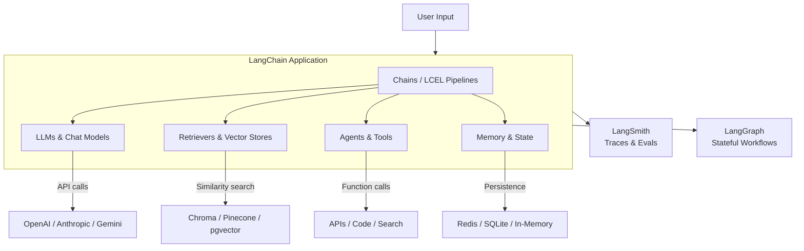
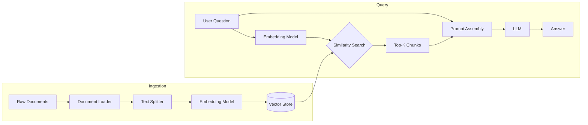
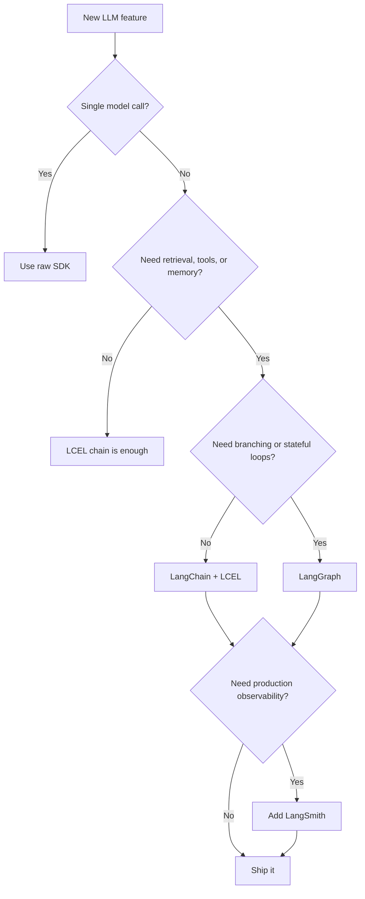

I spent three months building production LLM applications before I understood what LangChain was actually for. My first instinct was to reach for the raw OpenAI SDK and wire everything by hand. That worked fine for single model calls. It fell apart the moment I needed retrieval, memory, tool use, and observability to coexist inside the same application. LangChain solved exactly that problem — and in 2026, it has grown into an ecosystem I would recommend to most developers building serious LLM-powered software.

This is not a surface-level overview. By the end of this tutorial you will have read real code for a RAG pipeline, a tool-using agent, and a stateful workflow. You will also understand when LangChain is the wrong tool and what to reach for instead.

## What Is LangChain?

LangChain is an open-source framework for building applications powered by large language models. It provides composable abstractions for the most common LLM engineering patterns: chains of model calls, retrieval-augmented generation, autonomous agents, memory management, and structured tool use.

The project launched in late 2022 and initially attracted criticism for being over-abstracted and difficult to debug. That criticism was fair for the v0.1 era. The v0.3 rewrite — now stable and the version most teams are running in 2026 — addressed the core pain points. Streaming works properly, the LCEL (LangChain Expression Language) pipe syntax is concise and composable, and LangSmith gives you production-grade observability out of the box.

What LangChain is not: it is not a model provider, not a vector database, and not a deployment platform. It is the glue between those things. Its value is proportional to how many moving pieces your application has.

## Architecture Overview

Before writing code, it helps to see how the major components relate to each other. Here is how a typical LangChain application is layered:



The application layer sits in the middle. Chains define the flow of data through prompts, models, and output parsers. Agents decide dynamically which tools to invoke. Retrievers pull in external knowledge. Memory keeps context between turns. LangSmith and LangGraph are optional but powerful extensions that handle observability and stateful multi-step workflows respectively.

## Key Components

### Chains

A chain is a reusable sequence of steps. The simplest chain takes a prompt template, fills it in with input data, sends it to a model, and returns the result. The LCEL pipe syntax makes this readable:

```python
from langchain_core.prompts import ChatPromptTemplate
from langchain_openai import ChatOpenAI
from langchain_core.output_parsers import StrOutputParser

chain = (
    ChatPromptTemplate.from_template("Summarize this text in one sentence: {text}")
    | ChatOpenAI(model="gpt-4o-mini")
    | StrOutputParser()
)

result = chain.invoke({"text": "LangChain is a framework for building LLM applications..."})
```

Every `|` in that expression is a composable step. You can swap the model, add retrieval before the prompt, or append a structured output parser after — without rewriting the surrounding code.

### Agents and Tools

Agents give the model the ability to choose actions. Instead of following a fixed chain, an agent sees a set of available tools, reasons about which one to use, calls it, observes the result, and continues until it has an answer.

Tools are Python functions with type annotations and docstrings that LangChain serializes into JSON schemas for the model:

```python
from langchain_core.tools import tool

@tool
def search_documentation(query: str) -> str:
    """Search the product documentation for a given query. Returns relevant excerpts."""
    # your vector search or API call here
    return retriever.invoke(query)
```

### Memory

Memory persists conversation history so the model can refer back to earlier turns. LangChain offers in-memory buffers for development and Redis or DynamoDB backends for production. The memory component reads history before each model call and writes the new turn after.

### Retrieval

The retrieval stack is where most RAG applications live. LangChain provides document loaders (PDF, HTML, Notion, GitHub, etc.), text splitters, embedding model wrappers, and vector store clients — all with a consistent interface.

## Getting Started

Install the core package and whichever model provider you are using:

```bash
pip install langchain langchain-openai langchain-community langchain-chroma
```

Set your API key:

```bash
export OPENAI_API_KEY="sk-..."
```

Your first working chain in under ten lines:

```python
from langchain_openai import ChatOpenAI
from langchain_core.messages import HumanMessage

model = ChatOpenAI(model="gpt-4o-mini")
response = model.invoke([HumanMessage(content="What is LangChain?")])
print(response.content)
```

This is the bedrock. Everything else — RAG, agents, memory — builds on top of this single model invocation pattern.

## Building a RAG Pipeline

Retrieval-augmented generation is the most common production use case for LangChain. The pattern: load documents, embed them, store them in a vector database, and at query time retrieve the most relevant chunks before passing them to the model.

```python
from langchain_community.document_loaders import WebBaseLoader
from langchain_text_splitters import RecursiveCharacterTextSplitter
from langchain_openai import OpenAIEmbeddings, ChatOpenAI
from langchain_chroma import Chroma
from langchain_core.prompts import ChatPromptTemplate
from langchain_core.runnables import RunnablePassthrough
from langchain_core.output_parsers import StrOutputParser

# 1. Load documents
loader = WebBaseLoader("https://docs.example.com/overview")
docs = loader.load()

# 2. Split into chunks
splitter = RecursiveCharacterTextSplitter(chunk_size=1000, chunk_overlap=200)
chunks = splitter.split_documents(docs)

# 3. Embed and store
vectorstore = Chroma.from_documents(chunks, OpenAIEmbeddings())
retriever = vectorstore.as_retriever(search_kwargs={"k": 4})

# 4. Build the RAG chain
prompt = ChatPromptTemplate.from_template("""
Answer the question based only on the following context:

{context}

Question: {question}
""")

rag_chain = (
    {"context": retriever, "question": RunnablePassthrough()}
    | prompt
    | ChatOpenAI(model="gpt-4o")
    | StrOutputParser()
)

# 5. Query
answer = rag_chain.invoke("How does the authentication system work?")
print(answer)
```

A few things to note about this code. The `RunnablePassthrough()` lets the user's question flow through unchanged while the retriever runs in parallel to fetch context. The `search_kwargs={"k": 4}` limits retrieval to four chunks — tune this based on your context window budget and the density of your documents. For production, swap `Chroma` for Pinecone or pgvector and persist the index outside your application process.

## Building an Agent

An agent is more powerful than a chain because it can decide which tools to use and in what order. Here is a research agent that can search documentation and look up live data:

```python
from langchain_openai import ChatOpenAI
from langchain_core.tools import tool
from langchain import hub
from langchain.agents import create_tool_calling_agent, AgentExecutor

# Define tools
@tool
def search_docs(query: str) -> str:
    """Search internal documentation for relevant information."""
    return rag_chain.invoke(query)  # reuse the RAG chain from above

@tool
def get_current_status(service: str) -> str:
    """Check the current operational status of a named service."""
    # your status API call here
    return f"{service}: operational, latency p99=120ms"

tools = [search_docs, get_current_status]

# Load a standard ReAct prompt from LangChain Hub
prompt = hub.pull("hwchase17/openai-tools-agent")

# Create the agent
llm = ChatOpenAI(model="gpt-4o", temperature=0)
agent = create_tool_calling_agent(llm, tools, prompt)
agent_executor = AgentExecutor(agent=agent, tools=tools, verbose=True)

# Run it
result = agent_executor.invoke({
    "input": "Is the authentication service healthy? What does the docs say about its SLA?"
})
print(result["output"])
```

Setting `verbose=True` during development is genuinely useful — you see every tool call and the model's reasoning. Strip it or redirect to LangSmith before shipping to production.

## RAG Pipeline Architecture

Here is how the full RAG pipeline flows from ingestion through query:



The ingestion pipeline runs once (and on updates). The query pipeline runs on every user request. Keeping them separate is important: ingestion is often slow and expensive; queries need to be fast. Pre-compute your embeddings, persist the vector store, and load it at application startup rather than re-embedding on each request.

## LangSmith: Observability

LangSmith is LangChain's companion product for tracing, evaluation, and monitoring. It is not open-source, but the free tier covers most development and small-production workloads.

Enable it with two environment variables:

```bash
export LANGCHAIN_TRACING_V2=true
export LANGCHAIN_API_KEY="ls__..."
```

That is it. Every chain and agent invocation now sends a trace to LangSmith. You get a timeline of every model call, retrieval result, tool invocation, latency, and token count. When a RAG response is wrong, you can trace exactly which documents were retrieved and what the model saw — the most useful debugging capability I have found for retrieval pipelines.

LangSmith also supports running evaluation datasets. You can define a set of question–answer pairs and run your chain against them on every prompt change, which is the closest thing to automated testing for LLM outputs that I have found to actually work in practice.

## LangGraph: Stateful Agents

LangGraph extends LangChain for workflows that need explicit state management, branching, and cycles. It models your application as a directed graph where nodes are functions and edges carry state forward.

The simplest LangGraph application:

```python
from langgraph.graph import StateGraph, END
from typing import TypedDict

class AgentState(TypedDict):
    messages: list
    next_action: str

def call_model(state: AgentState) -> AgentState:
    # invoke the LLM with current messages
    response = llm.invoke(state["messages"])
    return {"messages": state["messages"] + [response], "next_action": "check"}

def check_result(state: AgentState) -> str:
    # decide whether to continue or finish
    last_msg = state["messages"][-1].content
    if "DONE" in last_msg:
        return END
    return "call_model"

graph = StateGraph(AgentState)
graph.add_node("call_model", call_model)
graph.add_node("check_result", check_result)
graph.add_conditional_edges("call_model", check_result)
graph.set_entry_point("call_model")

app = graph.compile()
result = app.invoke({"messages": [HumanMessage(content="Plan a three-step refactor")], "next_action": ""})
```

LangGraph is the right choice when your agent workflow has genuine branching logic, requires human-in-the-loop pauses, or needs to resume after an error without replaying the entire conversation. For simple sequential chains, it is overkill — stick with LCEL.

## When NOT to Use LangChain

LangChain is not the right tool for every situation. I have seen teams reach for it reflexively and create more complexity than they solved.

**Skip LangChain when:**

- You are making a single model call. `anthropic.messages.create()` or `openai.chat.completions.create()` is simpler and has zero overhead.
- Your team is not comfortable with Python and the abstraction layers are a maintenance liability.
- You need microsecond latency. LangChain adds measurable overhead that matters at very high throughput.
- The framework's version of a component (say, a specific vector store client) is lagging behind the vendor's own SDK.

Here is a decision flowchart for when to bring LangChain in:



If you follow this flowchart, you will not end up with a LangGraph application powering a greeting card generator.

## LangChain vs LlamaIndex vs Raw SDK

These are the three realistic options for most teams building LLM applications in 2026:

| | LangChain | LlamaIndex | Raw SDK |
|---|---|---|---|
| **Best for** | General LLM apps, agents | Data-heavy RAG, structured queries | Single-purpose tools, speed |
| **RAG support** | Excellent | Excellent (more opinionated) | Manual implementation |
| **Agent support** | Excellent (LangGraph) | Good | Manual implementation |
| **Observability** | LangSmith (first-class) | Third-party integrations | Manual logging |
| **Abstraction level** | High | High | Low |
| **Learning curve** | Medium | Medium | Low |
| **Community size** | Very large | Large | N/A |

My practical take: LlamaIndex has a slightly better ergonomics story for pure document retrieval applications, especially when you need fine-grained control over the indexing strategy. LangChain has the edge for general-purpose agent orchestration and anything that benefits from LangSmith. The raw SDK is the right answer when you need to ship fast and the workflow is simple enough that abstractions add friction rather than reducing it.

In most cases, these tools are not mutually exclusive. I have run LlamaIndex retrievers inside LangChain chains without any issues.

## Verdict

LangChain in 2026 is a mature, well-documented framework that solves real problems. The v0.3 rewrite addressed most of the legitimate criticism from the early days. LCEL makes composition readable. LangSmith turns the debugging experience from painful to genuinely good. LangGraph handles the genuinely hard cases — stateful agents with branching and recovery.

Where it still asks patience of you: the ecosystem moves fast, and occasionally a partner integration is a version or two behind the underlying library. The documentation is comprehensive but sometimes inconsistent across versions. When in doubt, read the source — it is clean Python and usually easier to understand than the docs.

If you are building a production LLM application with retrieval, tool use, or multi-step reasoning, LangChain is the framework I would start with in 2026. If the application grows in complexity, LangGraph is already there waiting. If you outgrow all of it, the abstraction is thin enough that migrating specific pieces to a raw SDK is tractable.

Start with the RAG pipeline, add LangSmith on day one, and resist LangGraph until the workflow genuinely needs it.

## FAQ

### Does LangChain work with Claude / Anthropic models?

Yes. Install `langchain-anthropic` and use `ChatAnthropic` in place of `ChatOpenAI`. The interface is identical — every chain, agent, and retrieval component works without modification. Claude's 200K context window makes it particularly useful for RAG applications where you want to pass large retrieved contexts.

### How does LangChain handle rate limits and retries?

LangChain wraps model clients with configurable retry logic. Set `max_retries` on any model client to automatically retry on rate limit errors with exponential backoff. For production workloads with high throughput, you will still want your own queue and rate limit management on top of this — LangChain's built-in retries are a safety net, not a throughput strategy.

### Is LangSmith required for production?

Not required, but I recommend it. Without LangSmith you are flying blind on retrieval quality and model behavior. The free tier covers enough traces for most small to medium applications. If you are processing sensitive data and cannot send traces to a third party, LangSmith offers a self-hosted deployment.

### What is the difference between LangChain and LangGraph?

LangChain (with LCEL) is for linear and branching pipelines that run start to finish. LangGraph is for workflows that need a persistent state graph — loops, checkpoints, human-in-the-loop pauses, and recovery from partial failures. Most applications start with LangChain and graduate to LangGraph when the control flow becomes complex enough to justify it.

### How do I evaluate whether my RAG pipeline is working?

Start by logging every retrieval result and final answer via LangSmith. Build a small test set of twenty to fifty questions with expected answers (even rough expected answers help). Run your chain against that set after every prompt change. Look for retrieval failures first — wrong chunks are the most common source of wrong answers. Then look for synthesis failures — good chunks but a bad summary. These two failure modes have different fixes.
