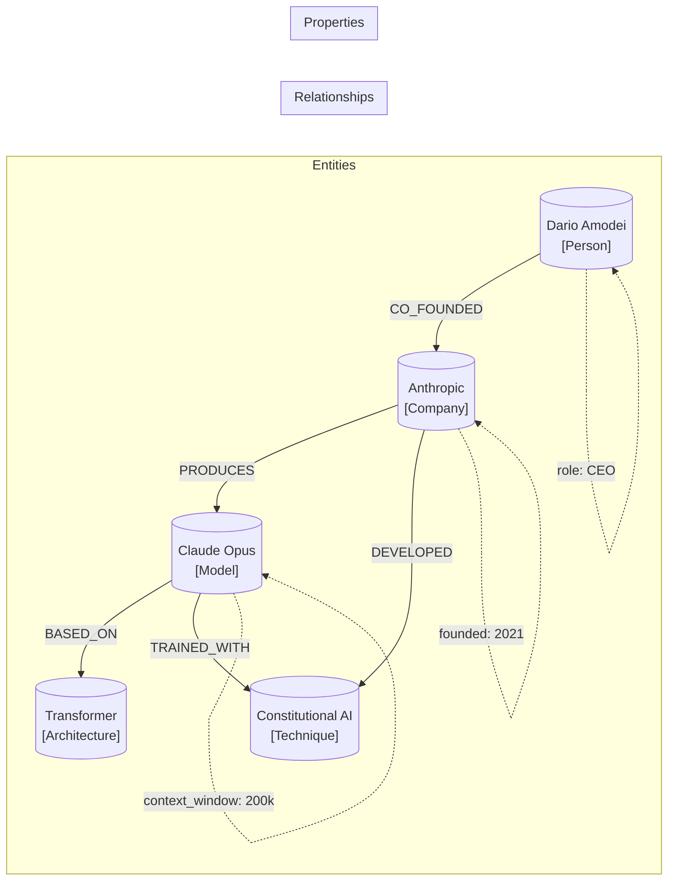
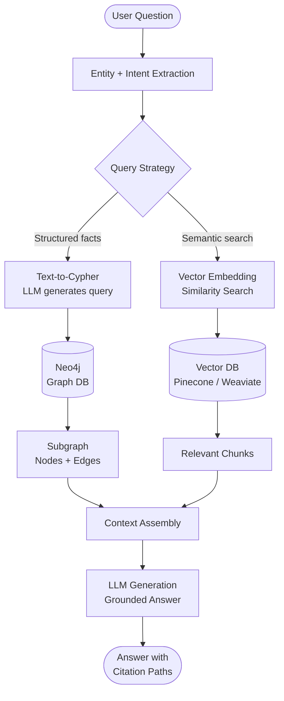
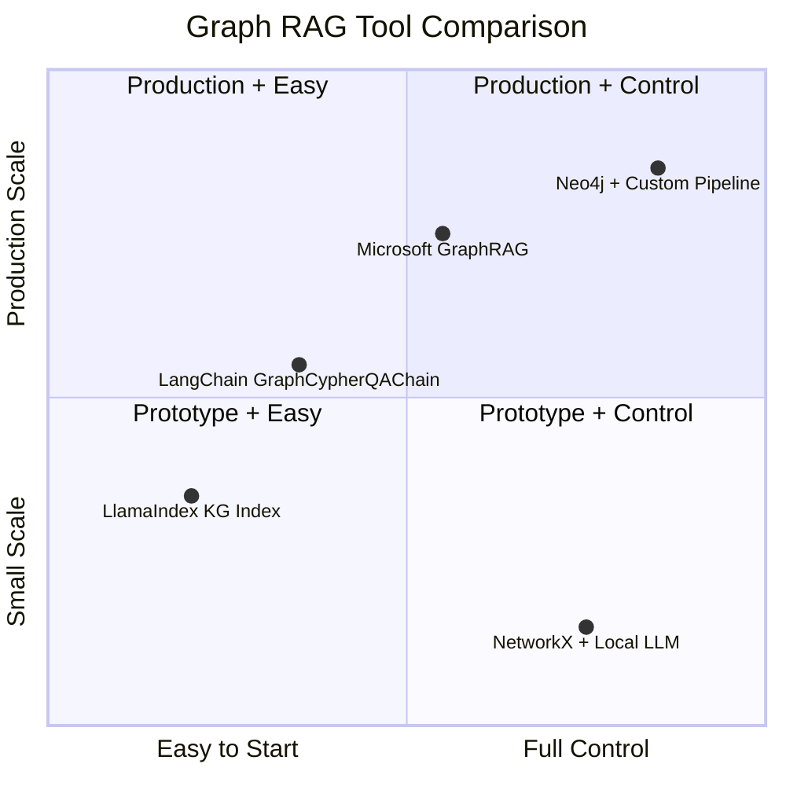

I have spent the last eighteen months building retrieval systems for production LLM applications. Vector databases were my first instinct — embed everything, query by cosine similarity, pipe the chunks into a prompt, ship it. That approach works fine for a certain class of question. But when users started asking things like "which vendors supply components to both Product A and Product B?" or "how many hops is this researcher from that paper's authors?", pure vector retrieval fell apart completely.

That is what sent me down the knowledge graph path. What I found is that the combination of knowledge graphs and large language models is not a niche research topic — it is quickly becoming a practical architecture pattern for any application where structured relationships between entities matter more than fuzzy semantic similarity alone. This guide explains what knowledge graphs are, why they complement LLMs so well, how Graph RAG works in practice, and how to start building one.

## What Are Knowledge Graphs?

A knowledge graph is a directed, labeled graph where nodes represent entities and edges represent typed relationships between those entities. Each node and each edge can carry properties — structured key-value data attached to the graph element.

That is the technical definition. The intuition is easier: a knowledge graph is a database that stores facts as triples in the form **(subject, predicate, object)**. "Claude Opus is made by Anthropic" becomes `(Claude Opus) --[MADE_BY]--> (Anthropic)`. "Anthropic was founded in 2021" becomes `(Anthropic) --[FOUNDED_IN]--> (2021)`. Chain thousands of these together and you have a structured map of knowledge that a query engine can traverse.

This is different from a relational database in an important way. A relational database stores rows. To find multi-hop relationships — for example, all companies that share an investor with a company that competes with another company — you write increasingly painful JOIN queries. A graph database makes those traversals native and fast because the edges are first-class data.



The three key primitives are:

- **Entities (nodes):** Named things — people, products, concepts, places, events, documents
- **Relationships (edges):** Typed, directed connections between entities — `COMPETES_WITH`, `CITES`, `OWNS`, `DEPLOYED_IN`
- **Properties:** Structured metadata on nodes or edges — dates, weights, confidence scores, source identifiers

Popular graph databases include Neo4j (the dominant player), Amazon Neptune, and TigerGraph. For smaller projects, NetworkX in Python or the Kuzu embedded graph database work well without standing up a server.

## Why Combine Knowledge Graphs with LLMs?

LLMs are excellent at understanding natural language, generating coherent text, and reasoning loosely over unstructured content. They are poor at precise multi-hop reasoning, they hallucinate relationships that do not exist, and they have no native concept of structured facts that must remain consistent.

Knowledge graphs are the opposite. They are precise, consistent, and traversable — but they require structured queries (Cypher for Neo4j, SPARQL for RDF stores) and they cannot handle natural language input directly.

The combination addresses each tool's weaknesses:

| Problem | LLM Alone | KG Alone | LLM + KG |
|---|---|---|---|
| Natural language interface | Excellent | Poor | Excellent |
| Multi-hop reasoning | Unreliable | Reliable | Reliable |
| Hallucinated relationships | Common | Never | Rare |
| Handling new documents | With RAG | Slow to update | Fast with extraction |
| Explainability | Low | High | High |
| Fuzzy/semantic queries | Excellent | Poor | Excellent |

The merged system lets users ask natural language questions, have the LLM translate them into structured graph queries or annotate retrieved graph paths with language, and return answers that are grounded in actual stored relationships rather than statistical plausibility.

## Graph RAG Explained

Standard RAG (Retrieval-Augmented Generation) uses a vector store. You embed your documents, embed the query, find the nearest chunks, and inject them into the prompt. Graph RAG replaces or augments that vector retrieval step with graph traversal.

There are three main flavors I have worked with:

**1. Retrieval via graph traversal.** The user's question is parsed into entities. Those entities are looked up in the graph. The system then traverses related nodes out to some hop depth — say, two or three hops — and the resulting subgraph (nodes and edges in that neighborhood) is serialized and inserted into the LLM's context window. The LLM answers from that structured context.

**2. Text-to-Cypher (or text-to-SPARQL).** The LLM is prompted with the graph schema and asked to generate a query in Cypher (Neo4j's query language). That query runs against the database, returns structured results, and the LLM formats them as a natural language answer. This works well for precise lookup questions.

**3. Hybrid: vector + graph.** The most robust production pattern. Vector search finds semantically relevant documents or entity candidates. The graph then grounds those candidates in their relationship context. You get semantic breadth from the vector index and structural depth from the graph.



The citation paths at the end are one of the most practically useful outputs. Because the answer came from a graph traversal, you can show the user the exact chain of relationships that supported it. That is something pure vector RAG cannot do.

## Building a Knowledge Graph Pipeline

Getting from raw documents to a queryable knowledge graph involves four stages. Here is how I approach each one in practice.

### Stage 1: Entity and Relationship Extraction

This is the hardest part. You need to pull structured triples out of unstructured text. The current best practice is to use an LLM for this, with a carefully designed extraction prompt.

The prompt instructs the model to read a document chunk and return a list of entities with their types and a list of relationships as triples. You also pass a schema — the set of allowed entity types and relationship types — to keep the output consistent and the graph from becoming a hairball.

```python
EXTRACTION_PROMPT = """
You are a knowledge graph extractor.
Given the text below, extract all entities and relationships.

ALLOWED ENTITY TYPES: Company, Person, Product, Technology, Concept
ALLOWED RELATIONSHIP TYPES: MAKES, FOUNDED, COMPETES_WITH, BASED_ON, CITES, ACQUIRED

Return JSON with this structure:
{
  "entities": [{"id": str, "type": str, "name": str, "properties": dict}],
  "relationships": [{"source": str, "target": str, "type": str, "properties": dict}]
}

TEXT:
{document_chunk}
"""
```

One important practical note: LLMs will occasionally invent entities or mis-classify relationship types. Run extracted triples through a validation step against your schema before writing to the graph. A simple JSON schema validator plus a lookup against a controlled vocabulary of allowed types catches most errors.

### Stage 2: Entity Resolution

The same real-world entity will appear in different forms across documents: "Anthropic", "Anthropic PBC", "the AI safety company Anthropic". Without resolution, your graph ends up with duplicate nodes that fragment the relationship structure.

Entity resolution matches surface forms to canonical identifiers. For small graphs, fuzzy string matching plus embeddings (compare the cosine similarity of entity name embeddings) is sufficient. For large graphs, you need a dedicated entity resolution pipeline using tools like DeepMatcher or a self-hosted Wikidata lookup.

### Stage 3: Graph Ingestion

Once you have cleaned triples, write them to your graph database. In Neo4j, this looks like a series of `MERGE` statements — `MERGE` rather than `CREATE` to avoid duplicates on re-ingestion.

```cypher
// Create or match entity nodes
MERGE (a:Company {id: $source_id})
  ON CREATE SET a.name = $source_name, a.created_at = timestamp()

MERGE (b:Technology {id: $target_id})
  ON CREATE SET b.name = $target_name

// Create the relationship
MERGE (a)-[r:BASED_ON]->(b)
  ON CREATE SET r.source_doc = $doc_id, r.confidence = $confidence
```

Attach the source document ID to each relationship as a property. This gives you provenance — when the LLM cites a fact, you can trace it back to the original document.

### Stage 4: Index and Query Layer

Build a text index over entity names so that the retrieval step can find nodes by approximate string match when exact ID lookup fails. In Neo4j this is a Lucene full-text index. Pair it with a vector index over entity description embeddings for semantic entity lookup.

The retrieval function for Graph RAG then works like this: find the best-matching entities for the query terms, retrieve their k-hop neighborhoods, serialize the subgraph as structured text or JSON, and inject into the prompt.

## Tools

The ecosystem here moved fast in 2025. These are the tools I have actually shipped with.

**Neo4j** is the production graph database most teams should reach for. The Cypher query language is expressive, the community is large, and the AuraDB cloud offering means you do not have to manage a server. The free tier handles graphs up to 200k nodes. The Python driver is solid. My main complaint is that Cypher has a learning curve compared to SQL, and debugging complex multi-hop queries takes real patience.

**LlamaIndex Knowledge Graph Index** is the fastest way to get from documents to a queryable graph in Python. It handles extraction, storage, and retrieval in about thirty lines of code. The tradeoff is that you give up control over the extraction schema and entity resolution strategy. For prototyping, it is excellent. For production, I end up replacing pieces of it with custom logic.

**LangChain graph integrations** cover Neo4j (`Neo4jGraph`), Amazon Neptune, and Kuzu. The `GraphCypherQAChain` lets you wire up text-to-Cypher with a single function call. The code is readable and the integration with LangSmith for tracing makes debugging retrieval much easier than rolling your own.

**Microsoft GraphRAG** is an open-source implementation from the Microsoft Research team. It focuses on community detection — grouping entities into clusters at multiple levels of granularity — which makes it especially good for questions that require global synthesis across a large corpus ("what are the main themes in these five hundred papers?") rather than precise entity lookups.



## Use Cases Where Knowledge Graphs Win

**Enterprise knowledge management.** Large organizations have knowledge scattered across Confluence, Jira, Slack, code repositories, and email. A KG built over these sources lets employees ask questions like "who owns the authentication service, what incidents has it had, and which teams depend on it?" Vector search returns candidate documents; graph traversal returns the answer.

**Drug discovery and biomedical research.** The canonical knowledge graph use case. Gene-protein-disease-drug relationships are inherently graph-structured. Systems like BioMedLM paired with a biomedical KG (e.g., Hetionet) can answer pathway questions that are impossible to express as embedding similarity.

**Financial compliance and risk.** Ownership structures, counterparty relationships, and regulatory classifications are all graph data. A Graph RAG system over regulatory documents plus a corporate relationship graph can answer "does this vendor fall under the same ultimate beneficial owner as one of our restricted counterparties?"

**Customer support with complex product dependencies.** When products have components, versions, compatibility constraints, and known issues, support agents can query a KG to find exact answers: "which firmware versions of hardware X are incompatible with software Y when deployed in configuration Z?"

**Code intelligence.** A graph of your codebase — files, classes, functions, imports, call relationships — lets an LLM agent reason about impact of a change, trace a bug through multiple modules, or understand why a particular dependency exists.

## KG vs Vector-Only RAG: When to Choose Which

Vector RAG should be your default for most applications. It is faster to build, easier to update (just re-embed new documents), and handles the broad majority of "find me relevant information about X" questions well.

Reach for Graph RAG when your questions have these characteristics:

- **Multi-hop reasoning required.** "What companies are connected to this person through at least two degrees of board membership?" This is a graph traversal, not a similarity search.
- **Exact relationship queries.** "Does Product A support Protocol B?" A binary yes/no question where a fuzzy similarity score is the wrong answer.
- **Consistency across answers.** If ten different users ask about the relationship between Entity A and Entity B, you want one consistent answer, not probabilistic variation based on which chunks happened to rank highest.
- **Explainability needed.** Regulated industries and high-stakes decisions benefit from the ability to show a human the precise evidence path: `(A) --[CERTIFIES]--> (B) --[REQUIRES]--> (C)`.
- **Complex aggregation.** "How many of our suppliers are also customers of our top competitor?" Vectors can not count graph paths.

The practical answer for most teams is hybrid: build the vector index first, add the graph layer when you hit the ceiling on relational questions.

## Limitations

I want to be honest about where this architecture is hard, because the academic papers tend to gloss over these parts.

**Extraction quality degrades on messy text.** Legal boilerplate, OCR'd scans, and domain-specific jargon with heavy abbreviations all trip up extraction models. Budget time for schema refinement and validation rules before assuming the graph is accurate.

**Entity resolution is genuinely difficult at scale.** The longer you run the pipeline, the more duplicate and near-duplicate nodes accumulate. Without a regular resolution pass, the graph's usefulness degrades. This is ongoing maintenance, not a one-time setup task.

**Graph schemas are hard to change after the fact.** Relational databases have migrations; graph databases do not have a mature equivalent. If you realize your relationship types are too coarse after ingesting ten million triples, you are in for a painful backfill.

**Text-to-Cypher fails on complex queries.** Current LLMs write decent Cypher for two-hop lookup queries. Multi-hop aggregations with `WHERE` clauses, `WITH` chaining, and `OPTIONAL MATCH` patterns still require human-written query templates or a careful few-shot prompt strategy.

**Cost.** Running LLM extraction at scale is not free. A million-document corpus might cost several hundred dollars in API calls just for the extraction pass, before you pay for the graph database.

## Verdict

Knowledge graphs and LLMs are genuinely complementary. The LLM handles the interface layer — understanding questions, generating extractions, formatting answers in natural language. The graph handles the fact layer — storing relationships precisely, enabling multi-hop traversal, providing provenance and explainability.

If your application involves structured relationships between a bounded set of entities, if users need to ask relational questions, or if you are operating in a domain where hallucinated facts have real consequences, the investment in a knowledge graph is worth it. If your application is mostly semantic search over unstructured text, stick with pure vector RAG until you hit its limits.

The tooling is mature enough to build on today. Start with LlamaIndex or LangChain for a prototype, move to a managed Neo4j instance when you are ready for production, and keep your extraction schema tight enough to enforce consistency from day one.

## FAQ

### What is the difference between a knowledge graph and a vector database?

A vector database stores documents or chunks as high-dimensional floating-point vectors and retrieves them by geometric similarity. It is excellent for "find text semantically similar to this query." A knowledge graph stores explicit named relationships between entities — `(A) --[RELATION]--> (B)` — and retrieves by traversal. The two structures answer different types of questions and are most powerful when used together.

### Do I need a graph database, or can I use NetworkX in memory?

For prototyping and datasets under roughly 100k nodes, NetworkX in Python is perfectly reasonable. It has no server overhead and integrates naturally with LlamaIndex. For production, you want a persistent graph database with index support. Neo4j AuraDB's free tier (200k nodes) is the easiest starting point. Switch to a paid tier or self-hosted Neo4j when you need more capacity or want to run Cypher aggregations at scale.

### How accurate is LLM-based entity extraction?

In my experience, extraction precision on clean, domain-specific text runs between 75% and 90% depending on the model and prompt quality. Recall (catching all entities) is lower, often 60–80%. Claude Opus and GPT-4o are meaningfully better than smaller models on complex schemas. The gap closes when you add a schema validation step that rejects malformed or out-of-vocabulary extractions. Do not skip validation before writing to the graph.

### Can I use Graph RAG with an open-weight model?

Yes, and it is a good combination. The graph provides factual grounding, which offsets one of the main weaknesses of smaller open-weight models — their tendency to hallucinate specific facts. The text-to-Cypher step is the hardest for smaller models; you may need to provide more few-shot examples or use a query template approach rather than free-form generation. Models in the 13B–70B range with instruction tuning handle simple two-hop Cypher generation reliably.

### How do I keep the knowledge graph up to date as documents change?

Design your ingestion pipeline to be idempotent from the start. Every node and relationship should have a `source_doc_id` property. When a document is updated, delete or flag relationships sourced from that document ID, re-extract from the new version, and merge the updated triples. This is easier to implement correctly before you have millions of nodes than after. For time-sensitive domains, consider versioning relationships with `valid_from` and `valid_until` properties rather than deleting and recreating them.
