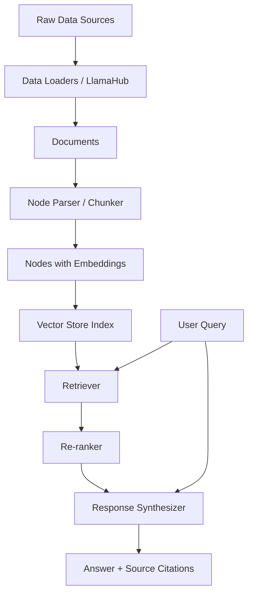
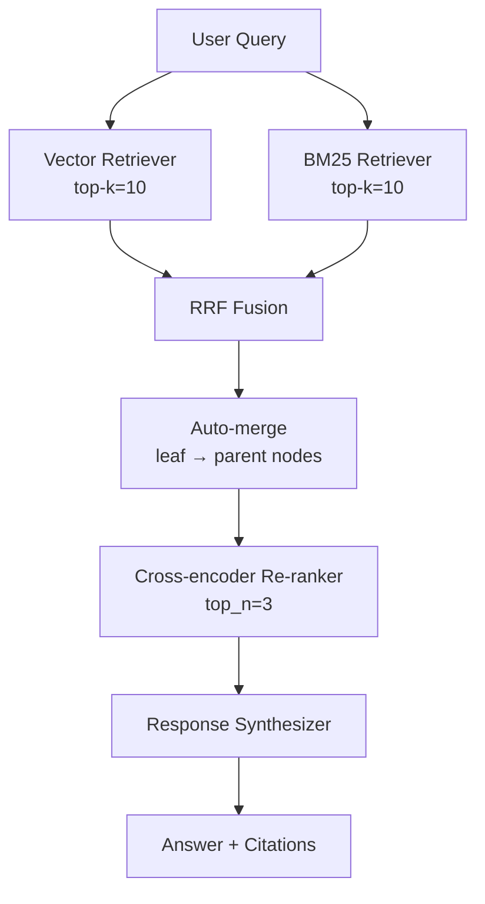
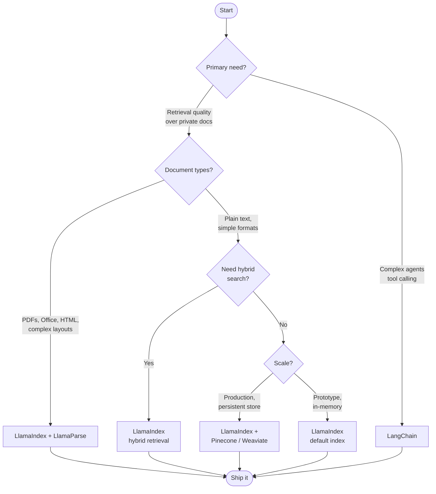

I spent the better part of a month building a production RAG system before I fully understood why LlamaIndex exists. My first attempt used raw embeddings, a Pinecone client, and a pile of glue code. It worked, barely, but every new document type broke something. When I rewrote it with LlamaIndex the core pipeline shrank from about 600 lines to under 100, and it handled PDFs, HTML, Notion exports, and Word docs without a single special case. That experience is why I think LlamaIndex is worth taking seriously — not because it is magic, but because it encodes a lot of hard-won RAG knowledge into coherent abstractions.

This is a hands-on LlamaIndex tutorial aimed at developers who have seen the hello-world demos and want to understand what actually happens at each stage, how to tune the parts that matter for quality, and how to decide whether LlamaIndex fits better than LangChain for a given project.

## What Is LlamaIndex?

LlamaIndex (formerly GPT Index) is an open-source data framework for building LLM applications that need to reason over private or domain-specific data. The core value proposition is structured retrieval-augmented generation: you point it at your documents, it handles ingestion and indexing, and it gives you a query interface that returns grounded answers backed by cited source chunks.

The framework ships as a Python package (`llama-index`) with a TypeScript port (`llamaindex`) for Node.js environments. The Python version is the primary one, and that is what this tutorial covers. As of early 2026, the library sits at version 0.12.x and the API has stabilised considerably after the v0.10 refactor that split everything into modular subpackages.

What LlamaIndex is not: it is not an agent framework in the LangChain sense, though it has agent capabilities. It is not a vector database. It is not a model provider. Think of it as the middleware that wires those things together with a RAG-first design philosophy.

## Core Concepts

Understanding four concepts unlocks everything else in the framework.

**Documents** are the raw inputs — a PDF, a web page, a Slack export, a database row. LlamaIndex ships with over 160 data loaders (via LlamaHub) that convert these sources into a standard `Document` object carrying the text content plus a metadata dictionary.

**Nodes** are the indexed unit of retrieval. A document gets chunked into nodes, and each node carries the chunk text, a reference back to its parent document, positional information (which chunk, which page), and an embedding vector. Nodes are what actually get stored in the vector index and retrieved at query time.

**Indexes** are the data structures built over nodes. The most common is `VectorStoreIndex`, which stores node embeddings in a vector database. LlamaIndex also ships with `SummaryIndex` (linear list, good for summarisation tasks), `KeywordTableIndex` (inverted keyword index), and `KnowledgeGraphIndex` (graph-based). You can combine them.

**Query engines** sit on top of an index and answer questions. The default `RetrieverQueryEngine` fetches the top-k most similar nodes, assembles them into a context window, and sends that context plus the question to an LLM. More advanced query engines add re-ranking, routing across multiple indexes, and multi-step reasoning.



## Building a RAG Pipeline

Here is a minimal but complete LlamaIndex RAG pipeline. This is where I always start before layering on complexity.

```bash
pip install llama-index llama-index-llms-anthropic llama-index-embeddings-openai
```

```python
import os
from llama_index.core import VectorStoreIndex, SimpleDirectoryReader, Settings
from llama_index.llms.anthropic import Anthropic
from llama_index.embeddings.openai import OpenAIEmbedding

# 1. Configure global defaults (replaces ServiceContext from v0.10)
Settings.llm = Anthropic(model="claude-sonnet-4-6", api_key=os.environ["ANTHROPIC_API_KEY"])
Settings.embed_model = OpenAIEmbedding(model="text-embedding-3-small")
Settings.chunk_size = 512
Settings.chunk_overlap = 64

# 2. Load documents from a local directory
documents = SimpleDirectoryReader("./docs").load_data()
print(f"Loaded {len(documents)} documents")

# 3. Build the index (embeds and stores nodes in memory by default)
index = VectorStoreIndex.from_documents(documents, show_progress=True)

# 4. Create a query engine and ask a question
query_engine = index.as_query_engine(similarity_top_k=5)
response = query_engine.query(
    "What are the main failure modes of our authentication system?"
)

print(response.response)
print("\n--- Source nodes ---")
for node in response.source_nodes:
    print(f"  [{node.score:.3f}] {node.node.metadata.get('file_name', 'unknown')} — {node.node.text[:120]}...")
```

The `Settings` object replaced the old `ServiceContext` in v0.10 and is now the recommended way to set global defaults. You can always override per-index or per-query-engine if you need different models for different parts of your system.

For production you almost certainly want a persistent vector store rather than the default in-memory one. Swapping in Pinecone takes about ten lines:

```python
from llama_index.vector_stores.pinecone import PineconeVectorStore
from llama_index.core import StorageContext
import pinecone

pc = pinecone.Pinecone(api_key=os.environ["PINECONE_API_KEY"])
pinecone_index = pc.Index("my-rag-index")

vector_store = PineconeVectorStore(pinecone_index=pinecone_index)
storage_context = StorageContext.from_defaults(vector_store=vector_store)

# Build once, persist automatically
index = VectorStoreIndex.from_documents(
    documents,
    storage_context=storage_context,
    show_progress=True,
)

# Later, load without re-embedding
index = VectorStoreIndex.from_vector_store(
    vector_store=vector_store,
    storage_context=storage_context,
)
```

## Advanced Retrieval: Hybrid Search, Re-ranking, and Auto-merging

Default top-k semantic search works reasonably well for short, self-contained queries. It struggles when users ask questions that require:

- Exact keyword matching (product names, error codes, version strings)
- Context that spans multiple chunks (explanations broken across pages)
- Precise ranking when the top-k results have similar embedding distances

LlamaIndex addresses all three.

### Hybrid Search

Hybrid search combines dense vector retrieval with sparse keyword (BM25) retrieval and merges the results. It is available when the underlying vector store supports it natively (Weaviate, Elasticsearch, Qdrant) or via the `QueryFusionRetriever`:

```python
from llama_index.core.retrievers import QueryFusionRetriever
from llama_index.retrievers.bm25 import BM25Retriever

vector_retriever = index.as_retriever(similarity_top_k=5)
bm25_retriever = BM25Retriever.from_defaults(
    docstore=index.docstore, similarity_top_k=5
)

hybrid_retriever = QueryFusionRetriever(
    retrievers=[vector_retriever, bm25_retriever],
    similarity_top_k=5,
    num_queries=1,          # set > 1 to auto-generate query variations
    mode="reciprocal_rerank",
)
```

The `reciprocal_rerank` mode fuses the two ranked lists using Reciprocal Rank Fusion (RRF), which consistently outperforms taking the raw union in my testing on internal document corpora.

### Re-ranking

After initial retrieval, a cross-encoder re-ranker re-scores each candidate node by jointly encoding the query and the node text. This is slower but substantially more accurate:

```python
from llama_index.core.postprocessor import SentenceTransformerRerank

reranker = SentenceTransformerRerank(
    model="cross-encoder/ms-marco-MiniLM-L-2-v2",
    top_n=3,
)

query_engine = index.as_query_engine(
    similarity_top_k=10,      # retrieve broadly
    node_postprocessors=[reranker],  # then rerank to top 3
)
```

The pattern of retrieve-broadly-then-rerank-tightly is one of the most reliable quality improvements I have found. Retrieve 10–15, rerank to 3–5. The cross-encoder sees the query and the passage together, which is far more discriminative than cosine similarity on independent embeddings.

### Auto-merging Retrieval

Auto-merging addresses the fragmentation problem. When a chunk is retrieved but its neighbours contain the rest of the explanation, you want the full parent context, not just the fragment. LlamaIndex's `AutoMergingRetriever` builds a hierarchical node tree: small leaf nodes for retrieval, larger parent nodes for context assembly.

```python
from llama_index.core.node_parser import HierarchicalNodeParser, get_leaf_nodes
from llama_index.core.retrievers import AutoMergingRetriever
from llama_index.core.storage.docstore import SimpleDocumentStore

# Parse into a hierarchy: 2048 → 512 → 128 token chunks
node_parser = HierarchicalNodeParser.from_defaults(
    chunk_sizes=[2048, 512, 128]
)
nodes = node_parser.get_nodes_from_documents(documents)
leaf_nodes = get_leaf_nodes(nodes)

# Index only the leaf nodes
docstore = SimpleDocumentStore()
docstore.add_documents(nodes)
storage_context = StorageContext.from_defaults(docstore=docstore)

leaf_index = VectorStoreIndex(leaf_nodes, storage_context=storage_context)

# At query time, merge leaf hits up to their parents when a threshold is met
base_retriever = leaf_index.as_retriever(similarity_top_k=6)
auto_merging_retriever = AutoMergingRetriever(
    base_retriever, storage_context=storage_context, verbose=True
)
```



## LlamaParse: Production-Grade Document Parsing

One of LlamaIndex's most underrated components is LlamaParse, a cloud-based document parsing service that handles the documents that simple text extraction butchers: multi-column PDFs, tables with merged cells, scanned documents, PowerPoint slides, and financial reports with footnotes.

LlamaParse is a paid API service (free tier available) that returns a clean markdown or text representation, preserving table structure and reading order:

```python
from llama_parse import LlamaParse
from llama_index.core import SimpleDirectoryReader

parser = LlamaParse(
    api_key=os.environ["LLAMA_CLOUD_API_KEY"],
    result_type="markdown",          # or "text"
    num_workers=4,                   # parallel parsing
    verbose=True,
    language="en",
)

file_extractor = {".pdf": parser, ".docx": parser, ".pptx": parser}

documents = SimpleDirectoryReader(
    "./docs",
    file_extractor=file_extractor,
).load_data()
```

In my experience, LlamaParse reduces chunk quality problems by a substantial margin for complex PDFs. A financial statement that was producing nonsense chunks with PyPDF2 parsed cleanly with LlamaParse, tables intact, headers attached to the right sections. For simple text-heavy PDFs the built-in loaders are fine. For anything with layout complexity, LlamaParse is worth the cost.

## LlamaIndex vs LangChain

This is the question I get asked most often. Both frameworks let you build RAG pipelines and agents on top of LLMs. They are not equivalent tools chasing the same goal.

| Dimension | LlamaIndex | LangChain |
|---|---|---|
| **Primary focus** | Data ingestion, indexing, retrieval | Chains, agents, tool orchestration |
| **RAG quality** | First-class: hybrid, re-rank, auto-merge built in | Possible but more assembly required |
| **Agent flexibility** | Good, growing | Excellent, mature |
| **Data connectors** | 160+ via LlamaHub | Fewer, more manual |
| **Streaming** | Yes | Yes |
| **TypeScript support** | Solid (llamaindex package) | Solid (langchain.js) |
| **Learning curve** | Moderate | Steeper |
| **Community** | Smaller but RAG-focused | Very large |

My rule of thumb: **if retrieval quality is the primary variable — choose LlamaIndex**. The built-in abstractions for hybrid search, re-ranking, and hierarchical chunking save weeks of custom code. If you are building complex multi-agent systems, tool-heavy pipelines, or need the breadth of LangChain's integrations ecosystem — LangChain is the stronger base.

Many production systems use both. A common pattern is LlamaIndex for the retrieval layer (documents, nodes, indexes, query engines) and LangChain or a custom agent loop for orchestration on top. The two frameworks interoperate through their shared OpenAI-compatible LLM interface.



## Limitations

No production tool review is honest without a section on where things break.

**Chunk size tuning is empirical, not formulaic.** The right chunk size depends on your documents, your query patterns, and your LLM's context window. There is no default that works well across use cases. Expect to experiment with 256, 512, and 1024 token chunks and measure retrieval precision on a representative eval set before committing.

**The v0.10 refactor broke a lot of tutorials.** If you are following a guide from 2023 or early 2024, the `ServiceContext`, `LLMPredictor`, and `GPTVectorStoreIndex` APIs are gone. The ecosystem is catching up but there is still a lot of outdated code in blog posts and Stack Overflow answers. Always check which LlamaIndex version a code sample targets.

**Cost at ingestion scale.** Embedding millions of chunks through OpenAI's API is not free. For large corpora, budget the embedding cost before you start. `text-embedding-3-small` at $0.02 per million tokens is cheap — but a million chunks at 512 tokens each is $10 just for the initial embed, and you pay again when you re-index after schema changes.

**Evaluation tooling is still maturing.** LlamaIndex ships with `RAGAs`-compatible evaluation utilities and its own `BatchEvalRunner`, but building a rigorous eval harness still requires meaningful engineering effort. This is not unique to LlamaIndex — it is a gap in the entire RAG ecosystem — but it means you should not expect to plug in a "RAG score" number without building custom evals for your specific domain.

**Agent reliability at depth.** LlamaIndex's `ReActAgent` and `FunctionCallingAgent` work well for shallow tool use (one or two tool calls per query). For deep agentic loops with many sequential decisions, reliability drops and you may need LangGraph or a more structured orchestration layer.

**Multi-tenancy is your problem.** LlamaIndex has no built-in concept of user isolation or access control. If you are building a multi-tenant application where user A must not see user B's documents, you need to implement that isolation yourself — typically via metadata filtering at retrieval time or by maintaining separate indexes per tenant.

## Verdict

LlamaIndex is the right foundation for production RAG systems where retrieval quality is the central engineering problem. The core pipeline takes an afternoon to get working. The advanced retrieval features — hybrid search, re-ranking, auto-merging — are implemented well and documented clearly. LlamaParse solves the gnarly real-world problem of parsing documents that other approaches handle badly.

The gaps are real: tuning is still empirical, eval tooling needs assembly, and the v0.10 migration left a documentation graveyard that wastes developer time. But for a team whose job is building a system that answers questions accurately over a private document corpus, LlamaIndex encodes more production-ready RAG knowledge than any other open-source option I have evaluated.

Start with a `VectorStoreIndex`, pin your chunk size at 512 with a 10% overlap, use a cross-encoder re-ranker, and measure retrieval precision on 50 real queries before you optimise anything else. That baseline will outperform most hand-rolled approaches out of the box.

---

## Frequently Asked Questions

### What is the difference between LlamaIndex and a vector database?

A vector database (Pinecone, Weaviate, Qdrant, pgvector) stores and retrieves embeddings efficiently. LlamaIndex is the layer above it: it handles document loading, chunking, embedding, index construction, query orchestration, and response synthesis. You almost always use both together — LlamaIndex manages the workflow, a vector database provides the storage.

### How do I evaluate retrieval quality in a LlamaIndex pipeline?

The most practical approach is to build a small golden set of 50–100 question-answer pairs grounded in your actual documents, then measure hit rate (did the correct source chunk appear in the top-k results?) and faithfulness (does the generated answer match the retrieved source?). LlamaIndex integrates with RAGAs for automated scoring on these dimensions. Start with hit rate — if the right chunk is not being retrieved, no amount of LLM tuning will fix the answer quality.

### Does LlamaIndex work with local or open-source LLMs?

Yes. LlamaIndex supports Ollama, HuggingFace models, vLLM, LM Studio, and any provider that exposes an OpenAI-compatible chat completion endpoint. Set `Settings.llm` to the appropriate integration class. The same applies to embeddings — you can use local `sentence-transformers` models instead of OpenAI embeddings if data privacy or cost is a concern.

### When should I use a `SummaryIndex` instead of a `VectorStoreIndex`?

Use `SummaryIndex` when the user's query requires synthesising information across the entire document rather than finding a specific passage. "Give me a high-level summary of this 80-page report" is a `SummaryIndex` query. "What does this report say about Q3 revenue in the APAC region?" is a `VectorStoreIndex` query. Many production systems route between the two based on query classification.

### Is the TypeScript version of LlamaIndex production-ready?

The `llamaindex` TypeScript package has been production-ready for basic pipelines since mid-2024. It lags the Python version on advanced features — some retrieval modes and data loaders are Python-only. For a Node.js backend that needs core RAG functionality (load, embed, index, query), the TypeScript version is a solid choice. For cutting-edge retrieval experiments or heavy use of LlamaHub connectors, run the Python service and call it via API from your Node.js layer.
