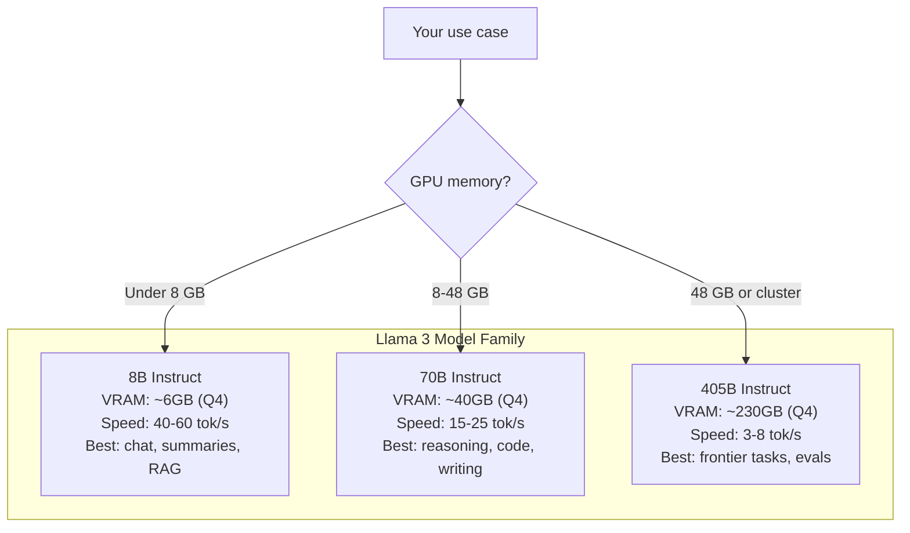
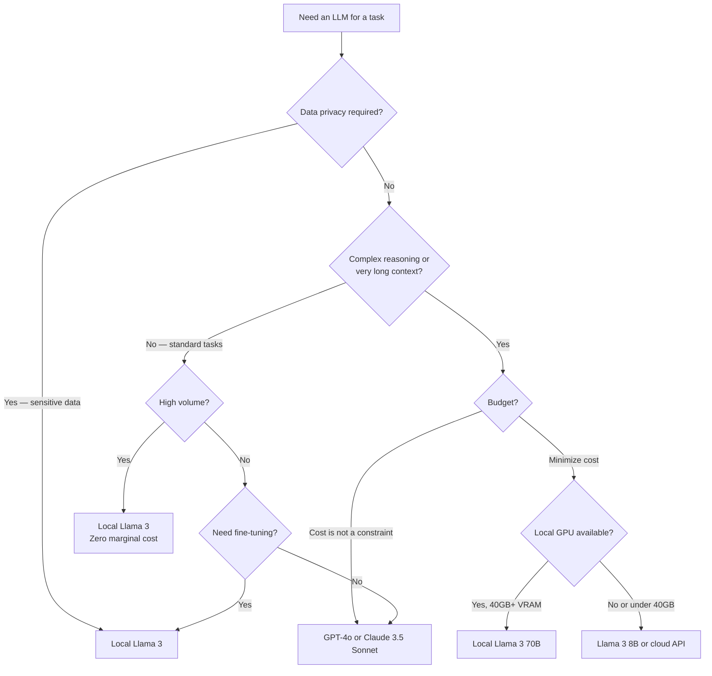

Running a frontier-class language model on your own hardware used to be a research project. With Llama 3, it is a forty-five minute setup that costs nothing per token after the download. I have been running Llama 3 locally for several months across two machines — a workstation with an NVIDIA RTX 4090 and a MacBook Pro M3 Max — and the results are genuinely good enough to replace cloud APIs for a meaningful slice of real workloads.

This guide covers everything you need to make that decision for yourself: the model variants, what hardware you actually need, how to get it running with Ollama, how performance compares to GPT-4o and Claude on standard benchmarks, and where the limits are.

## What Is Llama 3?

Llama 3 is Meta's third generation of open-weight large language models, released in April 2024 and extended through mid-2024 with the 405B flagship. Unlike proprietary models, the weights are publicly downloadable under a permissive license that allows commercial use for most organizations (revenue below $700M annually; above that, you need a separate Meta agreement).

The architectural jump from Llama 2 to Llama 3 is substantial. Meta rebuilt the tokenizer — the new vocabulary has 128,000 tokens versus 32,000 in Llama 2, which dramatically improves efficiency on code, non-English text, and technical content. The attention mechanism uses Grouped Query Attention (GQA) across all model sizes, which was previously only in the 70B variant of Llama 2. The training dataset grew to 15 trillion tokens, a roughly 7x increase, with a deliberately higher proportion of code and multilingual content.

The practical result: Llama 3 8B performs comparably to Llama 2 70B on many benchmarks, and Llama 3 70B is competitive with GPT-4 in several coding and reasoning tasks. The 405B model trades blows with GPT-4o on standard benchmarks while being fully self-hostable.

## Model Variants

Meta released three parameter scales, each with a base version and an instruction-tuned version. The instruction-tuned (`instruct`) variants are what you want for chat and agentic use. The base versions are starting points for fine-tuning.

**Llama 3 8B** is the everyday workhorse. It fits in 8 GB of VRAM using 4-bit quantization, runs comfortably on a consumer GPU or Apple Silicon, and produces output fast enough for interactive chat (40-60 tokens per second on an RTX 4090). It is strong at summarization, classification, Q&A over documents, and short code generation. Where it struggles: multi-step reasoning chains, complex function calling, and long-form code that requires tracking state across many lines.

**Llama 3 70B** is the quality flagship for self-hosters. At 4-bit quantization it needs around 40 GB of VRAM, which means either a high-end single GPU (A100 80GB), two high-end consumer GPUs, or Apple Silicon with 64-96 GB of unified memory. Generation is slower — roughly 15-25 tokens per second on optimal hardware — but the quality jump over 8B is meaningful on reasoning, long-form writing, and complex code tasks. This is the model I reach for when output quality matters more than throughput.

**Llama 3 405B** is the research and enterprise tier. In fp16 it needs around 810 GB of VRAM — essentially a multi-GPU server cluster. In 4-bit quantization it drops to roughly 230 GB, which puts it within reach of a high-memory single node. For individual developers, 405B is a benchmark reference rather than a daily driver. But for organizations with inference infrastructure, it is the most capable open-weight model available and competes directly with GPT-4o.



## Running Locally with Ollama

Ollama is the fastest path to a working local Llama 3 setup. It handles model downloads, quantization selection, CUDA or Metal GPU detection, and a local OpenAI-compatible API endpoint — all with a single binary. Here is how I set it up.

**Step 1: Install Ollama**

Download and install from [ollama.com](https://ollama.com). On macOS:

```bash
brew install ollama
```

On Linux:

```bash
curl -fsSL https://ollama.com/install.sh | sh
```

On Windows, use the installer from the Ollama website. After installation, start the daemon:

```bash
ollama serve
```

**Step 2: Pull the model**

For the 8B instruction-tuned model:

```bash
ollama pull llama3:8b-instruct-q4_K_M
```

For the 70B version (requires substantial VRAM or RAM):

```bash
ollama pull llama3:70b-instruct-q4_K_M
```

The `q4_K_M` suffix specifies 4-bit quantization with a medium-quality quantization scheme. It balances quality loss and memory savings better than `q4_0`. If you have the VRAM headroom, `q5_K_M` or `q6_K` will give you noticeably better output on reasoning tasks.

**Step 3: Run a chat session**

```bash
ollama run llama3:8b-instruct-q4_K_M
```

This drops you into an interactive terminal chat. Type `>>>` prompts and get responses streamed back. To exit, type `/bye`.

**Step 4: Use the API**

Ollama exposes a local REST API on port 11434 that mirrors the OpenAI API format. You can point any OpenAI-compatible client at `http://localhost:11434/v1` with a dummy API key:

```python
from openai import OpenAI

client = OpenAI(
    base_url="http://localhost:11434/v1",
    api_key="ollama",  # required but not validated
)

response = client.chat.completions.create(
    model="llama3:8b-instruct-q4_K_M",
    messages=[
        {"role": "system", "content": "You are a helpful assistant."},
        {"role": "user", "content": "Explain how attention mechanisms work."},
    ],
)
print(response.choices[0].message.content)
```

This means any tool built on the OpenAI SDK — LangChain, LlamaIndex, Open WebUI, Dify — can swap to your local Llama 3 instance by changing one URL.

**Step 5: Set a system prompt for consistent behavior**

Create a Modelfile to customize the model's persona and defaults:

```
FROM llama3:8b-instruct-q4_K_M

SYSTEM """
You are a precise technical assistant. Always cite your sources when making factual claims.
When writing code, include error handling. Prefer concise answers unless detail is explicitly requested.
"""

PARAMETER temperature 0.3
PARAMETER num_ctx 8192
```

Then build and run your custom model:

```bash
ollama create my-llama3 -f Modelfile
ollama run my-llama3
```

## Hardware Requirements

The single largest variable in local Llama 3 performance is GPU VRAM. If the model fits in VRAM, inference runs on the GPU and is fast. If the model spills into system RAM, performance collapses — often to 1-3 tokens per second, which makes interactive chat miserable.

| Model | Quantization | VRAM Required | Tokens/sec (RTX 4090) | Tokens/sec (M3 Max) |
|---|---|---|---|---|
| 8B | Q4_K_M | ~5.5 GB | 55-65 | 35-45 |
| 8B | Q6_K | ~7.5 GB | 45-55 | 28-36 |
| 8B | fp16 | ~16 GB | 30-40 | 18-25 |
| 70B | Q4_K_M | ~40 GB | 15-22 | 12-18 |
| 70B | Q6_K | ~54 GB | 10-15 | 8-12 |
| 405B | Q4_K_M | ~230 GB | 3-6 (multi-GPU) | N/A |

Apple Silicon is worth calling out specifically. The M3 Max with 96 GB of unified memory can run Llama 3 70B entirely in-memory with headroom to spare, because CPU and GPU share the same memory pool. Generation speed is slower than a dedicated NVIDIA GPU, but the capability-per-dollar is excellent for a laptop.

If you are buying hardware specifically for local inference, the current best options are:

- **Under $1,000:** RTX 4070 Ti Super (16 GB VRAM) — comfortable for 8B, partial offload for 70B
- **$1,000-2,000:** RTX 4090 (24 GB VRAM) — excellent for 8B, tight for 70B
- **$3,000-5,000:** Dual RTX 4090 or Mac Studio M3 Ultra — comfortable 70B, entry-level 405B
- **$10,000+:** A100 80GB or H100 — optimal for 70B, capable 405B (multi-card)

For context window: more is better but more expensive. Each additional 1,000 tokens of context uses roughly 0.5 GB of additional VRAM at 8B scale, scaling up proportionally for larger models. Keep `num_ctx` at 4096 or 8192 for daily use unless you specifically need longer context.

## Performance Benchmarks

These numbers draw from published evaluation results and my own informal testing against a set of 50 coding tasks and 30 reasoning problems I use consistently for model evaluation.

| Benchmark | Llama 3 8B | Llama 3 70B | Llama 3 405B | GPT-4o | Claude 3.5 Sonnet |
|---|---|---|---|---|---|
| MMLU | 68.4 | 82.0 | 87.3 | 88.7 | 88.3 |
| HumanEval (code) | 62.2 | 81.7 | 89.0 | 90.2 | 92.0 |
| GSM8K (math) | 79.6 | 93.0 | 96.8 | 96.1 | 95.9 |
| MATH | 30.0 | 50.4 | 73.8 | 76.6 | 71.1 |
| MT-Bench | 7.0 | 8.9 | 9.4 | 9.6 | 9.5 |
| GPQA (graduate) | 32.8 | 46.7 | 51.1 | 53.6 | 59.4 |

The standout result is Llama 3 405B on GSM8K math reasoning — it essentially matches GPT-4o. On HumanEval coding, 405B comes within 1.2 percentage points of GPT-4o. The 70B model is competitive enough for most professional development work.

The 8B model has a clear quality ceiling on complex tasks. Do not expect it to handle multi-step reasoning chains or architect novel software systems reliably. It excels at well-defined, bounded tasks.

```mermaid
xychart-beta
    title "Benchmark Scores — Higher Is Better (%)"
    x-axis ["MMLU", "HumanEval", "GSM8K", "MT-Bench×10"]
    y-axis "Score" 0 --> 100
    bar [68, 62, 80, 70]
    bar [82, 82, 93, 89]
    bar [87, 89, 97, 94]
    bar [89, 90, 96, 96]
```



*Bars left to right: Llama 3 8B, Llama 3 70B, Llama 3 405B, GPT-4o. MT-Bench scores multiplied by 10 to fit scale.*

## Fine-Tuning Llama 3

One of the most compelling reasons to use an open-weight model is the ability to fine-tune on your own data. Fine-tuned Llama 3 8B can outperform the base 70B model on domain-specific tasks — I have seen this consistently in customer support, legal document drafting, and internal tooling classification.

The practical approach for most teams is LoRA (Low-Rank Adaptation) fine-tuning, which adds a small set of trainable parameters on top of the frozen base model weights. LoRA fine-tuning of Llama 3 8B runs on a single RTX 3090 or 4090 within a few hours on a modest dataset (10,000-50,000 examples). For 70B, you need multi-GPU setups or cloud instances like Lambda Labs or RunPod.

The most accessible tooling for Llama 3 fine-tuning:

**Unsloth** — significantly reduces memory usage and training time through kernel-level optimizations. On my RTX 4090, Unsloth cuts training time roughly in half compared to vanilla Transformers. Open source and well-documented.

**Axolotl** — a higher-level configuration-driven fine-tuning framework that handles data formatting, LoRA setup, and multi-GPU training with a YAML config file. Lower engineering overhead than Transformers directly.

**LLaMA Factory** — similar to Axolotl with a broader range of fine-tuning methods and an optional web UI for teams who prefer not to work in config files.

For dataset preparation: quality matters far more than quantity. A curated dataset of 5,000 high-quality instruction-response pairs will outperform 100,000 noisy examples. Format your data as instruction-response pairs in ShareGPT format, which all major Llama 3 fine-tuning tools accept natively.

After fine-tuning, you can convert your LoRA weights to a GGUF file and load it directly in Ollama — the same workflow as the base model, now with your specialized behavior baked in.

## Llama 3 vs GPT-4o vs Claude 3.5 Sonnet

Benchmarks tell part of the story. Real-world usage reveals the gaps.

**Where Llama 3 70B holds its own against GPT-4o:**

- Standard code generation (functions, classes, unit tests)
- Summarization of documents up to 8,000 tokens
- Classification and extraction tasks
- Translation for major languages
- Q&A over structured data

**Where GPT-4o and Claude 3.5 Sonnet pull ahead:**

- Multi-step reasoning on novel problems — the proprietary models handle chain-of-thought more reliably on genuinely hard tasks
- Very long context (128K+ tokens) — Llama 3's default context in most Ollama setups is 4K-8K; extending it requires extra configuration and VRAM
- Instruction following on complex system prompts with many constraints — Llama 3 70B drifts from constraints more often than Claude 3.5 Sonnet
- Code understanding across very large codebases sent as context
- Safety and refusal calibration — for production consumer-facing applications, proprietary models have more mature content policies

**Where Llama 3 wins:**

- Cost: $0 per token after hardware amortization
- Privacy: your data stays on your hardware, full stop
- Customization: fine-tune for your domain, something neither GPT-4o nor Claude 3.5 Sonnet offers at self-serve scale
- Latency on local hardware: no network round trips, no rate limits
- Offline operation: air-gapped environments, travel, or reliability-critical applications
- Structured output: with constrained generation (grammar-based sampling), Llama 3 produces valid JSON reliably — more reliably than unguided GPT-4o in high-volume settings

## Use Cases

**Coding assistant.** This is my most consistent use of local Llama 3. I run it through a Continue.dev integration in VS Code. For generating boilerplate, writing tests, and explaining unfamiliar code, Llama 3 8B is fast enough to feel instant and good enough to be useful. For complex refactors I switch to 70B or fall back to Claude. The zero-cost model makes it easy to use aggressively without worrying about token burn.

**Retrieval-Augmented Generation (RAG).** Llama 3 is excellent as the generation layer in a RAG pipeline. Combined with a local embedding model (nomic-embed-text via Ollama works well) and a vector store like Chroma or Qdrant, you get a fully local RAG system with no external API calls. I use this pattern for querying internal documentation, codebases, and research paper archives. The 8B model handles the synthesis step efficiently; the quality bottleneck is usually retrieval precision, not the LLM.

**Private chat interface.** For chat over sensitive documents — legal agreements, medical records, personal financial data — local Llama 3 removes the question of whether your data is being logged or used for training. Open WebUI on top of Ollama gives you a polished chat interface indistinguishable from ChatGPT, running entirely on localhost.

**Batch processing pipelines.** For offline data processing — classifying support tickets, extracting structured fields from documents, scoring content against rubrics — local Llama 3 on a GPU delivers cost economics that cloud APIs cannot match at scale. At 50 tokens per second on an RTX 4090, you can process roughly 86,000 short prompts per hour. At GPT-4o prices, that same workload costs meaningful money.

## Decision Flowchart



## Limitations

Local Llama 3 is not a drop-in replacement for cloud APIs in every situation. The honest limitations:

**Context window is the most practical constraint.** Out of the box, Ollama defaults to a 2,048-token context window, which is too short for most real tasks. Setting `num_ctx 8192` in your Modelfile is the first thing to do. Going beyond 8K requires increasing VRAM allocation proportionally and Llama 3 was not trained with RoPE scaling for very long contexts the way some models are — quality degrades meaningfully above 16K tokens.

**Instruction following at scale.** Llama 3 70B is good at following instructions, but it is not Claude 3.5 Sonnet. In my testing, it maintains system prompt constraints reliably for 5-10 turns of conversation but starts to drift on longer interactions or when the system prompt has many conflicting requirements.

**Tool use and function calling.** Ollama supports function calling syntax but the underlying model reliability for complex multi-tool agentic workflows lags behind GPT-4o and Claude. Simple single-tool extraction works well; elaborate agent loops with five or more tools in play become unreliable.

**Setup and maintenance overhead.** Cloud APIs just work. Local Llama 3 requires hardware, setup, model management, and occasional debugging when Ollama updates break a configuration. For individual developers this is manageable; for teams it is an operational surface to account for.

**No multimodal on standard builds.** The base Llama 3 text models do not support image input. Llama 3.2 Vision (released later in 2024) adds multimodal capability, and it runs in Ollama, but you are giving up some quality relative to the 70B text model at equivalent hardware cost.

## Verdict

Llama 3 is the model that made local inference genuinely practical for production work. The 8B model is a capable daily driver for bounded tasks. The 70B model is competitive with paid cloud APIs on a wide range of professional development work. The 405B model proves that open-weight can reach frontier quality.

My recommendation after months of daily use: run Llama 3 8B locally for everything you use casually — coding assistance, summarization, drafting, Q&A over documents. Switch to 70B for anything where quality is the constraint. Keep a cloud API subscription for the tasks where Llama genuinely falls short: very long context, complex multi-step reasoning with novel problems, and multimodal work.

The cost math is compelling. An RTX 4090 costs roughly $1,600-1,800. At $0.015 per 1,000 tokens (GPT-4o blended rate), the GPU pays for itself after about 107 million tokens of inference. A developer doing serious AI-assisted work crosses that threshold in a few months. After that, every token is free.

For privacy-sensitive use cases, the calculus is even simpler — no amount of cloud API savings is worth sending regulated data to a third-party service. Local Llama 3 eliminates that risk entirely.

---

## Frequently Asked Questions

### What is the minimum hardware to run Llama 3 locally?

For the 8B model, a GPU with 8 GB of VRAM (RTX 3070, RTX 4060 Ti, or better) with 4-bit quantization. If you have no GPU, Llama 3 8B will run on CPU-only using system RAM (16 GB minimum) but at 3-5 tokens per second — slow but functional for offline use.

### Is Llama 3 free to use commercially?

Yes, for most organizations. Meta's Llama 3 Community License allows commercial use provided your monthly active users are below 700 million. Above that, you need a separate agreement with Meta. The license also prohibits using Llama 3 outputs to train other large language models.

### How does Llama 3 compare to Mistral for local use?

Llama 3 8B outperforms Mistral 7B on most standard benchmarks and has significantly better instruction following due to its larger vocabulary and more extensive instruction tuning. Mistral's Mixtral 8x7B MoE architecture is a stronger competitor to Llama 3 70B at lower memory cost, but Llama 3 70B produces higher quality on reasoning tasks in my testing.

### Can I use Llama 3 with my existing OpenAI-based code?

Yes. Ollama's API is designed to be OpenAI-compatible. In most cases you change the `base_url` to `http://localhost:11434/v1` and the model name to your local Llama 3 variant — no other code changes required. Libraries like LangChain, LlamaIndex, and Haystack have explicit Ollama integrations if you need more control.

### What is the difference between the base and instruct models?

The base model is trained to predict the next token — it will complete text but not follow instructions in the conversational sense. The instruct model is further trained with instruction tuning and RLHF to respond helpfully to prompts and follow directions. For almost all applications, use the instruct version. The base model is a starting point for custom fine-tuning.
