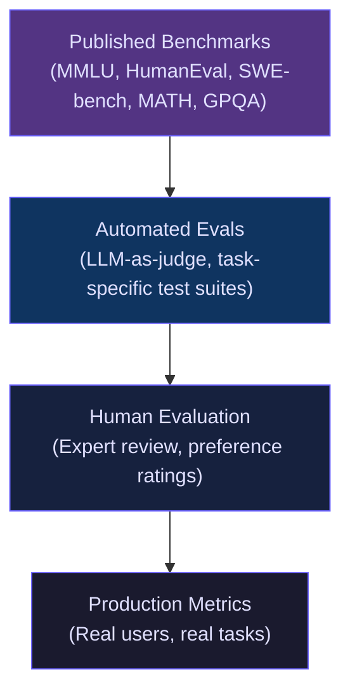
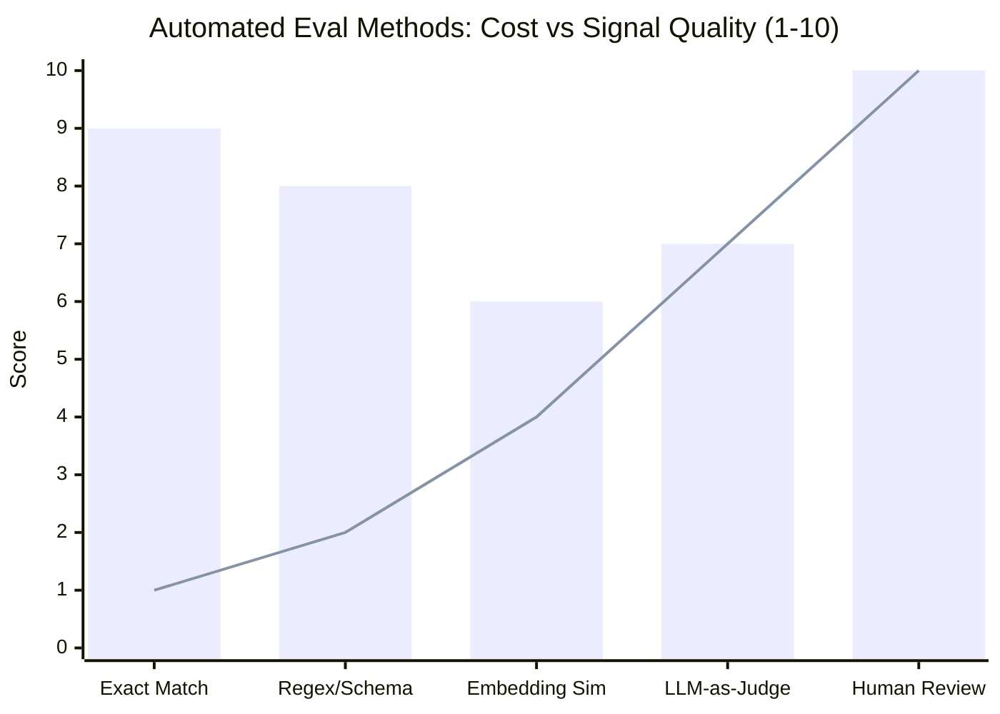
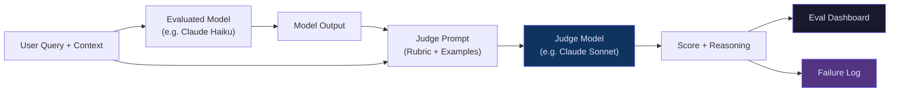

A model that aces every published benchmark can still fail spectacularly at your actual task. I've seen teams spend weeks comparing MMLU scores, pick the "winner," deploy it, and watch users quietly stop using the product. The benchmark said one thing; the workflow said another.

LLM evaluation is the discipline that closes that gap. Done well, it tells you which model to use, when a prompt change made things worse, and whether the system you're about to ship is actually ready. Done poorly — or skipped — it leaves you guessing.

This guide is for developers, AI engineers, and technical product managers building real applications on top of LLMs. I'll cover what the major benchmarks actually measure, how to complement them with automated evals, where LLM-as-judge fits in, and how to keep quality accountable in production.

---

## Why Benchmarks Alone Aren't Enough

Published benchmarks serve a real purpose: they let researchers compare models on controlled, reproducible tasks. MMLU tells you something about world knowledge. HumanEval tells you something about Python function synthesis. SWE-bench tells you something about resolving real GitHub issues.

The problem is the gap between "something about" and "your task."

When I evaluate a code-generation model for a team using a proprietary TypeScript monorepo with internal libraries, HumanEval scores are almost irrelevant. HumanEval uses short, self-contained Python functions. The real job involves navigating complex file dependencies, matching naming conventions from 200K lines of existing code, and following architecture decisions that aren't in any public training set.

Three structural problems make benchmark-only evaluation dangerous:

**Benchmark overfitting.** Model providers optimize for benchmark scores. Some degree of this is legitimate — a model that scores well on MMLU has probably learned a lot about the world. But scores have been inflated by training on benchmark-adjacent data, making the numbers harder to interpret at face value.

**Distribution mismatch.** Your users don't ask MMLU questions. The gap between "academically interesting" and "professionally useful" is often enormous, especially for specialized domains like legal review, medical summarization, or domain-specific code generation.

**Missing production signals.** Benchmarks can't capture latency under load, cost at scale, failure modes in adversarial inputs, or user satisfaction. A model that scores 5% higher on HumanEval but takes 3x longer to respond may be the wrong choice for an interactive coding assistant.

This is why serious evaluation uses multiple layers.

---

## The Evaluation Pyramid

Think of LLM evaluation as a pyramid. Benchmarks sit at the base — broad, cheap, but distant from your use case. Moving up the pyramid adds specificity and cost. At the top is production data, which is the most honest signal of all.

Most teams get stuck at the bottom. They compare benchmark tables, pick a model, and hope. The teams that build reliable AI products climb the full pyramid — using benchmarks to narrow the field, automated evals to test their specific tasks, human review to catch what automation misses, and production metrics to catch what humans miss.

---

## Key Benchmarks and What They Actually Measure

Here's an honest look at the major LLM benchmarks you'll see cited in model cards and provider announcements.

### MMLU (Massive Multitask Language Understanding)

MMLU covers 57 subjects ranging from elementary math to professional law and medicine. Each question is multiple-choice with four options. A score above 90% is now considered state-of-the-art; GPT-4 class models routinely hit that range.

**What it actually tests:** Whether a model has absorbed factual knowledge across a broad range of academic domains.

**What it doesn't test:** Reasoning chains, instruction following, code generation, factual grounding with citations, or anything that requires a non-multiple-choice response. A model can score well on MMLU while still confidently hallucinating when given an open-ended factual question.

**When to use it for selection:** MMLU is useful for filtering out obviously weak models and for selecting models that will handle broad question-answering tasks. If your application is a knowledge assistant that answers factual questions across many domains, MMLU is genuinely informative.

### HumanEval

HumanEval is 164 Python programming problems with associated unit tests. The model writes a function body; the tests determine whether it passes. The standard metric is pass@1: does the model's first attempt pass all tests?

**What it actually tests:** The ability to synthesize short, self-contained Python functions from a docstring.

**What it doesn't test:** Multi-file reasoning, TypeScript, large codebase navigation, refactoring, or code that depends on external context. HumanEval problems are intentionally self-contained, which is both the benchmark's strength (reproducibility) and its biggest weakness for practical code evaluation.

**When to use it for selection:** HumanEval is a reasonable tiebreaker for general-purpose code generation, but I wouldn't use it as the primary signal for a production coding assistant. Build task-specific evals for your actual codebase instead.

### MATH

MATH is 12,500 competition-level math problems spanning algebra, geometry, number theory, probability, and calculus. The problems are significantly harder than MMLU's math subset — many require multi-step derivations.

**What it actually tests:** Mathematical reasoning and step-by-step symbolic manipulation.

**When to use it for selection:** MATH is the right benchmark if your application involves quantitative reasoning: financial modeling assistants, tutoring systems, scientific computing workflows, or agents that need to verify their own calculations. For most product use cases, a high MATH score is a useful signal of reasoning depth but doesn't transfer directly.

### GPQA (Graduate-Level Google-Proof Q&A)

GPQA is a deliberately hard benchmark. The questions are written by domain experts in biology, chemistry, and physics, and are designed to be difficult to answer correctly by searching the web — hence "Google-proof." Human experts in the relevant field score around 65%; non-experts score near random chance.

**What it actually tests:** Deep expert-level reasoning in STEM domains.

**When to use it for selection:** GPQA matters if you're deploying AI into genuinely expert domains — scientific research assistance, advanced medical literature review, or pharmaceutical R&D. For typical software development tools, GPQA is an interesting signal of general reasoning power but not a direct predictor of usefulness.

### SWE-bench

SWE-bench is my favorite benchmark to actually trust for software engineering use cases. It presents the model with real GitHub issues from popular open-source Python repositories and asks it to produce a patch that resolves the issue. The patch is then run against the repository's existing test suite.

**What it actually tests:** The ability to understand a real codebase, diagnose an actual bug report, and write a patch that fixes the issue without breaking other tests.

**When to use it for selection:** If you're building a coding agent, automated PR reviewer, or bug-fixing workflow, SWE-bench scores are more informative than HumanEval. The benchmark actually requires codebase navigation, understanding existing code, and producing targeted changes — which is much closer to real software work.

The catch: even state-of-the-art models only solve 40–50% of SWE-bench tasks, which is a useful reminder that LLMs still need human oversight for real code changes.

---

## Automated Evaluation Methods

Once you move past published benchmarks to your own task, you need automated evaluation methods that scale. Manual human review is the gold standard but doesn't scale to catching every regression across every prompt version.

Here's how the main approaches compare:

The bars show signal quality; the line shows relative cost. Exact match and schema validation are cheap and high-signal for structured tasks. LLM-as-judge is the most versatile automated option for tasks where the "correct" answer isn't a fixed string.

**Exact match and schema validation** work best when the task has a deterministic correct answer: JSON extraction, classification into a fixed set of labels, SQL query generation (checked by execution). If the output can be mechanically verified, start here. It's cheap, fast, and unambiguous.

**Embedding similarity** measures semantic distance between the model's output and a reference answer. It's useful for soft matching — when you want to detect whether the model said something roughly equivalent to the expected answer, even if the wording differs. The weakness is that embedding similarity can be fooled by outputs that are topically related but factually wrong.

**Execution-based evaluation** runs the output as code or queries a database. HumanEval uses this approach. For coding assistants, running the generated code against a test suite is the most honest automated evaluation available. It's worth the engineering investment to set up if your use case involves code.

**Rule-based rubric evaluation** uses a checklist of requirements that can be automatically checked: did the response include a code block, did it mention all required items from the input, did it avoid forbidden phrases, is the JSON valid? This is lightweight and reliable for tasks with clear structural requirements.

---

## Building Your Own Eval Suite

The most important thing you can do for LLM evaluation is build an eval suite specific to your tasks. Here's how I approach it.

**Start with real failures.** Pull 50–100 examples of cases where your current system failed or where users reported bad outputs. These are your highest-value test cases. A test suite built from real failures will catch real regressions; a test suite built from happy-path examples will not.

**Add golden examples.** Curate 50–100 examples where the system produced ideal output. These anchor the rubric and help you define what "good" actually means.

**Define failure modes explicitly.** For each task type, write down what failure looks like. For a code generation task: compiles but logic is wrong, compiles but uses deprecated API, doesn't compile, includes hallucinated function names. Naming failure modes forces clarity and makes rubric design easier.

**Keep the suite versioned.** Store your eval cases in a git repository alongside your prompts and code. When you change a prompt, re-run the full suite and compare the before-and-after diff. This is how you catch regressions.

**Target 200–500 examples per task type.** Fewer than 100 examples and your scores are too noisy to trust. More than 1,000 examples starts to create review burden without proportional signal gain.

---

## LLM-as-Judge

LLM-as-judge uses a capable model — typically a frontier model like Claude Sonnet or GPT-4o — to evaluate the output of another model (or an earlier version of the same model). It's the most scalable approach for tasks where the correct answer is subjective or where the space of valid outputs is too large for exact matching.

Here's how I structure a production LLM-as-judge workflow:

The judge model receives the original query, any relevant context (retrieved documents, tool outputs), and the model's output. It then scores the output against a rubric you define.

**Writing a good judge prompt is the hardest part.** The most common mistake is writing a vague rubric like "rate this response from 1 to 10 for quality." That produces noisy, inconsistent scores that don't correlate with actual user value. Instead, specify exactly what each dimension measures and what each score level looks like:

- **Correctness (1–5):** Does the response accurately address the query? 5 = fully correct, no errors. 3 = mostly correct with one minor error. 1 = factually wrong or missing the point entirely.
- **Completeness (1–5):** Does the response include all required elements? 5 = all required elements present. 3 = one required element missing. 1 = substantively incomplete.
- **Instruction adherence (1–5):** Did the response follow all stated constraints? 5 = all constraints respected. 1 = major constraint violated.

Include concrete examples (few-shot demonstrations) in the judge prompt. Without them, the judge's calibration drifts across different input types.

**Validate your judge against human labels.** Before trusting LLM-as-judge scores in your CI pipeline, measure agreement between the judge and human reviewers on a held-out sample. Agreement above 80% at the binary pass/fail level is a reasonable threshold for trusting the judge as an automated proxy. Below that, revisit the rubric.

**Use a stronger judge than the evaluated model.** If you're evaluating Claude Haiku outputs with Claude Haiku as the judge, the judge will have blind spots in the same places the evaluated model does. Use a stronger judge — Claude Sonnet or GPT-4o — to catch errors the evaluated model itself can't reliably identify.

---

## Production Evaluation

Automated evals and human review catch most problems before they reach users. Production evaluation catches the rest — and it often catches different problems.

Production signals I track for every LLM-powered feature:

**Task completion rate.** Define what "task completed" means (user reached a defined end state, API call succeeded and returned valid output, downstream action was taken) and track it. A drop in completion rate is the first sign that something changed for the worse.

**User edit rate.** In coding assistants, document drafting, or any workflow where users can accept or modify the AI output, track how often users edit before accepting. A rising edit rate means the model is drifting from what users actually want. This signal is more sensitive than CSAT scores because users rarely complain explicitly — they just quietly fix the output.

**Failure mode distribution.** Log model outputs and run your automated classifier over them in production. Track the proportion of outputs that fall into each failure mode. This lets you see when a prompt change shifts the distribution of errors, even if the aggregate score stays flat.

**Latency percentiles.** p50, p90, and p99 latency matter for interactive applications. A model that is 20% slower at p99 after a change may be fine on average but noticeably worse for users who hit the slow path.

**Token cost per successful task.** Not cost per API call — cost per task that was actually useful. A model that costs 20% more per call but requires 40% fewer retries and user interventions is cheaper per successful outcome.

I build a simple eval dashboard that shows a 7-day rolling view of these metrics, broken down by task type. When a metric moves outside the expected band, it triggers a review of recent changes.

---

## Common Mistakes in LLM Evaluation

After watching teams build evaluation systems across many different domains, I see the same mistakes repeatedly.

**Evaluating on data the model saw.** If you're testing a model on examples that were used during fine-tuning or that appeared in training data-adjacent benchmarks, your scores will be inflated. Keep your eval set strictly separate from anything that informed model selection or prompt design.

**Averaging over too-different task types.** A single aggregate score across code generation, summarization, and question-answering is nearly meaningless. The model may be excellent at two and terrible at one, and the average hides it. Segment scores by task type and track them independently.

**Shipping on green CI without qualitative review.** Automated evals catch known failure modes reliably. They don't catch new failure modes that your rubric doesn't describe. Before major model or prompt changes, do a qualitative review of 50–100 outputs alongside the automated scores. Humans catch things rubrics miss.

**Treating eval as a one-time gate rather than a continuous process.** Models change (providers update them silently), prompts drift, context sources evolve, user intent shifts. Evaluation that was accurate six months ago may no longer reflect the current behavior of the system. Run evals continuously, not just at release time.

**Ignoring retrieval quality in RAG systems.** In retrieval-augmented systems, bad retrieval is responsible for the majority of generation failures. Evaluating only the final output misses this. Track retrieval recall, context relevance, and whether the retrieved chunks actually contain the information needed to answer the query.

**Using self-reported confidence as a quality signal.** Models that say "I'm confident this is correct" are not reliably more accurate than models that hedge. Confidence calibration varies dramatically by model and task. Don't use model-expressed certainty as a proxy for actual correctness — measure it directly.

---

## Verdict

The teams that build reliable LLM-powered products treat evaluation as continuous infrastructure, not a one-time pre-launch checkpoint. They use published benchmarks to narrow the field, build task-specific eval suites from real failures, validate with human review, and close the loop with production metrics.

The key hierarchy: benchmarks tell you what models can do in general. Automated evals tell you what your specific model does on your specific tasks. Human review tells you what automated evals miss. Production metrics tell you what all of the above miss.

Start by collecting 100 real failures from your current system. Turn them into test cases with explicit rubrics. Run them automatically on every significant change. That single step — a grounded, failure-driven eval suite — will tell you more about your system's quality than any combination of benchmark scores ever will.

---

## FAQ

### How many eval examples do I actually need to get reliable scores?

For a single task type with relatively low output variance (classification, extraction, structured generation), 100–200 examples is enough to detect a meaningful quality regression. For higher-variance tasks like open-ended generation or multi-step reasoning, 300–500 examples gives more stable scores. The key signal isn't raw count — it's whether your test cases cover the actual distribution of inputs your system sees in production. A well-curated 100-example set from real usage is worth more than 1,000 synthetic examples that don't reflect real queries.

### Can I use the same model to evaluate itself?

Technically yes, but the signal is weak. A model evaluating its own outputs has the same blind spots as the model generating them. It's more useful as a sanity check than as a rigorous eval. If you need self-evaluation (because you're on a tight budget or need speed), prompt the model explicitly to find flaws and hallucinations — adversarial framing improves the quality of self-critique. For anything production-critical, use a separate, stronger judge model.

### What's the difference between offline and online evaluation?

Offline evaluation runs against a fixed dataset before the model or prompt reaches users — this is your CI pipeline, your regression tests, your pre-launch checks. Online evaluation happens in production, measuring real user interactions. Both are necessary. Offline evaluation is faster and lets you catch regressions before they ship. Online evaluation catches distribution shift (user queries evolving in ways your test set didn't anticipate) and user-behavior signals like edit rate that can't be replicated offline.

### How do I evaluate LLMs for tasks where there's no single correct answer?

Use rubric-based LLM-as-judge evaluation with multiple dimensions scored separately. Define "good enough" concretely for each dimension rather than asking for an overall score. For example, a summarization task might have separate scores for factual accuracy (checkable against the source), completeness (did it cover the main points), conciseness (length appropriate for the use case), and style (appropriate for the intended audience). Validate the judge rubric against human labels before trusting it. Preference-based evaluation — presenting two outputs and asking which is better — can also be more reliable than absolute scoring for subjective tasks.

### Should I build my own eval framework or use an existing one?

Start with the simplest possible thing: a Python script that loads your test cases, calls the model, and writes scores to a CSV. Add complexity only when you outgrow it. That said, existing frameworks like LangSmith, Braintrust, and promptfoo are worth evaluating if you want a hosted dashboard, team-level access controls, and pre-built integrations with LLM-as-judge. The framework doesn't matter nearly as much as the quality of your test cases and rubrics — a mediocre framework with great eval cases will outperform a sophisticated framework with weak ones.
