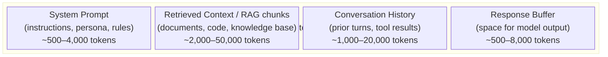
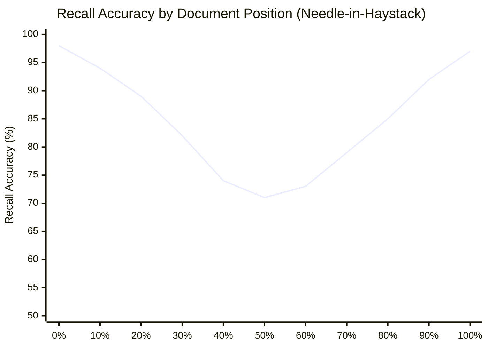
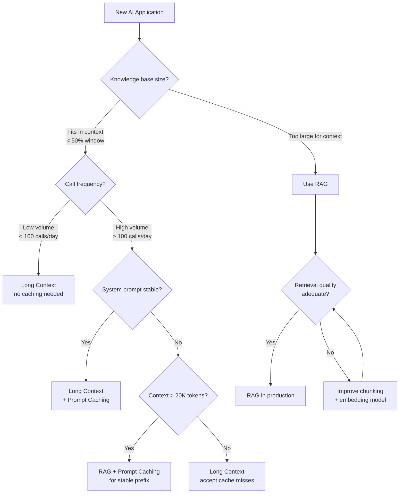

I've shipped production AI systems where the context window was an afterthought — and I've paid for it. One application silently dropped earlier messages, causing the model to forget user preferences mid-session. Another hit token limits during batch document analysis and started hallucinating summaries. Both failures were preventable once I understood how context windows actually work.

This guide covers everything I wish I'd known earlier: what an LLM context window is, how sizes compare across today's top models, where long context breaks down, and the strategies that keep your application fast, accurate, and cost-efficient.

## What Is a Context Window?

The **context window** is the total number of tokens an LLM can process in a single inference call — everything the model "sees" at once. Tokens are roughly four characters of English text, so a 128K context window holds approximately 96,000 words, or about a 300-page book.

Every call to the model draws from the same fixed token budget. That budget has to cover the system prompt, any retrieved documents, the full conversation history, tool call results, and the space reserved for the model's response. When input tokens plus expected output tokens exceed the limit, something gets cut — usually the oldest conversation turns, unless your application handles truncation explicitly.

This matters because LLMs are stateless by design. There is no persistent memory between API calls. The context window *is* the model's working memory for that interaction. Once tokens fall outside the window, the model cannot access them.

## Anatomy of a Context Window

Every prompt occupies the same shared token budget. Understanding how each layer consumes that budget is the first step toward using it efficiently.

The system prompt and response buffer are relatively fixed. Retrieved context and conversation history are where most applications run into trouble — both grow over time and compete for the same limited space.

## Current Context Window Sizes

Context limits have expanded dramatically since 2023. Here's where the major models stand as of early 2026:

| Model | Provider | Context Window | Notes |
|---|---|---|---|
| Gemini 1.5 Pro | Google | 2,000,000 tokens | Largest available; ~5M words |
| Gemini 1.5 Flash | Google | 1,000,000 tokens | Faster, cheaper 1M variant |
| Claude 3.5 Sonnet | Anthropic | 200,000 tokens | Strong mid-range performance |
| Claude 3 Opus | Anthropic | 200,000 tokens | High capability, slower |
| GPT-4o | OpenAI | 128,000 tokens | Most widely deployed GPT-4 class |
| GPT-4o mini | OpenAI | 128,000 tokens | Cost-efficient variant |
| Llama 3.3 70B | Meta (open) | 128,000 tokens | Leading open-weight option |
| Mistral Large | Mistral | 128,000 tokens | Strong European alternative |
| DeepSeek V3 | DeepSeek | 64,000 tokens | Competitive open-weight model |
| GPT-3.5 Turbo | OpenAI | 16,385 tokens | Legacy; still widely used |

A few observations from working with these models: bigger context does not automatically mean better results. Gemini's 2M window is impressive for ingesting entire codebases, but the model's ability to reason accurately over that full range is another matter.

## Long Context Does Not Mean Perfect Recall

This is the most dangerous misconception in LLM application development. A model with a 200K context window will not give you 200K tokens of perfect recall. Benchmark research consistently shows that recall accuracy degrades depending on *where* information appears in the context.

The "needle in a haystack" test — hiding a specific fact somewhere in a long document and asking the model to retrieve it — reveals a consistent pattern: retrieval accuracy is high at the beginning and end of the context, but drops significantly in the middle.

The "lost in the middle" effect — documented in research from Stanford and others — shows that models reliably underperform on information buried in the center of long contexts. This has real consequences:

- **Instruction following** degrades when rules appear in the middle of a long system prompt
- **Multi-document QA** misses relevant facts when the key document isn't at the beginning or end
- **Long conversation memory** fades for details discussed many turns ago (not the most recent, not the first)

The practical takeaway: do not assume that stuffing everything into the context window produces the best results. Structure matters as much as size.

## Strategies for Using Long Context Effectively

Once you understand the failure modes, you can work around them. Here are the strategies I use in production.

### 1. Position Critical Information Deliberately

Place the most important instructions and constraints at the very beginning of your system prompt and at the very end of your user message. The model reliably attends to both endpoints. Burying a key constraint in paragraph 12 of a long system prompt is a common source of instruction-following failures.

### 2. Use Recency to Your Advantage

When you need the model to reason over a specific document, put that document last — immediately before your question. Recency bias works in your favor here. I've seen measurable quality improvements from simply reordering context placement without changing any other prompt text.

### 3. Implement Sliding Window Conversation Management

For long-running conversations, don't let history grow unbounded. Implement a sliding window that keeps the last N turns plus a compressed summary of earlier turns. Libraries like LangChain and LlamaIndex include built-in memory management strategies. Rolling your own is straightforward: summarize the oldest N turns when you approach 70% of your token budget.

### 4. Chunk and Prioritize Retrieved Documents

When using retrieval, rank your chunks by relevance score and place the highest-scoring chunks at the top and bottom of your retrieved context block. Discard low-scoring chunks entirely rather than padding the context with marginally relevant text. Lower signal-to-noise ratio hurts performance even within the context limit.

### 5. Separate Reasoning from Long Context

For tasks requiring multi-step reasoning over long documents, consider a two-pass approach: first extract relevant quotes with a fast model call, then reason over the extracted material with a second call. This dramatically reduces the reasoning burden on the model.

## When to Use RAG Instead of Long Context

Retrieval-Augmented Generation (RAG) and long context windows solve related but different problems. Choosing incorrectly is expensive — both in cost and quality.

**Use long context when:**
- Your document set is small enough to fit comfortably (under 50% of the window)
- You need the model to reason holistically across the full document (e.g., finding inconsistencies, synthesizing themes)
- Latency allows for larger prompt processing
- Your content changes infrequently

**Use RAG when:**
- Your knowledge base exceeds any model's context limit
- You need precise, citable retrieval from a specific source
- Fresh content updates must be reflected immediately without re-prompting
- Cost is a primary constraint (RAG retrieves a small, targeted chunk; long-context calls pay for everything)

The common mistake I see is using RAG as a workaround for poor chunking or embedding quality, then concluding RAG doesn't work. RAG's quality ceiling is your retrieval quality — embedding model, chunk size, and similarity threshold all matter.

## Prompt Caching and Context Reuse

If you're making repeated calls with a large, stable system prompt, **prompt caching** is the single highest-ROI optimization available. Anthropic, OpenAI, and Google all offer forms of caching for prefix tokens.

With Anthropic's prompt caching, tokens marked with a `cache_control` breakpoint are stored server-side for up to five minutes (extended to one hour with extended caching). Subsequent calls that share the same prefix pay only 10% of the normal input token cost for cached portions.

For an application with a 10,000-token system prompt making 1,000 calls per hour:
- Without caching: 10M tokens/hour at full input price
- With caching: 10K tokens charged at full price (first call), then 9.99M tokens at 10% cost

The savings compound quickly at production scale. The key constraint: cached prefixes must be byte-identical. Even a single character change invalidates the cache. Design your system prompt to be static; move dynamic content (dates, user-specific data) to the user turn.

## Cost Implications of Context Window Size

Context window size has a direct, linear relationship to cost. Every token you send is a token you pay for.

| Scenario | Input Tokens | Estimated Cost per 1,000 Calls (Claude 3.5 Sonnet) |
|---|---|---|
| Short chatbot turn | 2,000 | ~$6 |
| Medium RAG application | 10,000 | ~$30 |
| Long document analysis | 50,000 | ~$150 |
| Full 200K context | 200,000 | ~$600 |

These numbers assume $3/million input tokens. Cached tokens reduce this by 90%. The practical implication: a 200K-token call costs 100x more than a 2K-token call. Before defaulting to "just send everything," model the monthly cost at your expected call volume.

Output tokens are typically priced 3-5x higher than input tokens. If your task requires long generated responses, that cost can exceed input costs quickly. Streaming responses and early stopping where appropriate keep output costs in check.

## Decision Flowchart: Choosing Your Context Strategy

## Best Practices

**Always measure token usage.** Log prompt tokens and completion tokens per call. Most providers return this in the API response. Without this data, you cannot identify which calls are costing the most or where truncation is occurring.

**Set explicit max_tokens.** Never leave max_tokens at the API default. Unbounded output generation wastes money and can hit unexpected limits. Define the maximum useful response length for each use case.

**Test at the edges.** Write integration tests that send prompts near your truncation threshold. Verify that your truncation logic removes the right content and that the model still produces coherent output with a truncated context.

**Use structured outputs to reduce token waste.** JSON mode or tool calling schemas constrain the output format. This prevents the model from generating lengthy preambles ("Certainly! Here's the information you requested...") and reduces output tokens substantially.

**Monitor for context-related degradation.** Track response quality metrics (user ratings, downstream task success) segmented by prompt length. If quality drops at longer prompts, you've found the context window ceiling for your specific task.

**Plan for model upgrades.** Context limits and pricing change frequently. Design your application to swap models without rewriting business logic. Abstract the LLM call behind an interface that you control.

## FAQ

### Does a larger context window always produce better results?

No. Larger windows increase the risk of the "lost in the middle" effect and add cost proportional to input tokens. A well-structured 20K-token prompt often outperforms a carelessly assembled 100K-token prompt. Use the minimum context that reliably supports the task.

### How do I know if my application is hitting context limits?

Check the `stop_reason` field in API responses. A value of `max_tokens` or `length` indicates the model stopped because it ran out of output space. For input truncation, some providers return an error; others silently trim older messages. Log token usage and set alerts when you exceed 80% of the context limit.

### Is prompt caching worth implementing for small applications?

It depends on your system prompt size and call volume. If your system prompt is under 1,000 tokens or you're making fewer than 50 calls per day, the savings are negligible. Above 5,000 tokens and 200+ daily calls, prompt caching typically pays for the implementation time within weeks.

### Can I use RAG and long context together?

Yes, and this is often the best approach for large-scale applications. Use RAG to retrieve the most relevant chunks, then pass those chunks through a large-context model that can reason holistically over them. The context window handles synthesizing retrieved material; RAG handles selecting what gets included.

### What happens to my data in the prompt cache?

Cached prompts are stored server-side per API key, not shared across customers. For Anthropic, the cache TTL is 5 minutes by default (extendable to 1 hour). The same privacy and data handling terms apply to cached tokens as to regular API calls. For regulated industries, check your provider's data processing agreements before enabling caching with sensitive content.
