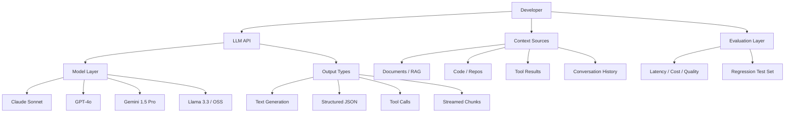
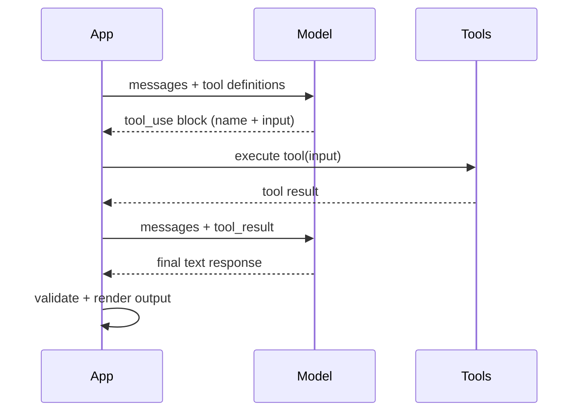
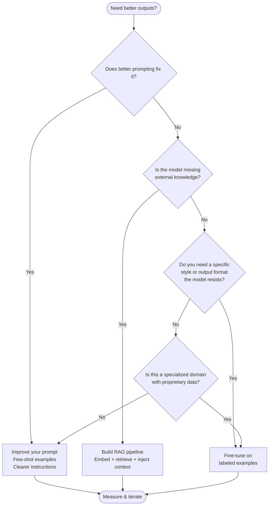

I've watched engineers spend weeks on the wrong parts of LLM integration — obsessing over model benchmarks while their token costs spiral, or building fine-tuning pipelines for problems that a better prompt would have solved in an afternoon. This guide cuts through that noise. If you are a developer building something real with language models, these are the fundamentals that actually move the needle.

## What Developers Actually Need to Know

Most LLM tutorials explain the transformer architecture. That is useful background, but it is not what you need to ship production software. What you need to understand is the contract the model exposes to you: how you send context in, how the model samples a response, what knobs you can turn, and how to design around the constraints that actually bite you at scale.

The four things that matter most in practice are: **token budgets** (how much you can send and at what cost), **sampling controls** (how the model decides what to say), **prompt structure** (how you shape model behavior without retraining), and **API patterns** (how to wire all of this into a real system). Everything else — benchmarks, architecture papers, hype — is secondary until those four are solid.



That diagram is the LLM ecosystem as a developer sees it. You own the left side — what context you send, how you call the API, how you evaluate the result. The model is a black box in the middle. Your leverage is entirely in what surrounds it.

---

## Tokens and Context Windows

A **token** is roughly four characters of English text, or about three-quarters of a word. "The quick brown fox" is five tokens. A typical paragraph is 60–80 tokens. Every model has a maximum context length — the combined limit on input plus output tokens for a single request.

Understanding the token economy is non-negotiable because it controls both your cost and your capability ceiling.

| Model | Context Window | Typical Input Cost | Typical Output Cost |
|---|---|---|---|
| Claude 3.5 Sonnet | 200,000 tokens | $3 / 1M tokens | $15 / 1M tokens |
| GPT-4o | 128,000 tokens | $5 / 1M tokens | $15 / 1M tokens |
| Gemini 1.5 Pro | 1,000,000 tokens | $1.25 / 1M tokens | $5 / 1M tokens |
| Claude Haiku 3.5 | 200,000 tokens | $0.80 / 1M tokens | $4 / 1M tokens |
| GPT-4o mini | 128,000 tokens | $0.15 / 1M tokens | $0.60 / 1M tokens |

Three things to internalize about context windows:

**Position bias is real.** Models pay more attention to content at the very beginning and the very end of the context window. Information buried in the middle of a 100K-token prompt is reliably retrieved less often. If you are doing RAG, put the most relevant retrieved chunks near the top of the prompt, not buried at the end of a wall of text.

**Output tokens cost more than input.** Across every major provider, output is 3–5x the price of input per token. This means verbose output formats (like narrated explanations instead of structured JSON) quietly multiply your bill. Default to compact, structured outputs where possible.

**Context does not equal memory.** The model has no persistent state between API calls. Every request is stateless. If you want the model to "remember" something from a previous turn, you have to include it in the next request's context. This is the root cause of the most common LLM architecture mistakes I see — teams expecting session state that does not exist.

---

## Temperature, Top-P, and Sampling

When the model finishes reasoning about what token should come next, it does not simply pick the highest-probability token every time. It samples from a probability distribution. The sampling controls let you tune how creative versus deterministic that sampling is.

**Temperature** is the most important lever. Temperature 0 makes the model always pick the highest-probability token — fully deterministic and repetitive. Temperature 1 samples according to the raw probabilities — more varied and creative. Temperature above 1 flattens the distribution further, making low-probability tokens more likely — useful for brainstorming, risky for factual work.

In practice:
- `temperature: 0` for extraction, classification, JSON generation, code that must be correct
- `temperature: 0.3–0.5` for drafting, summarization, most production use cases
- `temperature: 0.7–1.0` for creative writing, brainstorming, ideation

**Top-P** (nucleus sampling) is a secondary control that cuts the token distribution at a cumulative probability threshold. `top_p: 0.9` means the model only considers the smallest set of tokens that together account for 90% of the probability mass. It is a softer way to clip wild low-probability tokens. Most teams leave this at the default (usually 1.0) and tune temperature alone. Tuning both at once makes behavior hard to reason about.

**Top-K** limits consideration to the K most likely tokens. Less commonly exposed in major APIs. Skip it until you have a reason to reach for it.

My default: set temperature to match the task, leave everything else at defaults. The models have been trained with good defaults — do not override them without a specific reason and a test to validate the change.

---

## Prompting Fundamentals

Prompting is not a soft skill. It is the primary interface to model behavior, and small structural choices create large quality differences. These are the patterns that consistently produce better results.

**System prompt vs user message.** The system prompt sets the persistent context: who the model is, what format it should use, what constraints apply, what it should refuse. The user message is the per-request instruction. Most models weight the system prompt heavily — put your rules and format requirements there, not at the bottom of a long user message.

**Be explicit about format.** Do not ask for "a summary." Ask for "a bullet-point summary with exactly three bullets, each under 20 words, focusing on action items." Models follow explicit format instructions far better than implicit ones. If you need JSON, say exactly which fields, what types they are, and what they mean. Provide an example when the format is non-trivial.

**Give examples, not just instructions.** Few-shot prompting — including two or three examples of input and desired output in the prompt — is consistently the highest-leverage technique for improving output quality without touching the model. One well-chosen example is worth more than a paragraph of natural language instructions.

**Chain complex tasks.** A single model call asked to do five distinct things will do all five worse than five targeted calls, each doing one thing well. If your task involves classification, then extraction, then formatting, break it into three prompts. The intermediate outputs give you checkpoints to validate and debug.

**Give the model an out.** If you ask a model to extract information that is not present in the document, it will often hallucinate something plausible. Add an instruction like "If the answer is not present in the document, output null for that field." This dramatically reduces hallucination in extraction tasks.

---

## API Patterns: Chat Completions, Streaming, and Tool Use

### Chat Completions

The standard API contract across Anthropic, OpenAI, and most providers follows the same shape: a list of messages with roles (`system`, `user`, `assistant`), and the model appends the next `assistant` message. Here is a minimal example in TypeScript:

```typescript
const response = await anthropic.messages.create({
  model: "claude-sonnet-4-5",
  max_tokens: 1024,
  system: "You are a code reviewer. Return structured JSON only.",
  messages: [
    { role: "user", content: "Review this function:\n\n" + codeSnippet }
  ]
})
const text = response.content[0].text
```

Always set `max_tokens` explicitly. The default is often the model maximum, which is both slow and expensive. Set it to the actual ceiling you expect for the task.

### Streaming

Streaming returns tokens as they are generated rather than waiting for the full response. This is essential for any user-facing application — a response that streams in feels 10x faster than one that appears after a 6-second pause, even if the total latency is identical.

```typescript
const stream = anthropic.messages.stream({
  model: "claude-sonnet-4-5",
  max_tokens: 512,
  messages: [{ role: "user", content: userMessage }]
})

for await (const chunk of stream) {
  if (chunk.type === "content_block_delta") {
    process.stdout.write(chunk.delta.text)
  }
}
```

Streaming also lets you implement early stopping — if you detect that the model is generating something malformed or off-topic after the first few hundred tokens, you can abort the request and save the remaining cost.

### Tool Use (Function Calling)

Tool use is how you give the model the ability to call external APIs, query databases, or run computations. You define a set of tools with JSON schemas, and when the model decides to use one, it returns a structured tool call instead of a text response. Your code executes the tool, returns the result, and the model continues.

```typescript
const tools = [{
  name: "get_weather",
  description: "Get current weather for a city",
  input_schema: {
    type: "object",
    properties: {
      city: { type: "string", description: "City name" }
    },
    required: ["city"]
  }
}]

const response = await anthropic.messages.create({
  model: "claude-sonnet-4-5",
  max_tokens: 256,
  tools,
  messages: [{ role: "user", content: "What's the weather in Tokyo?" }]
})
```

Tool use requires an agentic loop: model call → check for tool use → execute tool → feed result back → model call again. Keep the loop simple until you need it to be complex.



---

## Model Selection: When to Use Which

There is no universally best model. The right choice depends on the task, the latency budget, the context length, and the cost envelope.

**Use a frontier model (Claude Sonnet, GPT-4o, Gemini 1.5 Pro) when:**
- The task requires nuanced reasoning or multi-step planning
- Output quality is high-stakes (customer-facing, legal, medical)
- You need long context (>32K tokens)
- You are still iterating on the prompt — use the best model to establish a quality ceiling, then downgrade

**Use a fast/cheap model (Claude Haiku, GPT-4o mini, Gemini Flash) when:**
- The task is well-defined and repetitive (classification, extraction, routing, summarization)
- Latency matters more than peak quality
- Volume is high and cost is a primary constraint
- You have a validated prompt that a smaller model can execute reliably

**Use an open-weight model (Llama 3.3, Mistral, Qwen) when:**
- Data cannot leave your infrastructure (privacy, compliance, air-gapped)
- You need to fine-tune on proprietary data without a vendor relationship
- You are running very high volume where self-hosted marginal cost beats API pricing
- You are building a product that cannot tolerate a third-party API dependency at the core

**Use a reasoning model (o3, Claude with extended thinking) when:**
- The task is hard math, complex multi-step logic, or competitive programming
- You have time budget for slower inference (seconds, not milliseconds)
- You need the model to show its work in a verifiable way

---

## Cost Optimization

Token cost is the most controllable variable in LLM spend. Here is where the money actually goes and how to cut it.

**Audit your prompt length.** Print your full assembled prompt (system + context + user message) before you send it. Most teams are shocked to discover they are sending 3,000 tokens of boilerplate that could be cut to 400. Every token you trim is a permanent cost reduction across every request.

**Cache your system prompt.** Anthropic and Google both support prompt caching — if your system prompt or large document context is repeated across requests, you pay a fraction of the normal input rate for cached tokens. Claude prompt cache hits cost $0.30/1M tokens vs $3.00/1M for uncached. At 10,000 requests per day with a 1,000-token system prompt, that is a 10x reduction on a large chunk of your spend.

**Match model to task.** Routing simple classification tasks to GPT-4o mini instead of GPT-4o reduces that task's cost by 30x. A routing layer that classifies request complexity and dispatches to the appropriate model typically cuts total spend by 40–70% compared to sending everything to the flagship model.

**Use structured outputs to reduce output tokens.** A JSON object with five fields is usually 50–80 tokens. The same information in a narrated paragraph is 200–400 tokens. Prefer JSON, YAML, or list formats over prose for any machine-consumed output.

**Batch non-interactive requests.** OpenAI's Batch API and Anthropic's batch endpoint offer 50% discounts for asynchronous workloads with a 24-hour turnaround window. If you are running nightly enrichment, bulk analysis, or evaluation jobs, batching cuts that cost in half.

---

## Fine-Tuning vs RAG vs Prompting

This is one of the most common architectural decisions in production LLM work, and it is often made in the wrong order.



**Start with prompting.** Most teams reach for fine-tuning or RAG because a few-shot example produced mediocre results — and they have not tried systematic prompt engineering. Before you build any infrastructure, spend a week on your prompt. Add examples. Specify the output format exactly. Chain the task into smaller steps. This alone resolves 70% of quality problems in my experience.

**Use RAG when the model needs knowledge it does not have.** If the model's training data does not include your internal documentation, recent events, or private records, no amount of prompting or fine-tuning will make it accurate. RAG (retrieval-augmented generation) solves this by embedding your documents, retrieving relevant chunks at query time, and injecting them into the prompt. The model reads the document; it does not memorize it.

RAG is also far cheaper and more maintainable than fine-tuning. You can update your document store without touching the model. You get citations pointing to source material. You avoid catastrophic forgetting (where fine-tuning on new data degrades performance on old tasks).

**Fine-tune when you need a specific style or domain that prompting cannot produce.** The genuine use cases for fine-tuning are: you need the model to reliably output a very specific format that it resists with prompting; you are building a domain-specific model where the vocabulary and conventions are very different from general text (e.g., structured medical coding, legal clause extraction with specific tags); or you need to distill a large expensive model's behavior into a smaller cheaper one for high-volume serving.

Fine-tuning is not a shortcut to quality. You need labeled training data (expensive to produce), an evaluation set (easy to overlook), and ongoing maintenance as base models change. Build the simpler thing first.

---

## Common Misconceptions

**"A bigger context window means the model remembers everything."** It does not. The model has no state between calls. A larger context window means you can send more information in a single request — you still have to decide what to include and how to manage conversation history across turns.

**"Temperature 0 means the model is always right."** Temperature 0 means the model is deterministic, not accurate. It will consistently produce the same wrong answer if its training data or your prompt leads it there. Determinism is useful for testing and debugging, not a substitute for correctness.

**"More tokens in the prompt means better results."** Past a certain point, more context hurts. Models have limited attention, and a prompt stuffed with loosely relevant text makes it harder to surface the most useful signal. Selective, curated context outperforms a dump of everything you have.

**"Fine-tuning makes a small model as good as a large one."** Fine-tuning adjusts style and format. It does not fundamentally increase reasoning capability. A fine-tuned Haiku will not match Sonnet on complex multi-step tasks regardless of how much training data you provide.

**"The model understands my codebase after I paste it in."** The model reads what you include in the prompt. It does not understand the broader codebase, your naming conventions, or your deployment environment unless you tell it. Explicit context about conventions, constraints, and existing patterns dramatically improves code generation quality.

---

## Verdict

LLM fundamentals are not that complicated once you strip away the hype. Tokens and context windows define your cost and capability envelope. Sampling controls tune output character. Prompting is your primary lever for quality — and it is underinvested by most teams. The API patterns (chat completions, streaming, tool use) follow a consistent contract across providers and are not difficult to implement correctly.

The teams that build reliable, cost-efficient LLM systems are not necessarily the ones using the most advanced models. They are the teams that understand the token budget, measure before optimizing, match the model to the task, and resist the urge to reach for fine-tuning before prompting has been genuinely exhausted.

Build the simplest thing that works, measure it honestly, and iterate from there. That approach produces more durable value than chasing every new model release.

---

## FAQ

### How do I know how many tokens my prompt uses before I send it?

Every major provider exposes a tokenizer. Anthropic has `claude-tokenizer`, OpenAI has `tiktoken`, and both have web-based token counters. In practice, use the rough heuristic of one token per four characters (English) and validate with the actual tokenizer when cost matters. Most SDKs also return token counts in the API response, which lets you log actual usage per request.

### What is the right max_tokens to set?

Set it to the realistic maximum output length for your specific task, not the model's absolute maximum. If you are extracting a JSON object with five fields, 256 tokens is almost always enough. Unnecessary `max_tokens` ceiling does not increase cost on its own, but it does increase latency on some providers that pre-allocate compute. More importantly, setting an accurate ceiling helps you catch runaway outputs in development.

### When should I use streaming vs waiting for the full response?

Use streaming for any user-facing feature where perceived latency matters — chat interfaces, autocomplete, real-time drafting tools. Use non-streaming for background jobs, batch processing, or any pipeline where you need the complete output before doing anything with it (JSON parsing, validation, downstream API calls). Streaming adds complexity to your error handling and parsing logic, so only add it where the UX benefit is clear.

### How do I stop the model from hallucinating in extraction tasks?

Three techniques work well in combination. First, add explicit fallback instructions: "If the field is not present in the document, output null." Second, require the model to cite the source text: "For each extracted field, include the exact sentence from the document that supports it." Third, validate the output against a schema and flag low-confidence extractions for human review rather than silently passing them downstream. Hallucination is a distributional property of the model — you manage it with output validation and review, not by wishing it away.

### Should I use one LLM provider or multiple?

Start with one provider and get your architecture solid before adding a second. Multi-provider setups are valuable for: fallback resilience (if Provider A is down, route to Provider B), cost optimization routing (cheap tasks to cheap provider), and specialized capability gaps (one provider is better at code, another at long documents). But they add operational complexity — different rate limits, different token counting, different error formats, different billing. Earn the complexity by demonstrating that a second provider solves a specific, measured problem.
