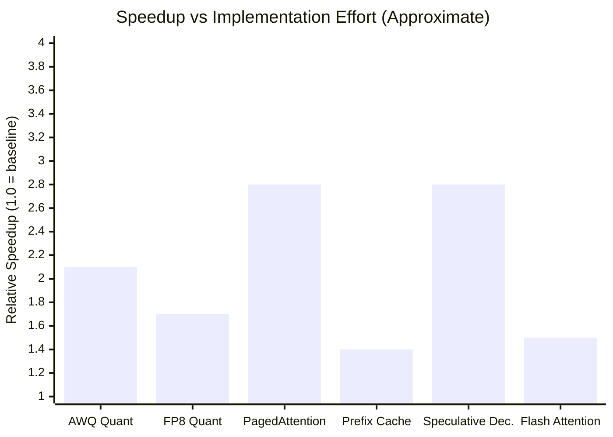
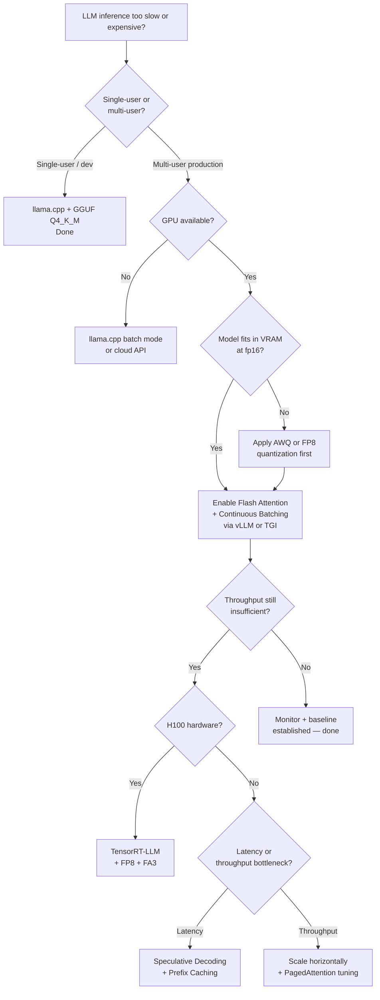

I deployed my first production LLM endpoint in early 2024 and watched it melt under a 50-request burst at 14 seconds per response. The model was accurate. The users were gone before the first token arrived. That gap between a model that works in a notebook and a model that works in production is almost always an inference problem — and fixing it is the most high-leverage engineering work you can do once a model is chosen.

This guide covers the full LLM inference optimization stack: where latency actually comes from, which techniques move the needle the most, which frameworks operationalize those techniques at scale, and how to decide what to reach for first. Numbers are cited from public benchmarks (vLLM, NVIDIA, Hugging Face TGI) as of early 2026 — confirm details against the current documentation before committing to a stack.

## Why Inference Speed Matters More Than You Think

The obvious reason is user experience. Interactive applications feel broken above 500ms first-token latency; above 2 seconds they feel unusable. But the less-obvious reason is cost. Inference compute bills scale directly with time — a 3× throughput improvement is roughly a 3× cost reduction for the same request volume.

There is also a competitive moat argument. A team that can serve a 70B model at the same latency and cost as a competitor serving a 7B model has won the quality-vs-cost trade without compromising either. That gap is not closed by picking better hardware — it is closed by better inference engineering.

Three numbers define inference quality:

- **Time to First Token (TTFT)**: How long until the user sees anything. Dominated by the prefill phase.
- **Tokens Per Second (TPS)**: Streaming speed after the first token. Dominated by the decode phase.
- **Throughput**: Total tokens served per second across all concurrent requests. Determined by batching and hardware utilization.

Optimizing without distinguishing these three is how teams end up with impressive throughput numbers and miserable interactive latency, or vice versa.

## The Inference Pipeline

Before optimizing anything, it helps to know exactly what runs when a user sends a prompt.

**Tokenize**: The prompt string is split into token IDs using a vocabulary-specific tokenizer (BPE, SentencePiece, etc.). Fast — typically under 1ms for prompts under 4K tokens.

**Prefill**: All prompt tokens are processed in a single forward pass through the model. This is embarrassingly parallel and GPU-efficient, but it scales with prompt length. A 32K-token context with a 70B model can take 2–4 seconds of prefill.

**Decode**: Output tokens are generated one at a time, each requiring a full forward pass. This is where most wall-clock time goes for typical responses. Each step attends to all previously generated tokens via the KV cache.

**Detokenize**: Token IDs are converted back to text and streamed to the client. Negligible cost.

The key insight: **prefill is compute-bound, decode is memory-bandwidth-bound**. That single fact explains why almost every optimization in this space targets either prefill parallelism or decode memory efficiency.

## Key Bottlenecks

### Memory Bandwidth in Decode

A 70B parameter model in fp16 occupies roughly 140 GB of weights. Reading those weights once per decode step, even at 3 TB/s (H100 SXM peak), takes ~47ms. That caps you at roughly 21 decode steps per second — about 21 tokens/s — even with zero other overhead. This is the memory wall.

KV cache compounds the problem. Each generated token adds key and value tensors for every layer to GPU memory. A 40-layer model with 128-head attention at 2K sequence length can accumulate several GB of KV cache per sequence.

### Compute Utilization in Prefill

Prefill is fast but inefficient for short prompts because the GPU is underutilized. Batching multiple prefill requests together raises utilization, but it requires knowing which requests arrived close enough in time to batch. This is why request scheduling is a real optimization lever.

### Memory Capacity

The hard limit: you can only run a model if it fits in VRAM, along with its KV cache. Quantization and memory-efficient attention exist partly to make larger models fit on available hardware.

## Quantization: The Highest-Leverage Starting Point

Quantization reduces weight precision from 32-bit or 16-bit floats to lower bit-width representations. The result: smaller memory footprint, faster memory reads, and often faster compute.

**GPTQ (Post-Training Quantization)**: Quantizes weights to INT4 or INT8 offline using calibration data. A 70B model in fp16 (~140 GB) drops to ~35 GB in INT4 — fitting on 2× A100 80GB instead of 4×. Quality loss at INT4 is typically 1–3 MMLU points, acceptable for most production use cases. GPTQ models load faster and decode faster (1.5–2.5× speedup on decode TPS).

**AWQ (Activation-Aware Weight Quantization)**: Selectively protects the small fraction of weights with high activation magnitude. At INT4, AWQ typically beats GPTQ by 1–2 points on benchmarks and loses less quality on coding tasks. It has become the de facto standard for INT4 serving in 2025–2026.

**FP8 (Hardware-Accelerated)**: NVIDIA H100 and H200 GPUs support native FP8 compute. FP8 quantization with dynamic scaling loses nearly nothing in quality while providing 1.5–1.8× speedup over fp16 compute. For teams with H100+ hardware, FP8 is often the right answer — no calibration required, no meaningful accuracy drop.

**GGUF (CPU/Consumer GPU)**: Used by llama.cpp, Ollama, and LM Studio. Q4_K_M is the standard quality-size sweet spot for local inference on consumer hardware. Not relevant for high-throughput serving.

Real benchmark: On an NVIDIA A10G (24 GB VRAM), a Llama-3 8B model in fp16 decodes at approximately 32 tokens/s. The same model in AWQ INT4 decodes at approximately 68 tokens/s — a **2.1× speedup** — while fitting comfortably alongside a moderate KV cache.

## KV Cache Optimization

Every decode step reads the cached key and value tensors for every previous token. As sequences grow longer, KV cache memory becomes the binding constraint on batch size. The smaller the KV cache, the more concurrent sequences fit in VRAM, the higher the throughput.

**PagedAttention** (used by vLLM): Inspired by OS virtual memory, PagedAttention stores KV cache in non-contiguous pages rather than one contiguous buffer per sequence. This eliminates fragmentation, allowing the GPU to serve more sequences simultaneously. vLLM reports 2–4× throughput improvements over naive implementations on long-sequence workloads.

**Grouped Query Attention (GQA)**: An architectural change in modern models (Llama 3, Mistral, Gemma) where multiple query heads share a single key-value head. GQA reduces KV cache memory by 4–8× at the cost of a modest quality trade-off — one that model designers have largely solved in training. If you're choosing a base model for high-throughput serving, prefer architectures with GQA.

**Prefix Caching**: When many requests share a common prefix (a system prompt, a few-shot template, a document), the KV cache for that prefix can be computed once and reused. vLLM and TGI both support prefix caching. For chatbot applications with a fixed system prompt, this cuts TTFT for subsequent turns by 20–60% depending on system prompt length.

**Sliding Window Attention (SWA)**: Used by Mistral and similar architectures. Instead of attending to all previous tokens, each layer attends to only a fixed window. This caps KV cache growth, enabling arbitrarily long generation at constant memory cost. The trade-off is reduced long-range context quality.

## Speculative Decoding

Speculative decoding is the most interesting technique in current inference research. The core idea: use a small "draft" model to generate several candidate tokens in a single step, then verify all of them in parallel with the large "target" model. Accepted tokens are kept; the first rejected token triggers a correction.

The math works because verification is embarrassingly parallel (like prefill), while naive autoregressive decoding is serial. If the draft model has a high acceptance rate (tokens it guesses that the target model would have generated), you effectively get 2–4 tokens per large-model forward pass instead of 1.

**Real numbers**: Google's SpecBench evaluation shows speculative decoding with a 7B draft and 70B target achieving **2.5–3.1× speedup** on code generation tasks (where the draft model is confident and acceptance rates are high) and 1.5–1.8× on open-ended chat (where diversity reduces acceptance rates).

**Self-speculative / Medusa**: Instead of a separate draft model, Medusa adds parallel output heads to the target model itself. Each head predicts tokens 2, 3, 4 steps ahead. Verified in a tree structure. Medusa achieves 2–2.5× speedup with no separate draft model to maintain — at the cost of fine-tuning and slightly more complex serving infrastructure.

The practical barrier is operational complexity: you need to co-locate draft and target models, manage draft model versioning, and handle edge cases where acceptance rates drop (which collapses performance back toward baseline). For high-traffic, latency-sensitive applications this complexity is often worth it. For general-purpose serving, KV cache optimization and quantization usually offer better ROI with less operational overhead.

## Technique Comparison

*Speedups are approximate and workload-dependent. PagedAttention and speculative decoding numbers reflect throughput on concurrent-request workloads, not single-stream latency.*

## Continuous Batching

Traditional static batching groups requests before processing: wait for N requests, process them as a batch, return results, repeat. This wastes GPU cycles whenever batch members finish at different times — the GPU idles while waiting for the slowest sequence.

**Continuous batching** (also called dynamic batching or iteration-level scheduling) interleaves new requests into the batch as slots free up, at each decode step. A request that completes a 50-token response doesn't leave a GPU slot empty for the remaining steps of a 500-token request beside it — a new request slots in immediately.

The throughput gains are substantial: vLLM's 2023 paper demonstrated 23× higher throughput than Hugging Face's naive batching for mixed-length workloads. In practice, with real traffic distributions, continuous batching delivers 4–8× throughput improvement over static batching on concurrent-request workloads.

Every production-grade serving framework — vLLM, TGI, TensorRT-LLM — implements continuous batching by default. If you're building a serving layer from scratch without it, you're starting 4–8× behind on throughput before writing a single line of optimization code.

## Flash Attention

The attention mechanism's memory and compute complexity is O(n²) in sequence length — which becomes a serious problem at 32K, 128K, or 200K token contexts. Standard attention materializes the full n×n attention matrix in GPU HBM, causing memory traffic that dominates compute time.

**Flash Attention** (v2 and v3) fuses the attention computation into a single kernel, computing the output in tiled blocks that fit in SRAM without ever writing the full attention matrix to HBM. The result: the same numerical output, but 2–4× faster attention computation and dramatically lower memory usage for long contexts.

For a model serving 32K-context requests, Flash Attention typically provides a **1.5–2.5× speedup** on the prefill phase and reduces peak VRAM usage by 5–10 GB per batch. Llama, Mistral, and most modern architectures use Flash Attention by default during training; the serving-side implementations in vLLM and TGI include Flash Attention kernels for all supported architectures.

Flash Attention v3 (released mid-2024) adds H100-specific optimizations using the new FP8 tensor cores and asynchronous memory pipelines. On H100 hardware, FA3 runs at approximately 75% of peak theoretical FLOPS — a significant jump from FA2's ~35% on the same hardware.

## Inference Frameworks

Choosing the right serving framework is as important as choosing the right optimization technique. The framework determines which optimizations you can apply, how they interact, and how much operational work you carry.

### vLLM

The community standard for open-source LLM serving. vLLM pioneered PagedAttention and continuous batching in a single deployable package. As of early 2026, it supports AWQ, GPTQ, FP8, speculative decoding, prefix caching, and Flash Attention for all major model families (Llama, Mistral, Qwen, Gemma, Phi, etc.).

**Best for**: Teams deploying open-weight models who want the widest optimization support and the most active community. Deployment is straightforward (one Python package, compatible with OpenAI API schema), horizontal scaling is well-documented, and production postmortems from organizations running vLLM at scale are widely available.

**Throughput benchmark**: On an 8× A100 80GB node, vLLM serving Llama-3 70B in FP8 achieves approximately 8,500 output tokens/s at batch size 32, compared to ~2,100 tokens/s for vanilla Hugging Face transformers.

### Hugging Face Text Generation Inference (TGI)

TGI is Hugging Face's production serving stack, tightly integrated with the Hub. It implements continuous batching, tensor parallelism, Flash Attention, and a subset of quantization options (AWQ, GPTQ, EETQ). The API is well-documented and Docker-native.

**Best for**: Teams already in the Hugging Face ecosystem who want tight model Hub integration, straightforward Docker deployment, and good observability out of the box. TGI trades some peak throughput for ease of deployment and operational stability.

### NVIDIA TensorRT-LLM

NVIDIA's proprietary stack, optimized for their own hardware. TensorRT-LLM compiles model graphs into optimized CUDA kernels with hardware-specific fusion, quantization (INT4, INT8, FP8), and in-flight batching. It regularly tops throughput benchmarks on NVIDIA hardware by meaningful margins over vLLM for the same models.

**Best for**: Teams with an all-NVIDIA fleet, a dedicated MLOps function, and throughput requirements that justify the operational overhead. TensorRT-LLM requires compiling model engines before serving (takes minutes to hours depending on model size), is NVIDIA-only, and has a steeper learning curve than vLLM or TGI.

**Throughput benchmark**: NVIDIA reports TensorRT-LLM achieving approximately 12,000 output tokens/s for Llama-3 70B on 8× H100 in FP8 — roughly 1.3–1.5× above vLLM on the same hardware.

## Hardware Considerations

Software optimizations interact with hardware in non-obvious ways. The right optimization depends on what hardware you're running.

| Hardware | Recommended Approach |
|---|---|
| A100 80GB | FP8 or AWQ INT4, Flash Attention v2, vLLM or TGI |
| H100 SXM | FP8 with Flash Attention v3, TensorRT-LLM or vLLM, speculative decoding if latency-critical |
| A10G 24GB | AWQ INT4 mandatory for 13B+ models, vLLM or TGI |
| Consumer GPU (RTX 4090) | GGUF Q4_K_M via llama.cpp or Ollama, single-user serving only |
| CPU (no GPU) | GGUF INT4 via llama.cpp, 1–4 tokens/s typical, acceptable for batch workloads |
| Multi-node | Tensor parallelism (automatic in vLLM, TGI, TensorRT-LLM), pipeline parallelism for very large models |

The biggest hardware mistake I've seen is over-specifying the GPU and under-specifying memory bandwidth. An H100 NVL (with its 2× HBM capacity vs SXM) often outperforms SXM in decode-heavy workloads because the binding constraint is memory bandwidth and capacity, not compute FLOPS.

## Decision Flowchart: Where to Start

## Cost vs Speed Tradeoffs

Not every optimization is free. Here is an honest accounting of what you give up.

**Quantization to INT4** costs 1–4 MMLU points and measurable quality degradation on tasks requiring precise arithmetic or very long-range coherence. For chatbots, coding assistants, and document summarization, this is almost always acceptable. For tasks where exact reproducibility matters (financial modeling, drug interaction), treat INT4 with more caution and run your own quality evaluation.

**Speculative decoding** adds a second model to maintain, version, and host. If the draft model is a different architecture than the target, hardware colocation and memory budgeting get complicated. The speedup is also workload-dependent: highly creative outputs (temperature >0.8, diverse sampling) have low acceptance rates and can collapse the speedup to 1.1–1.2×.

**Larger batches for throughput** increase TTFT. If you're optimizing for throughput at the expense of TTFT, interactive users will feel it. This is the fundamental tension in LLM serving: batch-oriented efficiency and interactive latency pull in opposite directions. Schedule requests by latency tolerance where possible.

**Tensor parallelism across multiple GPUs** adds inter-GPU communication overhead. For models that fit on a single GPU, tensor parallelism often hurts rather than helps. The rule of thumb: use tensor parallelism only when the model doesn't fit on a single device, or when you have dedicated high-bandwidth interconnect (NVLink).

## My Recommended Starting Stack

If I were building a production inference stack today for a team that wants good performance without excessive complexity, here is what I'd use:

1. **Model**: Choose a GQA-based architecture (Llama 3, Mistral, Qwen 2.5, Gemma 2). Avoid architectures without GQA for anything serving more than a few users.
2. **Quantization**: AWQ INT4 if memory-constrained, FP8 if on H100+ and fitting in VRAM.
3. **Framework**: vLLM with default settings. It gives you continuous batching, PagedAttention, prefix caching, and Flash Attention in a single `pip install`.
4. **Scaling**: Start on a single GPU node. Add tensor parallelism only when a single GPU is insufficient. Add nodes when a single node is insufficient.
5. **Monitoring**: Track TTFT p50/p95, TPS p50/p95, KV cache utilization, and request queue depth. KV cache pressure is the earliest signal that your serving setup is underpowered for the load.

From this baseline, add speculative decoding if interactive latency is critical and your acceptance rates are high. Add TensorRT-LLM if you're on H100 hardware and throughput is the primary objective.

## Verdict

LLM inference optimization is not a single technique — it is a stack of decisions, each of which compounds with the others. The highest-leverage starting points in 2026 are: use a modern model architecture with GQA, quantize to AWQ or FP8, serve with vLLM or TGI, and let continuous batching do its job.

Beyond that, the right next step depends on whether your bottleneck is memory capacity (quantize more aggressively, add a node), TTFT (prefix caching, speculative decoding), or throughput (tune batch sizes, add replicas). Measure first, then optimize. The teams that win on inference cost and latency are the ones that know which number is actually binding on their specific workload.

The gap between a naive Hugging Face `pipeline()` call and a well-tuned vLLM deployment serving the same model can be 10–20× in throughput and 3–5× in cost at scale. That gap is almost entirely captured by the techniques in this guide, with no hardware upgrades required.

---

## FAQ

### What is the single biggest win for most teams starting from a naive serving setup?

Switching to continuous batching via vLLM or TGI. If you are currently processing requests one at a time or with static batching, continuous batching alone can deliver 4–8× throughput improvements with no model changes, no quantization, and no additional hardware. It is the fastest path from "notebook works" to "production serves real load."

### Does quantization hurt model quality enough to matter?

For most production use cases — chat, code completion, summarization, classification — AWQ INT4 quality loss is not detectable in user-facing metrics. The delta is 1–4 MMLU points, which matters on benchmarks and rarely matters in production. The exception is tasks requiring precise numerical reasoning or extreme long-range coherence. For those, test FP8 first (near-zero quality loss) before dropping to INT4.

### How do I know if my bottleneck is TTFT or throughput?

Measure both under realistic load. If individual requests feel slow even when the server is lightly loaded, your TTFT is the problem — look at prefill time, prompt length, and prefix caching opportunities. If individual requests feel fine but the server can't keep up with concurrent users, throughput is the problem — look at batch size, KV cache utilization, and whether you need additional replicas or quantization to increase effective batch size.

### Is speculative decoding production-ready in 2026?

Yes, but with caveats. vLLM has native speculative decoding support as of v0.4+. The operational overhead is real: you need a draft model co-located with the target model, and the speedup is highly dependent on workload. For code generation and structured output tasks, speculative decoding consistently delivers 2–3× TTFT improvements. For open-ended chat at high temperature, the gains may not justify the complexity. Benchmark on your specific workload before committing.

### Can I run a 70B model on a single A100 80GB?

Yes, with AWQ INT4 quantization. A 70B model in INT4 takes roughly 35–40 GB, leaving 40+ GB for KV cache. This supports meaningful concurrent load. In fp16 (140 GB), a single A100 80GB cannot fit a 70B model — you'd need at least 2× A100 80GB with tensor parallelism. This is one of the most practical arguments for quantization: it changes the hardware footprint from "2 GPUs required" to "1 GPU sufficient."
