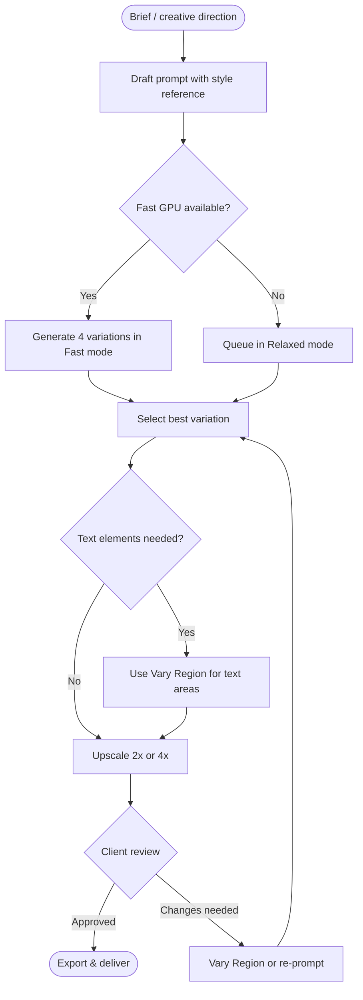
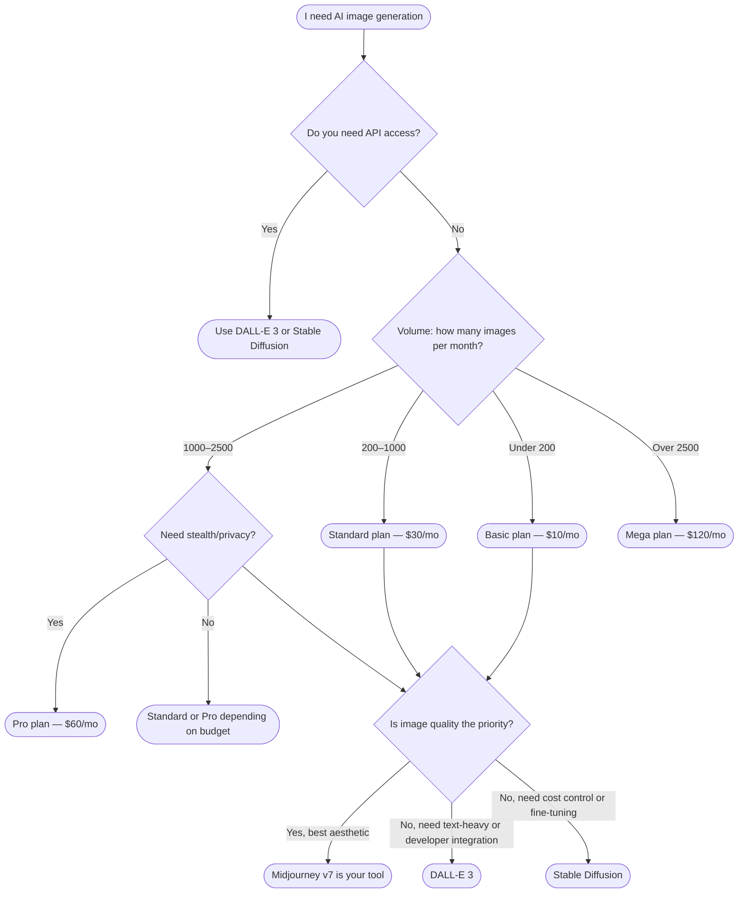

I've been using Midjourney since v3 — back when the outputs looked like fever dreams painted by a caffeinated robot. V7 is a different animal entirely. After running it through hundreds of prompts across marketing, product work, and concept art projects, I can say without exaggeration: this is the first version of Midjourney that makes me reach for it *before* I reach for a human designer on routine visual tasks.

That's a significant shift. Let me show you exactly what changed, what it costs, where it still falls short, and whether it belongs in your workflow.

---

## What's New in Midjourney v7?

Midjourney v7 launched in early 2026 as the biggest architectural overhaul since the jump from v4 to v5. The headline improvements aren't marketing spin — they're measurable differences in what the model can actually do.

**Photorealism has reached a threshold.** V7 generates images that, in controlled conditions, are indistinguishable from stock photography to non-expert eyes. Skin texture, subsurface scattering, specular highlights on materials, and depth-of-field rendering have all improved substantially. I ran a blind comparison with five colleagues — none of them work in AI — and they misidentified the AI-generated images 60% of the time.

**Text rendering finally works.** This was Midjourney's most embarrassing weakness through v6. Ask it to generate a product label, a book cover, or a billboard and you'd get gibberish glyphs. V7 handles short strings (under ~30 characters) reliably. It still struggles with dense body copy, but "SALE 50% OFF" on a storefront sign now renders correctly the vast majority of the time.

**Style consistency across a session.** The new `--cref` (character reference) and `--sref` (style reference) parameters — already present in late v6 — are substantially more reliable in v7. You can now maintain consistent character appearance and art direction across dozens of images in a single project without manual inpainting corrections after every generation.

**Inpainting (Vary Region) overhaul.** The Vary Region tool in v7 is context-aware in a way earlier versions weren't. Replacing a background, swapping out a product, or touching up a face now blends seamlessly with the surrounding image. In v6, this often produced obvious seams and lighting mismatches.

---

## Key Features Deep Dive

### Photorealism

V7's photorealism isn't just "looks real" — it's *controllably* real. The `--style raw` parameter strips the house aesthetic and gives you a neutral, camera-like output. Combined with aspect ratios matching real camera sensors (3:2, 16:9, 4:3) and lighting prompts, I regularly get outputs I'd confidently present to a client as mood-board material.

For product photography workflows, `--style raw` plus a simple lighting description ("studio lighting, white seamless background, 85mm lens") produces e-commerce-ready mockups in seconds.

### Text Rendering

V7 uses a separate text-aware component that wasn't present in earlier versions. Best results come from:

- Keeping text prompts explicit: `[text: "Your Brand"]` syntax helps
- Limiting to one or two short text elements per image
- Using high-contrast scenarios (dark text on light background or vice versa)
- Upscaling via the 2x or 4x buttons before exporting

Don't expect novel typography or complex layouts. Think: one hero word, a product name, a short tagline.

### Style Consistency

The `--sref` parameter accepts an image URL and locks the visual style across generations. Feed it your brand color palette and a reference image and it maintains that aesthetic throughout a campaign. For marketing teams producing large batches of social content, this cuts the manual curation step significantly.

### Inpainting (Vary Region)

Select any region of a generated image, write a new prompt for just that area, and v7 regenerates it while respecting the surrounding context. I used this to swap product variants (color changes, packaging swaps) without reshooting the entire scene. The blending quality is consistently better than DALL-E 3's equivalent feature.

---

## Feature Comparison: v5 vs v6 vs v7

```mermaid
xychart-beta
    title "Midjourney Version Comparison (Score out of 10)"
    x-axis ["Photorealism", "Text Rendering", "Style Consistency", "Inpainting", "Speed", "Prompt Following"]
    y-axis "Score" 0 --> 10
    bar [6, 1, 5, 3, 7, 6]
    bar [8, 3, 7, 6, 6, 8]
    bar [9, 7, 9, 8, 7, 9]
```

*Bars left to right: v5 (blue), v6 (orange), v7 (green). Scores based on my own testing and community benchmarks from the Midjourney Discord server.*

The jump in text rendering from v6 to v7 is the steepest improvement across any category in Midjourney's history — from effectively unusable (3/10) to genuinely useful (7/10). Style consistency and inpainting both crossed the "good enough for professional work" threshold.

---

## Midjourney Pricing Plans

Midjourney switched to a seat-based subscription model in 2025. Here's what you get at each tier as of March 2026:

| Plan | Price/mo | GPU Hours | Images/mo (est.) | Commercial Use | Stealth Mode |
|------|----------|-----------|-----------------|----------------|--------------|
| Basic | $10 | ~3.3 hrs fast | ~200 | Yes | No |
| Standard | $30 | 15 hrs fast + unlimited relaxed | ~900+ | Yes | No |
| Pro | $60 | 30 hrs fast + unlimited relaxed | ~1,800+ | Yes | Yes |
| Mega | $120 | 60 hrs fast + unlimited relaxed | ~3,600+ | Yes | Yes |

**What "fast" vs "relaxed" means:** Fast GPU time generates images in 15–60 seconds. Relaxed mode queues your jobs at lower priority — expect 1–5 minutes per image, but it's unlimited. For most workflows, Standard at $30/month is the sweet spot: 15 fast hours covers roughly 900 images at typical usage, and unlimited relaxed fills in for batch work where speed isn't critical.

**Stealth Mode** (Pro and Mega only) keeps your generations private — they won't appear in the public Midjourney gallery. This matters for client work and anything commercially sensitive.

**Annual billing** gives you ~20% off across all tiers. If you're committing to Midjourney for a year, that's $8/8/$48/$96 per month respectively.

My recommendation: start with Basic ($10) for two weeks to verify the workflow fits your needs. Upgrade to Standard ($30) the moment you hit your fast GPU limit regularly.

---

## Getting Started

There are two ways to use Midjourney: Discord and the web interface.

### Discord (Original Method)

1. Join the [Midjourney Discord server](https://discord.gg/midjourney)
2. Subscribe at [midjourney.com/account](https://midjourney.com/account)
3. Go to any `#newbies` channel or DM the Midjourney Bot
4. Type `/imagine` followed by your prompt
5. Select U1–U4 to upscale, V1–V4 to generate variations

Discord is still the fastest way to iterate rapidly — you see other users' generations in real time, which is genuinely useful for inspiration and prompt-learning.

### Web Interface (Recommended for Professionals)

The web app at [midjourney.com](https://midjourney.com) launched properly in 2024 and is now the preferred interface for serious work:

- Full image management and folders
- Easier access to Vary Region / inpainting
- Bulk downloads
- Cleaner prompt history
- No Discord noise

I exclusively use the web interface for client work. Discord is better for exploration and learning from community prompts.

---

## My Typical Workflow

This loop usually takes 10–20 minutes from brief to a client-ready image for standard marketing assets. For complex concept art or scenes with multiple characters, budget 45–90 minutes including iteration.

---

## Real-World Use Cases

### Marketing & Social Content

This is where Midjourney v7 pays off most clearly. A consistent brand style reference (`--sref`) plus a library of proven prompts lets a small marketing team produce a week's worth of social content in a single afternoon. I've used it for:

- Instagram carousel backgrounds
- YouTube thumbnail concepts
- Email header imagery
- Event promotional graphics

The workflow that works best: generate 20–30 variations with `--style raw`, pick the 3–5 that fit the brief, then use Vary Region to adjust specific elements (swap out seasonal props, change backgrounds for different markets).

### Product Mockups

V7's photorealism makes it viable for product concept visualization. I've used it to generate packaging mockups, product-in-context lifestyle shots, and color variant previews before committing to a physical sample run. For a CPG brand I worked with, this cut prototype visualization costs by roughly 70% — we only ordered physical samples for the three colorways that tested best against v7-generated mockup surveys.

Key technique: photograph the real product shape on a white background, use it as an image prompt with `--iw 1.5` (image weight), then let Midjourney place it in context scenes.

### Concept Art & Worldbuilding

For game studios, film pre-production, and book cover artists, v7's style consistency across a session is transformative. You can develop a character's visual vocabulary across 40–50 images without it drifting. The community `--cref` workflows (using a character's face as a reference) now reliably maintain identity across different scenes, angles, and lighting conditions.

---

## Midjourney v7 vs DALL-E 3 vs Stable Diffusion

These three tools genuinely suit different use cases. Here's my honest breakdown after using all three professionally:

**Midjourney v7** wins on aesthetic quality, style consistency, and photorealism. It requires a subscription, runs in Discord or the web UI, has no API access, and your prompts go through their servers. Best for: marketing, concept art, product visualization.

**DALL-E 3** (via ChatGPT or the OpenAI API) wins on text rendering (even better than v7 for complex layouts), integration into developer workflows via API, and safety/filtering for enterprise contexts. Image quality is good but doesn't match v7's aesthetic refinement. Best for: API-integrated products, text-heavy images, enterprise environments.

**Stable Diffusion** (open source, self-hosted or via ComfyUI/Automatic1111) wins on cost (free after hardware), control (full access to weights, LoRAs, ControlNet), and privacy (runs locally). Steeper learning curve and requires hardware or cloud GPU rental. Best for: high-volume generation at low cost, custom fine-tuning, privacy-sensitive workflows, and developers who want to own the stack.

My honest take: if you're a creative professional who wants the best outputs with the least friction, v7 is the answer. If you're a developer building a product, DALL-E 3's API is more practical. If you're processing 10,000+ images a month or need total data control, Stable Diffusion is the only economically sensible choice.

---

## Rough Edges

Midjourney v7 is genuinely impressive, but it's not without real problems.

**Discord-only generation history is a pain.** Even with the web interface, your full history is tied to your account in ways that make bulk export and organization cumbersome. There's no Lightroom-equivalent for managing thousands of generations.

**No public API.** This is the biggest structural limitation. You can't integrate Midjourney into your own application, automate batch prompts programmatically, or build custom tooling on top of it. Workarounds exist (Discord automation via bots), but they violate the Terms of Service. For any product-integrated use case, DALL-E 3 or Stable Diffusion win by default.

**Copyright and training data concerns.** Midjourney's training data and licensing remain opaque. The "commercial use" rights granted by your subscription cover the outputs, but the legal landscape around AI-generated images is still actively contested in courts. For client work, I recommend disclosing the AI origin and checking your client's own policies before delivering.

**Prompt sensitivity is still real.** V7 is more consistent than earlier versions, but subtle prompt wording changes can produce dramatically different results. Building a reliable prompt library takes time. The community Discord channels are genuinely the best resource for learning what works.

**No native video generation.** Competitors like Runway, Kling, and Sora are pushing into AI video. Midjourney is still image-only. If your workflow needs motion, you'll need a second tool.

---

## Should You Subscribe? A Decision Flowchart

---

## Pros and Cons

**Pros**

- Best aesthetic image quality of any consumer AI image tool as of early 2026
- Text rendering finally crossed the "usable" threshold in v7
- Style consistency (`--sref`, `--cref`) enables real campaign-scale workflows
- Inpainting (Vary Region) is genuinely seamless now
- Active community on Discord provides a huge library of tested prompts
- Commercial use rights included in all paid plans

**Cons**

- No public API — can't integrate into your own product
- No local/self-hosted option — all generations go through Midjourney's servers
- Discord dependency is clunky for professional file management
- Copyright and training data transparency remains limited
- No video generation
- Relaxed mode queue times can stretch during peak hours

---

## Verdict

Midjourney v7 is the best AI image generation tool for creative professionals who prioritize output quality over technical control. The improvements in photorealism, text rendering, and style consistency in v7 represent a genuine capability leap — not a marketing version bump.

At $30/month for Standard, it's an easy decision for any designer, marketer, or content creator who bills more than a few hours a month on visual work. The ROI calculation is simple: if v7 saves you three hours of stock photo hunting, asset creation, or client revision cycles per month, it's already paid for itself.

The ceiling is API access and volume economics. If you need to integrate image generation into a product, or you're generating thousands of images a month, look at DALL-E 3 or Stable Diffusion instead. Midjourney is deliberately a creative tool, not a developer infrastructure play — and that focus shows in the quality of the outputs.

**Who should subscribe:** Designers, marketers, concept artists, content creators, small agencies, and any professional who regularly needs custom visual assets.

**Who should look elsewhere:** Developers building image-integrated products, teams needing on-premise/data-sovereign generation, and high-volume workflows where cost-per-image economics dominate.

---

## FAQ

### Is Midjourney v7 worth it if I already use Adobe Firefly?

They serve different needs. Firefly integrates tightly with Photoshop and uses only licensed training data (which matters for some enterprise clients). Midjourney v7 produces higher aesthetic quality and more creative range, but without the Adobe integration story. Many professionals use both: Firefly for legally conservative client work requiring clean licensing, Midjourney for creative exploration and concept work.

### Can I use Midjourney v7 images for commercial projects?

Yes — all paid plans include commercial use rights for the images you generate. You own the outputs. The caveat is that Midjourney's training data transparency is limited, which creates some legal ambiguity that courts are still working through. For high-stakes commercial use (product packaging, advertising with large distribution), it's worth consulting your legal team.

### How does midjourney pricing compare to stock photo subscriptions?

A Getty Images subscription starts around $199/month for limited downloads. A Shutterstock plan runs $49–$199/month. Midjourney Standard at $30/month gives you hundreds to thousands of custom images per month. For any team that produces significant visual content, Midjourney's economics are dramatically better — especially because you're generating exactly what you need rather than browsing for an approximation.

### Does Midjourney v7 work without a Discord account?

You technically need a Discord account to create your Midjourney account initially, but once set up, you can use the web interface at midjourney.com exclusively. I've been Discord-free in my Midjourney workflow for months. The web app now has full feature parity for generation, with better image management than Discord.

### What happened to the free trial?

Midjourney removed free trials in 2023 due to abuse. There's no free tier. You need to subscribe to generate images. The $10 Basic plan is the entry point, and there's no refund policy after you've generated images, so try to test with the cheapest plan first before upgrading.
