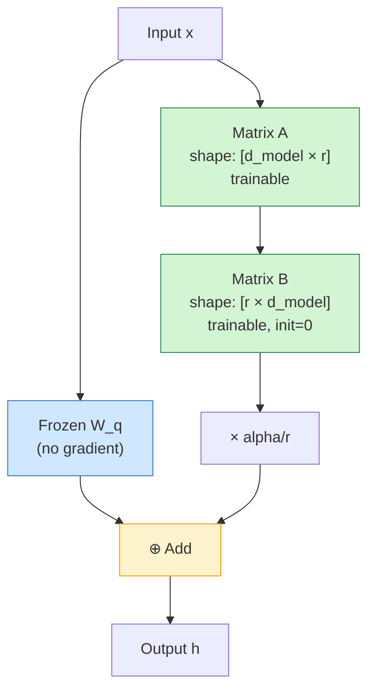
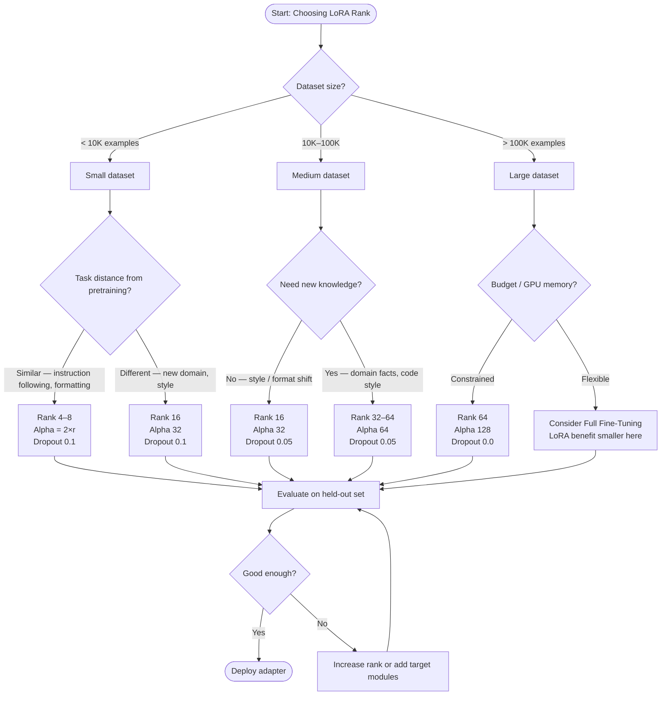

I first tried to fine-tune a 7B model on a single A100 in early 2023. The job OOM-killed itself in under four minutes. Then I discovered LoRA, re-ran the exact same experiment in an afternoon, and shipped a domain-specific model that outperformed the base on my eval set. That gap — between "can't even load the optimizer" and "trained and deployed by lunch" — is what LoRA fine-tuning is actually about.

This guide explains exactly how LoRA works, when to use it over full fine-tuning, how QLoRA pushes it even further, and how to implement everything with Hugging Face PEFT in real code you can run today.

## What Is LoRA?

LoRA stands for **Low-Rank Adaptation**. It was introduced by Hu et al. in 2021 in the paper *"LoRA: Low-Rank Adaptation of Large Language Models"* and has since become the dominant parameter-efficient fine-tuning (PEFT) method for LLMs.

The core idea is elegant: instead of updating every parameter in a pre-trained weight matrix during fine-tuning, freeze the original weights entirely and inject a pair of small trainable matrices alongside them. Those small matrices together form a low-rank approximation of the weight update you would have computed with full fine-tuning. At inference time, you either merge them back or apply them on-the-fly with negligible overhead.

Why does this work? Because the weight updates that happen during fine-tuning tend to have low *intrinsic rank*. Full fine-tuning wastes enormous compute updating billions of parameters when only a small subspace of those parameters actually encodes the task-specific knowledge you care about. LoRA exploits that redundancy directly.

The practical result: you can fine-tune a 7B model with a single 24 GB consumer GPU. You can train on a 70B model with two or four such GPUs. You can store many task-specific adapters cheaply and swap them at runtime. None of this is possible with full fine-tuning at reasonable cost.

## How LoRA Works: Low-Rank Matrices and Frozen Weights

Let me be concrete about the math, because it matters for choosing your hyperparameters.

A standard weight matrix in a transformer layer — say, the query projection `W_q` — has shape `[d_model, d_model]`. For a 7B model, `d_model` might be 4096, so `W_q` has ~16.7 million parameters. Full fine-tuning would update all of them with gradients.

LoRA instead freezes `W_q` completely. It then injects two new matrices:

- **Matrix A**: shape `[d_model, r]`, initialized with random Gaussian values
- **Matrix B**: shape `[r, d_model]`, initialized to all zeros

Here `r` is the **rank**, a small integer you choose (typically 4–64). The product `B × A` has the same shape as `W_q` but only `2 × d_model × r` parameters — for rank 16, that is 131,072 parameters instead of 16.7 million. A 127× reduction.

During the forward pass, the adapted output is computed as:

```
h = W_q x + (B × A) x × (alpha / r)
```

`alpha` is a scaling hyperparameter that controls how strongly the LoRA update is applied. In practice you set `alpha` to a fixed value and tune rank. The `alpha / r` scaling means that if you double the rank, the magnitude of the LoRA contribution stays stable unless you also change alpha.

During training, gradients only flow through `A` and `B`. The frozen `W_q` never accumulates a gradient. That means the optimizer states — the momentum and variance buffers that Adam maintains per parameter — only exist for the LoRA matrices, cutting memory use dramatically.

Matrix B initializing to zero is important: at the start of training, `B × A = 0`, so the model's initial output is identical to the base model. You start from the base model's behavior and gradually specialize. This stability makes LoRA training much easier to debug than approaches that randomly perturb the starting point.



LoRA is typically applied to the attention weight matrices (`W_q`, `W_k`, `W_v`, `W_o`) and sometimes the MLP projection matrices. You do not have to apply it to every layer — constraining it to the attention projections in every transformer block is the most common and well-validated approach.

## LoRA vs Full Fine-Tuning: Cost, Speed, and Quality

The tradeoffs here are real and worth quantifying rather than hand-waving.

**Memory.** Full fine-tuning of a 7B model in bf16 requires roughly 14 GB just for weights, plus optimizer states (Adam stores two fp32 tensors per parameter), plus activations for backprop. Total can exceed 80–100 GB. LoRA with rank 16 reduces trainable parameters to ~0.5–1% of total, cutting optimizer memory proportionally. A 7B LoRA run fits comfortably in 18–24 GB.

**Speed.** LoRA training is faster per step because fewer gradients are computed and the optimizer update touches fewer parameters. In practice, a LoRA epoch over the same dataset runs 20–40% faster than full fine-tuning on the same hardware.

**Quality.** This is where honest nuance is needed. For most domain adaptation tasks — customer support, legal text, medical records, code in a specific style — LoRA matches full fine-tuning quality when rank is chosen appropriately. For extremely large weight updates (very different task from pretraining, very large dataset), full fine-tuning can pull ahead. But in the regime most practitioners actually operate in — datasets of tens to hundreds of thousands of examples, tasks related to general language — LoRA is within a few points of full fine-tuning on standard benchmarks.

**Storage.** A full fine-tuned 7B model weights ~14 GB on disk. A LoRA adapter for the same model at rank 16 weighs 20–80 MB depending on which matrices you adapt. You can store hundreds of task-specific adapters for the same storage cost as one full fine-tuned model.

```mermaid
xychart-beta
    title "LoRA vs Full Fine-Tuning: Resource Comparison (7B model)"
    x-axis ["GPU Memory (GB)", "Disk (GB)", "Train Time (relative)", "Quality (MMLU Δ)"]
    y-axis "Score (normalized, higher = more)" 0 --> 100
    bar [18, 5, 70, 95]
    bar [95, 100, 100, 100]
```



The chart normalizes Full Fine-Tuning to 100 on each axis. LoRA wins on every resource dimension and trails only very slightly on quality — a gap that closes as you increase rank or apply LoRA to more weight matrices.

## QLoRA: 4-Bit Quantized LoRA

QLoRA (Dettmers et al., 2023) stacks quantization on top of LoRA to push memory efficiency even further. The key idea: load the frozen base model weights in 4-bit NF4 (NormalFloat 4) format instead of bf16, then train the LoRA adapters in bf16 as before.

NF4 quantization compresses each 16-bit weight to 4 bits using a data-free quantization scheme optimized for the normal distribution of neural network weights. The savings are dramatic: a 7B model that takes 14 GB in bf16 fits in ~4 GB in NF4. A 13B model fits on a 12 GB GPU. A 70B model fits in 48 GB — a pair of 3090s or a single A100.

The catch: quantization adds a small compute overhead for de-quantizing during forward passes, and the 4-bit format loses some precision. In practice, QLoRA-trained adapters score within 1–2 points of LoRA on most benchmarks while requiring dramatically less VRAM. For most practitioners using consumer GPUs, QLoRA is the right default.

QLoRA also introduced **double quantization** (quantizing the quantization constants themselves) and **paged optimizers** (offloading optimizer states to CPU RAM when GPU memory is tight). Together these make it possible to train a 65B model on a single 48 GB GPU — something that would have required a cluster a year earlier.

## Step-by-Step LoRA Fine-Tuning with PEFT

Here is a complete implementation using Hugging Face `transformers` and `peft`. This trains a LoRA adapter on a causal language model task. I have stripped boilerplate to keep it readable, but this code runs.

```python
from transformers import (
    AutoModelForCausalLM,
    AutoTokenizer,
    TrainingArguments,
    Trainer,
    DataCollatorForLanguageModeling,
    BitsAndBytesConfig,
)
from peft import LoraConfig, get_peft_model, TaskType
from datasets import load_dataset
import torch

# --- 1. Load base model (with QLoRA 4-bit quantization) ---
bnb_config = BitsAndBytesConfig(
    load_in_4bit=True,
    bnb_4bit_quant_type="nf4",
    bnb_4bit_compute_dtype=torch.bfloat16,
    bnb_4bit_use_double_quant=True,
)

model = AutoModelForCausalLM.from_pretrained(
    "meta-llama/Llama-3-8b-hf",
    quantization_config=bnb_config,
    device_map="auto",
)
tokenizer = AutoTokenizer.from_pretrained("meta-llama/Llama-3-8b-hf")
tokenizer.pad_token = tokenizer.eos_token

# --- 2. Configure LoRA ---
lora_config = LoraConfig(
    task_type=TaskType.CAUSAL_LM,
    r=16,                          # rank
    lora_alpha=32,                 # scaling factor
    lora_dropout=0.05,
    target_modules=[               # which weight matrices to adapt
        "q_proj", "k_proj",
        "v_proj", "o_proj",
        "gate_proj", "up_proj", "down_proj",  # MLP projections
    ],
    bias="none",
)

model = get_peft_model(model, lora_config)
model.print_trainable_parameters()
# trainable params: 83,886,080 || all params: 8,114,999,296 || trainable%: 1.03

# --- 3. Prepare dataset ---
dataset = load_dataset("your_dataset_here", split="train")

def tokenize(example):
    return tokenizer(
        example["text"],
        truncation=True,
        max_length=2048,
        padding="max_length",
    )

tokenized = dataset.map(tokenize, batched=True, remove_columns=dataset.column_names)

# --- 4. Training arguments ---
training_args = TrainingArguments(
    output_dir="./lora-llama3-adapter",
    num_train_epochs=3,
    per_device_train_batch_size=4,
    gradient_accumulation_steps=4,    # effective batch = 16
    warmup_ratio=0.03,
    learning_rate=2e-4,
    bf16=True,
    logging_steps=10,
    save_strategy="epoch",
    optim="paged_adamw_32bit",        # QLoRA paged optimizer
    report_to="wandb",
)

# --- 5. Train ---
trainer = Trainer(
    model=model,
    args=training_args,
    train_dataset=tokenized,
    data_collator=DataCollatorForLanguageModeling(tokenizer, mlm=False),
)
trainer.train()

# --- 6. Save adapter only (not the full model) ---
model.save_pretrained("./lora-llama3-adapter")
tokenizer.save_pretrained("./lora-llama3-adapter")
```

The `save_pretrained` call on a PEFT model saves only the adapter weights, not the base model. The adapter directory will be 20–80 MB rather than 16 GB.

## Choosing Rank and Alpha

Rank and alpha are the two LoRA hyperparameters that matter most. Here is how I think about them.

**Rank (r)** controls the expressiveness of the adapter. Low rank (4–8) is good for tasks that are close to the base model's pretraining distribution — formatting changes, mild style shifts, short instruction following. Higher rank (32–64) is better for tasks that require absorbing genuinely new knowledge or a very different output distribution, like domain-specific code in an obscure language, specialized scientific notation, or a niche task the base model has never seen.

Starting at rank 16 is a safe default for most fine-tuning tasks. Doubling rank roughly doubles trainable parameters. Beyond rank 64, you often see diminishing returns and it is worth asking whether full fine-tuning makes more sense.

**Alpha** controls the magnitude of the LoRA update relative to the base weights. The convention is to set `alpha = 2 × r` as a starting point (so rank 16 → alpha 32). You can think of alpha as a learning rate multiplier for the adapter. If your loss is dropping too slowly, try increasing alpha. If training is unstable, decrease it.

**Dropout** adds regularization inside the LoRA layers. A value of 0.05–0.1 is standard. For very small datasets (under 5,000 examples), try 0.1. For large datasets where overfitting is less of a concern, 0.0 is fine.

**Target modules** matter more than most guides acknowledge. Adapting only the attention projections (`q_proj`, `v_proj`) is the minimal approach and works well for many tasks. Adding the MLP projections (`gate_proj`, `up_proj`, `down_proj`) increases trainable parameters by roughly 3× but can significantly improve quality on knowledge-heavy tasks. If you have memory headroom, adapt all seven.



## Merging and Deployment

After training, you have two choices for deployment: **keep the adapter separate** or **merge it into the base model**.

**Separate adapter** is the right choice when you need to serve multiple adapters from the same base model, or when you are still iterating. Load the base model once and swap adapters on-the-fly. PEFT makes this trivial:

```python
from peft import PeftModel

base = AutoModelForCausalLM.from_pretrained("meta-llama/Llama-3-8b-hf")
model = PeftModel.from_pretrained(base, "./lora-llama3-adapter")
# Switch to a different adapter later:
model.load_adapter("./another-adapter", adapter_name="task2")
model.set_adapter("task2")
```

**Merged model** is better for production deployments where latency is critical and you want a single clean checkpoint for vLLM, llama.cpp, or any inference server. Merging folds the LoRA matrices back into the base weights so there is zero runtime overhead:

```python
from peft import PeftModel

base = AutoModelForCausalLM.from_pretrained(
    "meta-llama/Llama-3-8b-hf",
    torch_dtype=torch.bfloat16,
)
model = PeftModel.from_pretrained(base, "./lora-llama3-adapter")
merged = model.merge_and_unload()          # returns a standard HF model
merged.save_pretrained("./llama3-merged")  # saves full merged weights
```

One gotcha: if you trained with 4-bit quantization (QLoRA), you cannot merge directly — the base model is in int4 and cannot absorb a bf16 delta cleanly. The standard pattern is to reload the base model in bf16 or fp16, then load the adapter and merge. The adapter itself is stored in full precision, so this works correctly.

## Multiple LoRA Adapters

One of LoRA's underrated advantages is that you can serve many adapters from a single base model. This is economically attractive: instead of storing and loading ten fine-tuned 7B models (140 GB), you store the base once (14 GB) and ten adapters (< 1 GB total).

The PEFT library supports this natively via named adapters:

```python
model.load_adapter("./adapter-legal", adapter_name="legal")
model.load_adapter("./adapter-medical", adapter_name="medical")
model.load_adapter("./adapter-code", adapter_name="code")

# Route each request to the right adapter:
model.set_adapter("legal")
output = model.generate(inputs)
```

For production multi-tenant serving, tools like **LoRAX** and **S-LoRA** (open-source) handle this at scale, with adapter caching, batching across different active adapters, and efficient memory management. This architecture is now used by several LLM inference providers under the hood.

You can also **compose** adapters using techniques like LoRA merging with task arithmetic. If you have a reasoning adapter and a coding adapter, you can linearly interpolate their weights to create a blended adapter that combines both capabilities — without any additional training.

## Common Mistakes

**Using rank that is too high for a small dataset.** Rank 64 with a 1,000-example dataset will overfit badly. Start low and go up only if your eval metrics justify it.

**Forgetting to freeze the base model.** With PEFT, `get_peft_model` handles this automatically, but if you are implementing LoRA manually, every base parameter needs `requires_grad = False`. Accidentally training the base weights defeats the purpose and will OOM your GPU.

**Not applying LoRA to enough modules.** Many tutorials only add LoRA to `q_proj` and `v_proj`. That is a reasonable starting point but often leaves quality on the table. For most tasks, including the MLP projections is worth the extra parameter cost.

**Setting learning rate too low.** LoRA adapters start from zero (B initialized to zero). They need a higher learning rate than you would use for full fine-tuning. `1e-4` to `3e-4` is typical. The `1e-5` or `5e-6` learning rates common in full fine-tuning will cause LoRA to converge very slowly.

**Merging a QLoRA adapter without reloading in full precision.** If you trained with `load_in_4bit=True`, reload the base in bf16 before merging. Skipping this step produces corrupt merged weights.

**Not evaluating on a held-out set during training.** LoRA can still overfit, especially with small datasets and high rank. Log eval loss every few hundred steps and stop before it diverges.

**Expecting LoRA to recover from a poorly chosen base model.** LoRA is a specialization tool, not a correction tool. If the base model cannot perform your task at all with good prompting, LoRA will have trouble too. Start with the best base model you can afford.

## Verdict

LoRA fine-tuning is the technique that made practical LLM specialization accessible to the average ML engineer. Its math is simple, its implementation is battle-tested in PEFT, and its results are competitive with full fine-tuning in the parameter regime most teams actually work in. QLoRA extends that accessibility to anyone with a gaming GPU.

If you need to adapt an LLM to a domain, style, or task format — and you do not have 8× A100s sitting idle — LoRA is where you start. The only cases where I reach for full fine-tuning instead are very large datasets (500K+ examples), tasks dramatically different from pretraining, or scenarios where every fraction of a point of benchmark quality is worth the compute bill.

The adapter ecosystem around LoRA — LoRAX for serving, PEFT for training, merging and composition tools — has matured to the point where it is genuinely production-ready. Train your adapter this afternoon; serve it tonight.

## FAQ

### How does LoRA rank affect training time?

Rank has a roughly linear effect on both parameter count and training time per step, but the relationship is not steep. Going from rank 16 to rank 32 adds ~1% more total parameters (the LoRA matrices are still tiny relative to the frozen base) and increases step time by only 5–10%. The more significant effect of higher rank is on memory for optimizer states, which scales with trainable parameter count.

### Can I apply LoRA to encoder-only models like BERT or RoBERTa?

Yes. PEFT supports `TaskType.SEQ_CLS`, `TaskType.TOKEN_CLS`, and other encoder task types. LoRA applies identically to the self-attention weight matrices. The main difference is that you typically adapt only the attention projections for encoder models, since they lack autoregressive MLP blocks. Classification fine-tuning with LoRA on BERT-sized models is extremely fast and the quality degradation relative to full fine-tuning is minimal.

### What is the difference between LoRA and prompt tuning or prefix tuning?

All three are parameter-efficient fine-tuning methods, but they operate differently. Prompt tuning and prefix tuning prepend learnable tokens or vectors to the input sequence and train only those. LoRA instead modifies the weight matrices themselves via low-rank updates. In practice, LoRA consistently outperforms prompt and prefix tuning across benchmarks, especially for smaller base models. The gap narrows for very large models (100B+), where prompt tuning becomes more competitive.

### Does LoRA work for multimodal models?

Yes, and it is increasingly common. Vision-language models like LLaVA and Idefics apply LoRA to both the language model backbone and sometimes the vision encoder. The training setup is nearly identical — you configure which linear projections to target in each component. The main practical difference is that multimodal fine-tuning data preparation is more involved, requiring paired image-text examples.

### How do I know if my LoRA adapter is actually helping and not just memorizing?

Hold out 10–20% of your dataset before training and evaluate on it throughout. Watch for the gap between train loss and eval loss widening — that is overfitting. Also run the base model on your eval set without the adapter to establish a baseline. A good adapter should improve on that baseline by a clear margin on task-relevant metrics (ROUGE, accuracy, human preference) while not degrading general capabilities tested by a separate benchmark like MT-Bench or MMLU.
