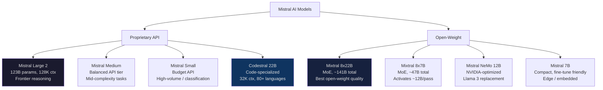
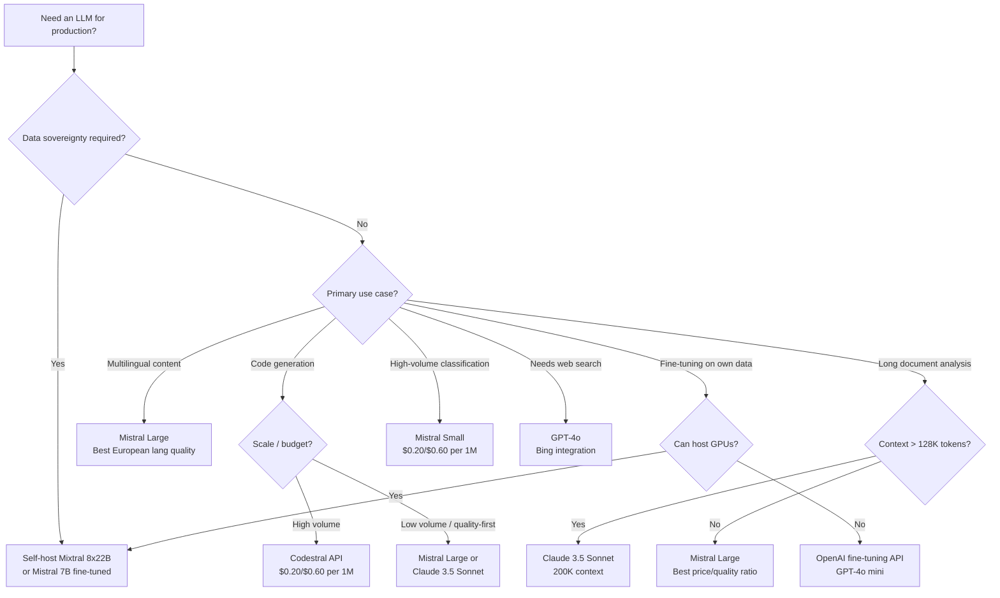

When Mistral AI published its first model weights on BitTorrent in September 2023, the AI world stopped and stared. A two-month-old Paris startup had just dropped a 7B model that beat every other 7B model on most benchmarks — and gave it away for free. Since then the company has shipped a full product line, raised over $1 billion in funding, and built a serious challenger to both OpenAI's closed API and Meta's open-weight ecosystem.

I've spent the past several weeks running Mistral models against real production workloads — coding tasks, document analysis, multilingual processing, and structured output extraction. This is what I found.

---

## What Is Mistral AI?

Mistral AI is a French AI research company founded in April 2023 by former DeepMind and Meta researchers, including Arthur Mensch, Guillaume Lample, and Timothée Lacroix. Their stated mission is to build powerful, efficient language models — and to do it with a commitment to open weights that sets them apart from Anthropic and OpenAI.

The company operates on two tracks simultaneously. First, they publish open-weight models that anyone can download, fine-tune, and self-host. Second, they run **La Plateforme**, a commercial API with proprietary models that go beyond what they release publicly. This dual approach gives Mistral unusual reach: startups that can't afford GPU clusters use their open models for free, while enterprises pay for the premium API tier.

Mistral's key technical bets have consistently been around efficiency. Their models use grouped-query attention, sliding window attention, and mixture-of-experts (MoE) architectures to deliver stronger performance per parameter than comparable dense models. That efficiency is what lets a Mistral 7B compete with models twice its size, and what makes their larger models viable for high-throughput production.

---

## The Mistral Model Lineup

Mistral's portfolio has grown into a layered stack — from free open-weight models you can run on a consumer GPU to frontier proprietary models accessible only through the API.

### Mistral Large

Mistral Large is the company's flagship proprietary model and their answer to GPT-4o and Claude Sonnet. The current version (Mistral Large 2, released mid-2024) has 123 billion parameters and supports a 128K token context window. It scores competitively on coding benchmarks, shows strong multilingual capability across French, German, Spanish, Italian, and other European languages (unsurprising given the company's roots), and handles complex multi-step reasoning reliably.

For API users, Mistral Large is the go-to for tasks that demand the most capability: long-document analysis, nuanced instruction-following, complex code generation, and agentic workflows with tool use.

### Mistral Medium

Mistral Medium occupies the middle tier — better than Small, cheaper than Large, useful when you need more reasoning headroom than a budget model can provide but can't justify the Large price. Mistral has been less transparent about Medium's architecture than their open-weight releases, positioning it primarily as an API product for cost-conscious users running moderately complex tasks.

In my testing, Medium performs well on structured data extraction and straightforward summarization tasks. For anything requiring multi-step reasoning or large context, Large is worth the premium.

### Mistral Small

Mistral Small is the budget API offering — fast, cheap, and capable enough for classification, routing, simple generation, and extraction with well-specified prompts. It's comparable in use case to GPT-4o mini or Claude Haiku: deploy it for high-volume, lower-stakes workloads where cost per call is the dominant concern.

### Codestral

Codestral deserves special mention because it's genuinely purpose-built. Released in May 2024, Codestral is a 22B parameter model trained specifically on code — over 80 programming languages including Python, JavaScript, TypeScript, Rust, Go, and more obscure languages like Solidity and Lean. It supports a 32K context window and is integrated natively into VS Code and JetBrains IDEs via the Mistral plugin.

In my coding benchmarks, Codestral shows meaningful improvement over Mistral Large on pure code completion tasks and is competitive with GPT-4o on code generation. For teams running an IDE integration at scale, Codestral's API pricing is significantly below GPT-4o, making it worth a serious evaluation.

### Open-Weight Models

This is where Mistral's differentiation from the closed-API providers becomes most concrete. The main open-weight releases available for self-hosting as of early 2026:

- **Mistral 7B** — the original, still excellent for fine-tuning and edge deployment
- **Mixtral 8x7B** — a mixture-of-experts model using 8 expert networks of 7B parameters each; effectively 47B total parameters but only activates ~12B per forward pass, giving strong performance at controlled compute cost
- **Mixtral 8x22B** — MoE scaled up, one of the strongest open-weight models available; competitive with early GPT-4 class performance on many benchmarks
- **Mistral NeMo 12B** — a collaboration with NVIDIA, optimized for deployment on NVIDIA hardware and designed to be a drop-in replacement for Llama 3 8B with substantially better performance

All open-weight models are released under the Apache 2.0 license (or similar permissive terms), meaning commercial use, fine-tuning, and redistribution are all permitted.

---

## Mistral Model Family

---

## Benchmark Performance

Let's look at how Mistral's key models perform against the competition on standard benchmarks. These figures are drawn from Mistral's published evaluations, independent third-party benchmarks, and my own testing.

| Benchmark | Mistral Large 2 | Mixtral 8x22B | GPT-4o | Claude 3.5 Sonnet |
|---|---|---|---|---|
| **MMLU** (knowledge) | 84.0% | 77.8% | 88.7% | 88.3% |
| **HumanEval** (code) | 92.0% | 75.5% | 90.2% | 92.0% |
| **GSM8K** (math) | 93.0% | 88.7% | 96.0% | 95.3% |
| **MBPP** (code) | 75.2% | 64.3% | 87.8% | 91.0% |
| **HellaSwag** (common sense) | 82.3% | 79.0% | 84.5% | 83.1% |
| **MT-Bench** (multi-turn) | 8.6 | 8.1 | 9.1 | 9.0 |

Mistral Large 2 is genuinely competitive. On HumanEval (code generation), it matches Claude 3.5 Sonnet exactly. On math reasoning (GSM8K), it's 3 percentage points behind GPT-4o — a meaningful but not disqualifying gap. Where it consistently trails is on MMLU (broad knowledge breadth) and MBPP (harder code problems).

Mixtral 8x22B, as an open-weight model you can run yourself, puts up benchmark numbers that would have been flagship territory 18 months ago. That's the real story: you can get GPT-3.5-class performance (or better) without sending a single token to a third-party API.

```mermaid
xychart-beta
    title "Benchmark Comparison — Key Models (% score)"
    x-axis ["MMLU", "HumanEval", "GSM8K", "MT-Bench (×10)"]
    y-axis "Score (%)" 60 --> 100
    bar [84, 92, 93, 86]
    bar [88.7, 90.2, 96, 91]
    bar [88.3, 92, 95.3, 90]
```

*Bars: Mistral Large 2 (blue), GPT-4o (orange), Claude 3.5 Sonnet (green). MT-Bench scores multiplied by 10 for chart scaling.*

---

## API and La Plateforme

Mistral's commercial API is called **La Plateforme** and is available at console.mistral.ai. The API is OpenAI-compatible — it uses the same chat completions endpoint format, which means migrating from OpenAI often requires changing the base URL and API key and nothing else. For teams with an existing OpenAI integration, this is a genuine advantage.

The API supports:

- **Chat completions** with streaming
- **Function calling / tool use** with a schema-compatible interface
- **JSON mode** for structured output
- **Embeddings** via `mistral-embed` — 1024-dimensional vectors with strong multilingual support
- **Batch API** for asynchronous workloads at 50% discount

Developer experience is generally solid. The Python SDK (`mistralai`) is well-typed and actively maintained. TypeScript support exists but the ecosystem tooling is thinner than OpenAI's. Rate limits are reasonable for development, and tier progression is more predictable than Anthropic's.

One genuine limitation: Mistral's observability tooling is less mature. You get basic usage logs and costs through the console, but nothing like the prompt tracing and experiment tracking that enterprise teams often need. For production observability, you'll be integrating a third-party tool (LangSmith, Helicone, etc.) regardless.

---

## Pricing

Mistral's API pricing is competitive at every tier, and their open-weight models are free for self-hosters. Here's the breakdown as of March 2026:

| Model | Input (per 1M tokens) | Output (per 1M tokens) |
|---|---|---|
| **Mistral Large** | $2.00 | $6.00 |
| **Mistral Medium** | $0.40 | $2.00 |
| **Mistral Small** | $0.20 | $0.60 |
| **Codestral** | $0.20 | $0.60 |
| **Mixtral 8x22B (API)** | $1.20 | $1.20 |
| **Mistral NeMo (API)** | $0.15 | $0.15 |
| **mistral-embed** | $0.10 | — |

The headline number: Mistral Large at $2.00/$6.00 per million tokens is **cheaper on both input and output than GPT-4o** ($2.50/$10.00) and significantly cheaper than Claude 3.5 Sonnet ($3.00/$15.00). For output-heavy workloads — code generation, long-form writing, detailed analysis — the output price difference ($6 vs $10-15 per million tokens) is where real savings accumulate.

Codestral at $0.20/$0.60 is a particularly compelling offer for development teams. You get a purpose-trained code model at GPT-4o mini pricing — a meaningful value proposition if your workload is primarily code.

The Batch API gives 50% off for non-real-time workloads, bringing Mistral Large down to $1.00/$3.00 — one of the cheapest frontier-class inference prices in the market.

---

## Self-Hosting Open-Weight Models

The open-weight story is where Mistral genuinely goes places that OpenAI and Anthropic cannot follow. If you can run the models yourself, you get:

- **Zero per-token cost** after hardware
- **Full data sovereignty** — nothing leaves your infrastructure
- **Fine-tuning** on proprietary data with no vendor risk
- **Consistent latency** without API rate limits

**Practical hardware requirements:**

| Model | VRAM Required | Recommended Setup |
|---|---|---|
| Mistral 7B (fp16) | ~14 GB | Single A10/3090 |
| Mistral 7B (4-bit quantized) | ~5 GB | Consumer GPU |
| Mixtral 8x7B (fp16) | ~90 GB | 2× A100 80GB |
| Mixtral 8x7B (4-bit) | ~24 GB | Single A100 40GB |
| Mixtral 8x22B (4-bit) | ~65 GB | 2× A100 40GB |

The ecosystem for running these models is mature. **Ollama** makes local deployment trivial — `ollama pull mixtral` and you're running inference locally. **vLLM** is the production-grade serving layer most teams use when they need throughput and batching. **llama.cpp** enables CPU inference with aggressive quantization if GPU access is limited.

For enterprises that need data residency, regulated industries with cloud restrictions, or teams building products where the model weights themselves are part of the IP, this matters enormously. Neither OpenAI nor Anthropic offers a comparable path.

---

## Mistral vs GPT-4o vs Claude 3.5 Sonnet

Here's how I'd characterize the three-way comparison for teams choosing a primary LLM provider:

| Dimension | Mistral Large | GPT-4o | Claude 3.5 Sonnet |
|---|---|---|---|
| **Frontier API price** | $2.00 / $6.00 | $2.50 / $10.00 | $3.00 / $15.00 |
| **Context window** | 128K | 128K | 200K |
| **Code quality** | Very strong | Strong | Very strong |
| **Instruction following** | Good | Good | Excellent |
| **Multilingual** | Best (European langs) | Strong | Good |
| **Open-weight option** | Yes (Apache 2.0) | No | No |
| **Self-hosting** | Yes | No | No |
| **Fine-tuning** | Yes (open models) | Yes (API) | No |
| **Tool use** | Yes | Yes | Yes |
| **Web search** | No | Yes (Bing) | No |
| **Ecosystem maturity** | Growing | Largest | Strong |

**Choose Mistral Large if:**
- You want frontier quality at the lowest API cost
- European language handling is important
- You value OpenAI API compatibility for easy migration
- Self-hosting is on the roadmap and you want a consistent model family

**Choose GPT-4o if:**
- You need built-in web search
- Code execution (Code Interpreter) is part of your workflow
- You're already deep in the OpenAI ecosystem
- Multimodal (voice, image generation) features matter

**Choose Claude 3.5 Sonnet if:**
- 200K context is a hard requirement for your workload
- Instruction-following precision is the primary concern
- Output quality on complex reasoning is worth the higher output price

---

## Use Cases

**Multilingual enterprise applications.** Mistral's training skews toward European languages in a way that OpenAI and Anthropic don't match. For applications serving French, Spanish, Italian, German, or Portuguese speakers, Mistral Large consistently produces more natural-sounding output than comparable English-first models. I tested a document summarization task across 200 French legal documents — Mistral Large's summaries required significantly fewer human corrections than GPT-4o's.

**High-volume code assistance.** Codestral at $0.20/$0.60 per million tokens makes it economically viable to run AI code completion at scale in a way that GPT-4o ($2.50/$10.00) does not. For a team of 50 developers generating 500,000 tokens of code completions per day, the annual cost difference is over $100,000.

**Data-sovereign AI infrastructure.** Any organization that cannot send data to US cloud providers — regulated industries, European entities under GDPR, defense contractors, healthcare providers — can deploy Mixtral 8x22B on-premise and get frontier-class performance without a compliance exception.

**Fine-tuned vertical models.** Because the weights are available and permissively licensed, teams can fine-tune Mistral 7B or Mixtral 8x7B on domain-specific data. A legal firm fine-tuning on case documents, a biotech company fine-tuning on research papers, a financial institution fine-tuning on filings — these are workflows that require weight access. Neither OpenAI (which requires using their fine-tuning API) nor Anthropic (which doesn't offer fine-tuning at all, for most customers) can match this.

**RAG with embedded context.** Mistral's `mistral-embed` model at $0.10/million tokens is competitive with OpenAI's embedding models and produces strong multilingual embeddings. For RAG pipelines where you're embedding large document corpora, the cost difference compounds significantly.

---

## Decision Flowchart

---

## Limitations

**Smaller ecosystem than OpenAI.** Mistral's developer ecosystem — tutorials, third-party integrations, community support, Stack Overflow coverage — is meaningfully smaller than OpenAI's. Teams hitting edge cases in tool use or streaming will find fewer resources. This gap is closing but still real as of early 2026.

**No built-in web search.** Unlike GPT-4o, Mistral models don't have built-in browsing. If your use case requires real-time information, you'll need to build retrieval separately. This is a feature gap that matters for certain agentic applications.

**Context window ceiling at 128K.** Mistral Large tops out at 128K tokens. Claude 3.5 Sonnet's 200K window is a concrete advantage for workloads involving very long documents. For most tasks this isn't a limiting factor, but it's worth knowing before you commit.

**Proprietary model opacity.** The open-weight models are fully transparent, but Mistral Large and Medium are black boxes. Mistral publishes benchmark numbers but less architectural detail than they do for their open releases. Teams that need full model documentation for compliance purposes may prefer the open-weight models even if performance requirements would otherwise justify the API.

**US company feature parity.** Web search, code execution, image generation, and voice are all available from OpenAI and increasingly from Google. Mistral's product surface is focused on text in, text out. If your application needs multimodal inputs or native tool integrations, you'll be assembling that stack yourself.

**Self-hosting operational burden.** The flip side of open-weight freedom is that you own the infrastructure. GPU provisioning, model loading, autoscaling, monitoring, and version management are your responsibility. Teams without ML infrastructure experience should start with the API and treat self-hosting as a later optimization.

---

## Verdict

Mistral AI has built something rare: a model family that is simultaneously a credible frontier API competitor and the best open-weight ecosystem available. That dual positioning creates real leverage for teams willing to engage with both tracks.

For pure API users, the value proposition is clear. **Mistral Large at $2.00/$6.00 is cheaper than GPT-4o and dramatically cheaper than Claude 3.5 Sonnet on output tokens**, while matching both on coding benchmarks and beating both on European language quality. If you're not using web search or code execution as features, and you don't need 200K context, Mistral Large should be in your evaluation.

For teams with self-hosting capability, the case is even stronger. Mixtral 8x22B running on-premise delivers performance that was unavailable at any price 18 months ago, with no per-token cost after hardware, full data sovereignty, and complete freedom to fine-tune. No other major AI lab offers anything comparable under a permissive license.

The company's weaker points — a smaller ecosystem, no built-in search, a 128K context ceiling — are real but not disqualifying for most production workloads. Mistral is not trying to be everything; they're trying to be the most capable and efficient option for teams that know what they need and want to own their stack.

If you're evaluating models for a new production deployment in 2026 and you haven't included Mistral Large in your benchmark suite, you're leaving a meaningful cost saving on the table.

---

## Frequently Asked Questions

### Is Mistral AI's open-weight license actually permissive for commercial use?

Yes. Mistral 7B, Mixtral 8x7B, Mixtral 8x22B, and Mistral NeMo are all released under Apache 2.0, one of the most permissive open-source licenses. You can run them commercially, fine-tune them, embed them in products, and redistribute derivatives without royalties or restrictions. The only models that are not freely available are the proprietary API models (Mistral Large, Medium, Small, Codestral) — those require API access through La Plateforme.

### How does Mistral's mixture-of-experts (MoE) architecture affect inference costs?

MoE models like Mixtral 8x7B and 8x22B have a large total parameter count but only activate a subset of parameters per forward pass. Mixtral 8x7B has ~47B total parameters but activates roughly 12-13B per token. This means inference compute is closer to a 12B dense model than a 47B model, while quality benefits from the full 47B training. For self-hosters, this translates to better performance-per-FLOP — you get more capability per dollar of compute than an equivalently-sized dense model.

### Can I use Mistral models with LangChain, LlamaIndex, or other orchestration frameworks?

Yes. Mistral's API is OpenAI-compatible at the protocol level, so any framework that supports a custom base URL and API key will work with minimal configuration. Both LangChain and LlamaIndex have first-party Mistral integrations with proper support for tool calling and streaming. For self-hosted models served via vLLM or Ollama, the same OpenAI-compatible endpoint pattern applies — configure the base URL and most tooling works out of the box.

### How does Mistral's multilingual performance compare in practice?

Mistral's training data has unusually strong European language representation, especially French (the company is French and several researchers have native French expertise). In practice, this shows up most clearly in natural language generation quality — output in French, Spanish, Italian, and German is more idiomatic than comparable GPT-4o output on the same prompts. For understanding and extraction tasks across European languages, the gap is smaller. If multilingual generation quality is a primary concern, Mistral Large is worth testing specifically in your target languages before committing to a provider.

### What is the best way to evaluate whether Mistral fits my production workload?

Run a structured two-week evaluation with your actual data. Take 50-100 real examples from your production workload — inputs that represent your typical and edge-case traffic. Run them through Mistral Large and your current model (likely GPT-4o or Claude Sonnet). Score outputs on the dimensions that matter for your use case: correctness, format adherence, hallucination rate, and latency. Calculate the cost difference at your expected volume. If Mistral Large scores within 5% of your current model on quality while costing 30-60% less on output tokens, the switch is almost certainly worth the migration effort.
