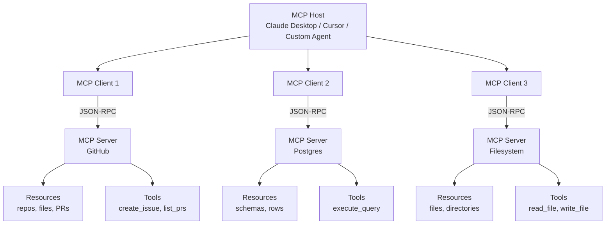
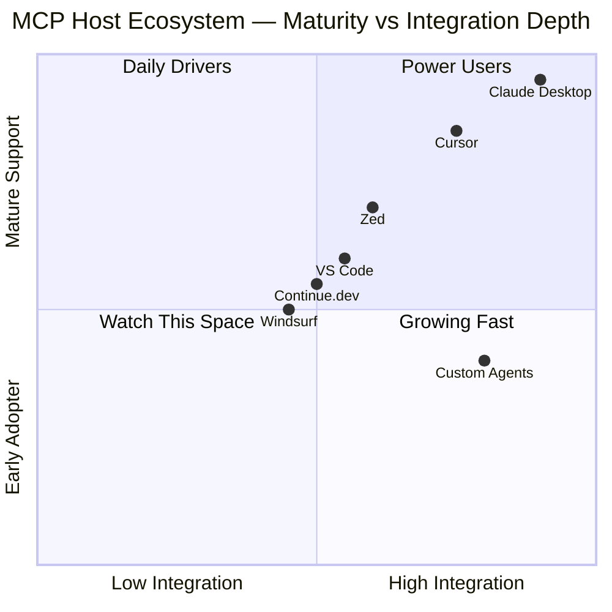
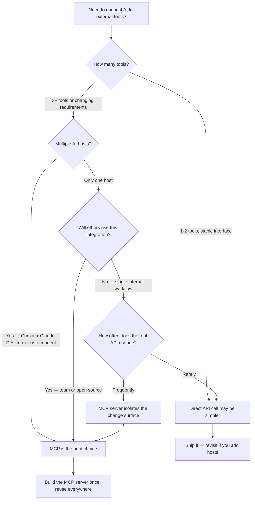

I spent an afternoon last month trying to connect Claude to a private GitHub repo, a Postgres database, and a Slack workspace at the same time. Without MCP, that meant writing three separate integrations, each with its own auth flow, context-injection logic, and error handling. With MCP, it meant running three community servers and pointing Claude Desktop at them. The contrast was stark enough that I stopped what I was doing and read the spec from start to finish.

If you have been building AI-powered tooling in 2025 or 2026, you have almost certainly heard the acronym. This article explains what the Model Context Protocol actually is, why the problem it solves is real and non-trivial, how the protocol works under the hood, and how to start building with it today.

## What Is MCP?

The Model Context Protocol (MCP) is an open standard, published by Anthropic in late 2024, that defines a common interface between AI applications and the external tools, data sources, and services those applications need to use.

In plain terms: MCP is a universal adapter for AI. Instead of every AI host (Claude Desktop, Cursor, your custom agent) needing to know exactly how to talk to every service (GitHub, Postgres, Slack, your internal APIs), MCP defines a single protocol both sides agree on. The AI host speaks MCP. The service exposes an MCP server. They can communicate without any custom glue.

The spec covers three categories of capability:

- **Resources** — data and files the server exposes that the model can read (database records, repository contents, file system entries)
- **Tools** — actions the model can invoke with arguments (run a SQL query, create a GitHub issue, send a Slack message)
- **Prompts** — reusable prompt templates the server publishes, which the host can surface to users

MCP is transport-agnostic and model-agnostic. It works over standard I/O (for local processes) or HTTP with Server-Sent Events (for remote servers), and any model that runs inside an MCP-aware host can use any MCP server without changes to either side.

## The Problem MCP Solves

Before MCP, the integration landscape for AI tools was a classic N×M problem.

Imagine you have N different AI applications — Claude Desktop, a custom VS Code extension, a LangChain agent, a Slack bot, a CI pipeline assistant. Each of these needs to integrate with M different services — GitHub, Jira, Postgres, S3, Notion, your internal knowledge base, your deployment API.

Without a standard, each of those N applications writes its own integration for each of those M services. That is N×M implementations, each slightly different, each maintained separately, each a fresh source of bugs. When a service changes its API, every one of those N integrations breaks independently.

MCP collapses the matrix. Each service writes one MCP server. Each AI application implements one MCP client. The total integration surface becomes N+M instead of N×M. A GitHub MCP server works with Claude Desktop, Cursor, Zed, your custom agent, and anything else that speaks the protocol — with no extra code on either side.

This is the same insight that drove the Language Server Protocol (LSP) to success in the editor world. Before LSP, every editor needed a custom plugin for every language. After LSP, language tooling became independent of the editor. MCP is the LSP moment for AI tool use.

## MCP Architecture

The protocol uses a three-tier model: host, client, and server.



**The host** is the AI application the user interacts with. It manages the conversation, maintains context, and decides when to call tools. Claude Desktop and Cursor are both hosts. A custom agent you build is a host.

**The client** is a component inside the host that manages the connection to a single MCP server. One host can run multiple clients simultaneously — one per server — so Claude Desktop can be talking to GitHub, Postgres, and your filesystem at the same time.

**The server** is the process that exposes capabilities to the model. It advertises which resources, tools, and prompts it offers, handles requests from the client, and returns structured results. The server can be a local process (great for filesystem or database access) or a remote service (great for SaaS APIs).

The model itself never talks directly to servers. The host reads the server's capability list, includes relevant context in the model's prompt, and mediates tool calls between the model and the server. This gives the host full control over what the model can access.

## How MCP Works Under the Hood

MCP is built on JSON-RPC 2.0, a lightweight remote procedure call protocol that uses JSON for encoding. If you have worked with the Language Server Protocol, the message format will feel familiar.

### Transport Layers

MCP supports two transport mechanisms:

**Standard I/O (stdio)** — The host spawns the server as a child process and communicates over stdin/stdout. This is the simplest option and works well for local servers. Claude Desktop uses stdio for most of its bundled servers.

**HTTP + Server-Sent Events (SSE)** — The host connects to a remote HTTP endpoint. The server streams events back to the client using SSE. This works for hosted servers that need to run somewhere other than the user's machine.

### The Handshake

When a client connects to a server, they perform a capability negotiation:

1. The client sends an `initialize` request that includes the protocol version it supports and its own capabilities.
2. The server responds with its protocol version, its capabilities, and metadata about itself.
3. The client sends an `initialized` notification to confirm the handshake is complete.

After initialization, the client can query the server for its list of resources (`resources/list`), tools (`tools/list`), and prompts (`prompts/list`). These lists are included in the context the host provides to the model so it knows what actions are available.

### Tool Calls

When the model decides to invoke a tool, the flow looks like this:

1. The model outputs a structured tool call — a JSON object with the tool name and its arguments.
2. The host intercepts that output and forwards it to the appropriate MCP client as a `tools/call` request.
3. The MCP client sends the request to the server over the transport layer.
4. The server executes the action and returns a result (or an error).
5. The host injects the result back into the conversation context so the model can reason about it.

The whole round-trip is synchronous from the model's perspective — it "sees" the result before generating its next token.

## MCP Server Examples

The MCP ecosystem already has a solid catalog of community and official servers. Here are a few worth knowing:

**Filesystem** (`@modelcontextprotocol/server-filesystem`) — Exposes read and write access to directories on the local machine. Useful for letting Claude edit files during an agentic session.

**GitHub** (`@modelcontextprotocol/server-github`) — Lists repositories, reads files, creates and comments on issues, opens pull requests. One of the most widely used servers in the ecosystem.

**PostgreSQL** (`@modelcontextprotocol/server-postgres`) — Connects to a Postgres database. The model can inspect schemas, run read-only queries (by default), and navigate table relationships.

**Brave Search** (`@modelcontextprotocol/server-brave-search`) — Gives the model access to live web search results. Useful when you need current information that falls outside the model's training data.

**Slack** (`@modelcontextprotocol/server-slack`) — Reads channel history, lists members, posts messages. Makes it practical to build agents that participate in team communication.

The full list is maintained at [modelcontextprotocol.io](https://modelcontextprotocol.io/servers) and grows quickly. At the time of writing there are over 150 community servers covering everything from Notion to AWS to local SQLite files.

## Building an MCP Server

Building your own MCP server is straightforward. Anthropic publishes official SDKs for TypeScript and Python. Here is a minimal TypeScript server that exposes a single tool — fetching the current weather for a given city:

```typescript
import { Server } from "@modelcontextprotocol/sdk/server/index.js";
import { StdioServerTransport } from "@modelcontextprotocol/sdk/server/stdio.js";
import {
  CallToolRequestSchema,
  ListToolsRequestSchema,
} from "@modelcontextprotocol/sdk/types.js";

const server = new Server(
  { name: "weather-server", version: "1.0.0" },
  { capabilities: { tools: {} } }
);

// Advertise the tools this server exposes
server.setRequestHandler(ListToolsRequestSchema, async () => ({
  tools: [
    {
      name: "get_weather",
      description: "Fetch current weather for a city",
      inputSchema: {
        type: "object",
        properties: {
          city: { type: "string", description: "City name" },
        },
        required: ["city"],
      },
    },
  ],
}));

// Handle tool invocations
server.setRequestHandler(CallToolRequestSchema, async (request) => {
  if (request.params.name !== "get_weather") {
    throw new Error(`Unknown tool: ${request.params.name}`);
  }

  const city = String(request.params.arguments?.city ?? "");
  // In production, call a real weather API here
  const temp = Math.round(15 + Math.random() * 20);

  return {
    content: [
      {
        type: "text",
        text: `Current weather in ${city}: ${temp}°C, partly cloudy.`,
      },
    ],
  };
});

// Connect over stdio
const transport = new StdioServerTransport();
await server.connect(transport);
```

To register this server with Claude Desktop, add it to `~/Library/Application Support/Claude/claude_desktop_config.json`:

```json
{
  "mcpServers": {
    "weather": {
      "command": "node",
      "args": ["/path/to/weather-server/dist/index.js"]
    }
  }
}
```

Restart Claude Desktop and the `get_weather` tool is now available in every conversation. The model can call it autonomously when it decides weather information is relevant, or you can invoke it explicitly.

The Python SDK follows the same pattern using FastMCP, a thin decorator-based wrapper that reduces the boilerplate even further:

```python
from mcp.server.fastmcp import FastMCP

mcp = FastMCP("weather-server")

@mcp.tool()
def get_weather(city: str) -> str:
    """Fetch current weather for a city."""
    # Call your real weather API here
    return f"Current weather in {city}: 22°C, partly cloudy."

if __name__ == "__main__":
    mcp.run()
```

That is all it takes to publish a tool to any MCP-aware host. The decorator handles schema generation, argument validation, and protocol compliance automatically.

## The MCP Ecosystem

MCP support has spread quickly across the developer tool landscape. Here is where things stand as of early 2026:



**Claude Desktop** is the reference host. Anthropic built it alongside the protocol, so support is deepest here. You get a GUI for managing server connections, built-in approval dialogs for tool calls, and the most reliable behavior when something goes wrong.

**Cursor** added MCP support in late 2025. You configure servers in `.cursor/mcp.json` at the project root or in global settings. The integration works well for code-adjacent tools (filesystem, GitHub, databases) and is what I use day-to-day.

**Zed** ships MCP support as part of its Agent Panel feature. Configuration lives in the project's `.zed/settings.json`. The implementation is solid and the team has been active in the MCP community.

**VS Code** gained experimental MCP support through the Copilot agent mode. Configuration uses the standard `mcp.json` format but lives in the VS Code workspace settings. Expect this to mature significantly in 2026.

**Continue.dev** is an open-source VS Code extension for AI-assisted coding that added MCP support early. If you self-host your AI backend, Continue plus a set of MCP servers is a compelling fully-open alternative to the commercial editors.

Beyond editors, MCP is increasingly used in custom agent frameworks. If you are building an agent with LangChain, LlamaIndex, or a bare-metal approach using the Anthropic API directly, you can use the MCP client SDK to give your agent access to any MCP server without writing a custom integration for each one.

## Security Considerations

MCP gives models real access to real systems. That deserves real attention to security.

**Principle of least privilege.** Each MCP server should expose only what the current use case requires. Your coding assistant does not need write access to your production database. Configure scopes carefully, especially for servers that can mutate data.

**Prompt injection.** A malicious document or web page retrieved through an MCP resource could contain instructions designed to hijack the model's next action. This is a live research problem, not a solved one. Treat model-controlled tool calls with the same skepticism you would treat user-controlled inputs in a traditional application.

**Tool approval.** Well-designed hosts ask for explicit user approval before executing destructive or irreversible tool calls. Claude Desktop does this by default. If you are building a custom host, build the approval step in from the start — retrofitting it later is harder than it sounds.

**Credential management.** MCP servers often need credentials to access external services. Store those credentials in environment variables or a secrets manager, not hardcoded in the server config file. The `claude_desktop_config.json` file in particular is readable by other processes on the same machine.

**Network exposure.** If you run a remote MCP server (HTTP+SSE transport), secure it behind authentication. An unauthenticated MCP server is an unauthenticated API endpoint — treat it accordingly.

## MCP vs Direct API Integration

Should you use MCP or just call external APIs directly from your agent code? The answer depends on your situation:



**Use MCP when:**
- You need the same tool available in multiple AI hosts
- You are building tooling others will use (open source, team-wide)
- You want the model to discover and compose tools dynamically
- You want the security and approval model that MCP hosts provide

**Skip MCP when:**
- You have exactly one integration in a single-host application
- The tool interface is trivially simple (one function, stable schema)
- You are prototyping something you might throw away

For anything beyond a prototype, MCP's compounding returns — one server, many hosts — almost always justify the upfront investment.

## The Future of MCP

The protocol is less than two years old and the trajectory is steep. A few things I am watching:

**OAuth and remote authentication.** The working group is actively specifying how MCP servers should handle OAuth flows for user-specific credentials. Once that lands, building a server that connects to a user's personal GitHub or Google account without manual token setup becomes practical.

**Sampling and model composition.** MCP includes a "sampling" capability that lets servers request model completions from the host. This opens the door to server-side AI that composes with the user's chosen model, rather than hard-coding a specific API call inside the server.

**Agent-to-agent communication.** As multi-agent systems become more common, MCP provides a natural interface for one agent to expose capabilities to another. A research agent and a writing agent can both speak MCP without knowing anything about each other's internal implementation.

**Enterprise adoption.** Several companies are already shipping internal MCP servers for their engineering platforms. The pattern is becoming: one MCP server per internal API, with standard authentication and access controls, available to every AI tool in the engineering stack. The consolidation effect is real.

## Verdict

MCP is not hype. It solves a genuine, compounding problem — the N×M integration mess — with a clean, open, well-specified standard. The protocol is simple enough that you can read the whole spec in a few hours. The SDK makes building a server a matter of hours, not days. And the ecosystem is already large enough that you can often find a maintained server for the tool you need without writing anything from scratch.

If you are building AI tooling in 2026, MCP should be part of your vocabulary. More than that, it should probably be part of your architecture. The question is not whether the protocol is worth learning — it is. The question is which of your existing integrations to migrate first.

I started with the GitHub server. You might start with your database or your internal documentation. Either way, start.

---

## FAQ

### Does MCP only work with Claude?

No. MCP is an open protocol. Any AI host can implement MCP client support, and any service can implement an MCP server. Cursor, Zed, VS Code, and a growing list of custom agents all support MCP. The only requirement is that both sides implement the spec — the specific model or vendor is irrelevant.

### How is MCP different from OpenAI's function calling?

OpenAI's function calling is a feature of the OpenAI API — it defines how a model signals that it wants to call a function and how results are returned. MCP operates at a different layer: it is a transport protocol that defines how the hosting application discovers and calls external tools. You can use MCP with function calling or tool use from any provider. They solve adjacent problems, not the same one.

### Can I run MCP servers in production, or is this only for local dev?

Both. The stdio transport is ideal for local tools (filesystem, local databases, dev servers). The HTTP+SSE transport is designed for remote, production-grade servers. Several companies are already running production MCP servers behind authenticated endpoints. The protocol supports it; the security practices around it are still maturing.

### Is there a registry of community MCP servers?

Yes. The official list lives at [modelcontextprotocol.io/servers](https://modelcontextprotocol.io/servers). There are also community curations on GitHub (search "awesome-mcp-servers") with additional context on quality and maintenance status for each server.

### How stable is the MCP spec? Should I worry about breaking changes?

The spec reached v1.0 in early 2025 and has been relatively stable since. Minor revisions have been additive rather than breaking. Anthropic has signaled a strong commitment to backward compatibility, similar to how the LSP was managed after it left Microsoft's hands. That said, features like OAuth and sampling are still being finalized, so if you are building on those specific capabilities, track the working group's progress before shipping to production.
