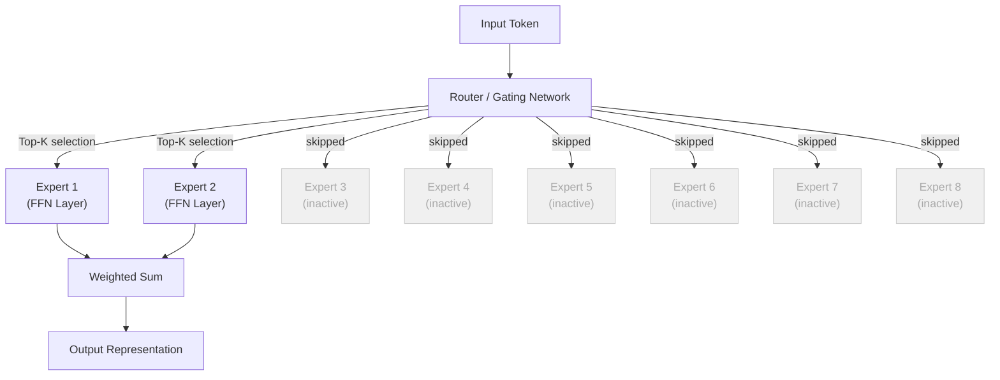
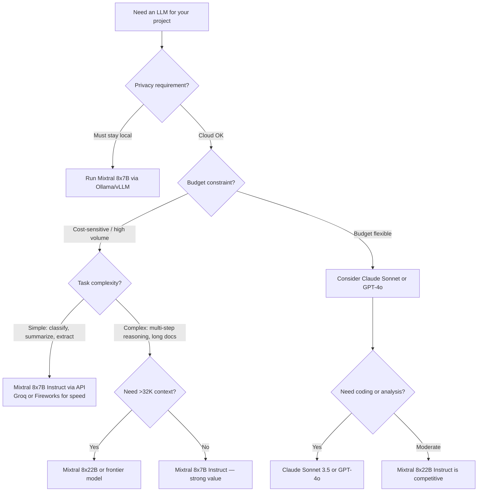

I tested Mixtral 8x7B against GPT-3.5-Turbo on a batch of 200 real coding tasks. Mixtral was cheaper to run, faster on average, and scored higher on correctness. That result surprised me — not because Mixtral is secretly better than everything, but because of *how* it achieves competitive performance at a fraction of the compute cost. The answer is mixture of experts, and once you understand the architecture, you'll see why it's become the dominant design pattern for the next generation of frontier models.

## What Is Mixture of Experts?

A standard dense language model — GPT-2, LLaMA 2, early Claude models — activates every one of its parameters for every single token it processes. If the model has 70 billion parameters, all 70 billion are doing work on every word. That's computationally expensive at inference time, and it scales poorly as models get larger.

Mixture of experts (MoE) breaks this assumption. Instead of one monolithic feedforward network, an MoE model has *multiple* feedforward networks called experts. For each token, a lightweight routing network decides which experts to activate — typically just two or three out of the full set. The rest stay idle. The result is a model with a large total parameter count but a much smaller "active" parameter count at any given moment.

This distinction matters enormously for real-world deployment:

- **Total parameters** determine what the model has learned and how capable its upper bound is
- **Active parameters** determine the compute cost and latency of each forward pass

A Mixtral 8x7B model has 46.7 billion total parameters but activates roughly 12–13 billion per token. You get the knowledge capacity of a ~47B model at the inference cost of a ~13B model. That's not a trick — it's the core efficiency insight.



The router isn't a black box — it's a learned linear layer that outputs a score for each expert. Those scores pass through a softmax, and the top-K experts (usually K=2) are selected. The outputs of the chosen experts are then combined via a weighted sum, with the weights coming from the router's softmax scores. This happens at every transformer layer that uses MoE, which in Mixtral is every feedforward block.

## How Mixtral Works: The 8x7B Architecture

Mistral AI released Mixtral 8x7B in December 2023 as an open-weight model. The naming is slightly misleading: "8x7B" doesn't mean eight 7B models strapped together. It means the model has 8 expert FFN blocks per layer, each roughly the size of a 7B-style feedforward network, with 2 experts active per token.

The full architecture looks like this:

- **Layers:** 32 transformer blocks
- **Attention heads:** 32 (with grouped-query attention for efficiency)
- **Context length:** 32,768 tokens (32K)
- **Total parameters:** 46.7B
- **Active parameters per token:** ~12.9B
- **Vocabulary size:** 32,000 tokens

Crucially, attention layers in Mixtral are *dense* — every attention head is active for every token. Only the feedforward (FFN) sublayers use the MoE routing. This is a deliberate design choice: attention captures positional and contextual relationships across the sequence, while the FFN layers handle "knowledge storage." Specializing the knowledge-storage component while keeping attention dense is an elegant decomposition.

The router is trained with an auxiliary load-balancing loss that encourages each expert to handle roughly equal numbers of tokens. Without this constraint, training collapses: one or two experts get selected for everything and the rest never learn. Mistral's implementation handles this well — in practice, you see genuine specialization emerge across experts, with some handling different syntactic patterns and others focusing on domain-specific content.

Mistral also released **Mixtral 8x22B** in April 2024. The larger variant has 141B total parameters and ~39B active parameters per token, with a 64K context window. It competes more directly with GPT-4-class models.

## Performance vs Dense Models

The headline claim for Mixtral 8x7B is that it matches or exceeds LLaMA 2 70B on most benchmarks while activating far fewer parameters per token. Here's how the numbers look on standard evals:

```mermaid
xychart-beta
    title "Benchmark Scores — Mixtral 8x7B vs Dense Competitors"
    x-axis ["MMLU", "HumanEval", "GSM8K", "BBH", "HellaSwag"]
    y-axis "Score (%)" 0 --> 100
    bar [70.6, 40.2, 74.4, 60.7, 81.0]
    bar [68.9, 29.9, 56.8, 51.2, 80.2]
    bar [63.9, 18.3, 56.8, 45.6, 78.6]
```



The three bars represent Mixtral 8x7B, LLaMA 2 70B, and LLaMA 2 13B respectively. Mixtral beats the 70B dense model on MMLU (general knowledge), HumanEval (code), and GSM8K (math reasoning) while costing less to run at inference time. Against the 13B, the gap is decisive across every benchmark.

The story isn't that Mixtral wins everything — GPT-4 class models still outperform it on harder reasoning tasks. The story is the efficiency ratio. For applications that don't need frontier-tier reasoning, Mixtral gives you a dramatically better performance-per-dollar curve than dense alternatives at the same compute budget.

Instruction-tuned variants matter here. **Mixtral 8x7B Instruct** and **Mixtral 8x22B Instruct** are fine-tuned for chat and instruction following and consistently outperform their base counterparts on practical tasks. For production use, always reach for the Instruct version unless you're doing further fine-tuning yourself.

## Running Mixtral Locally

If you have the hardware, running Mixtral locally gives you zero API cost, full privacy, and no rate limits. Here's what you actually need:

**For Mixtral 8x7B:**
- Quantized (Q4): fits in 24–26 GB VRAM — a single RTX 3090/4090 or two 12 GB cards
- Full float16: requires ~95 GB VRAM — typically 2x A100 80GB
- CPU/RAM fallback: 64 GB RAM minimum with llama.cpp, expect slow inference

**For Mixtral 8x22B:**
- Quantized (Q4): ~45 GB VRAM — two A100 40GB or similar
- Full float16: ~220 GB VRAM — multi-GPU setup required

The most practical path for local inference is [Ollama](https://ollama.com), which handles quantization, layer offloading, and model management:

```bash
# Install Ollama (macOS/Linux)
curl -fsSL https://ollama.com/install.sh | sh

# Pull and run Mixtral 8x7B Instruct
ollama pull mixtral:8x7b-instruct-v0.1-q4_K_M
ollama run mixtral:8x7b-instruct-v0.1-q4_K_M
```

For programmatic access with Ollama running locally:

```bash
curl http://localhost:11434/api/generate \
  -d '{
    "model": "mixtral:8x7b-instruct-v0.1-q4_K_M",
    "prompt": "Explain how sparse routing works in mixture-of-experts models.",
    "stream": false
  }'
```

If you want OpenAI-compatible endpoints locally, [LM Studio](https://lmstudio.ai) and [vLLM](https://github.com/vllm-project/vllm) both support Mixtral and expose a `/v1/chat/completions` endpoint you can drop into existing code with a base URL swap.

For vLLM (best for throughput in production-like local setups):

```bash
pip install vllm
python -m vllm.entrypoints.openai.api_server \
  --model mistralai/Mixtral-8x7B-Instruct-v0.1 \
  --tensor-parallel-size 2  # adjust to your GPU count
```

## API Access

If local hardware isn't practical, several cloud providers serve Mixtral with competitive pricing:

| Provider | Model | Input (per 1M tokens) | Output (per 1M tokens) |
|---|---|---|---|
| **Mistral AI** | Mixtral 8x7B | $0.70 | $0.70 |
| **Mistral AI** | Mixtral 8x22B | $2.00 | $6.00 |
| **Together AI** | Mixtral 8x7B Instruct | $0.60 | $0.60 |
| **Fireworks AI** | Mixtral 8x7B | $0.50 | $0.50 |
| **Groq** | Mixtral 8x7B | $0.27 | $0.27 |

Groq uses its own Language Processing Unit (LPU) hardware and delivers remarkable throughput — often 400–500 tokens per second on Mixtral 8x7B, which is 5–10x faster than GPU-based inference providers. If latency is the constraint, Groq is worth benchmarking even if you end up on a different provider for cost or reliability reasons.

Using Mistral's official API:

```python
from mistralai import Mistral

client = Mistral(api_key="your-api-key")

response = client.chat.complete(
    model="open-mixtral-8x7b",
    messages=[
        {"role": "user", "content": "What are the tradeoffs of MoE vs dense transformers?"}
    ]
)
print(response.choices[0].message.content)
```

The Mistral SDK follows the same message format as OpenAI, so if you're already using the OpenAI SDK, switching requires only changing the base URL and model name.

## Should You Use Mixtral? A Decision Framework



The framework simplifies to a few key questions. If data privacy drives the decision, Mixtral is one of the best open-weight options available — run it locally and nothing leaves your infrastructure. If cost at scale is the binding constraint, Mixtral 8x7B's per-token cost is a fraction of GPT-4o or Claude Sonnet. If you need maximum reasoning capability on complex, long-horizon tasks, frontier models still have the edge.

## MoE vs Dense Models: Real Tradeoffs

MoE isn't strictly better — it shifts where the complexity lives. Here's an honest accounting:

**Advantages of MoE:**
- Higher parameter count (more knowledge capacity) at lower active compute
- Better performance-per-dollar at inference time for the same quality tier
- Naturally suited to diverse tasks because different experts specialize
- Can be scaled by adding more experts without proportional compute increase

**Disadvantages of MoE:**
- Higher *total* parameter count means more memory required to load the model, even if most parameters are idle
- Routing adds overhead: the gating network adds a small but nonzero cost per token
- Load balancing during training is tricky — auxiliary losses add complexity
- Expert specialization is emergent, not controlled: you can't directly assign experts to topics
- Fine-tuning is harder because you need to balance expert utilization during the fine-tuning run
- Communication overhead in multi-GPU setups, since different experts may live on different devices

For most API users, these tradeoffs are invisible — the provider handles the infrastructure. For teams deploying their own Mixtral instances, the memory requirements are the practical blocker. A 46.7B-parameter model needs all those parameters in VRAM or RAM, even though only 12.9B activate per token.

## Who Else Uses MoE? The Architecture Goes Mainstream

Mixtral proved MoE could work at scale with open weights. Since then, the architecture has spread:

**DeepSeek MoE series:** DeepSeek's R1 and V3 models use a fine-grained MoE design with many smaller experts instead of a few large ones. DeepSeek-V3 has 671B total parameters with only 37B active per token — an even more extreme efficiency ratio than Mixtral, achieved through 256 routed experts with 8 active at a time. Their January 2026 results shook the industry because the performance-per-dollar ratio appeared to significantly undercut US-based frontier labs.

**Grok (xAI):** xAI has publicly described Grok-1 as a 314B-parameter MoE model. The architecture is consistent with Mixtral's general approach but at substantially larger scale.

**Google's Gemini:** Google has confirmed that parts of the Gemini model family use MoE techniques, though specific details of the routing and expert counts haven't been fully disclosed.

**Mistral's own roadmap:** Mistral has continued iterating. Their Mistral Large and subsequent models incorporate lessons from the Mixtral architecture, and the open-weight Mixtral series remains one of the best reference points for how MoE scales.

The pattern is consistent: frontier labs have converged on MoE as the architecture of choice for scaling beyond ~70B effective parameters without proportional compute costs. The question is no longer whether MoE works — it's how to route, how many experts to use, and how fine-grained the expert decomposition should be.

## Limitations to Know Before You Deploy

**Context length ceiling.** Mixtral 8x7B's 32K context window is strong but not market-leading. Claude 3.5 Sonnet supports 200K tokens. Gemini 1.5 Pro supports 1 million tokens. If your application regularly processes long documents, legal agreements, or entire codebases, that 32K limit will bite.

**No native tool use in base models.** The Mistral API provides function calling, but the base Mixtral weights don't have this baked in as robustly as models specifically trained for tool use. In practice, Mixtral via the Mistral API handles tool use acceptably, but I've seen more formatting failures compared to GPT-4o or Claude Sonnet in structured output scenarios.

**Multilingual quality drops.** Mixtral performs well on English and reasonably on French, German, Spanish, and Italian (reflecting Mistral's European origin). Quality degrades more on less-resourced languages than comparable-size dense models trained with stronger multilingual objectives.

**No vision.** Neither Mixtral 8x7B nor 8x22B has multimodal input. If your application needs image understanding, you're looking at a different model entirely.

**Fine-tuning complexity.** If you need to fine-tune for a specific domain, MoE models require more care than dense models to avoid expert collapse or load imbalance during training. Established fine-tuning recipes for LLaMA 2 or Mistral 7B don't transfer directly.

## Verdict

Mixtral 8x7B Instruct is one of the most useful models for cost-sensitive production workloads in 2026. For classification, extraction, summarization, code generation at moderate complexity, and retrieval-augmented generation pipelines, it delivers quality that matches or approaches GPT-3.5-Turbo at a fraction of the cost — and on some tasks, it beats GPT-3.5 outright.

Mixtral 8x22B closes the gap with frontier models for harder reasoning tasks, though at that tier you're comparing it directly against Claude Sonnet and GPT-4o, and the competitive picture is less clear-cut.

The mixture-of-experts architecture itself is the real story. What Mistral demonstrated with Mixtral is now the design template that every serious frontier lab is following. Understanding MoE isn't just useful for choosing a model today — it's essential context for interpreting every model announcement that comes out over the next few years. When a lab says their 400B-parameter model runs efficiently, they almost certainly mean MoE.

---

## Frequently Asked Questions

### Is Mixtral 8x7B really 8 separate 7B models?

No. The "8x7B" naming is shorthand for the MoE configuration — 8 expert feedforward networks per layer, each with a parameter count comparable to a 7B-scale FFN. The model is a single unified transformer that shares attention layers across all tokens, with the 8 expert FFN blocks competing for each token via the routing network. Total parameters are 46.7B, not 8×7B=56B, because the experts share some components.

### How does Mixtral compare to LLaMA 3 or Mistral 7B?

Mixtral 8x7B consistently outperforms LLaMA 2 70B and LLaMA 3 8B on most benchmarks. Against LLaMA 3 70B — Meta's current flagship open-weight dense model — the results are more mixed and task-dependent. Mistral 7B (a dense model) is smaller and cheaper to run but meaningfully less capable than Mixtral 8x7B on complex tasks. The practical choice is usually Mixtral 8x7B over Mistral 7B unless hardware is severely constrained.

### Can Mixtral run on a consumer laptop?

With aggressive quantization (Q3 or Q4), Mixtral 8x7B can technically run via llama.cpp on a machine with 32 GB of unified RAM (like a MacBook Pro M2 Max or M3 Max). Expect 5–15 tokens per second on Apple Silicon — usable for experimentation but not practical for production or heavy use. For fast local inference, you need at least one 24 GB GPU.

### What's the difference between Mixtral 8x7B base and Instruct?

The base model is trained only on next-token prediction from a large text corpus. It completes text but doesn't follow instructions reliably. The Instruct variant is fine-tuned with supervised examples and RLHF/DPO to follow user instructions, maintain a helpful conversational format, and refuse harmful requests. For any practical chat or API use case, always use the Instruct version. The base model is for researchers or teams doing their own fine-tuning.

### How is Mixtral's mixture-of-experts different from DeepSeek's?

Both use sparse MoE routing, but the expert granularity differs. Mixtral uses 8 relatively large experts with 2 active per token. DeepSeek-V3 uses 256 much smaller "fine-grained" experts with 8 active per token. The fine-grained approach gives the router more flexibility and potentially better specialization but increases routing complexity. DeepSeek also separates a small number of "shared" experts that are always active from the routed experts — a hybrid design that addresses some of the load-balancing challenges in pure MoE training.
