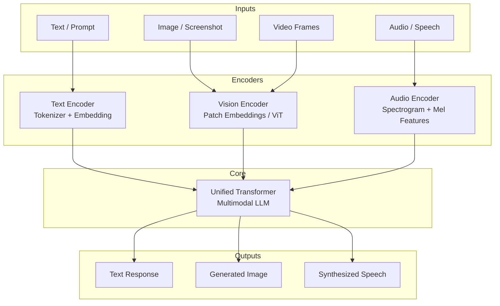
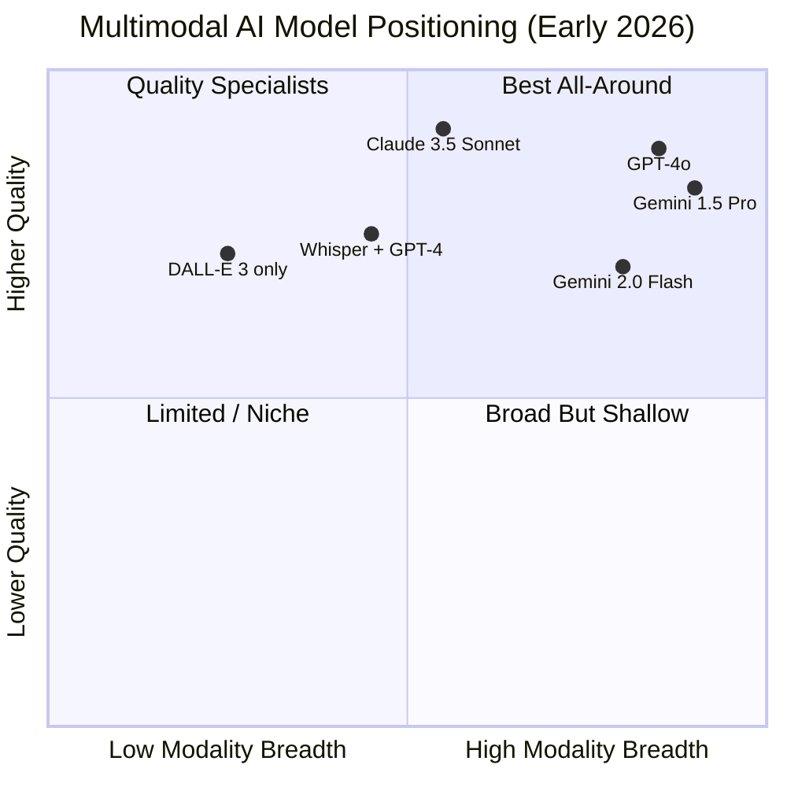
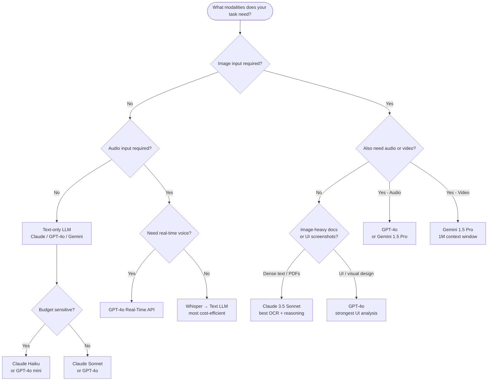

I've been building AI-powered apps for a few years now, and the single biggest shift I've seen isn't a new model — it's the collapse of the wall between modalities. For most of AI's history, you had a text model, a vision model, an audio model, and maybe an image generation model. They lived in separate silos with separate APIs and separate billing accounts. You glued them together yourself.

That era is largely over. Multimodal AI — models that can natively understand and generate across text, images, and audio in a single unified architecture — is now mainstream. GPT-4o, Gemini 1.5 Pro, and Claude 3.5 Sonnet all operate across at least two modalities natively. The question is no longer "can I do this?" It's "which model does it best for my specific job, and how do I build it?"

This guide answers both questions.

---

## What Is Multimodal AI?

A **multimodal AI model** is one that accepts and/or produces more than one type of data — most commonly text, images, and audio — within a single model rather than through a chained pipeline of separate models.

The key word is "native." A pipeline that runs Whisper to transcribe audio, then feeds the text to GPT-4, then runs DALL-E on the output is not a multimodal model — it's three models bolted together. A multimodal LLM processes the raw input signals together, allowing the model to attend to relationships across modalities that a pipeline would lose.

Why does this matter in practice?

- **Richer context.** When the model sees your screenshot *and* your error message together, it can reason about visual layout, not just the words.
- **Lower latency.** One API call replaces three sequential calls.
- **Fewer handoff errors.** No transcription that drops technical jargon before it reaches the reasoning model.
- **New capability classes.** Tasks like "describe what changed between these two UI screenshots" are only tractable when vision and language are integrated.

The modalities in play across current production systems are: **text** (always), **image input** (vision), **audio input/output** (speech), **video input**, and **image generation**. Not every model handles all of these, which is one of the things this article maps out.

---

## Multimodal Architecture: How It Actually Works



The core architectural pattern is a **unified transformer** that receives tokens from multiple encoders. A vision encoder — typically a Vision Transformer (ViT) variant — converts an image into patch embeddings that live in the same space as text token embeddings. An audio encoder converts waveforms into spectral features. All of these land in the same token stream that the main transformer attends over.

This is why multimodal LLMs can say things like "the error in line 34 matches the red highlight visible in the screenshot you attached" — the model is literally attending to both at the same time, not reasoning about them sequentially.

**Output modalities** are handled differently. Text output is native to every LLM. Image generation typically uses a separate decoder (a diffusion model) that the transformer is trained to steer. Audio output for speech synthesis is similarly handled by a vocoder component. The trend — most visible in GPT-4o — is to collapse these decoders into a single end-to-end trained system rather than leaving them as bolt-on modules.

---

## Vision Capabilities: GPT-4o, Claude, and Gemini

Vision input is now table stakes for frontier models. Here's where they actually differ.

### GPT-4o

GPT-4o has the most mature vision workflow in the OpenAI ecosystem. It accepts images as base64 or URLs inline in the message array, it integrates with Code Interpreter so the model can not only describe a chart but also write and run code to reproduce it, and it can handle multiple images in a single context window.

I've used it extensively for UI screenshot analysis, and it handles dense interfaces well — it'll identify specific components, describe spacing issues, and even flag accessibility problems. Where it gets shaky is with technical diagrams that require domain knowledge: a network topology diagram or a circuit schematic will get vaguer responses than a screenshot of a web app.

### Claude 3.5 Sonnet (and Claude 3 Opus)

Claude's vision capability is particularly strong for **document and text-dense image analysis**. Feed it a PDF scan, a whiteboard photo full of handwritten notes, or a table screenshot and it'll faithfully extract structured data from it. I've had consistently better results from Claude than GPT-4o when the image contains a lot of text that needs to be accurately read (not just described).

Claude also has one important limitation: as of early 2026 it doesn't support image *generation* — only image *understanding*. If your workflow needs both, you're either pairing Claude with a generation API or switching to a different model for that step.

### Gemini 1.5 Pro / Gemini 2.0

Gemini's headline vision feature is its **massive context window** (up to 1M tokens), which means it can accept entire videos as sequences of frames, not just individual images. For tasks like "summarize this 30-minute recorded meeting" or "find every moment in this video where the presenter shows a chart," Gemini is currently in a class of its own.

Gemini also natively understands interleaved image-text documents — you can feed it a multi-page PDF with embedded figures and ask questions that require reasoning across both the text and the figures. For research paper analysis, this is genuinely powerful.

---

## Audio and Speech: Whisper, Gemini Native Audio, and GPT-4o Voice

### OpenAI Whisper

Whisper is OpenAI's open-weight ASR (Automatic Speech Recognition) model and it remains one of the best pure transcription solutions available. It's not a multimodal LLM — it's a specialized audio-to-text model — but it's the backbone of many multimodal pipelines.

**When to use it:** Any time you need accurate, fast, cheap transcription as a preprocessing step. The large-v3 variant handles 99 languages, runs on consumer GPUs, and produces timestamped transcripts. I use it for meeting recording pipelines, podcast transcription, and voice-to-code dictation.

**When it falls short:** It's transcription only. It doesn't understand the content, can't answer questions about the audio, and has no awareness of who's speaking without a separate diarization step.

### Gemini Native Audio

Gemini 1.5 Pro accepts raw audio as a modality — not transcribed text, but the actual audio file. This means the model can reason about tone, pace, speaker identity, and non-verbal signals alongside the words. It can answer questions like "at what point does the speaker sound most uncertain?" that a transcription-based pipeline simply cannot.

For customer service call analysis and qualitative user interview research, this is a meaningful capability jump. The tradeoff is cost and latency compared to running Whisper + a text LLM.

### GPT-4o Real-Time API

GPT-4o introduced a Real-Time Audio API that enables low-latency, bidirectional audio conversation — the model speaks back in a synthesized voice that's aware of conversational context. This is how the ChatGPT Advanced Voice Mode works. As an API, it opens up custom voice assistants, interactive IVR systems, and language tutoring apps that respond naturally to interruptions and overlapping speech.

---

## Image Generation: DALL-E 3, Midjourney, and Stable Diffusion

Image generation sits alongside — not inside — most multimodal LLMs, but it's a core part of any multimodal AI workflow.

### DALL-E 3 (via GPT-4o)

DALL-E 3 is the current OpenAI generation model and its tight integration with GPT-4o is its main advantage. You can have a conversation with GPT-4o, refine a concept through multiple turns, and generate the image at the end — the model rewrites your prompt internally to improve image quality. It follows complex compositional instructions reliably and handles text-in-image better than its predecessors (though still imperfectly).

### Midjourney

Midjourney produces the highest aesthetic quality of any current system for photorealistic and stylized art. It's not available as a programmatic API in the traditional sense, which makes it awkward to embed in applications. For creative professionals using it interactively, though, it's often the output they choose for client deliverables.

### Stable Diffusion (and FLUX)

Open-weight diffusion models — Stable Diffusion 3, FLUX.1 — are the choice when you need to run generation locally, fine-tune on proprietary image datasets, or avoid sending imagery to a third-party API. The control surface is much larger (ControlNet, IP-Adapter, LoRA fine-tuning) at the cost of operational complexity.

---

## Model Capability Comparison



| Model | Text | Vision In | Audio In | Audio Out | Image Gen | Video |
|---|---|---|---|---|---|---|
| GPT-4o | ✅ | ✅ | ✅ | ✅ | via DALL-E 3 | ❌ |
| Claude 3.5 Sonnet | ✅ | ✅ | ❌ | ❌ | ❌ | ❌ |
| Gemini 1.5 Pro | ✅ | ✅ | ✅ | ❌ | ❌ | ✅ |
| Gemini 2.0 Flash | ✅ | ✅ | ✅ | ✅ | ✅ | ✅ |

---

## Video Understanding

Video is the multimodal frontier that's just beginning to be production-ready. The challenge is scale: a 10-minute video at 1 frame per second is 600 images. At 10 fps it's 6,000. Context windows that can handle that at acceptable cost are a recent development.

**Gemini 1.5 Pro** is the current leader here. I've tested it on recorded product demos and technical presentations. It can locate specific moments, summarize segments, and answer questions that require synthesizing information across the full video. Feed it an hour-long conference talk and ask "which slide has the performance benchmark data?" — it works.

**GPT-4o** supports video via the API but with frame limits that make long-form video analysis more expensive and constrained. It's better suited for short clips (under 2 minutes) where you want tight integration with the rest of the OpenAI ecosystem.

For most teams building video analysis today, the practical stack is: extract frames with ffmpeg at an appropriate sample rate, then send to a model with a large enough context window. Gemini is the natural fit for that pipeline.

---

## Building Multimodal Apps: Code Examples

Let me walk through a practical example: a tool that accepts an uploaded screenshot and a text question, then returns an analysis. I'll show GPT-4o and Gemini variants.

### GPT-4o Vision API (Python)

```python
import base64
import httpx
from openai import OpenAI

client = OpenAI()

def analyze_screenshot(image_path: str, question: str) -> str:
    # Read and encode the image
    with open(image_path, "rb") as f:
        image_data = base64.standard_b64encode(f.read()).decode("utf-8")

    # Determine image type from path
    ext = image_path.rsplit(".", 1)[-1].lower()
    media_type = f"image/{ext}" if ext != "jpg" else "image/jpeg"

    response = client.chat.completions.create(
        model="gpt-4o",
        messages=[
            {
                "role": "user",
                "content": [
                    {
                        "type": "image_url",
                        "image_url": {
                            "url": f"data:{media_type};base64,{image_data}",
                            "detail": "high",  # Use "low" for faster/cheaper analysis
                        },
                    },
                    {
                        "type": "text",
                        "text": question,
                    },
                ],
            }
        ],
        max_tokens=1024,
    )

    return response.choices[0].message.content


# Usage
result = analyze_screenshot(
    "error_screenshot.png",
    "What's causing the error shown in this screenshot, and how do I fix it?"
)
print(result)
```

### Gemini Vision + Audio (Python)

```python
import google.generativeai as genai
import pathlib

genai.configure(api_key="YOUR_API_KEY")

def analyze_with_audio_and_image(
    image_path: str,
    audio_path: str,
    prompt: str
) -> str:
    model = genai.GenerativeModel("gemini-1.5-pro")

    # Upload files using the File API for large inputs
    image_file = genai.upload_file(path=image_path)
    audio_file = genai.upload_file(path=audio_path)

    response = model.generate_content(
        [
            image_file,
            audio_file,
            prompt,
        ]
    )

    return response.text


# Example: Analyze a design review meeting recording alongside the slide deck screenshot
result = analyze_with_audio_and_image(
    image_path="slide_deck_screenshot.png",
    audio_path="design_review.mp3",
    prompt=(
        "The audio is a design review meeting. "
        "The image is a screenshot of the slide being discussed. "
        "Summarize the key feedback about this slide."
    ),
)
print(result)
```

### Streaming Audio Response with GPT-4o Real-Time API

```python
import asyncio
import websockets
import json
import base64

async def realtime_voice_session(user_audio_bytes: bytes):
    """Send audio to GPT-4o real-time and stream back the response."""
    url = "wss://api.openai.com/v1/realtime?model=gpt-4o-realtime-preview"
    headers = {
        "Authorization": "Bearer YOUR_API_KEY",
        "OpenAI-Beta": "realtime=v1",
    }

    async with websockets.connect(url, extra_headers=headers) as ws:
        # Configure the session
        await ws.send(json.dumps({
            "type": "session.update",
            "session": {
                "modalities": ["text", "audio"],
                "voice": "alloy",
                "input_audio_format": "pcm16",
                "output_audio_format": "pcm16",
            }
        }))

        # Send audio input
        audio_b64 = base64.b64encode(user_audio_bytes).decode()
        await ws.send(json.dumps({
            "type": "input_audio_buffer.append",
            "audio": audio_b64,
        }))
        await ws.send(json.dumps({"type": "input_audio_buffer.commit"}))
        await ws.send(json.dumps({"type": "response.create"}))

        # Collect streamed response
        audio_chunks = []
        async for message in ws:
            event = json.loads(message)
            if event["type"] == "response.audio.delta":
                chunk = base64.b64decode(event["delta"])
                audio_chunks.append(chunk)
            elif event["type"] == "response.done":
                break

        return b"".join(audio_chunks)  # Raw PCM16 audio bytes
```

---

## How to Choose: Decision Flowchart



The flowchart above covers the most common decision points. A few rules of thumb I've landed on after building production multimodal apps:

1. **Start with GPT-4o** if you need the broadest modality coverage and tight ecosystem integration.
2. **Switch to Claude** when you're doing heavy document or text-image analysis — the accuracy on dense text is reliably better.
3. **Use Gemini** when you have video, need a 1M token context, or want to send raw audio without pre-transcription.
4. **Run Whisper locally** when cost is the primary constraint and you don't need the model to reason about audio nuance.

---

## Real-World Use Cases

### 1. Customer Support Automation

A multimodal support bot that accepts screenshots alongside text tickets is materially better than text-only. Users can paste a screenshot of an error, and the model identifies the exact error state, the browser version shown in the UI, and the relevant help article — without the user having to describe any of it. I've seen this reduce average handle time by 30-40% on visual-heavy products.

### 2. Accessibility Tools

Real-time image description for visually impaired users is now straightforward to build. You stream camera frames, send them to a vision model, and return audio descriptions. Gemini's audio output and vision input in a single model makes this architecture cleaner than it was with chained models.

### 3. Code Review from Screenshots

Developers working on legacy codebases often have documentation that exists only as screenshots of old wikis or scanned PDFs. Claude's strong OCR + reasoning combination makes it practical to ask "what does this legacy authentication flow do?" with a screenshot of a faded diagram as input.

### 4. Medical Imaging Triage (Research Context)

Multimodal LLMs are being evaluated in radiology and pathology workflows — not for diagnosis (which requires certified systems), but for administrative triage, report summarization, and helping clinicians prioritize review queues. This use case requires specific regulatory consideration, but the underlying capability is real.

### 5. Multimodal RAG

Retrieval-Augmented Generation extended to images: your vector database stores embeddings of documents, charts, and images alongside text. When a user asks a question, relevant images are retrieved and sent to the model alongside text context. This is particularly useful for technical manuals, product catalogs, and research libraries where critical information lives in figures.

---

## Limitations to Know Before You Build

**Hallucination is worse with images.** Models will confidently describe things in images that aren't there, especially when the image is ambiguous or low-resolution. Always validate critical visual claims programmatically where possible.

**Token cost scales with image resolution.** GPT-4o charges based on image tile count at high detail. A 2048x2048 image can cost 1000+ tokens before you've typed a single word. Budget carefully when processing many images at scale.

**Audio transcription accuracy varies by accent and domain.** Whisper and Gemini's audio handling both degrade on heavy accents, strong background noise, and domain-specific terminology. Test your actual audio before building production pipelines around it.

**Context length is not the same as reasoning depth.** Gemini's 1M context window can hold an hour of video frames, but that doesn't mean it reasons perfectly over all of it. Attention degrades over very long contexts in practice. For long-form video, structured chunking and summarization still produces better results than raw stuffing.

**Output modality gaps.** Claude doesn't generate images or audio. Most models that do generate images are using a separate diffusion decoder that introduces its own failure modes. No single model does everything equally well.

**Privacy and data residency.** Sending images and audio to external APIs raises questions that text-only workflows sometimes don't trigger as acutely — think medical images, financial documents, PII in screenshots. Know your vendor's data handling terms before you build.

---

## Verdict

Multimodal AI is genuinely transformative, and the infrastructure is mature enough to build on right now. The model choice matters less than picking the right modalities for your actual task and designing a proper evaluation loop.

If I were starting a new multimodal project today, my default stack would be:

- **GPT-4o** for the main reasoning layer if I need text + vision + audio in one API
- **Claude 3.5 Sonnet** for any document or text-image extraction where accuracy is critical
- **Gemini 1.5 Pro** for anything involving video or very long audio
- **Whisper (self-hosted)** for high-volume transcription where cost matters more than reasoning
- **FLUX or Stable Diffusion** for image generation if I need to keep data local; DALL-E 3 for the fastest path to quality

The biggest mistake I see teams make is treating multimodal as a demo feature. The real value is in production workflows where the ability to receive and reason about an image or audio clip removes a manual translation step that was silently costing hours of human time every day.

---

## FAQ

### What's the difference between a multimodal AI and a multimodal pipeline?

A multimodal AI processes different input types natively within a single model's architecture — the attention mechanism spans all modalities simultaneously. A multimodal pipeline chains separate specialized models (Whisper → GPT-4 → DALL-E) via API calls. Native multimodal models have lower latency, fewer handoff errors, and can reason across modalities in ways pipelines cannot. Pipelines are cheaper and more composable, which makes them the right choice for many production systems despite being architecturally cruder.

### Can I fine-tune a multimodal LLM on my own images and audio?

Yes, but the process varies significantly by model and modality. Text fine-tuning is the most accessible — OpenAI, Anthropic, and Google all offer it. Vision fine-tuning is available for some models (GPT-4o fine-tuning includes image support in limited preview). Audio fine-tuning is the least accessible of the three and generally requires open-weight models like Whisper or working with a provider's enterprise program. For most teams, prompt engineering and retrieval will get you further faster than fine-tuning.

### How do I handle privacy when sending images to a multimodal API?

The same principles as text apply, but images can carry PII that's harder to detect automatically — faces, medical data, financial documents, whiteboards with confidential information. Before sending images to a third-party API: check the vendor's data processing agreement and opt-out options, strip EXIF metadata from photos, consider running a detection step to flag sensitive image categories before they hit the model API, and prefer self-hosted open-weight models (FLUX, LLaVA) when data residency is a hard requirement.

### Is multimodal AI better than specialized models for each modality?

For many tasks, no — specialized models still win on their specific domain. Whisper beats GPT-4o's transcription accuracy on difficult audio. A dedicated OCR engine with post-processing beats a vision LLM on pure text extraction throughput and cost. The multimodal LLM wins when you need *reasoning* that crosses modalities — understanding the relationship between a screenshot and an error message, or summarizing the emotional tone of an audio clip alongside what was said. If you can decompose the task cleanly into pure-modality steps, specialized models are often cheaper and more accurate.

### What's the best way to evaluate a multimodal AI system?

Build a test set from real tasks before you write production code. For vision tasks: collect 30-50 real images from your use case, define what the correct output looks like, run multiple models, and score them on your rubric rather than a generic benchmark. For audio tasks: record yourself and several colleagues saying the sentences your system will encounter, including domain-specific terms, then measure accuracy. For image generation: create a prompt library covering your key use cases and score outputs on adherence, quality, and consistency across runs. The generic MMMU or VQA benchmarks will not predict which model performs best on your specific task distribution.
