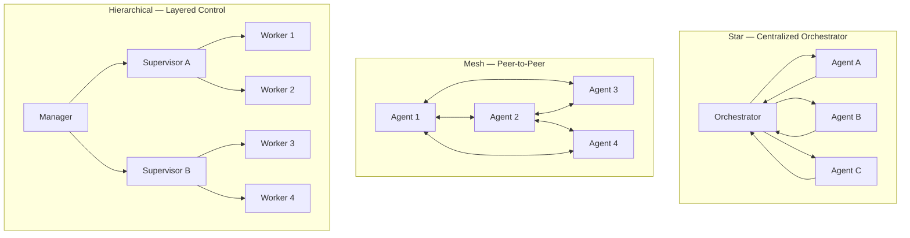
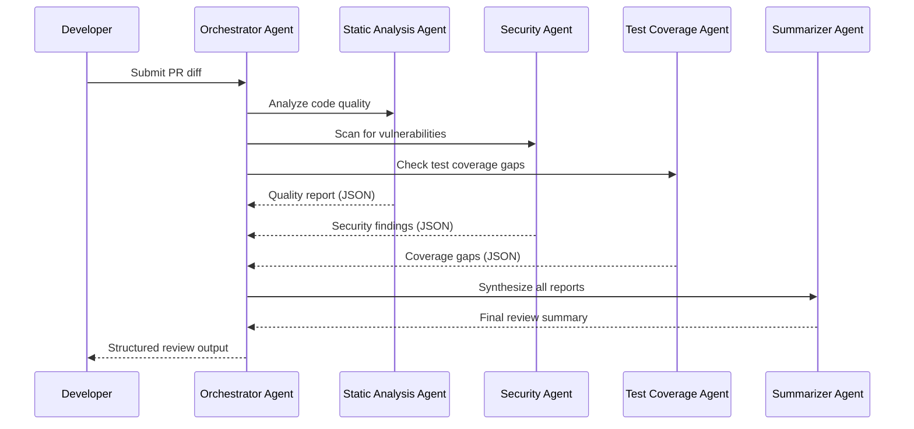
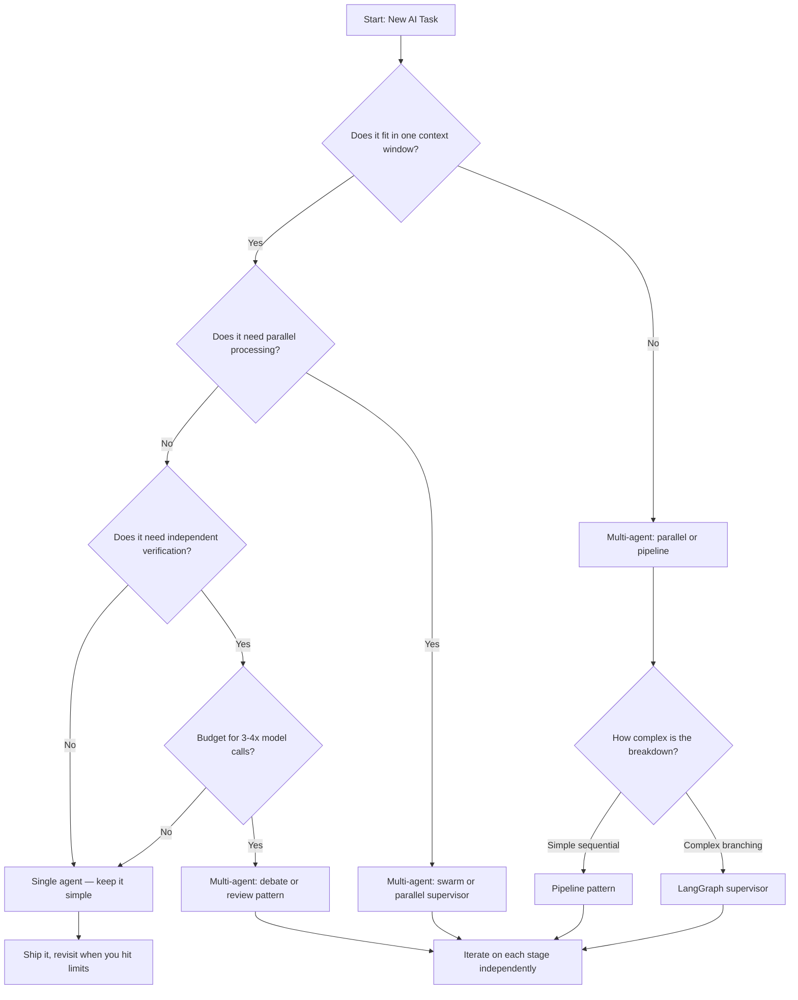

I've built enough single-agent pipelines to know exactly when they break: the task grows, the context window fills up, the model starts dropping earlier context, and you're left wondering whether the output reflects your instructions or just the last thousand tokens. That's the inflection point where multi-agent systems stop being an architecture exercise and start being a practical engineering decision.

Multi-agent AI is not hype — but it is frequently misapplied. Most teams jump to a swarm of agents when a better prompt and a tool call would've done the job. This guide is for the teams who've already squeezed the single-agent approach and genuinely need more.

## What Are Multi-Agent Systems?

A multi-agent system (MAS) is a setup where multiple AI models — or multiple instances of the same model — collaborate, compete, or specialize to complete a task that a single agent handles poorly or not at all.

The key word is *system*. Each agent is a node with its own role, context, and output. The system defines how those nodes communicate, who decides what, and how the final result gets assembled.

Multi-agent AI isn't a new idea. The academic field predates LLMs by decades — think robotics swarms and game-theoretic simulations. What's changed is that LLMs gave us agents with general reasoning capability, so we can compose them in ways that weren't practical when every agent required a custom model trained from scratch.

The practical use cases that push teams toward multi-agent AI today:

- Tasks too long to fit in a single context window (full codebase refactors, multi-document research)
- Tasks that benefit from parallelism (scraping 50 URLs simultaneously, processing a backlog of tickets)
- Tasks that require independent verification (one agent writes code, another reviews it)
- Tasks with genuinely distinct sub-problems requiring specialized prompts or tools

If your task doesn't fit one of those categories, you probably don't need a multi-agent system yet.

## Common MAS Architectures

Before getting into specific patterns, here's a map of how agents can relate to each other topologically.

**Star (centralized):** One orchestrator agent routes tasks to worker agents and aggregates results. Simple to reason about, easy to debug. Most production systems start here.

**Mesh (peer-to-peer):** Agents communicate directly with each other, without a central coordinator. More resilient to single-point failure, but harder to trace and govern. Good for simulation and research; harder to operate reliably in production.

**Hierarchical:** Multiple layers of agents, where higher-level agents break down problems and delegate to lower-level specialists. Scales well for complex tasks; the tradeoff is coordination overhead grows with depth.

## Architecture Patterns

Topology describes structure. Patterns describe behavior — how agents actually make decisions and communicate. These four patterns cover the vast majority of real-world multi-agent AI systems.

### Supervisor Pattern

One agent acts as a supervisor, breaking a task into subtasks and dispatching them to worker agents. The supervisor synthesizes the outputs into a final result.

This is the most common pattern and the right default. It maps cleanly onto how engineering teams actually work: a tech lead owns the overall outcome, delegates specific work, and reviews before shipping.

Where it shines: research synthesis, code generation with review, report generation where sections can be parallelized.

Where it struggles: if the supervisor's context window fills up with subtask outputs, it can lose track of earlier decisions. Keep subtask outputs compact and structured.

### Debate Pattern

Two or more agents produce competing answers, then critique each other's reasoning before a judge agent (or the same agents) converges on a final answer.

The debate pattern is useful when you genuinely don't know if the first answer is correct — complex reasoning tasks, code correctness verification, legal interpretation. The critique step catches errors that a single pass misses.

The cost is high: you're running 3–4× the model calls of a single-agent approach. Use debate when the cost of a wrong answer significantly outweighs the compute budget.

### Pipeline Pattern

Agents are chained sequentially. The output of Agent 1 becomes the input of Agent 2, and so on. Each agent in the chain has a narrow, well-defined role.

Classic example: scraper → summarizer → classifier → reporter. Each agent is simpler and cheaper than an all-in-one agent trying to do all four jobs in a single prompt.

Pipelines are predictable, testable, and easy to improve incrementally (swap out the summarizer without touching the classifier). The downside: each step adds latency, and errors propagate forward unless you add validation gates between stages.

### Swarm Pattern

A large pool of undifferentiated agents work on subtasks in parallel, with no fixed hierarchy. Tasks are distributed dynamically. Results are aggregated asynchronously.

Swarms are powerful for embarrassingly parallel workloads: processing a large dataset, running competitive analysis across 100 companies, generating variations of a prompt for A/B testing.

The operational complexity is real. You need robust task queues, deduplication, failure handling, and result aggregation. Most teams who jump to swarms prematurely end up building a lot of infrastructure to solve problems a simpler pattern would have avoided.

## Communication Protocols

How agents talk to each other matters as much as the architecture topology.

**Structured outputs (JSON/typed schemas):** The most reliable approach. Each agent produces a typed result that the next agent or orchestrator can parse without ambiguity. Use this by default. Unstructured text hand-offs between agents introduce parsing failures that are hard to debug.

**Shared memory / state stores:** Agents read from and write to a shared object — a dict, a database record, a vector store. This works well for stateful tasks where agents need to build on each other's context incrementally. Careful with concurrency: parallel agents writing to the same state object need locking or conflict resolution.

**Message queues:** Asynchronous communication via a queue (Redis, SQS, Kafka). Decouples agents so fast agents don't block on slow ones. Good for production swarms where reliability matters. Adds operational overhead.

**Direct API calls:** Agent A calls Agent B's endpoint synchronously and waits for a response. Simple and fast for small systems. Doesn't scale well; tight coupling makes failures cascade.

The practical hierarchy: start with structured outputs in a simple supervisor pattern. Add shared memory when agents need persistent context. Add message queues when you need parallelism and reliability at scale.

## A Real Workflow: Code Review Pipeline

Here's how a multi-agent code review pipeline actually runs in practice.

Each specialist agent runs in parallel (the three dashed return arrows happen concurrently). The orchestrator waits for all three, then sends the aggregated structured output to the summarizer. The developer sees one coherent review, not three fragmented reports.

The key design decisions here: parallel execution on independent tasks, structured JSON between every agent, and a summarizer that handles synthesis so the orchestrator doesn't have to.

## Framework Comparison

The framework you choose shapes what patterns are easy and what's painful. Here's an honest look at the four frameworks I've worked with directly.

| Feature | LangGraph | CrewAI | AutoGen | Claude (direct) |
|---|---|---|---|---|
| **Abstraction level** | Low (graph primitives) | High (role-based) | Medium (conversation) | None (you build it) |
| **Pattern support** | Any topology | Crew + supervisor | Debate + sequential | Any (manual) |
| **State management** | Built-in, excellent | Limited | Thread-based | Your implementation |
| **Debugging / tracing** | LangSmith integration | Basic logging | Good built-in | Manual or third-party |
| **Parallelism** | Yes (native) | Yes | Limited | Manual |
| **Learning curve** | Steep | Gentle | Medium | Steepest |
| **Best for** | Complex workflows, prod systems | Fast prototyping | Research, debate | Full control |

**LangGraph** is where I reach first for production systems. The graph abstraction forces you to make the topology explicit — nodes, edges, conditional branching, state schema. That explicitness pays off when debugging. LangSmith tracing is excellent. The learning curve is real; plan a few days to internalize the mental model before you're productive.

**CrewAI** is the fastest path from idea to a running multi-agent prototype. You define agents by role and goal, assign tasks, and the framework handles routing. The abstraction is high enough that you don't think much about topology — which is good for demos and bad for production when something breaks and you need to trace exactly what happened.

**AutoGen** (Microsoft) handles conversation-centric multi-agent patterns well, especially the debate and self-reflection patterns. It models agent interaction as a dialogue, which makes it natural for research tasks. Less suited to pipeline and swarm patterns where you want tight control over execution order and state.

**Claude API directly:** I've built multi-agent systems with nothing but the Anthropic SDK, typed Pydantic models, and asyncio. It's the most work, but you understand exactly what's happening at every step. For teams with specific requirements (custom state stores, unusual topologies, strict latency budgets) this is often the right call. No framework abstractions to debug — just your code.

## When Multi-Agent Beats Single-Agent

The honest answer: less often than you'd think, and later than you'd expect.

Single-agent with good tooling handles the majority of developer workflows. Don't add coordination overhead until you've hit a real ceiling.

The genuine cases where multi-agent wins:

**Context overload.** Your task requires more information than fits in one context window. Parallelizing with independent agents, each handling a scoped portion, is the practical solution. A codebase migration where each agent handles one module is a textbook example.

**Independent verification.** You need more confidence in the output than a single pass provides. A security audit agent reviewing the output of a code generation agent catches a different class of bugs than re-running the same agent.

**Parallel throughput.** You have N independent items to process and latency matters. Running N agents concurrently (or a pool of M agents against a queue of N tasks) is the obvious win.

**Specialization.** Your task has genuinely distinct sub-problems that benefit from different system prompts, tools, or even models. A data extraction agent might use a cheap fast model; a reasoning-heavy synthesis step might need a more capable model. Mixing models across agents in a pipeline is underused.

## Real-World Examples

**Customer support triage:** An intake agent classifies the ticket and extracts structured metadata (product, severity, account tier). A routing agent selects the appropriate queue. A responder agent drafts an initial reply from a knowledge base. A quality agent scores the draft before it's sent. Each stage is independently testable and swappable.

**Competitive research:** A search agent queries 20 sources in parallel. A summarizer agent condenses each source independently. An aggregator agent synthesizes across summaries. A fact-checker agent flags contradictions. The whole pipeline runs in under two minutes for research that would take a human analyst several hours.

**Code generation with review:** A planner agent converts a feature spec into a task breakdown. Parallel implementation agents write each component. A test generation agent produces test cases for each component. A review agent analyzes the diff against the spec and test results. An integration agent assembles the final PR. This is the pattern we used in a TypeScript monorepo migration — the pattern cut review cycles by about 40%.

## Should You Use Multi-Agent?

Work through this flowchart before adding agents. Most tasks land at "single agent — keep it simple" and should stay there.

## Common Pitfalls

**Premature agent proliferation.** Teams reach for 10 specialized agents when a well-structured single agent with five tools would be cheaper, faster, and easier to debug. Start with one agent. Add agents when you've identified a specific bottleneck that an additional agent would solve.

**Unstructured inter-agent communication.** Passing raw text between agents is a debugging nightmare. The downstream agent misparses the upstream output, produces garbage, and you spend an hour figuring out where the chain broke. Enforce typed schemas at every agent boundary from day one.

**No human-in-the-loop gate for high-stakes actions.** Multi-agent systems can take a lot of actions quickly. If an agent can write to a database, send an email, or call a paid API, make sure at least one step requires human approval before those actions execute in production.

**Ignoring cost.** A 5-agent pipeline where each agent uses a 200K-token context and runs 10 debate iterations is not a "prototype." Model those costs before you build. Many multi-agent architectures are economically viable only with cheaper models at intermediate steps.

**No observability.** A single agent in a bad state is debuggable. Five agents in a bad state, passing structured objects you haven't logged, is a disaster. Trace everything — inputs, outputs, tool calls, latency — from day one. LangSmith, Langfuse, and Weights & Biases all have multi-agent tracing support.

**Over-engineering the coordination layer.** I've seen teams spend a month building a sophisticated agent orchestration framework before they've validated the underlying agent prompts. Validate the individual agents first. Coordination is the last thing to optimize.

## Verdict

Multi-agent systems are a real and useful tool — for the right class of problems. The supervisor pattern covers about 80% of practical multi-agent use cases and should be your default when you've confirmed a single-agent approach isn't sufficient.

Use LangGraph if you're building for production and want the topology to be explicit and debuggable. Use CrewAI if you need a working prototype fast. Use the Anthropic SDK directly if you have unusual requirements and don't want a framework between you and the model.

The teams getting the most out of multi-agent AI are the ones who moved slowly enough to understand each agent's failure modes before adding more. That discipline — validate one agent, then compose — is harder to maintain than it sounds, and worth every bit of the slowdown.

---

## FAQ

### How many agents is too many?

There's no fixed number, but complexity grows faster than agent count. Three to five agents with clear responsibilities is a manageable starting point. When you exceed seven or eight, coordination overhead and debugging difficulty increase sharply. If you're building a large system, add hierarchical layers rather than flattening everything into one giant swarm.

### Can different agents use different AI models?

Yes, and this is an underused optimization. Use a cheap fast model (Claude Haiku, GPT-4o mini, Gemini Flash) for classification, extraction, and routing. Reserve a more capable model for synthesis, reasoning, and generation. A well-designed pipeline might use three different models at different stages and cost a fraction of what an all-premium setup would.

### How do I prevent agents from looping or getting stuck?

Set explicit iteration limits, timeouts, and termination conditions before you start. An agent that's allowed to retry indefinitely on a bad result is a runaway cost center. Most frameworks (LangGraph, AutoGen) have built-in loop detection you should enable. Also: add a human escalation path for cases where the agent can't converge — don't assume the system will always resolve itself.

### Is multi-agent AI reliable enough for production?

It depends on the pattern and the stakes. Pipelines with well-validated individual stages and human review gates for consequential outputs are production-ready today. Fully autonomous swarms that take actions without oversight are not, for most applications. The more autonomous the system, the more investment you need in observability, testing, and rollback mechanisms before it goes near production data.

### What's the difference between multi-agent and agentic AI?

Agentic AI refers to a single AI model that uses tools, takes multi-step actions, and operates with some degree of autonomy toward a goal. Multi-agent AI is a system of multiple such agents working together. A single Claude agent with web search and code execution tools is agentic. A system where one Claude agent plans, another executes, and a third reviews is multi-agent. You can have agentic AI without multi-agent AI, but most serious multi-agent systems are also agentic.
