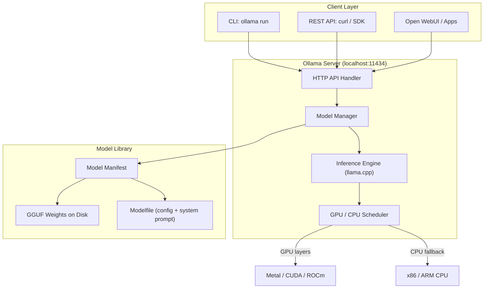
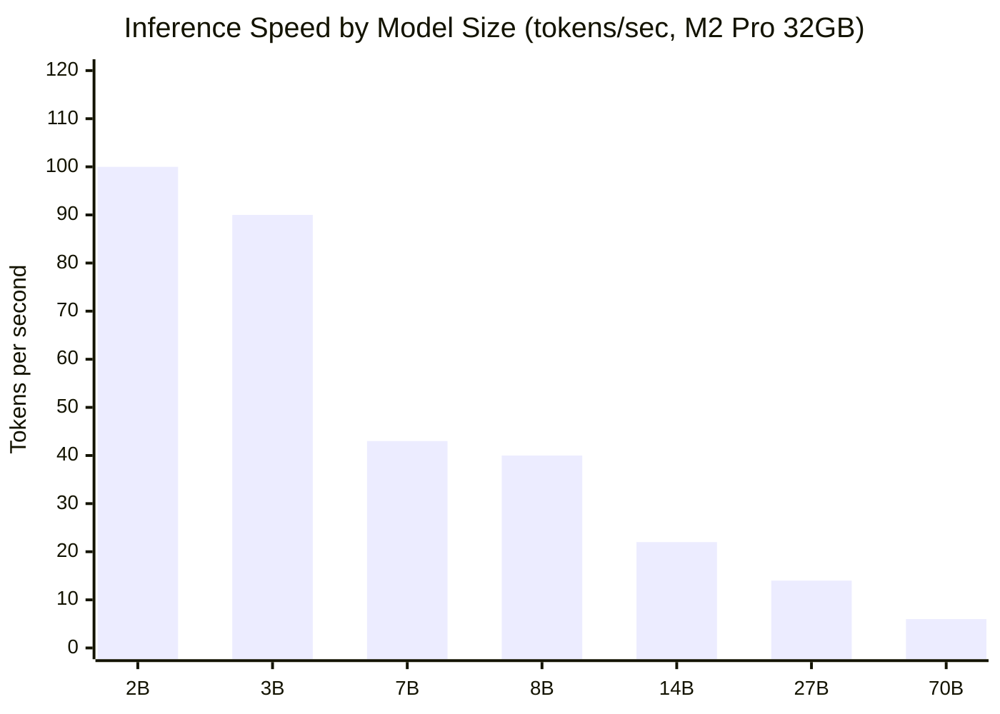
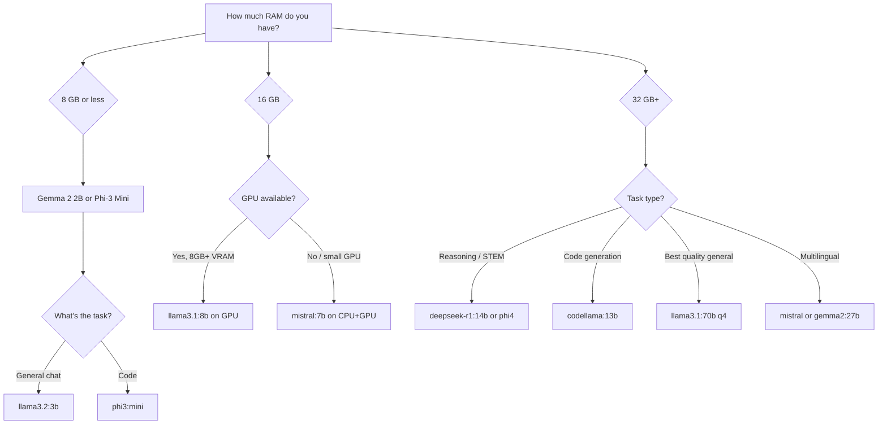

I spent most of last year paying cloud API bills I did not need to pay. Summarization tasks, code completion experiments, internal chatbots — the kind of work that does not require the latest frontier model and definitely does not require sending your codebase to a third-party server. Then I found Ollama, ran `ollama run llama3` on my M2 MacBook, and within sixty seconds I had a capable LLM answering questions with zero internet required. This is that complete tutorial.

If you want to run LLMs locally — whether for privacy, cost, latency, or plain curiosity — Ollama is the fastest path from zero to working model that exists today.

## What Is Ollama?

Ollama is an open-source tool that packages large language model inference into a single local server with a clean CLI and a REST API that mirrors the OpenAI API format. It handles model downloads, quantization, GPU detection, and memory management so that you do not have to.

The core promise is straightforward: one command to pull a model, one command to run it, and an API endpoint at `http://localhost:11434` that any application can call. There is no Python environment to configure, no CUDA driver dance, no Docker required (though it works in Docker if you want it to).

Ollama is not a model itself. It is the runtime that serves models. Think of it as a local equivalent to a model API provider — except the server runs on your laptop and the models cost nothing per token after the initial download.

The project is actively maintained, ships builds for Mac (Apple Silicon and Intel), Linux (x86-64 and ARM), and Windows, and has grown from a side project to one of the most-starred AI repositories on GitHub. As of early 2026, it supports over 100 models in its library.

## How Ollama Works: Architecture

Understanding the architecture helps you debug problems and tune performance. Ollama has three main layers that work together whenever you run a model:



The **Ollama server** runs as a background daemon and exposes an HTTP API. When you call `ollama run`, the CLI sends a request to this server. The server checks whether the model is already downloaded; if not, it pulls it from the Ollama model library (a registry hosted at `ollama.com`).

The **inference engine** underneath Ollama is `llama.cpp`, the battle-tested C++ LLM inference library. This is what handles the actual matrix multiplications. Ollama wraps it with sensible defaults and handles the platform-specific compilation so you never have to touch `cmake`.

The **GPU scheduler** detects available hardware — Apple Metal on Mac, CUDA on NVIDIA GPUs, ROCm on AMD GPUs — and offloads as many model layers to the GPU as VRAM allows. Any layers that do not fit land on CPU. This graceful degradation means the model runs on any machine; it just runs faster with a GPU.

## Installation

### Mac

```bash
brew install ollama
```

Or download the native app from [ollama.com/download](https://ollama.com/download). The Mac app adds a menu bar icon and starts the server automatically at login. On Apple Silicon, Metal acceleration is enabled by default — no extra configuration needed.

### Linux

```bash
curl -fsSL https://ollama.com/install.sh | sh
```

This one-liner downloads the binary, installs a systemd service, and starts the server. If you have NVIDIA drivers installed, CUDA support is detected automatically. For AMD GPUs, ROCm support is available but requires ROCm 6.x or later to be installed separately.

### Windows

Download the installer from [ollama.com/download](https://ollama.com/download) and run it. Ollama installs as a Windows service and is accessible from Command Prompt or PowerShell. WSL2 is not required. NVIDIA GPU acceleration works via CUDA; AMD GPU support on Windows is currently experimental.

### Verify the installation

```bash
ollama --version
```

If you see a version number, the CLI is installed. Start the server explicitly if needed:

```bash
ollama serve
```

On Mac and Windows the desktop app handles this automatically. On Linux the systemd service starts on boot.

## Running Your First Model

Pull and chat with Llama 3.2 (3B parameters, fast, fits on almost any machine):

```bash
ollama run llama3.2
```

Ollama downloads the model on the first run (about 2 GB for the 3B quantized version) and drops you into an interactive chat session. Type your message, press Enter, and the model responds. Type `/bye` to exit, or `Ctrl+D`.

For a one-shot query without the interactive session:

```bash
ollama run llama3.2 "Explain the difference between TCP and UDP in one paragraph."
```

That is the entire getting-started experience. No API key, no cloud account, no configuration file.

## Available Models

Ollama's model library covers every major open-weight model family. Here are the ones worth knowing in 2026:

**Llama 3 (Meta)** — The workhorse of the open-weight world. Available in 3B, 8B, and 70B sizes. The 8B model is a strong general-purpose choice for most hardware. Excellent instruction following and multilingual capability.

```bash
ollama pull llama3.2        # 3B — fastest
ollama pull llama3.1:8b     # 8B — best balance
ollama pull llama3.1:70b    # 70B — needs 48GB+ RAM
```

**Mistral (Mistral AI)** — The 7B model punches well above its weight. Particularly strong on European languages and structured output. The Mixtral 8x7B mixture-of-experts variant is available for machines with more headroom.

```bash
ollama pull mistral          # 7B — excellent quality/speed ratio
ollama pull mixtral          # 8x7B MoE — needs ~26GB RAM
```

**Gemma (Google DeepMind)** — Compact, well-aligned models in 2B and 7B sizes. Gemma 2 (available in 9B and 27B) delivered a significant quality jump. Good for summarization and Q&A tasks.

```bash
ollama pull gemma2:2b        # 2B — runs on anything
ollama pull gemma2:9b        # 9B — strong all-rounder
```

**DeepSeek** — The model that surprised everyone in early 2025. DeepSeek-R1 is a reasoning-focused model that rivals GPT-4o on math and code problems. Available distilled to 7B and 14B for local use.

```bash
ollama pull deepseek-r1:7b   # Reasoning distill — great for STEM
ollama pull deepseek-r1:14b  # More capable, needs ~10GB RAM
```

**Phi-3 / Phi-4 (Microsoft)** — Small models with remarkable capability relative to their size. Phi-4 at 14B beats many larger models on reasoning benchmarks. Best choice when RAM is the hard constraint.

```bash
ollama pull phi4             # 14B — punches above its weight
ollama pull phi3:mini        # 3.8B — impressive for its size
```

**CodeLlama (Meta)** — Fine-tuned specifically for code generation and completion. Available in 7B, 13B, and 34B. The 7B version handles most coding tasks well and generates tokens quickly on consumer hardware.

```bash
ollama pull codellama        # 7B — fast code generation
ollama pull codellama:13b    # 13B — better for complex tasks
```

## Model Comparison

| Model | Size | RAM Required | Speed (M2 Pro) | Best For |
|---|---|---|---|---|
| Phi-3 Mini | 3.8B | ~3 GB | ~80 tok/s | Quick tasks, low RAM |
| Gemma 2 2B | 2B | ~2 GB | ~100 tok/s | Summarization |
| Llama 3.2 3B | 3B | ~2.5 GB | ~90 tok/s | General chat |
| Mistral 7B | 7B | ~5 GB | ~45 tok/s | Multilingual, structured output |
| Llama 3.1 8B | 8B | ~6 GB | ~40 tok/s | Best overall at 8B |
| DeepSeek-R1 7B | 7B | ~5 GB | ~40 tok/s | Reasoning and math |
| CodeLlama 7B | 7B | ~5 GB | ~45 tok/s | Code completion |
| Phi-4 14B | 14B | ~10 GB | ~22 tok/s | Strong reasoning, mid hardware |
| Gemma 2 9B | 9B | ~7 GB | ~30 tok/s | High-quality output |
| Mixtral 8x7B | 47B | ~26 GB | ~12 tok/s | Near-frontier quality |
| Llama 3.1 70B | 70B | ~48 GB | ~6 tok/s | Maximum open-weight quality |

RAM requirements are approximate for Q4 quantization (the Ollama default). Speed measurements are on an Apple M2 Pro with 32GB unified memory. Windows and Linux with NVIDIA GPUs will vary based on VRAM available for GPU offloading.

## Performance by Model Size

The relationship between model size and inference speed follows a predictable curve on local hardware. Here is how the main model tiers compare in tokens per second on typical consumer hardware:



The practical breakpoint for interactive use is around 15-20 tokens per second. Below that, responses feel sluggish in a real-time chat interface. For batch processing or background tasks, raw speed matters less than output quality. A 70B model running at 6 tok/s on CPU-heavy hardware is still useful for overnight batch jobs — just not for live conversations.

## Advanced Usage

### Custom Modelfiles

A Modelfile is Ollama's way to customize a model with a system prompt, temperature, context length, or a fine-tuned base. Create a file named `Modelfile`:

```dockerfile
FROM llama3.1:8b

PARAMETER temperature 0.3
PARAMETER num_ctx 8192

SYSTEM """
You are a senior software engineer who reviews code for correctness, security, and maintainability.
Be concise. Identify issues clearly. Suggest specific fixes.
"""
```

Build and run it:

```bash
ollama create code-reviewer -f Modelfile
ollama run code-reviewer
```

This creates a named model variant you can call from the CLI or API. The Modelfile approach is how you build specialized assistants without fine-tuning — just a base model with a tight system prompt and tuned parameters.

### REST API

Ollama exposes an OpenAI-compatible API at `http://localhost:11434`. You can call it directly:

```bash
curl http://localhost:11434/api/generate \
  -d '{
    "model": "llama3.1:8b",
    "prompt": "What is gradient descent?",
    "stream": false
  }'
```

Or use it as an OpenAI drop-in replacement with the `/v1/chat/completions` endpoint:

```bash
curl http://localhost:11434/v1/chat/completions \
  -H "Content-Type: application/json" \
  -d '{
    "model": "llama3.1:8b",
    "messages": [{"role": "user", "content": "Write a Python quicksort."}]
  }'
```

This means any application or library that targets the OpenAI API can point to `localhost:11434` and use local models with zero code changes. LangChain, LlamaIndex, and most AI frameworks have Ollama integrations or work via the OpenAI-compatible endpoint.

### GPU Acceleration

Ollama automatically detects and uses available GPUs. To verify it is using your GPU:

```bash
ollama run llama3.1:8b
# In another terminal:
ollama ps
```

The output shows which model is loaded and how many layers are on GPU vs CPU. To force CPU-only (sometimes useful for debugging):

```bash
OLLAMA_NUM_GPU=0 ollama run llama3.1:8b
```

On NVIDIA hardware, increase the number of GPU layers for better performance:

```bash
OLLAMA_NUM_GPU=999 ollama run llama3.1:8b
```

Setting this to a high number tells Ollama to push as many layers as possible to the GPU (it caps at the model's actual layer count). The default is usually optimal, but if you have excess VRAM, this can help.

### Running Models in the Background

For applications and scripts, use the API rather than the interactive CLI. Start the server, then POST to it from your code. In Python with the `ollama` package:

```python
import ollama

response = ollama.chat(
    model='llama3.1:8b',
    messages=[{'role': 'user', 'content': 'Summarize this in 3 bullet points: ...'}]
)
print(response['message']['content'])
```

The Python library handles connection management and streaming automatically.

## Ollama + Open WebUI

Open WebUI is a self-hosted chat interface that connects to Ollama and provides a ChatGPT-style experience in your browser. It is the fastest way to give non-technical users access to your local models.

Install it with Docker (one command):

```bash
docker run -d -p 3000:80 \
  --add-host=host.docker.internal:host-gateway \
  -v open-webui:/app/backend/data \
  --name open-webui \
  ghcr.io/open-webui/open-webui:main
```

Open `http://localhost:3000`. Open WebUI auto-detects Ollama at `host.docker.internal:11434` and lists all your downloaded models in a dropdown. You get conversation history, system prompt customization, model switching, and basic RAG functionality — all running locally.

If you do not want Docker, Open WebUI also ships as a Python package (`pip install open-webui`), though Docker is the cleaner setup for most people.

This combination — Ollama + Open WebUI — is what I use for internal tooling where sending data to a cloud API is not acceptable. The setup takes about ten minutes and the result is a local AI assistant that costs nothing to run.

## Ollama vs LM Studio vs GPT4All

Three tools dominate the "run LLMs locally" space. Here is how they compare:

| Feature | Ollama | LM Studio | GPT4All |
|---|---|---|---|
| Interface | CLI + REST API | Desktop GUI | Desktop GUI |
| API compatibility | OpenAI-compatible REST | OpenAI-compatible REST | Limited |
| Headless / server use | Excellent | Limited | Poor |
| Developer workflow | CLI-first, scriptable | Click-to-run | Click-to-run |
| Model library | 100+ via registry | HuggingFace browse | Curated set |
| Windows support | Yes | Yes | Yes |
| Mac support | Yes (M-series optimized) | Yes | Yes |
| Linux support | Yes | Limited | Yes |
| GPU support | Metal, CUDA, ROCm | CUDA, Metal | CUDA, Metal |
| Docker friendly | Yes | No | No |
| Open source | Yes | Partial | Yes |
| Best for | Developers, servers, CI | Non-technical users | Beginners |

**Ollama** wins for developer use because it is API-first. It fits naturally into scripts, applications, and automated pipelines. If you can use the CLI and understand REST APIs, Ollama is the right choice.

**LM Studio** wins for users who want a visual model browser, a built-in chat interface, and do not want to touch a terminal. It is also strong for quickly comparing model outputs side by side in a GUI.

**GPT4All** targets non-technical users who want a self-contained desktop app. The model selection is more curated (smaller but vetted), and the setup is the simplest of the three. It is less extensible and harder to integrate into code.

For most developers reading this, Ollama is the answer. For someone who does not write code and just wants a private ChatGPT alternative, LM Studio or GPT4All will be less frustrating.

## Hardware Requirements

Local LLM performance depends almost entirely on how much the model fits into fast memory. The key insight: any memory that the model has to read from slow storage (disk) or system RAM (instead of GPU VRAM or Apple unified memory) causes a proportional slowdown.

**Minimum to run something useful:**
- 8 GB RAM: Runs 3B–4B models at 50–100 tok/s (Mac), slower on Windows/Linux without GPU
- 16 GB RAM: Runs 7B–8B models comfortably; 13B models slowly
- 32 GB RAM: Runs 13B–14B models well; 70B models possible with quantization + patience

**For comfortable daily use:**
- Apple Silicon Mac (M-series): 16–32 GB unified memory. The M2 Pro 32GB is the sweet spot. Unified memory means the GPU sees the full RAM pool without a separate VRAM bottleneck.
- NVIDIA GPU: 12–24 GB VRAM covers 7B–13B models with layers mostly on GPU. The RTX 4090 (24 GB) handles quantized 70B with most layers offloaded.
- AMD GPU: ROCm support is solid on Linux with RX 7900 XTX (24 GB); Windows support is improving.

**CPU-only:** Any modern CPU (x86-64 or Apple Intel) can run Ollama, but speed will be 5–20 tok/s for 7B models — usable for batch tasks, painful for interactive chat.

## Which Model Should You Run?



Use this flowchart as a starting point, not a final answer. Download two or three candidates and run them on your actual use case for ten minutes each. Benchmark scores on papers do not always translate to the prompts you actually send. The model that sounds best in a tweet may not be the model that handles your specific task best.

## Verdict

Ollama is the best tool available today for running LLMs locally. The installation is trivial, the API is clean, the model library covers every major open-weight model, and the developer workflow — pull, run, call from code — maps directly onto how engineers actually build things.

I use it for three purposes: prototyping new AI features without paying API costs during development, running privacy-sensitive document processing locally, and self-hosting internal tools via Open WebUI. All three use cases would cost money or create compliance concerns with a cloud API. With Ollama, they run on hardware I already own.

The limitations are real. Local inference cannot match the latest frontier models (Claude 3.7, GPT-4.5, Gemini 2.0) on difficult reasoning tasks. Large models need substantial RAM and ideally a capable GPU. If you need the absolute best model quality and are not constrained by privacy or cost, a cloud API is the right answer.

But for a growing category of tasks — internal tooling, development experimentation, privacy-sensitive workflows, air-gapped environments, or simply wanting to understand how these models work — Ollama removes every obstacle between you and a running LLM.

**Rating: 9 / 10**

Run `ollama run llama3.1:8b` right now. You will have a useful local LLM in under three minutes.

## FAQ

### Does Ollama work without an internet connection after setup?

Yes. Once a model is downloaded, Ollama runs entirely offline. The model weights are stored locally (by default in `~/.ollama/models`). The only time internet is needed is to pull new models or updates. This is one of the main reasons teams use Ollama for sensitive data processing.

### How much disk space do the models use?

Models range from about 1.5 GB (Gemma 2B) to 40 GB (Llama 3.1 70B quantized). A practical setup with three or four 7B–8B models uses around 20–25 GB. You can free space with `ollama rm modelname`. Store models on an SSD — HDD speeds create a significant startup delay when loading model weights into memory.

### Can I run multiple models simultaneously?

Yes, with limits. Ollama can serve multiple models, but each loaded model occupies RAM. If you have 32 GB of RAM and load two 8B models, that uses about 12 GB of RAM and leaves 20 GB for your OS and other applications. The server handles concurrency and will swap models if memory pressure is high. For serving multiple users simultaneously, deploy Ollama on a machine with enough RAM to keep your most-used model loaded permanently.

### Is Ollama suitable for production deployments?

Ollama works well for internal production deployments — private APIs, team tools, pipelines on your own infrastructure. It is not designed as a high-throughput public API server. For high-concurrency production use (hundreds of simultaneous requests), look at vLLM or TGI (Text Generation Inference) which are purpose-built for throughput. Ollama's sweet spot is single-user or low-concurrency applications where simplicity of operation matters more than peak throughput.

### How do I update models when new versions are released?

```bash
ollama pull llama3.1:8b
```

Running `pull` again for an existing model downloads only the changed layers (similar to Docker layers). Ollama checks the manifest and skips anything already cached. Major version updates (e.g., moving from Llama 3 to a hypothetical Llama 4) will be a full download. You can pin a specific version using the tag syntax: `ollama pull llama3.1:8b-instruct-q4_K_M`.
