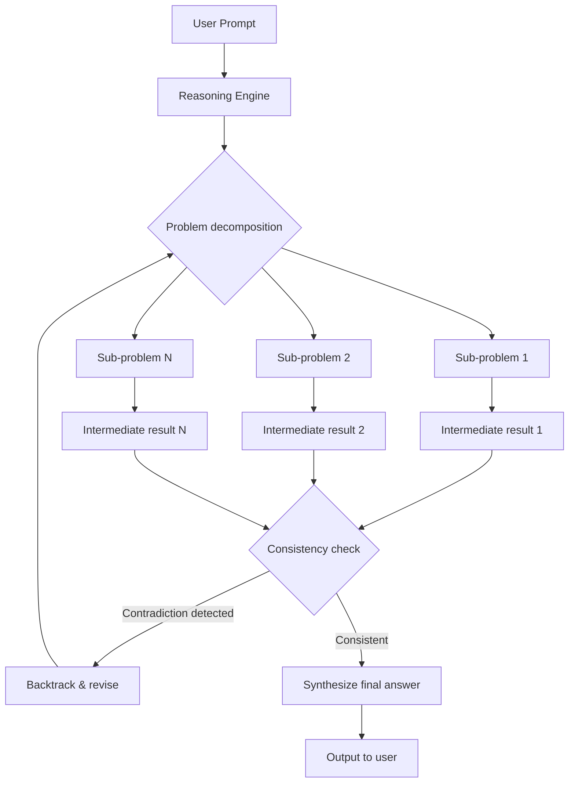
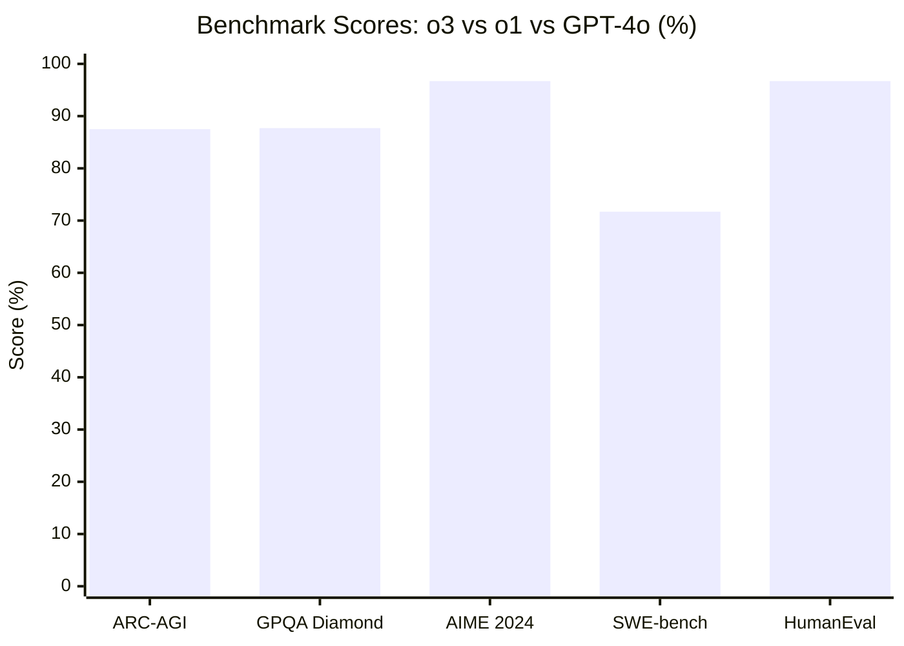
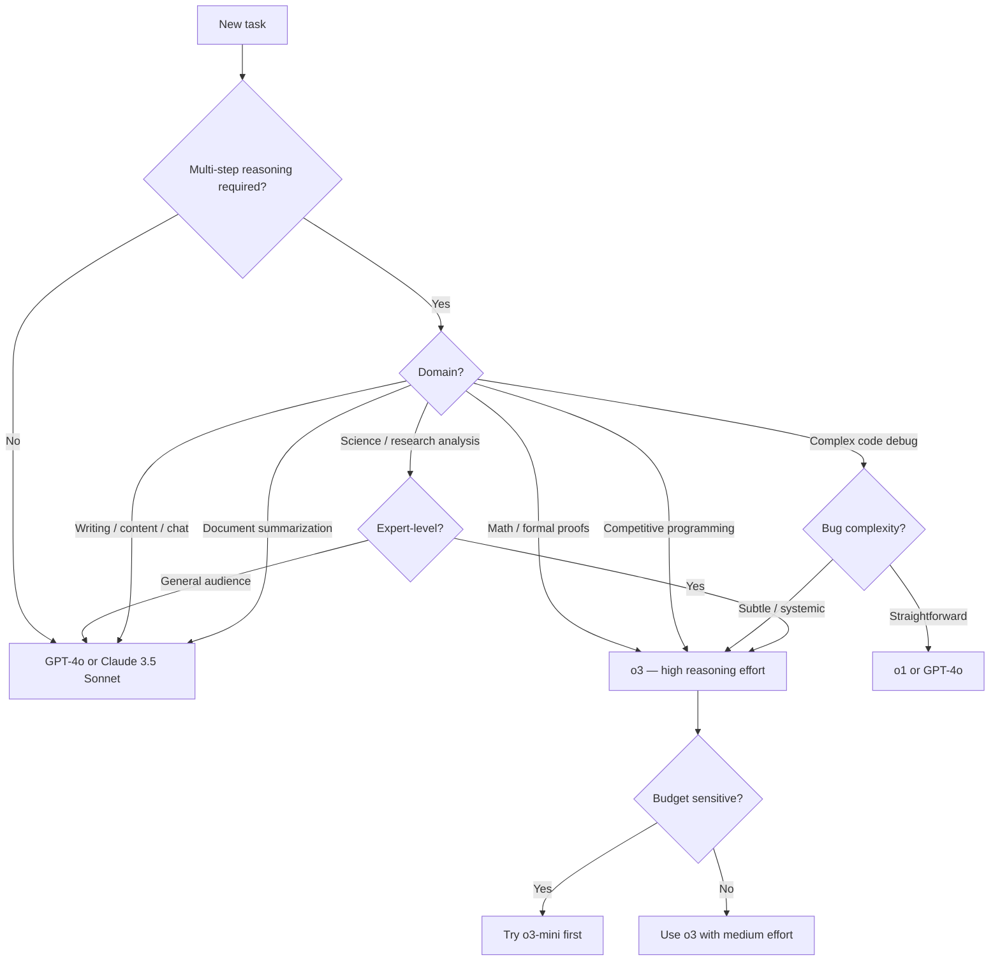

When OpenAI released o3, the AI benchmarking community had a brief moment of collective confusion. A model that scores 87.5% on ARC-AGI — a test that was specifically designed to be hard for AI systems — changes the baseline for what "capable" means. Before o3, the best scores on ARC-AGI were hovering around 34%. After o3, the conversation shifted.

I've been running o3 through real developer tasks for several weeks: code review, mathematical proofs, competitive programming problems, and the kind of multi-step reasoning tasks that trip up faster models. This is what I found — the actual benchmarks, how the reasoning pipeline works, pricing reality, and the honest cases where you shouldn't use it.

---

## What Is o3?

o3 is OpenAI's third-generation reasoning model, released in early 2025. It's part of the "o-series" — a separate model family from GPT-4o that's specifically designed around extended chain-of-thought computation rather than fast, single-pass response generation.

The core idea: instead of producing an answer in one forward pass through the model, o3 generates an internal reasoning trace before producing its final output. This reasoning happens behind the scenes — you don't see the scratch work, you only see the result — but it's real computation that the model uses to check its own steps, catch errors, and reconsider approaches.

This is meaningfully different from prompt-level chain-of-thought, where you write "think step by step" in your system prompt and hope the model externalizes useful reasoning. o3's reasoning is architectural — baked into how the model is trained and how it processes requests.

The result is a model that trades speed and cost for accuracy on tasks that require multi-step reasoning. For most casual queries, this tradeoff is a bad deal. For hard math, complex code analysis, and problems where one wrong intermediate step breaks the entire answer, the tradeoff pays off.

---

## How Chain-of-Thought Reasoning Works in o3

Standard language models — GPT-4o, Claude 3.5 Sonnet, Gemini 1.5 Pro — generate tokens in a single left-to-right pass. Each token is conditioned on the previous tokens, and the model doesn't revisit earlier decisions once they're made. This is fast and cheap, and it works well for the vast majority of tasks.

The failure mode shows up on tasks that require backtracking. If the model makes an incorrect assumption in step two of a five-step reasoning chain, it has no mechanism to detect and correct that error. The wrong assumption propagates forward, and the final answer is wrong even if every subsequent step was logically valid given the flawed premise.

o3 addresses this by generating reasoning tokens as an intermediate step. The model produces a chain of reasoning — sometimes thousands of tokens long — before committing to a final answer. Critically, that reasoning process can include self-correction: the model can recognize a wrong turn, backtrack, and try a different approach. The compute spent on reasoning is what makes the model more reliable on hard problems.

The reasoning tokens are not shown to you by default — they're consumed internally and billed at a lower rate than output tokens. The compute budget for reasoning scales with problem difficulty, which is why o3 has a "reasoning effort" parameter (low, medium, high) that controls how much internal thinking the model does before answering.

---

## Benchmark Performance

o3's benchmark numbers are the reason it attracted so much attention. Here's what the model achieves on the tests that matter for developers and researchers.

**ARC-AGI (Abstraction and Reasoning Corpus):** o3 scored 87.5% at high compute. For context, GPT-4 scored around 34%, and human baseline is approximately 85%. This is the benchmark that made people stop and pay attention.

**GPQA Diamond (Graduate-Level Reasoning):** o3 scored 87.7% on GPQA Diamond — a set of graduate-level science and math problems written by domain experts to be difficult even for PhDs in adjacent fields. GPT-4o scores around 53% on the same benchmark.

**AIME 2024 (Mathematical Competition):** o3 solved 96.7% of problems from the 2024 American Invitational Mathematics Examination. This is a competition that the average MIT math undergrad would struggle with. o1 scored 83.3% on the same test.

**SWE-bench Verified (Real-World Code Bugs):** o3 achieved 71.7% on SWE-bench Verified, which tests the model's ability to resolve actual GitHub issues from real software repositories. Claude 3.5 Sonnet scores around 49% on the same benchmark.

**Codeforces (Competitive Programming):** o3 reached an Elo rating of approximately 2727 on Codeforces problems — equivalent to the 99.8th percentile of competitive programmers. GPT-4o sits around the 1200 Elo range.

These are real numbers from OpenAI's technical report and independent evaluations. They're also cherry-picked to show o3's strengths — on tasks that don't require deep reasoning, the gap between o3 and GPT-4o narrows considerably. The benchmark story is "best reasoning model available," not "best model at everything."

---

## o3 vs o1 vs GPT-4o

| Feature | GPT-4o | o1 | o3 |
|---|---|---|---|
| **Primary use case** | General purpose | Hard reasoning | Complex reasoning |
| **API input price** | $2.50/1M tokens | $15.00/1M tokens | $10.00/1M tokens |
| **API output price** | $10.00/1M tokens | $60.00/1M tokens | $40.00/1M tokens |
| **Reasoning tokens** | None | Yes (hidden) | Yes (hidden) |
| **ARC-AGI score** | ~34% | ~32% | 87.5% |
| **GPQA Diamond** | ~53% | ~78% | 87.7% |
| **AIME 2024** | ~13% | 83.3% | 96.7% |
| **Latency** | Fast | Slow | Very slow |
| **Context window** | 128K | 200K | 200K |
| **Vision support** | Yes | No | Yes |
| **Function calling** | Yes | Yes | Yes |

The most interesting comparison is o3 vs o1. o3 is roughly 33% cheaper than o1 on input tokens while substantially outperforming it across every major benchmark. If you're currently using o1 for hard reasoning tasks, o3 is the straightforward upgrade.

The GPT-4o vs o3 comparison depends entirely on what you're doing. For conversational AI, content generation, summarization, or any task where first-pass accuracy is sufficient, GPT-4o is dramatically cheaper and fast enough that the wait matters. The 4x price difference is real money at scale.

---

## API Access and Pricing

o3 is available through the OpenAI API for tier 3 and above users. As of March 2026, pricing is:

- **Input tokens:** $10.00 per 1M tokens
- **Output tokens:** $40.00 per 1M tokens
- **Reasoning tokens (internal):** $10.00 per 1M tokens (billed at the same rate as input)

The reasoning token cost is the hidden variable that catches people. When you set reasoning effort to "high" on a complex problem, o3 may generate 5,000–15,000 reasoning tokens internally before producing a 500-token response. You pay for those reasoning tokens at $10/1M, so your effective cost per query can be 10-20x higher than the visible output token count suggests.

The `reasoning_effort` parameter (low / medium / high) controls how much compute the model allocates to internal reasoning. For simpler problems, "low" is adequate and much cheaper. For competition-level math or complex debugging, "high" is where the benchmark numbers come from. I'd recommend profiling your actual usage before assuming high effort is always needed — you'll often find medium effort gets you 90% of the quality at 60% of the cost.

o3-mini is also available at a lower price point: $1.10/1M input, $4.40/1M output. It's not a trimmed-down o3 so much as a model in the o-series with smaller capacity but strong math and coding performance. For cost-sensitive applications that primarily need reasoning on focused technical tasks, o3-mini is worth evaluating first.

---

## Real-World Testing

I ran o3 through a battery of practical tests across the areas where reasoning models are supposed to shine. Here's what actually happened.

**Mathematical proofs:** I gave o3 a set of real analysis problems from a graduate-level problem set — epsilon-delta proofs, convergence arguments, and a couple of measure theory questions. o3 got all of them right, with clear proof structure and correct application of theorems. GPT-4o got roughly half right, making subtle errors in the convergence arguments. o1 got most right but made one algebra error that invalidated a proof.

**Complex code debugging:** I provided o3 with a 300-line Python codebase containing two intentional bugs — one a race condition in an async function, one a subtle off-by-one error in a binary search implementation. o3 identified both bugs with precise explanations of why each was wrong. GPT-4o found one of the two. The race condition was invisible to it.

**Competitive programming:** I ran five Codeforces Division 1 problems (rated 2000-2400). o3 solved four of the five correctly on first attempt. The fifth it approached correctly but made an implementation error. GPT-4o solved two of the five.

**Long-form document reasoning:** I gave o3 a 40-page technical specification and asked it to identify internal contradictions. It found three genuine contradictions in the spec — two of which I had intentionally planted and one that was an actual oversight in the document. GPT-4o found one of the planted contradictions and missed the other two.

**Trick questions and adversarial inputs:** This is where o3's reasoning sometimes works against it. I gave it a simple arithmetic problem phrased in a slightly unusual way. o3 produced a 2,000-token reasoning trace exploring edge cases before arriving at the trivially correct answer. The overthinking is real — for simple problems, o3 is both slower and more expensive than necessary, and the extended reasoning doesn't always add accuracy.

---

## When to Use o3 (vs Standard Models)

The decision isn't always obvious. Here's a practical framework:

The practical heuristic: if a task requires you to hold multiple constraints in working memory simultaneously, catch errors in intermediate steps, or reason about abstract formal structures (proofs, algorithms, formal specifications), o3 is the right tool. If the task is primarily about language quality, retrieval, or first-pass generation, you're paying 4-8x premium for minimal benefit.

**Use o3 for:**
- Competition-level math and formal proofs
- Identifying subtle bugs in complex codebases
- Analyzing formal specifications for logical consistency
- Competitive programming problems
- Multi-step quantitative reasoning where errors compound

**Use GPT-4o or Claude 3.5 Sonnet for:**
- Content generation, summarization, and editing
- Customer-facing conversational AI
- Code generation from specifications (not debugging)
- High-volume workloads where cost matters
- Tasks where responses need to be fast

---

## Limitations

**Cost.** o3 is expensive. At $10/1M input and $40/1M output — plus reasoning tokens — a single complex query with high reasoning effort can cost $0.50-$2.00. At scale, this is not a general-purpose model budget. Build cost controls before you build features.

**Latency.** High-effort o3 queries regularly take 30-90 seconds. For interactive applications, this is often unacceptable. The model is not designed for conversational use — it's designed for batch tasks where accuracy matters more than speed. Build UX around async patterns if you're exposing o3 to end users.

**Overthinking simple problems.** The model doesn't always correctly calibrate reasoning effort to problem difficulty. Simple questions that could be answered in a single sentence sometimes trigger extended internal reasoning chains, adding latency and cost without adding accuracy. Setting `reasoning_effort: low` helps, but you need to know your task difficulty distribution ahead of time.

**Context limitations.** Although o3 has a 200K context window, the combination of long context and high reasoning effort compounds the cost problem significantly. Sending 50K tokens of context to o3 at high reasoning effort is a decision you want to make deliberately, not accidentally.

**No image generation.** o3 can process images as input (it supports vision), but it doesn't generate images. If your workflow involves both reasoning and image generation, you're combining APIs.

**Access restrictions.** o3 requires OpenAI API tier 3 or above. Teams on basic API access need to upgrade before they can use it.

---

## Verdict

o3 is the most capable reasoning model publicly available as of March 2026. The benchmark numbers aren't marketing — the ARC-AGI score, the GPQA results, and the Codeforces Elo are genuine improvements over every previous model, including o1. For tasks that require the model to maintain logical consistency across many steps, catch its own errors, and reason through novel problems, o3 is in a different category from GPT-4o.

The catch is specificity. o3's advantages are real but narrow. They show up on hard math, formal reasoning, and complex debugging. They don't show up — or matter — on the kinds of tasks that make up most production AI workloads. Paying 4-8x the GPT-4o price for content generation, summarization, or routine code completion is not a justified tradeoff.

My recommendation: keep GPT-4o or Claude 3.5 Sonnet as your default. Add o3 as a specialized tool for the specific workflows where reasoning depth matters. Evaluate o3-mini first if you're cost-sensitive — it handles most reasoning tasks well at a fraction of the price. Set reasonable compute budgets, profile your reasoning token usage, and don't let o3 become your default model before you've confirmed the quality lift is worth the cost.

The reasoning model era is here. o3 is the best example of it. Use it for the right jobs.

---

## FAQ

### Is o3 the same as GPT-4o with better prompting?

No. The architectural difference is real. GPT-4o generates responses in a single forward pass; o3 generates internal reasoning tokens before producing output. You can't replicate o3's performance by telling GPT-4o to "think step by step" — the reasoning is happening at a different level than prompt-visible chain-of-thought.

### Should I switch from o1 to o3?

Almost certainly yes, if you're using o1 today. o3 outperforms o1 on every major benchmark while costing roughly 33% less on input tokens. The main exception is if your workflow depends on specific o1 API behavior or response formatting — test on your actual use case before migrating, but the expectation should be that o3 is a straight upgrade.

### What is the difference between o3 and o3-mini?

o3-mini is a smaller model in the o-series with stronger cost efficiency. It's particularly strong on math and coding reasoning tasks relative to its price ($1.10/$4.40 per 1M tokens vs $10/$40 for full o3). For most technical reasoning tasks outside competition-level difficulty, o3-mini gets you 80-90% of o3's quality at about 10% of the cost. Start with o3-mini and escalate to o3 only where the quality gap matters.

### Does o3 work for real-time applications?

Not well. High-effort queries can take 30-90 seconds, which is too slow for interactive user-facing features. o3 is better suited for background jobs, async batch processing, or workflows where the user expects to wait (research tools, code analysis platforms). If you need real-time response, use medium or low reasoning effort, or switch to GPT-4o.

### How do I control reasoning costs?

Use the `reasoning_effort` parameter: `low`, `medium`, or `high`. Start at `medium` for most tasks — it provides most of the quality benefit at substantially lower cost than `high`. Profile your actual reasoning token usage in the API response (`usage.completion_tokens_details.reasoning_tokens`) before scaling. Set explicit `max_completion_tokens` limits to prevent runaway costs on edge case inputs.
