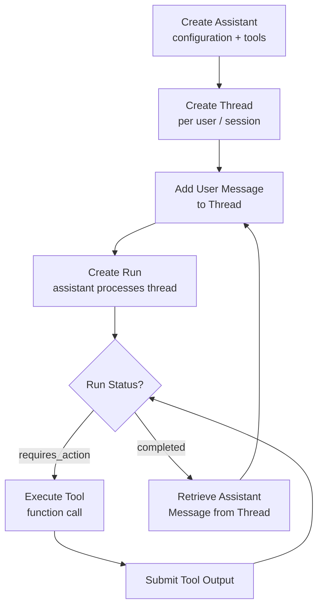
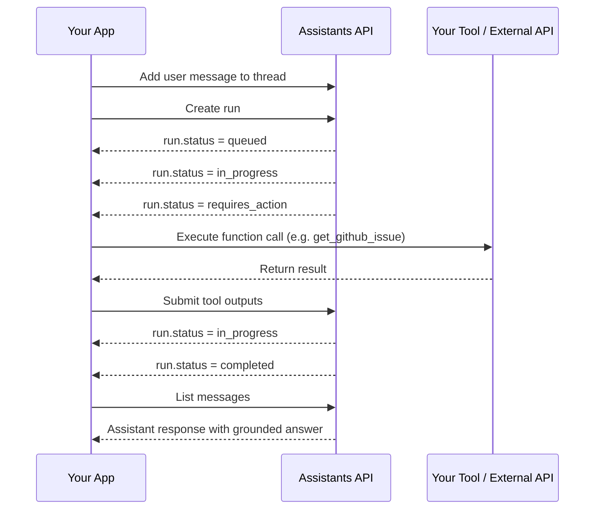
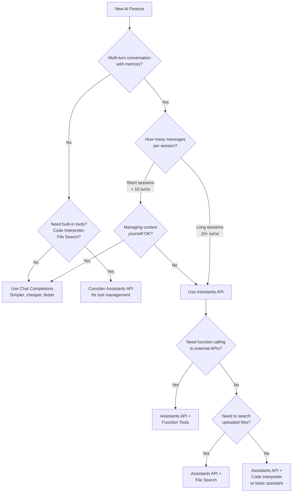

I've been building with OpenAI's Chat Completions API for years, and it works well — until you need state. The moment I tried to build a coding assistant that remembered previous files, tracked multi-turn debugging sessions, and executed code on demand, managing context manually became a full-time job. The Assistants API was built to solve exactly that problem.

This tutorial walks through everything I've learned about the OpenAI Assistants API: the core concepts, real working code, the built-in tools, streaming, file handling, and an honest assessment of where it shines versus where it falls short. If you want to build a custom AI assistant without reinventing thread management and tool orchestration from scratch, keep reading.

## What Is the OpenAI Assistants API?

The Assistants API is OpenAI's framework for building stateful, tool-using AI assistants. Unlike Chat Completions — where you send a complete list of messages every single request — the Assistants API manages conversation history server-side. You send a new message, trigger a run, and OpenAI handles the context window.

Beyond state management, the API ships three built-in tools out of the box:

- **Code Interpreter** — a sandboxed Python environment where the model can write and execute code, generate charts, and process data files.
- **File Search** — vector-store-backed semantic search over files you upload (PDFs, CSVs, code, docs).
- **Function Calling** — structured JSON tool calls that connect your assistant to any external API or database.

The result is a framework that handles the scaffolding most teams build themselves: conversation history, tool routing, retries on function calls, and file storage.

## Key Concepts

Before touching any code, it helps to understand the four objects the API revolves around.

### Assistants

An Assistant is a configured AI agent. You define its name, instructions (a system prompt), which model it uses, and which tools it can access. An assistant persists indefinitely — you create it once and reuse the same `assistant_id` across every conversation.

### Threads

A Thread is a conversation session. Each thread stores an ordered list of Messages. When you create a new user, session, or ticket, you create a new thread and store its `thread_id`. OpenAI manages the context window automatically, truncating older messages when needed so the run never exceeds the model's limit.

### Runs

A Run is the act of processing a thread with a specific assistant. When you trigger a run, OpenAI reads the thread's messages, applies the assistant's instructions and tools, and generates a response. A run goes through several statuses: `queued → in_progress → (requires_action) → completed`.

### Messages

Messages are the individual turns in a thread. They belong to either the `user` or `assistant` role. After a run completes, you retrieve the latest assistant message to get the response.



## Getting Started

Install the SDK and set your key:

```bash
pip install openai
export OPENAI_API_KEY="sk-..."
```

### Create an Assistant

```python
from openai import OpenAI

client = OpenAI()

assistant = client.beta.assistants.create(
    name="Dev Assistant",
    instructions=(
        "You are a senior software engineer. Help the user debug code, "
        "explain concepts clearly, and write production-quality Python. "
        "When you write code, always include type hints and docstrings."
    ),
    model="gpt-4o",
    tools=[{"type": "code_interpreter"}],
)

print(f"Assistant ID: {assistant.id}")
# Save this — reuse it instead of creating a new assistant each time
```

### Create a Thread and Send a Message

```python
# Start a new conversation thread
thread = client.beta.threads.create()

# Add the user's first message
client.beta.threads.messages.create(
    thread_id=thread.id,
    role="user",
    content="Write a Python function that finds all prime numbers up to n using the Sieve of Eratosthenes.",
)

# Run the assistant on this thread
run = client.beta.threads.runs.create(
    thread_id=thread.id,
    assistant_id=assistant.id,
)

print(f"Run status: {run.status}")  # queued
```

### Poll Until Complete

```python
import time

def wait_for_run(client, thread_id: str, run_id: str):
    """Poll a run until it reaches a terminal state."""
    while True:
        run = client.beta.threads.runs.retrieve(
            thread_id=thread_id,
            run_id=run_id,
        )
        if run.status in ("completed", "failed", "cancelled", "expired"):
            return run
        if run.status == "requires_action":
            return run  # Handle tool calls separately
        time.sleep(0.5)

run = wait_for_run(client, thread.id, run.id)
print(f"Final status: {run.status}")

# Retrieve the assistant's response
messages = client.beta.threads.messages.list(
    thread_id=thread.id,
    order="desc",
    limit=1,
)
response_text = messages.data[0].content[0].text.value
print(response_text)
```

## Adding Tools

The Assistants API's real power comes from its built-in tools. Here's how I use each one.

### Code Interpreter

Code Interpreter runs Python in an isolated sandbox. The model can iterate — write code, see the output, fix errors — all within a single run. I use it for data analysis, chart generation, and any task where the answer depends on actual computation.

```python
# Assistant already has code_interpreter in its tools list
# Just ask it to do math, write code, or analyze a file

client.beta.threads.messages.create(
    thread_id=thread.id,
    role="user",
    content="Analyze the attached CSV and plot a bar chart of monthly revenue.",
)
# Attach a file — shown in the File Handling section below
```

### File Search

File Search lets the assistant semantically search uploaded documents. Under the hood, OpenAI chunks, embeds, and stores your files in a managed vector store. No separate embedding pipeline needed.

```python
# Upload a file
with open("product_docs.pdf", "rb") as f:
    uploaded_file = client.files.create(file=f, purpose="assistants")

# Create a vector store and attach the file
vector_store = client.beta.vector_stores.create(name="Product Docs")
client.beta.vector_stores.files.create(
    vector_store_id=vector_store.id,
    file_id=uploaded_file.id,
)

# Update assistant to use file search + attach the vector store
client.beta.assistants.update(
    assistant_id=assistant.id,
    tools=[{"type": "file_search"}],
    tool_resources={
        "file_search": {"vector_store_ids": [vector_store.id]}
    },
)

# Now ask questions grounded in the document
client.beta.threads.messages.create(
    thread_id=thread.id,
    role="user",
    content="What is the refund policy according to our product docs?",
)
```

### Function Calling

Function calling connects your assistant to external systems — databases, APIs, CRMs, anything. You define the function schema, the model decides when to call it, and you execute the actual logic.

```python
import json

# Define your function schema
tools = [
    {
        "type": "function",
        "function": {
            "name": "get_github_issue",
            "description": "Fetch details of a GitHub issue by number.",
            "parameters": {
                "type": "object",
                "properties": {
                    "repo": {
                        "type": "string",
                        "description": "Owner/repo, e.g. 'openai/openai-python'",
                    },
                    "issue_number": {
                        "type": "integer",
                        "description": "The issue number to fetch.",
                    },
                },
                "required": ["repo", "issue_number"],
            },
        },
    }
]

# Update assistant with the function tool
client.beta.assistants.update(
    assistant_id=assistant.id,
    tools=tools,
)

def get_github_issue(repo: str, issue_number: int) -> dict:
    """Your actual implementation — call the GitHub API here."""
    # In production: requests.get(f"https://api.github.com/repos/{repo}/issues/{issue_number}")
    return {"title": "Fix streaming timeout", "state": "open", "body": "..."}

def handle_requires_action(run, thread_id: str) -> str:
    """Process tool calls and submit outputs."""
    tool_calls = run.required_action.submit_tool_outputs.tool_calls
    tool_outputs = []

    for tool_call in tool_calls:
        args = json.loads(tool_call.function.arguments)
        if tool_call.function.name == "get_github_issue":
            result = get_github_issue(**args)
        else:
            result = {"error": "Unknown function"}

        tool_outputs.append({
            "tool_call_id": tool_call.id,
            "output": json.dumps(result),
        })

    # Submit all outputs and get updated run
    updated_run = client.beta.threads.runs.submit_tool_outputs(
        thread_id=thread_id,
        run_id=run.id,
        tool_outputs=tool_outputs,
    )
    return updated_run
```



## Streaming Runs

Polling is fine for development, but in production I always stream. Streaming delivers tokens as they generate, which feels snappy to users and lets you handle tool call events in real time.

```python
def stream_run(client, thread_id: str, assistant_id: str):
    """Stream a run and print tokens as they arrive."""
    with client.beta.threads.runs.stream(
        thread_id=thread_id,
        assistant_id=assistant_id,
    ) as stream:
        for event in stream:
            event_type = event.event

            # Print text tokens as they stream
            if event_type == "thread.message.delta":
                for block in event.data.delta.content or []:
                    if block.type == "text" and block.text.value:
                        print(block.text.value, end="", flush=True)

            # Handle tool calls mid-stream
            elif event_type == "thread.run.requires_action":
                run = event.data
                updated_run = handle_requires_action(run, thread_id)
                # After submitting outputs, streaming resumes automatically
                # when using the stream context manager

            elif event_type == "thread.run.completed":
                print()  # newline after streamed response
                break

            elif event_type in ("thread.run.failed", "thread.run.cancelled"):
                print(f"\nRun ended: {event_type}")
                break
```

## File Handling

Code Interpreter can both read files you upload and produce files (charts, processed CSVs) as output. Here's the full pattern I use for data analysis workflows:

```python
# Upload an input file for Code Interpreter
with open("sales_data.csv", "rb") as f:
    data_file = client.files.create(file=f, purpose="assistants")

# Attach the file to the message (not the thread or assistant)
client.beta.threads.messages.create(
    thread_id=thread.id,
    role="user",
    content="Plot monthly revenue from this CSV as a line chart and save it.",
    attachments=[
        {
            "file_id": data_file.id,
            "tools": [{"type": "code_interpreter"}],
        }
    ],
)

# After run completes, check for generated image files
messages = client.beta.threads.messages.list(thread_id=thread.id, order="desc", limit=1)
for block in messages.data[0].content:
    if block.type == "image_file":
        file_id = block.image_file.file_id
        # Download the generated chart
        image_data = client.files.content(file_id)
        with open("revenue_chart.png", "wb") as out:
            out.write(image_data.read())
        print("Chart saved to revenue_chart.png")
```

## Assistants API vs Chat Completions: When to Use Which

The decision isn't always obvious. Here's the flowchart I use when starting a new project:



**Choose Chat Completions when:**
- You need a single-turn response (classify this text, translate this sentence)
- Your session is very short and you're comfortable managing a message list
- Latency is critical — Chat Completions has lower overhead
- You're building a high-volume API (cost per call matters more)

**Choose Assistants API when:**
- You're building a multi-turn assistant with real conversation history
- You need Code Interpreter for computation or charting
- You need to ground answers in uploaded documents via File Search
- You want OpenAI to manage function calling orchestration

## Pricing

The Assistants API doesn't add a separate fee on top of model costs — you pay for tokens consumed, just like Chat Completions. The wrinkle is the built-in tools:

| Feature | Cost (as of Q1 2026) |
|---|---|
| Model tokens | Same as Chat Completions (input/output per model) |
| Code Interpreter | $0.03 per session |
| File Search storage | $0.10 / GB / day (first 1 GB free) |
| Function calling | No extra fee — just token cost |

The Code Interpreter session fee adds up if you have thousands of short sessions. For pure function calling or file search use cases, the cost profile is nearly identical to raw Chat Completions.

I keep an eye on two things: thread storage costs (old threads with files accumulate) and Code Interpreter session counts in high-traffic apps. Prune old threads and files with the API if you're paying for storage you don't need.

## Limitations

The Assistants API is genuinely useful, but I've hit a few walls worth knowing about before you commit.

**Latency overhead.** Every run has startup overhead — OpenAI has to load thread context, tool configuration, and spin up the Code Interpreter sandbox if needed. For quick, single-turn tasks, Chat Completions is meaningfully faster.

**No custom memory architecture.** The API manages context automatically, which is convenient but opinionated. You can't plug in your own vector database for the thread history or customize the truncation strategy. For teams with existing RAG pipelines, this can feel limiting.

**Run duration limits.** Runs can time out on long Code Interpreter tasks. Very large files or complex computation may hit the limit. Design your tasks to complete in reasonable time or break them into smaller steps.

**Function calling requires polling or streaming.** The `requires_action` pattern means your server has to be reachable to handle tool calls mid-run. Serverless environments with short timeouts need careful design (streaming helps, but long tool executions still need robust handling).

**No real-time collaboration.** A thread is locked to one run at a time. You can't run two concurrent requests on the same thread, which limits certain multi-agent architectures.

## Verdict

The OpenAI Assistants API hits a real sweet spot for a specific class of application: multi-turn assistants that need to use tools, execute code, or search documents — without the team building that scaffolding themselves. If I'm prototyping a coding assistant, a document Q&A bot, or a data analysis agent, I reach for it immediately.

I don't use it for high-volume, single-turn workloads. The overhead isn't worth it there. And if my team already has a mature RAG pipeline and vector store, I'll often prefer Chat Completions with custom orchestration for the control it affords.

For most teams building their first real AI assistant, the Assistants API cuts weeks off the timeline. State management, tool orchestration, file storage, and Code Interpreter are solved problems from day one. That's a meaningful head start.

## FAQ

### Do I have to create a new assistant for every user?

No — and you shouldn't. Create one assistant (or a small set by role/persona) and reuse the same `assistant_id`. Create a new **thread** per user or session. The thread holds the user-specific conversation history; the assistant holds the shared configuration.

### How do I delete old threads and files to control storage costs?

Use the API directly: `client.beta.threads.delete(thread_id)` and `client.files.delete(file_id)`. Build a cleanup job that deletes threads and associated files older than your retention policy. For File Search vector stores, use `client.beta.vector_stores.delete(vector_store_id)`.

### Can I use the Assistants API with GPT-4o mini to save money?

Yes. Swap `model="gpt-4o-mini"` in your `client.beta.assistants.create()` call. GPT-4o mini supports all three tools (Code Interpreter, File Search, Function Calling). For tasks that don't require top-tier reasoning, the cost reduction is substantial — typically 15-20x cheaper per token.

### What happens if a run fails mid-function-call?

If your tool submission times out or throws an error, the run moves to `failed` status. You can inspect `run.last_error` for the reason. Implement retry logic in `handle_requires_action`: catch exceptions from your external API calls, log them, and submit an error message as the tool output so the assistant can respond gracefully instead of silently failing.

### Is the Assistants API production-ready in 2026?

Yes, with caveats. OpenAI has shipped it past beta and it powers production workloads across many teams. The main operational concerns are latency (predictable but higher than Chat Completions), idempotency (check run status before creating a duplicate), and storage hygiene (prune threads and files regularly). Build with those constraints in mind and it's solid.
