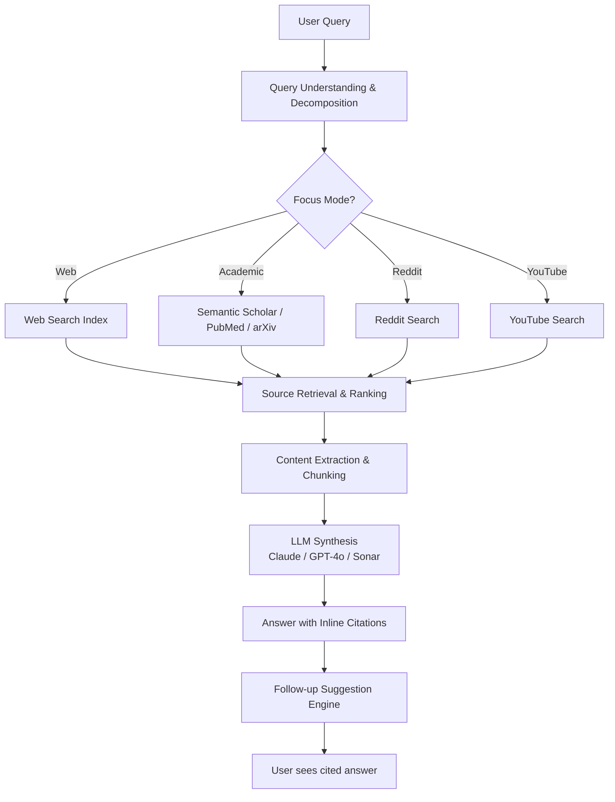
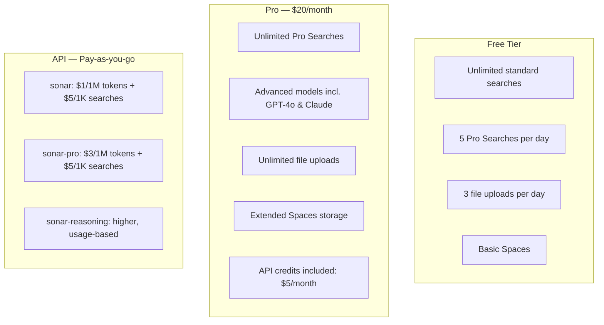
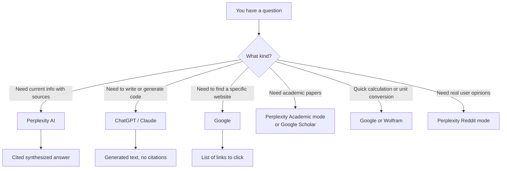

I used Google for research the same way for fifteen years. Then someone on my team slacked me a Perplexity link for a technical question and I followed the citations for twenty minutes without touching another tab. A week later I was paying $20 a month for the Pro tier. This review is my honest accounting of whether that money was well spent — and whether it would be for you.

## What Is Perplexity AI?

Perplexity AI is an answer engine that combines real-time web search with large language models to produce cited, conversational responses to questions. It is not a chatbot that searches the web as an afterthought. The search layer is the product. Every response surfaces numbered citations linking directly to the source pages, and the interface is built around following those citations rather than returning a list of links and leaving you to do the reading.

Founded in 2022 by Aravind Srinivas (ex-OpenAI, ex-DeepMind) and three co-founders, Perplexity raised roughly $500 million at a reported $9 billion valuation by early 2025. The product has grown from a niche developer tool to something used by researchers, journalists, and everyday people who are frustrated with search ads and SEO spam. By late 2025 the company reported over 100 million monthly active users.

The core promise is simple: ask a question, get an answer with traceable sources, follow up in conversation. In practice, getting that promise right requires a lot of moving parts to work together, and this review is about where those parts do and do not hold up.

## Key Features

### Cited Answers

The citation system is the feature that defines Perplexity. Every factual claim in a response is tagged with a bracketed number, and the source links appear inline below the answer. You can hover over a citation number to see a preview of the source content before clicking.

This sounds simple but it changes how you interact with AI-generated information. Instead of staring at a confident paragraph and wondering whether to trust it, you can spot-check specific claims in seconds. I have caught Perplexity misrepresenting a source maybe a handful of times across months of heavy use. That rate is low enough that I trust it on low-stakes research but still verify primary sources before anything consequential.

The citations also make Perplexity more useful than a chatbot for research tasks because you end up with a reference list automatically. Summarizing a technical topic for a team update used to mean opening eight tabs and manually noting URLs. With Perplexity the citations are already formatted and the summary is already done.

### Pro Search

Free-tier searches are fast but limited. Pro Search, available on the paid plan, runs a deeper research pass: Perplexity issues multiple sub-queries, synthesizes across more sources, and produces significantly longer, more structured answers. The difference is noticeable on complex technical questions.

For a question like "what are the current trade-offs between Apache Kafka and Redpanda for high-throughput event streaming at under 10ms p99 latency," a standard search returns a reasonable two-paragraph summary with five links. Pro Search returns a structured comparison covering architecture differences, benchmark data from multiple sources, cost considerations, and operational complexity — with fifteen to twenty citations. For technical decision-making, the depth is worth it.

Free users get five Pro Searches per day. Pro subscribers get unlimited.

### Focus Modes

Focus modes let you direct Perplexity's search to a specific source category:

- **Web** (default): crawls the open web
- **Academic**: searches Semantic Scholar, PubMed, arXiv, and similar academic databases
- **YouTube**: searches and summarizes video content
- **Reddit**: searches Reddit threads, useful for real-user opinions on products or experiences
- **Writing**: disables search entirely and uses the model as a pure writing assistant
- **Wolfram|Alpha**: routes math and data queries to Wolfram

The Academic mode is the one I use most often. For a literature review on a technical topic, it surfaces actual papers rather than blog posts summarizing papers. The citations link directly to abstracts and full PDFs where available. This does not replace proper academic research tools, but it is a fast first pass that would have taken me an hour in Google Scholar and a university library portal.

The Reddit mode is underrated. For "what do actual users think of [product X]" style questions, Reddit surfaces real opinions that Google's SEO-optimized results bury. I use it for research on software tools, hardware purchases, and anything where genuine user experience beats official documentation.

### Spaces and Collections

Spaces (formerly called Collections) let you create persistent research contexts. You can start a Space for a project — say, "competitor analysis for Q2" — add documents, URLs, and notes to it, and then ask questions that reference that accumulated context across multiple sessions. Perplexity searches both the web and your uploaded materials when you work in a Space.

This is the closest Perplexity gets to a research assistant rather than a search engine. For ongoing projects, the context persistence means you are not re-explaining your research scope every session.

### Perplexity API

Perplexity offers an API that gives programmatic access to its online LLM models — models that can search the web as part of their response generation. This is different from the standard LLM APIs (OpenAI, Anthropic) that work from training data only.

The API uses the `sonar` model family. As of early 2026:

- `sonar`: fast, lighter model with web search — $1 per 1M tokens plus $5 per 1,000 searches
- `sonar-pro`: more capable, deeper search — $3 per 1M tokens plus $5 per 1,000 searches
- `sonar-reasoning`: extended thinking before answering — higher cost, slower

The API is particularly useful for building applications that need up-to-date information without scraping or managing your own search infrastructure. Feed it a question about current events, recent pricing, or breaking news and you get a cited, synthesized answer as a structured API response. I have used it to add real-time research capabilities to internal tools at a fraction of the cost of building the equivalent retrieval pipeline from scratch.

## How Perplexity Works: Architecture Overview

Understanding the system helps explain both its strengths and its failure modes.

The key architectural insight is that the LLM is downstream of search, not the other way around. Most AI chatbots with search bolt web access onto a model trained to generate text. Perplexity's design puts retrieval first: the system searches, fetches and extracts content from pages, chunks it, and then passes that retrieved content to the LLM as context. The LLM's job is synthesis and citation, not knowledge recall.

This architecture is why Perplexity handles recent events better than ChatGPT, and why it can surface accurate information about things that happened last week. It also explains the primary failure mode: if the search index does not find good sources, or if the page content extraction fails (paywalled articles, JavaScript-heavy sites, PDF-only sources), the synthesis step has bad inputs and produces bad outputs.

## Pricing: Free vs Pro vs API

| Tier | Cost | Pro Searches | File Uploads | API Access |
|---|---|---|---|---|
| **Free** | $0 | 5/day | 3/day | No |
| **Pro** | $20/month | Unlimited | Unlimited | $5 credit included |
| **Enterprise** | Custom | Unlimited | Unlimited | Custom |
| **API only** | Pay-per-use | N/A | N/A | Yes |

The free tier is genuinely useful for casual search. You hit the five Pro Search daily limit quickly if you do any serious research, but for occasional lookups and standard web questions the free product is competitive with any other option available.

At $20/month, Pro is priced identically to ChatGPT Plus and Claude Pro. The question is not whether $20 is a lot — it is what you are trading it for. Perplexity Pro is optimized for research and information retrieval. It is not a coding assistant, a document writer, or a multi-modal creative tool. If that is the primary job you need done, $20/month is easy to justify. If you need a broader AI assistant, you might be better served by one of the other tiers.

The API pricing is competitive for applications that need real-time, cited search results. Building equivalent functionality with a general-purpose LLM plus your own search and extraction pipeline would cost significantly more in engineering time and often more in infrastructure.

## Real-World Use Cases

### Research and Synthesis

This is Perplexity's strongest suit. I use it as the first step for any topic I need to understand quickly. Ask a question, read the synthesized answer, follow two or three citations to verify the key claims, and then decide whether I need to go deeper. The time saved versus the traditional open-ten-tabs approach is substantial.

For competitive research — understanding what a product or company is doing, tracking recent announcements, summarizing industry trends — Perplexity is faster and more reliable than Google because it surfaces synthesized information rather than a list of links that may or may not be relevant.

One caveat: Perplexity is a research starting point, not a research endpoint. For anything where being wrong has real consequences — medical information, legal questions, financial decisions, anything you are about to publish — follow the citations and verify with primary sources.

### Coding and Technical Questions

Perplexity is not a coding assistant. It does not write long functions, it cannot run code, and it lacks the instruction-following precision of Claude or GPT-4o for complex programming tasks. But it is surprisingly useful for a specific category of technical question: anything where the answer depends on current library versions, recent API changes, or documentation that was updated in the last few months.

Ask Perplexity "what changed in the Next.js 15 App Router middleware API" and you get a current, cited answer. Ask ChatGPT (without browsing) the same question and you may get an answer based on training data that is several versions stale. For debugging issues caused by recent breaking changes, this currency is the whole value.

I use Perplexity for technical research and Claude or GPT-4o for code generation. They are complementary, not competing.

### Fact-Checking

The citation system makes Perplexity a reasonable first tool for fact-checking claims. Feed it a statement you are uncertain about and ask for evidence. The citations let you trace where the answer is coming from. If the sources are low-quality or the citations do not actually support the claim, that is usually visible.

It is not foolproof — Perplexity can confidently cite sources that partially support a claim while omitting important counterevidence. But compared to asking a model with no search, the transparency of citations at least gives you a path to verification rather than a black-box assertion.

## Perplexity vs Google vs ChatGPT

**Perplexity vs Google:** Google returns links; Perplexity returns answers with links. For navigational queries ("find the Stripe docs"), Google is faster. For research questions ("how does Stripe handle idempotency in webhook delivery"), Perplexity saves time by synthesizing the answer rather than making you read through five documentation pages yourself. The real comparison is when Google's results are dominated by SEO-optimized content that barely answers the question — this is where Perplexity's synthesis approach is a consistent improvement.

**Perplexity vs ChatGPT:** ChatGPT without browsing works from training data that has a knowledge cutoff. ChatGPT with browsing can search the web but the search is secondary to the model's language generation. Perplexity makes search primary, which means better currency and more consistent citation quality. ChatGPT's advantage is everything that is not search: writing, coding, creative tasks, multi-modal input, and richer conversation history management. These are genuinely different tools with meaningful overlap in the research tier.

**Where each wins:**

| Task | Best Tool |
|---|---|
| Recent news and events | Perplexity |
| Writing long documents | ChatGPT / Claude |
| Code generation | Claude / ChatGPT |
| Academic literature | Perplexity Academic |
| Finding a specific URL | Google |
| Real user opinions | Perplexity Reddit mode |
| Complex reasoning without search | Claude |
| Current pricing or specs | Perplexity |

## The Rough Edges

**Paywalled content.** Perplexity cannot read behind paywalls. For topics where the best sources are academic journals, financial news, or premium industry publications, the citations will often link to abstracts or preview pages rather than full content. The synthesis quality suffers accordingly. This is not unique to Perplexity — it is a fundamental limitation of any web-crawling approach — but it is worth being aware of.

**Hallucinated synthesis.** Occasionally Perplexity will state something with confidence that the linked citations do not fully support. This usually happens when the retrieved content is ambiguous and the model fills in the gap rather than flagging uncertainty. The rate is lower than uncited models, but it is not zero. Read the citations, not just the summary.

**Inconsistent source quality.** The algorithm does not always surface the best sources. For contested topics, it sometimes balances low-quality sources against high-quality ones as if they are equal. For technical topics, it occasionally prefers a Stack Overflow answer from 2019 over a more recent and authoritative source. The Academic focus mode helps here, but on standard web searches the source quality varies.

**No code execution.** Unlike ChatGPT with Code Interpreter, Perplexity cannot run code, analyze data files in any meaningful way, or iterate on a script. For data science work or anything that benefits from a sandboxed execution environment, Perplexity is not the right tool.

**Follow-up context decay.** Long conversations in Perplexity sometimes lose the thread of earlier context in a way that requires you to re-state your research topic. The product is optimized for question-and-answer pairs more than long, branching conversations. For deep research threads, I often start fresh sessions rather than trying to continue a conversation that has drifted.

**No image generation.** Perplexity is a text research tool. There is no image generation, no voice mode, no code interpreter. If you need those things, Perplexity is not an all-in-one replacement for ChatGPT Plus.

## Pros and Cons

**Pros**
- Cited answers you can verify — transparency that pure chat models lack
- Real-time web search means information is current
- Academic mode is excellent for literature research
- Reddit mode surfaces genuine user opinions that SEO results bury
- Pro Search depth is a meaningful step up for complex questions
- Clean, fast interface with no advertising
- API enables real-time, cited search in your own applications
- Spaces provide persistent research context across sessions

**Cons**
- Paywalled content is inaccessible, limiting depth on premium topics
- Not a coding assistant — no code execution, no long generation tasks
- Synthesis occasionally overstates what citations actually support
- Source quality on standard web search varies and is not always controllable
- Long conversations lose context and need periodic re-grounding
- No multimodal features (no image generation, voice, or code interpreter)
- $20/month Pro tier competes directly with Claude and ChatGPT for the same budget line

## Verdict

After months of daily use, Perplexity AI has earned a permanent place in my research workflow. It has not replaced Google — navigational searches still go there. It has not replaced Claude — anything involving writing or code generation still goes there. What it has replaced is the workflow of opening multiple tabs, reading through pages of search results, and manually synthesizing what I found.

For research, fact-checking, technical lookups, and staying current on fast-moving topics, Perplexity Pro is the best tool I have used. The citation system is not just a feature — it is the reason the product works at a level of trust that uncited AI outputs cannot reach. Being able to check where an answer comes from changes how much you can rely on it.

The rough edges are real. Paywalls, source quality variation, and the lack of coding or multimodal features mean this is a specialist tool, not an all-purpose AI assistant. If you need one AI subscription and you use it for writing, coding, and general conversation, Claude Pro or ChatGPT Plus is probably the better fit. If you do a lot of research, technical lookups, and want answers you can actually trace back to sources, Perplexity Pro is the right $20/month.

**Rating: 8.5 / 10** — excellent at what it does, worth the price if research is a regular part of your work.

---

## Frequently Asked Questions

### Is Perplexity AI free to use?

Yes. The free tier provides unlimited standard searches and five Pro Searches per day. For casual research use, the free tier is competitive with most alternatives. You hit the Pro Search limit quickly if you do heavy research — that is the primary push to the $20/month Pro tier.

### How accurate is Perplexity compared to Google?

For synthesized research answers, Perplexity is often more directly useful than Google because it reads and summarizes content rather than returning links. Its accuracy depends heavily on the quality of sources the search retrieves. The citation system lets you verify claims, which means errors are visible rather than hidden. For purely factual lookups against well-documented topics, accuracy is high. For niche, contested, or recent topics with limited coverage, verify primary sources regardless of what Perplexity returns.

### Can Perplexity replace ChatGPT or Claude?

For research and information retrieval: largely yes. For writing, coding, multi-modal tasks, and long creative generation: no. Perplexity is a research tool first. ChatGPT and Claude are generative AI assistants that happen to have search capabilities. They solve different primary problems and are genuinely complementary for people who do both kinds of work.

### Is Perplexity AI safe to use for sensitive research?

Perplexity collects usage data by default. If you are researching sensitive topics — medical, legal, financial, or competitive intelligence — check the current privacy policy and consider whether the convenience trade-off is appropriate for your situation. There is no private or incognito mode equivalent in Perplexity the way some browsers offer.

### What is the Perplexity API best used for?

The Perplexity API is most valuable for applications that need real-time, sourced answers as part of a larger workflow — internal research tools, automated competitive intelligence pipelines, customer-facing Q&A systems that need current information, or any application where you need LLM synthesis plus live web data without building your own retrieval infrastructure. At $1–$3 per million tokens plus search costs, it is cost-competitive for moderate usage and substantially cheaper than the engineering effort to replicate the search-plus-synthesis pipeline independently.
