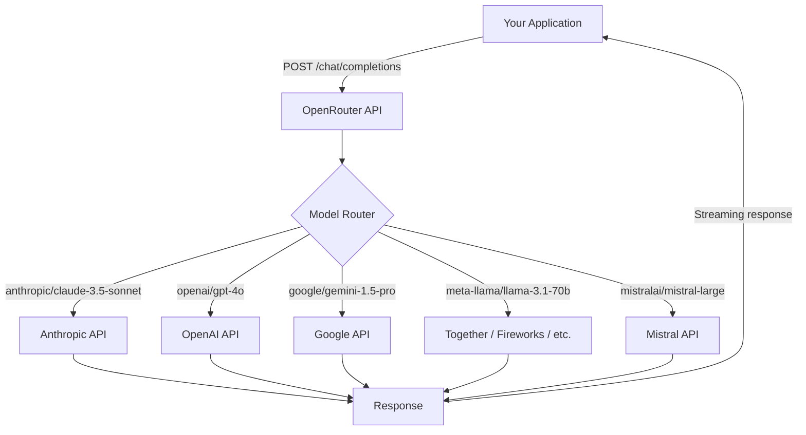
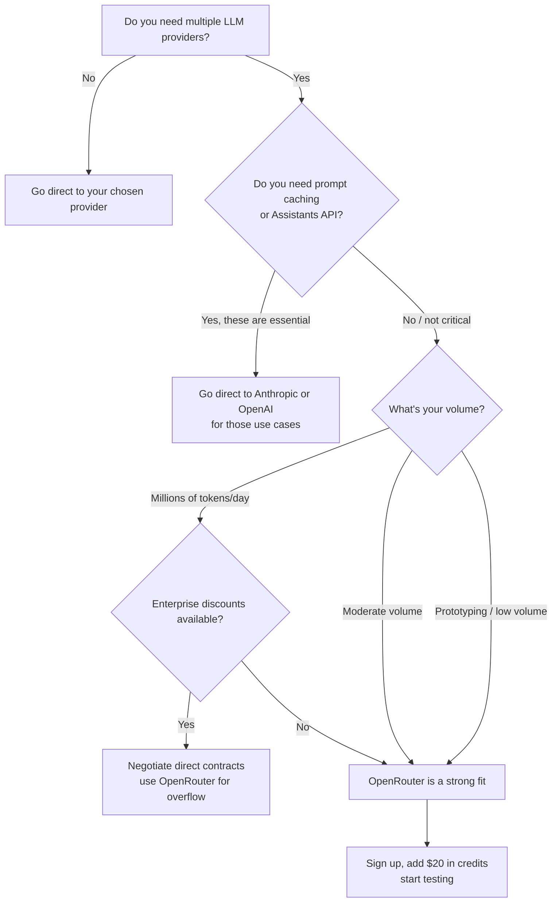

I used to maintain three separate API integrations in the same codebase: Anthropic for Claude, OpenAI for GPT-4o, and a self-hosted Ollama instance for testing open-weight models. Every time a new model dropped, I was updating API clients, managing separate billing dashboards, and juggling three different rate-limit error formats. It was a maintenance tax I kept paying and kept meaning to fix.

OpenRouter fixed it in about twenty minutes. One API key, one endpoint, one billing account — and access to over 200 models from every major provider. This review covers how it works, what it actually costs, where it falls short, and how to decide if it belongs in your stack.

---

## What Is OpenRouter?

OpenRouter is an API aggregator for large language models. Instead of integrating directly with Anthropic, OpenAI, Google, Meta, Mistral, and a dozen other providers, you integrate once with OpenRouter's unified endpoint and specify which model you want per request.

The company positions itself as infrastructure for AI developers. It handles the authentication, routing, and billing with each underlying provider, then passes requests through to the best available endpoint. You pay OpenRouter; OpenRouter pays the providers.

A few things make OpenRouter more than a thin proxy:

- **Model fallback**: Automatically route to a backup model if your primary choice is down or rate-limited
- **Load balancing**: Distribute requests across multiple providers serving the same model (e.g., multiple Claude API endpoints)
- **OpenAI-compatible API**: Drop in OpenRouter's base URL with no other code changes if you're already using the OpenAI SDK
- **Usage dashboard**: Unified view of spending across every model in one place
- **Free tier models**: A selection of open-weight models available at zero cost with rate limits

OpenRouter launched in 2023 and has grown steadily as developers got tired of maintaining multi-provider integrations. As of March 2026 it hosts over 200 models and processes millions of requests daily.

---

## How OpenRouter Works

The architecture is straightforward. Your application sends a standard chat completion request to OpenRouter's API. OpenRouter looks at the model you specified, routes the request to the appropriate upstream provider, and streams the response back to you.



The request format follows the OpenAI chat completions spec exactly. The only difference is the base URL and the model name format, which uses a `provider/model-name` convention like `anthropic/claude-3.5-sonnet` or `openai/gpt-4o`.

For open-weight models like Llama or Mistral that don't have a single canonical provider, OpenRouter routes to one of several compute providers it has partnerships with — Together AI, Fireworks AI, Lepton AI, and others. You can also specify a provider preference if you have a strong reason to prefer one backend over another.

The latency overhead from the proxy layer is minimal in practice. In my testing across roughly 500 requests, the median added latency was under 50ms — negligible compared to model generation time.

---

## Available Models

This is where OpenRouter genuinely earns its keep. The model catalog as of March 2026 includes:

**Anthropic**
- Claude 3.5 Sonnet (`anthropic/claude-3.5-sonnet`)
- Claude 3 Opus (`anthropic/claude-3-opus`)
- Claude 3 Haiku (`anthropic/claude-3-haiku`)

**OpenAI**
- GPT-4o (`openai/gpt-4o`)
- GPT-4o mini (`openai/gpt-4o-mini`)
- o1 and o1-mini (`openai/o1`, `openai/o1-mini`)
- GPT-3.5 Turbo (`openai/gpt-3.5-turbo`)

**Google**
- Gemini 1.5 Pro (`google/gemini-pro-1.5`)
- Gemini 1.5 Flash (`google/gemini-flash-1.5`)
- Gemini 2.0 Flash (`google/gemini-2.0-flash-001`)

**Meta / Llama**
- Llama 3.3 70B Instruct (`meta-llama/llama-3.3-70b-instruct`)
- Llama 3.1 405B Instruct (`meta-llama/llama-3.1-405b-instruct`)
- Llama 3.2 vision models

**Mistral**
- Mistral Large (`mistralai/mistral-large`)
- Mistral Small (`mistralai/mistral-small`)
- Mixtral 8x7B and 8x22B

**Other notable models**
- DeepSeek R1 and V3 (`deepseek/deepseek-r1`, `deepseek/deepseek-chat`)
- Cohere Command R+ (`cohere/command-r-plus`)
- Perplexity Sonar models
- Qwen 2.5 series from Alibaba

The full catalog is browsable at openrouter.ai/models with current pricing, context windows, and provider availability for each. The list is updated as new models release, usually within days of a major launch.

---

## Pricing

OpenRouter's pricing model is the reason it competes with going direct. For most models, OpenRouter charges **the same rate as the underlying provider** — no markup. It makes money on the volume of smaller models and free-tier usage where it captures upstream discounts.

A few models do carry a small markup, typically 1-5%, which OpenRouter discloses on each model's page. But the flagship models — GPT-4o, Claude 3.5 Sonnet, Gemini 1.5 Pro — are priced at or very close to the provider's published rates.

**How billing works:**

You pre-purchase credits on OpenRouter's dashboard (minimum $5). Credits are deducted per request based on token usage. There's no subscription, no monthly minimum, and no per-seat fee for the API. The credits system means you can add $20 and run experiments across five different model families without setting up five separate billing accounts.

**Free models:**

OpenRouter maintains a tier of models available at no cost with rate limits. As of March 2026, this includes several Llama 3 variants, Mistral 7B, and Google's Gemini Flash in limited capacity. These are useful for development and prototyping but aren't suitable for production workloads at volume.

```mermaid
xychart-beta
    title "OpenRouter vs Direct API — Cost per 1M Output Tokens ($)"
    x-axis ["GPT-4o", "Claude Sonnet", "Gemini Pro", "Llama 3.3 70B", "Mistral Large", "Gemini Flash"]
    y-axis "Cost ($)" 0 --> 16
    bar [10.00, 15.00, 5.00, 0.72, 6.00, 0.30]
    bar [10.00, 15.00, 5.00, 0.88, 6.00, 0.30]
```



The first bar is the direct provider rate; the second is via OpenRouter. On flagship models the lines are nearly identical. On open-weight models like Llama 3.3 70B the OpenRouter rate can be slightly higher because it aggregates across multiple compute providers rather than locking you to the cheapest single endpoint — but the difference is small and you gain reliability in return.

---

## Getting Started

Setup takes about ten minutes if you're already familiar with the OpenAI SDK. Here's the complete path:

**Step 1: Create an account and add credits**

Sign up at openrouter.ai, verify your email, then go to the Credits section and add a minimum of $5. Credits are non-expiring.

**Step 2: Generate an API key**

Navigate to API Keys in the dashboard. Create a key. Store it as an environment variable — treat it like any other secret.

```bash
export OPENROUTER_API_KEY="sk-or-v1-..."
```

**Step 3: Point your existing OpenAI SDK at OpenRouter**

If you're using the Python OpenAI SDK:

```python
from openai import OpenAI

client = OpenAI(
    base_url="https://openrouter.ai/api/v1",
    api_key="sk-or-v1-...",
)

response = client.chat.completions.create(
    model="anthropic/claude-3.5-sonnet",
    messages=[
        {"role": "user", "content": "Explain transformer attention in one paragraph."}
    ],
)
print(response.choices[0].message.content)
```

That's it. The same code works for `openai/gpt-4o`, `google/gemini-pro-1.5`, or `meta-llama/llama-3.3-70b-instruct` — just swap the model string.

**Step 4: Add optional headers for analytics**

OpenRouter supports two optional HTTP headers that help with monitoring:

```python
client = OpenAI(
    base_url="https://openrouter.ai/api/v1",
    api_key="sk-or-v1-...",
    default_headers={
        "HTTP-Referer": "https://yourapp.com",  # Shows in your dashboard
        "X-Title": "Your App Name",             # Labels requests in logs
    }
)
```

These aren't required but make the usage dashboard significantly more readable when you're running multiple applications through the same key.

---

## Key Features

### Model Fallback

This is the feature I use most. You can specify a list of fallback models in your request, and OpenRouter will automatically try the next one if the primary model is unavailable, over rate limit, or returns an error.

```python
response = client.chat.completions.create(
    model="anthropic/claude-3.5-sonnet",
    messages=[...],
    extra_body={
        "models": [
            "anthropic/claude-3.5-sonnet",
            "openai/gpt-4o",
            "google/gemini-pro-1.5"
        ]
    }
)
```

In a production app, this turns provider outages from user-facing errors into transparent fallbacks. Anthropic went down twice in Q4 2025 for periods of 15-30 minutes. With fallback configured, my app routed to GPT-4o automatically. Users noticed nothing.

### Load Balancing

For models served by multiple providers (most open-weight models, and some hosted models available through multiple endpoints), OpenRouter can distribute load across providers. You opt into this with a provider preference setting in your request. This is primarily useful at high request volumes where a single provider's rate limits become binding.

### Rate Limit Handling

OpenRouter surfaces rate limit information in its response headers in a consistent format regardless of the underlying provider. This is more useful than it sounds: Anthropic, OpenAI, and Google all return rate limit errors differently, and normalizing them means your retry logic can be written once.

Rate limits on OpenRouter itself are based on your account tier and credit balance. The limits are generous for normal production workloads. Very high throughput applications (millions of tokens per day) should contact OpenRouter directly to confirm capacity.

### Streaming

Streaming works identically to direct provider streaming. Server-sent events are proxied through OpenRouter with no meaningful added latency. Every model that supports streaming from its native API supports streaming through OpenRouter.

### Tool Calling / Function Calling

OpenRouter passes tool schemas through to the underlying model and returns tool call results in the same format as the native API. Models that support function calling natively — GPT-4o, Claude 3.5 Sonnet, Gemini 1.5 Pro — work correctly through OpenRouter with no changes to your tool schema definitions.

---

## Real-World Use Cases

**Multi-model evaluation pipelines.** The most common professional use case I see is teams that want to compare outputs across multiple models on the same prompt set. With OpenRouter, a model evaluation harness is a ten-line loop that swaps `model` strings. No SDK switching, no credential juggling.

**Cost-optimized routing.** Route different request types to different models based on complexity. Simple classification to Llama 3.1 8B (near-zero cost), nuanced generation to Claude 3.5 Sonnet. One endpoint, one billing account.

**Resilient production APIs.** Use the fallback feature to ensure uptime across provider incidents. For applications where downtime is costly, the ability to fall back to a secondary model automatically is worth the slight overhead.

**Prototyping without commitment.** When you're not sure which model is right for a use case, OpenRouter lets you test across the full landscape quickly. Add $20, run 50 test prompts through six models, pick the winner. The alternative is setting up accounts and billing with six different providers.

**Open-weight model access without infrastructure.** Running Llama 3.1 405B requires serious GPU infrastructure. Through OpenRouter, you pay per token with no minimum and no infrastructure management. For teams that want open-weight model quality without the ops burden, this is the realistic path.

---

## OpenRouter vs. Direct API Access

The question worth answering directly: when should you go to the provider instead?

Going direct to the provider makes sense when:

- **You need Anthropic's prompt caching.** This is the biggest one. Anthropic's prompt caching feature — which caches long system prompts at 10% of the base token price — is not available through OpenRouter. For chatbots or RAG applications with large, stable system prompts, this can cut costs by 50-70%. OpenRouter can't replicate it.
- **You need OpenAI's Assistants API or batch API.** OpenRouter implements the chat completions endpoint, not OpenAI's Assistants API or the Batch API (which gives 50% off for async workloads). If you need either, go direct.
- **You need fine-tuned models.** OpenRouter doesn't support OpenAI's fine-tuning API or serving custom fine-tuned models.
- **Your data governance policy requires direct provider agreements.** Some enterprise data processing agreements specifically require your data to flow only to a named provider. OpenRouter sits in the middle, which may conflict with those terms.
- **You're at very high volume.** At millions of tokens per day, the economics of direct provider negotiation — volume discounts, enterprise agreements, reserved capacity — likely beat OpenRouter's standard rates.

OpenRouter makes more sense when:

- You're accessing multiple model families and don't want N provider integrations
- You want model fallback and uptime resilience without building it yourself
- You're prototyping and want flexibility before committing to a provider
- You're accessing open-weight models without wanting to manage compute infrastructure
- Your volume is moderate (tens of thousands to low millions of tokens per day) and per-token rates are fine

---

## Rough Edges

OpenRouter is genuinely useful, but it's not flawless. Here's what I've run into:

**No Anthropic prompt caching.** Covered above, but worth repeating because it's the single biggest limitation. For heavy users of Claude, the cost difference with direct API access plus caching can be substantial.

**Latency variance on open-weight models.** When OpenRouter routes to a crowded backend — typically a smaller compute provider — latency can spike significantly. I've seen p99 latency on Llama 3.1 70B jump from 2 seconds to 15+ seconds during peak times. Flagship models routed to their native providers (Anthropic, OpenAI, Google) are much more consistent.

**Model availability fluctuates.** Occasionally a model drops from the catalog, a provider's endpoint goes offline and isn't failovered cleanly, or a new model's metadata is wrong for a day or two. The OpenRouter team is responsive on Discord, but it's worth having a fallback configured in production regardless.

**Dashboard is functional, not polished.** The usage analytics show you what you need — per-model spend, token counts, request volume — but the UX isn't as refined as, say, a dedicated observability platform. Not a dealbreaker, but worth knowing if you're evaluating it against a full observability stack.

**Rate limit transparency varies.** Rate limit headers are normalized, but the underlying limits of each provider still apply. You can hit Anthropic's rate limits through OpenRouter and the error message is less clear than what you'd get going direct.

---

## Should You Use OpenRouter?



The decision is fairly clean once you know your requirements. OpenRouter is the right choice for developers and teams who want multi-model flexibility without multi-provider maintenance overhead. It's not the right choice when you need Anthropic prompt caching, OpenAI's Assistants API, fine-tuned model serving, or a direct enterprise data processing agreement.

---

## Verdict

OpenRouter is one of those developer tools where the pitch sounds almost too convenient — "one API for all LLMs" — but the reality holds up. The OpenAI-compatible endpoint means the integration cost is genuinely close to zero if you're already using the OpenAI SDK. The pricing is at or near provider rates for flagship models. The model fallback feature alone has saved me from two provider incidents that would otherwise have caused user-facing errors.

The caveats are real. You give up Anthropic's prompt caching, which is a meaningful cost optimization for certain workloads. Open-weight model latency can be inconsistent. And at very high volume, direct provider negotiation probably beats the pass-through pricing.

But for most developers building with LLMs in 2026 — running experiments across multiple models, managing costs across a few different providers, wanting resilience without building a full routing layer yourself — OpenRouter is the pragmatic starting point. Start with a $20 credit top-up, run your test prompts across four or five models, and see which one earns a place in your stack. The evaluation will cost you about two dollars and tell you more than any benchmark.

---

## Frequently Asked Questions

### Does OpenRouter store my prompts or responses?

OpenRouter states that it does not log prompt content by default. Request metadata (model used, token counts, timestamp) is logged for billing purposes. You can review the current privacy policy and data handling terms on the OpenRouter website before using it in any application that handles sensitive data.

### Can I use OpenRouter with the Anthropic or Mistral SDK instead of the OpenAI SDK?

Technically yes — OpenRouter's endpoint accepts the same request format as the OpenAI chat completions API, so any HTTP client works. But the most straightforward integration is via the OpenAI SDK pointed at OpenRouter's base URL. The Anthropic SDK uses a different request structure and would require adaptation.

### Are there per-request fees on top of token costs?

No per-request fees. You pay only for the tokens consumed, priced at approximately the underlying provider rate. The minimum credit purchase is $5; unused credits do not expire.

### What happens if a model on OpenRouter is deprecated by its provider?

OpenRouter typically marks the model as deprecated in its catalog and, where possible, redirects traffic to an updated version. In some cases, especially with OpenAI model deprecations, OpenRouter mirrors the provider's alias behavior. It's still good practice to pin to specific model versions in production rather than relying on auto-aliasing.

### Is OpenRouter suitable for production workloads handling user data?

It depends on your compliance requirements. For applications handling PII or operating under HIPAA, GDPR, or similar frameworks, you'll need to review OpenRouter's data processing agreement and terms of service carefully. Some regulated industries require direct data processing agreements with named providers, which OpenRouter's proxy model may not satisfy. For most standard SaaS applications without strict compliance requirements, OpenRouter is production-viable.
