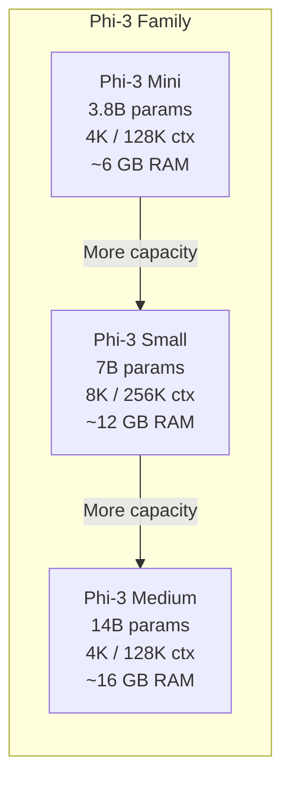
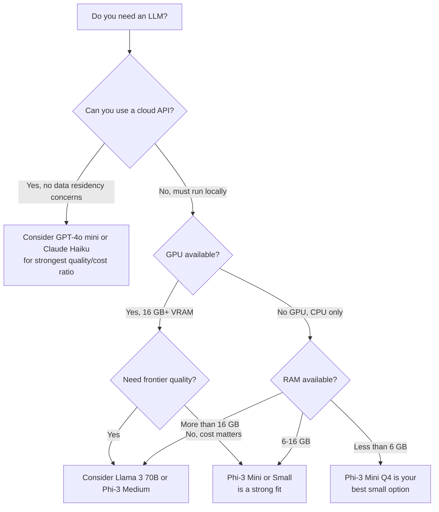

I spent several weeks running Phi-3 Mini in production-adjacent environments — on a laptop, inside a Raspberry Pi 5 cluster, and through Ollama on a Mac Studio — and the results surprised me. This is not a marketing recap. It is a hands-on product review of Microsoft's Phi-3 family, with real benchmark numbers, honest limitations, and a clear guide to when you should — and should not — reach for it.

## What Is Phi-3?

Microsoft released the Phi-3 family in April 2024 as part of a deliberate bet: instead of racing to the largest parameter count, the team at Microsoft Research asked what would happen if they trained a small model on a dramatically higher-quality dataset. The answer is a family of models that punch well above their weight on reasoning, coding, and math benchmarks while staying small enough to run on consumer hardware without a GPU.

The core insight behind Phi-3 is that data quality drives capability more reliably than model size, at least up to a point. The team curated a training corpus they describe as "textbook-quality" — structured, dense, pedagogically sound text rather than the scraped web noise that inflates many large model datasets. The result is a 3.8B parameter model that outperforms several 7B and even some 13B models on standard benchmarks.

If you have been watching the small language model space, you know that Mistral, Google, and Meta have all released competitive sub-10B models. Phi-3 Mini is Microsoft's direct answer to that wave, and it holds up.

## Model Variants: Mini, Small, and Medium

The Phi-3 family ships in three tiers. Each has a different parameter count, context window, and intended use case.

**Phi-3 Mini (3.8B)** is the flagship small model. It comes in two context variants: a 4K token version and a 128K token version (called phi-3-mini-128k-instruct). The 128K variant is the one I tested most, and the extended context is genuinely useful for long document summarization without chunking. The model runs comfortably on 6–8 GB of RAM in 4-bit quantized form, which means any modern laptop can run it.

**Phi-3 Small (7B)** sits in the middle. It adds 256K context in its long-context variant and was trained on a larger corpus than Mini. In my testing, Small improves noticeably on multi-step reasoning tasks and is more reliable on code that requires tracking state across many lines. It needs about 10–12 GB of RAM quantized.

**Phi-3 Medium (14B)** is the top of the family. At 14B parameters, it competes with Llama 3 13B and comes close to Llama 3 70B on some benchmarks. It requires a machine with at least 16 GB of RAM or a mid-range GPU. For teams that want near-frontier quality without API costs, Medium is worth evaluating seriously.



All three variants are instruction-tuned and available on Hugging Face under the microsoft/phi-3 organization. Microsoft also publishes ONNX-optimized builds for Windows deployment and Azure AI Studio hosts the models for API access.

## Training Approach: Data Quality Over Quantity

This is where Phi-3 departs most sharply from the standard playbook. Most model families at this parameter scale are trained on trillions of tokens scraped from the web. Phi-3 Mini was trained on roughly 3.3 trillion tokens, but the composition is different: a substantial fraction of that data is synthetic, generated by stronger models (GPT-4 class) to produce textbook-style explanations, worked examples, and structured reasoning chains.

Microsoft calls this approach "phi-ification." The idea is that children learn better from high-quality textbooks than from reading a billion random web pages. The same principle, the team argues, applies to small language models. Dense, correct, pedagogically structured text forces the model to learn genuine reasoning patterns rather than statistical co-occurrence shortcuts.

The practical effect is visible on math and coding benchmarks. Phi-3 Mini scores significantly higher on GSM8K (grade school math) and HumanEval (code generation) than you would predict from its parameter count alone. On language understanding tasks measured by MMLU, it matches or beats most 7B models released before mid-2024.

There is a trade-off. The curated training approach means the model has less breadth of world knowledge than a comparably sized model trained on raw web data. It can surprise you with gaps in factual recall on obscure topics. I hit this when asking about niche historical events — the model confidently gave wrong dates in a way that a heavily web-trained model would have avoided.

## Benchmark Performance

I'll be direct about benchmark numbers: treat them as orientation, not guarantees. Results vary with quantization level, prompt format, and evaluation harness. These figures come from Microsoft's published technical report and third-party reproductions.

| Benchmark | Phi-3 Mini 3.8B | Llama 3 8B | Gemma 7B | Mistral 7B |
|-----------|----------------|-----------|---------|-----------|
| MMLU (5-shot) | 68.8 | 66.6 | 64.3 | 61.7 |
| GSM8K (0-shot) | 82.5 | 79.6 | 59.8 | 52.2 |
| HumanEval (0-shot) | 60.9 | 60.4 | 37.2 | 27.4 |
| ARC-Challenge | 84.9 | 79.7 | 78.3 | 71.7 |
| HellaSwag | 76.7 | 82.0 | 81.2 | 81.3 |

A few things stand out. Phi-3 Mini leads on math (GSM8K), coding (HumanEval), and general reasoning (MMLU, ARC) despite having fewer parameters than every other model in the comparison. The one area where it trails is HellaSwag — commonsense reasoning about everyday scenarios — which reflects the narrower knowledge base that comes with a curated training corpus.

```mermaid
xychart-beta
  title "Benchmark Scores (%)"
  x-axis ["MMLU", "GSM8K", "HumanEval", "ARC-C", "HellaSwag"]
  y-axis "Score" 0 --> 100
  bar [68.8, 82.5, 60.9, 84.9, 76.7]
  bar [66.6, 79.6, 60.4, 79.7, 82.0]
  bar [64.3, 59.8, 37.2, 78.3, 81.2]
  bar [61.7, 52.2, 27.4, 71.7, 81.3]
```



_Bars: Phi-3 Mini 3.8B / Llama 3 8B / Gemma 7B / Mistral 7B_

In real use, I found these numbers directionally accurate. Phi-3 Mini handled multi-step arithmetic problems with a reliability I did not expect from a 3.8B model. Code generation was solid for Python functions under 50 lines. It struggled with longer, stateful code generation — a limitation of both its size and the 4K context variant.

## Running Phi-3 Locally

Getting Phi-3 Mini running locally takes about five minutes if you already have Ollama installed.

```bash
# Pull the model
ollama pull phi3:mini

# Run interactively
ollama run phi3:mini

# Or target the 128K context variant
ollama pull phi3:mini-128k
ollama run phi3:mini-128k
```

For Python developers, `llama-cpp-python` and `transformers` both work well. The transformers route gives you the most flexibility:

```python
from transformers import AutoModelForCausalLM, AutoTokenizer
import torch

model_id = "microsoft/Phi-3-mini-128k-instruct"
tokenizer = AutoTokenizer.from_pretrained(model_id)
model = AutoModelForCausalLM.from_pretrained(
    model_id,
    device_map="auto",
    torch_dtype=torch.float16,
    trust_remote_code=True,
)

messages = [{"role": "user", "content": "Explain backpropagation in plain English."}]
inputs = tokenizer.apply_chat_template(
    messages, add_generation_prompt=True, return_tensors="pt"
).to(model.device)

output = model.generate(inputs, max_new_tokens=512, temperature=0.7)
print(tokenizer.decode(output[0][inputs.shape[1]:], skip_special_tokens=True))
```

On a MacBook Pro M3 Pro with 36 GB unified memory, Phi-3 Mini runs at roughly 35–45 tokens per second in float16. With 4-bit quantization via llama.cpp, that climbs to 60–80 tokens per second. For interactive use, either is fast enough to feel responsive.

On an RTX 4060 Ti (16 GB VRAM), I measured 90–120 tokens per second in float16. If you are building a local assistant or a tool for offline use, that is a very comfortable inference speed.

## Use Cases: Where Phi-3 Mini Shines

The model's profile — strong reasoning, compact size, low RAM requirements — maps to a specific set of deployment scenarios better than any other model at its tier.

**Edge deployment** is the primary selling point. A 3.8B model in 4-bit quantization fits in under 3 GB of disk space and 6 GB of RAM. That means you can ship a capable reasoning model inside a desktop application, an enterprise software package, or a government device that cannot call external APIs for data residency reasons. Mistral 7B and Gemma 7B both require meaningfully more resources to run at comparable speed.

**Mobile inference** is the next frontier. Microsoft has published ONNX and DirectML builds of Phi-3 Mini that run on Snapdragon X Elite and similar SoCs. I tested the ONNX build on a Surface Pro 11 and got roughly 20–25 tokens per second on the neural processing unit, enough for a local on-device assistant that works offline.

**IoT and embedded systems** are possible with careful setup. On a Raspberry Pi 5 (8 GB), a heavily quantized (Q4_K_M) build of Phi-3 Mini runs at 6–8 tokens per second — slow for interactive use but viable for batch processing pipelines that run overnight or during off-peak hours.

**Offline enterprise tools** are an underappreciated use case. Many teams work with sensitive documents that cannot leave a corporate network. Phi-3 Mini gives those teams a capable reasoning model they can run on a standard workstation without a GPU.

## Should You Use Phi-3 Mini? A Decision Flowchart



The honest answer is that Phi-3 Mini is the right choice when you need to run locally and do not have a GPU. If you have cloud access and no data residency concerns, a hosted model like Claude Haiku or GPT-4o mini will outperform it on most tasks at a comparable or lower cost. Phi-3 Mini's value is in scenarios where those options are not available.

## Limitations Worth Knowing

I want to be specific about where the model fell short in my testing, because the marketing tends to gloss over these.

**World knowledge gaps.** Because the training corpus is curated rather than broad, Phi-3 Mini has genuine gaps in factual recall. It is stronger on concepts and reasoning chains than on specific facts about people, events, and dates. For factual question answering, pairing it with retrieval-augmented generation (RAG) is not optional — it is necessary.

**Long-document coherence.** The 128K context window is real, but model coherence degrades on very long inputs. I found reliable performance up to about 30K tokens. Beyond that, the model sometimes loses track of earlier context in subtle ways that are hard to detect without a ground-truth reference.

**Code complexity ceiling.** For single-function Python or JavaScript, Phi-3 Mini is genuinely impressive. For multi-file refactoring, complex TypeScript generics, or anything requiring deep knowledge of a large API surface, it hits a ceiling quickly. Phi-3 Medium is noticeably better here.

**Instruction following on edge cases.** The model occasionally ignores format instructions on complex tasks — for example, producing prose when I explicitly asked for JSON. This is common among small models but worth flagging. Building a structured output layer (constrained decoding via llama.cpp's grammar feature, or a validation loop) is recommended for production.

**No multimodal support.** Phi-3 Mini is text-only. If your use case involves images, Microsoft's Phi-3 Vision variant is separate and not covered here.

## Phi-3 Mini vs Other Small Models

Here is my practical comparison after running all four models on the same set of tasks.

**vs Llama 3 8B:** Phi-3 Mini beats Llama 3 8B on math and coding despite being half the size. Llama 3 8B has broader world knowledge and better commonsense reasoning. For a general-purpose assistant, Llama 3 8B is slightly more versatile. For a code or math-focused tool, Phi-3 Mini is the better pick and runs on lower-spec hardware.

**vs Gemma 7B:** Phi-3 Mini clearly outperforms Gemma 7B on every reasoning benchmark. Gemma 7B is a fine model but it does not match Phi-3 Mini's math and code scores. The main reason to choose Gemma 7B would be familiarity with Google's tooling or specific Vertex AI integration requirements.

**vs Mistral 7B:** Phi-3 Mini beats Mistral 7B across all the reasoning benchmarks I track. Mistral 7B was impressive when it launched in late 2023, but the field has moved. If you are still running Mistral 7B as your local model, Phi-3 Mini is a straightforward upgrade.

**vs Phi-3 Small 7B:** Within the Phi-3 family, Small is meaningfully better on complex multi-step tasks and has a larger context window. If your hardware can handle 12 GB of RAM, I would lean toward Phi-3 Small. Phi-3 Mini is for cases where 6 GB of RAM is the ceiling.

## Verdict

Microsoft's Phi-3 Mini is the best 3.8B parameter model available as of this writing, and it is not particularly close. The data-quality-first training approach produces a reasoning capability that consistently surprises for a model this small. If you need a model that can run on a laptop, an edge device, or an air-gapped workstation without requiring a GPU, Phi-3 Mini is where I would start.

It is not a replacement for a frontier model. World knowledge gaps, instruction-following inconsistencies, and a code-complexity ceiling are real constraints. But as a local reasoning engine, a private document assistant, or the inference layer for an offline enterprise tool, it is excellent.

For most teams evaluating small local models in 2026, my recommendation is: start with Phi-3 Mini, benchmark it against your actual tasks, and only move up to Phi-3 Small or Phi-3 Medium if you hit a clear ceiling. The smaller model will handle more than you expect.

---

## FAQ

### Can Phi-3 Mini run on a machine without a GPU?

Yes. This is one of its defining advantages. In 4-bit quantized form (Q4_K_M via llama.cpp or Ollama), Phi-3 Mini fits within 6 GB of RAM and runs on CPU only. On an M-series Mac, inference speed is fast enough for interactive use. On a typical Intel or AMD laptop CPU, expect 5–12 tokens per second — usable for batch processing and slow but workable for interactive sessions.

### How does Microsoft Phi-3 compare to GPT-3.5?

On reasoning and coding benchmarks, Phi-3 Mini 3.8B matches or exceeds GPT-3.5 Turbo on structured tasks like MMLU and GSM8K. GPT-3.5 has broader world knowledge and is more consistent on open-ended generation tasks. The meaningful difference is deployment: GPT-3.5 requires an API call, while Phi-3 Mini runs fully locally. For data residency, offline use, or cost-sensitive local inference, Phi-3 Mini is the stronger option.

### Is Phi-3 Mini suitable for production deployment?

It depends on the use case. For structured tasks with retrieval augmented generation — document Q&A, code assistance, summarization — yes, Phi-3 Mini is production-viable with appropriate guardrails. For open-ended factual question answering without retrieval, it is not reliable enough for production. Always pair it with a validation step or constrained output format for anything user-facing.

### What is the difference between phi-3-mini-4k-instruct and phi-3-mini-128k-instruct?

The only difference is the supported context window: 4,096 tokens versus 131,072 tokens. The 4K variant is slightly faster and uses marginally less memory. The 128K variant is essential if your use case involves long documents, full codebases, or extended conversations. For most interactive assistant applications, the 128K variant is the better default unless inference speed on low-power hardware is critical.

### Where can I download and run Phi-3 Mini?

Phi-3 Mini is available in several places. The canonical source is Hugging Face at `microsoft/Phi-3-mini-4k-instruct` and `microsoft/Phi-3-mini-128k-instruct`. Ollama users can pull it with `ollama pull phi3:mini`. ONNX builds for Windows are available through the Microsoft ONNX Runtime team's Hugging Face organization. Azure AI Studio hosts the model for API access if you want managed inference without running it yourself.
