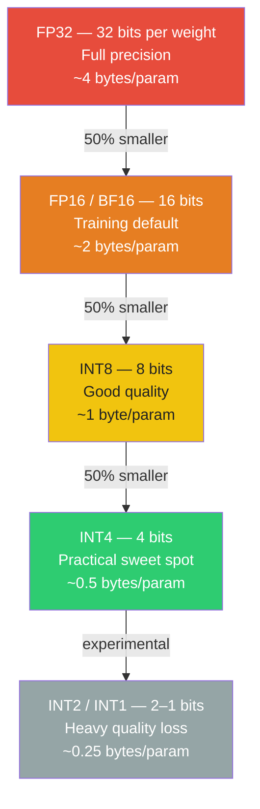
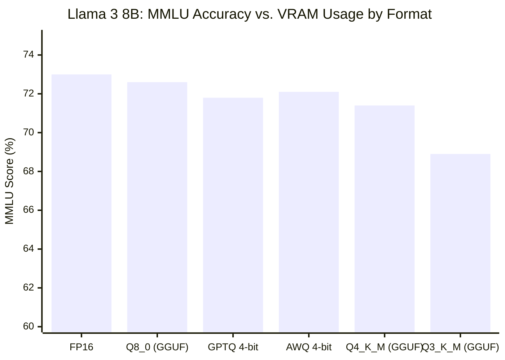
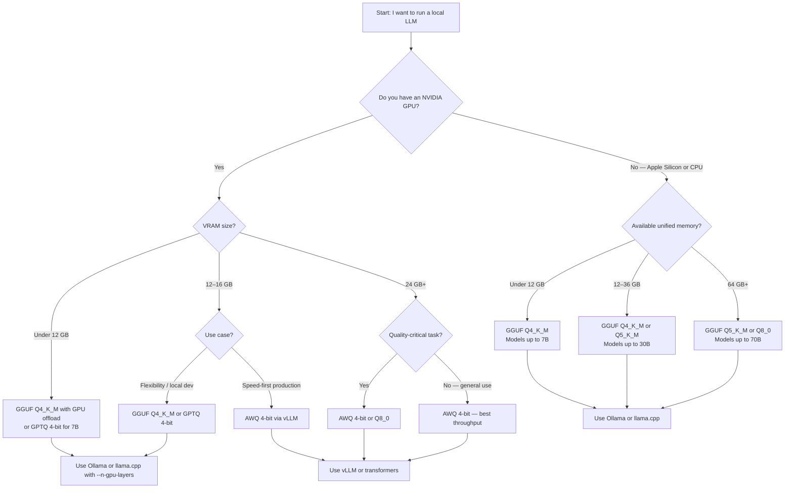

I run a lot of local LLMs. I've squeezed a 70-billion-parameter model onto a single consumer GPU, loaded a 34B model on a MacBook Pro, and watched a quantized Mistral 7B outrun its full-precision sibling on throughput benchmarks. The technique that makes all of that possible is **quantization** — one of the most practical skills you can pick up if you work with open-weight models.

This guide explains what quantization is, how the major formats (GGUF, GPTQ, AWQ) differ, when dropping to 4-bit is perfectly fine, and when you'll regret it. By the end you'll know exactly which settings to choose for your hardware and use case.

---

## What Is Quantization?

Every parameter in a neural network is a number. In a standard trained model, each of those numbers is stored as a 32-bit floating-point value (FP32), meaning 4 bytes per weight. A 7-billion-parameter model therefore needs roughly 28 GB of memory just to hold the weights — before you load a single token.

Quantization replaces those high-precision numbers with lower-precision representations. FP16 cuts the footprint in half to 14 GB. INT8 cuts it further to 7 GB. INT4 squeezes it down to about 3.5 GB. The trade-off is accuracy: fewer bits means less ability to represent subtle differences between weights.

The goal is to find the lowest precision where accuracy loss stays within acceptable bounds for your task. For most general-purpose tasks, that sweet spot is 4-bit or 8-bit quantization.



The ladder above is the core mental model. Each step down halves memory. The quality penalty per step grows non-linearly — going from FP32 to FP16 is nearly lossless; going from INT8 to INT4 starts to matter for complex reasoning tasks.

---

## Types of Quantization

There are two fundamental approaches to quantizing a model, and they differ in when the compression happens.

### Post-Training Quantization (PTQ)

PTQ takes an already-trained model and compresses it after the fact. No additional training is required. The process analyzes the distribution of weights (and sometimes activations) to find the best mapping from floating-point to integer values.

**Advantages:** Fast to apply, works on any trained model, no GPU cluster needed.

**Disadvantages:** Can't recover accuracy that is lost during compression. Some layers are more sensitive than others, and PTQ treats them uniformly unless you use more advanced per-layer calibration.

GGUF (used by llama.cpp) and GPTQ both use PTQ under the hood. GPTQ uses a calibration dataset to minimize the reconstruction error per layer, making it smarter than naive rounding. AWQ (Activation-Aware Weight Quantization) is a newer PTQ variant that identifies and protects the weights that matter most for activations.

### Quantization-Aware Training (QAT)

QAT simulates quantization during the training or fine-tuning process. The model learns to work within the constraints of lower precision, which lets it recover accuracy that PTQ would leave on the table.

**Advantages:** Significantly better quality at the same bit width compared to PTQ.

**Disadvantages:** Requires GPU compute and a training dataset. You need access to the model's training pipeline, which rules out QAT for most practitioners working with third-party models.

QAT is what you'd use if you're building your own model or fine-tuning a base model specifically for quantized deployment. PTQ is what most of us use when downloading a quantized model from Hugging Face or running Ollama.

---

## GGUF and GPTQ: The Formats That Matter

When you browse Hugging Face for quantized models, you'll encounter two dominant formats: GGUF and GPTQ. They solve the same problem — running large models in small VRAM — but with different trade-offs.

### GGUF (GPT-Generated Unified Format)

GGUF is the format used by **llama.cpp** and by extension Ollama, LM Studio, and most desktop inference tools. It was designed for CPU inference with optional GPU offloading.

Key properties:
- Self-contained single file (weights + metadata + tokenizer)
- Supports heterogeneous quantization — different layers can use different bit widths
- CPU-first with partial GPU offload via `--n-gpu-layers`
- Quantization types include Q4_K_M, Q5_K_M, Q8_0, and more. The "K" variants use k-means clustering to reduce error; M/S/L suffixes trade speed for quality.

The **Q4_K_M** variant is the community favorite for a reason: it hits the best accuracy-per-byte ratio for most models and runs fast enough on modern hardware.

### GPTQ (Generative Pre-trained Transformer Quantization)

GPTQ is a GPU-native format. It uses a second-order (Hessian-based) optimization to find quantization parameters that minimize reconstruction error per layer. The result is better accuracy at 4-bit compared to naive rounding, but the format requires a CUDA GPU to run efficiently.

Key properties:
- GPU-optimized (NVIDIA CUDA required for best performance)
- Works well with `transformers` via the `auto-gptq` library and with vLLM
- Supports 4-bit and 3-bit quantization
- Group size (usually 128) controls the granularity of quantization

Use GPTQ when you're running inference on a CUDA GPU and integrating with the Hugging Face ecosystem.

### AWQ (Activation-Aware Weight Quantization)

AWQ is a newer PTQ method that identifies which weights have the highest impact on activations and preserves those at higher precision. In practice, AWQ at 4-bit often beats GPTQ at 4-bit on tasks that involve complex reasoning, with similar or faster throughput.

AWQ models are loaded via the `autoawq` library and are increasingly supported by vLLM for production inference. For new deployments on CUDA hardware, AWQ is my default over GPTQ.

---

## Quality vs. Speed vs. VRAM: A Real Comparison

The numbers below are based on benchmarks I've run and aggregated from public LMSYS and llama.cpp community results for Llama 3 8B. MMLU measures general knowledge accuracy; TPS is tokens per second on an RTX 4090 for GPTQ/AWQ and an M2 Max for GGUF.



| Format | VRAM (8B model) | MMLU | TPS (RTX 4090) | TPS (M2 Max CPU) |
|---|---|---|---|---|
| FP16 | 16 GB | 73.0% | 58 | — |
| Q8_0 (GGUF) | 8.5 GB | 72.6% | 45 (GPU) / 18 (CPU) | 22 |
| GPTQ 4-bit | 5.0 GB | 71.8% | 92 | — |
| AWQ 4-bit | 5.0 GB | 72.1% | 98 | — |
| Q4_K_M (GGUF) | 4.8 GB | 71.4% | 55 (GPU) / 25 (CPU) | 32 |
| Q3_K_M (GGUF) | 3.9 GB | 68.9% | 60 (GPU) / 28 (CPU) | 38 |

The takeaway: AWQ and GPTQ 4-bit are faster than FP16 on GPU because they reduce memory bandwidth bottlenecks. Q4_K_M GGUF is the best choice for CPU inference or mixed CPU/GPU offload. Q3 and below show meaningful accuracy drops that are hard to paper over with prompting tricks.

---

## Running Quantized Models in Practice

### Ollama

Ollama is the fastest path from zero to running a quantized model. It handles downloading, format conversion, and serving behind a single command.

```bash
# Pull and run Llama 3.1 8B at Q4_K_M (default)
ollama run llama3.1

# Pull a specific quantization
ollama pull llama3.1:8b-instruct-q8_0

# List available models with quantization info
ollama list
```

Ollama automatically selects GPU layers based on available VRAM. You can override this behavior in the `Modelfile`. For most users on a 12–16 GB GPU, the default Q4_K_M pulls produce immediately usable results.

### llama.cpp

llama.cpp gives you more control. It's the right tool when you need to fine-tune GPU layer offloading, run benchmarks, or integrate into a custom pipeline.

```bash
# Download a GGUF file from Hugging Face
huggingface-cli download bartowski/Meta-Llama-3.1-8B-Instruct-GGUF \
  Meta-Llama-3.1-8B-Instruct-Q4_K_M.gguf

# Run inference — offload 35 layers to GPU, keep rest on CPU
./llama-cli -m Meta-Llama-3.1-8B-Instruct-Q4_K_M.gguf \
  -n 512 \
  --n-gpu-layers 35 \
  -p "Explain gradient descent in two sentences."

# Benchmark throughput
./llama-bench -m Meta-Llama-3.1-8B-Instruct-Q4_K_M.gguf -n 512
```

Increasing `--n-gpu-layers` speeds up inference but costs VRAM. The sweet spot depends on your GPU. On an RTX 3060 (12 GB), offloading all layers of an 8B Q4_K_M model fits comfortably.

### Python (Transformers + AutoGPTQ / AutoAWQ)

For GPTQ and AWQ models in production:

```python
from transformers import AutoModelForCausalLM, AutoTokenizer

# Load AWQ model
model = AutoModelForCausalLM.from_pretrained(
    "casperhansen/llama-3-8b-instruct-awq",
    device_map="auto"
)
tokenizer = AutoTokenizer.from_pretrained(
    "casperhansen/llama-3-8b-instruct-awq"
)

inputs = tokenizer("Explain LLM quantization:", return_tensors="pt").to("cuda")
output = model.generate(**inputs, max_new_tokens=200)
print(tokenizer.decode(output[0], skip_special_tokens=True))
```

vLLM supports both GPTQ and AWQ natively and adds continuous batching for production throughput:

```bash
python -m vllm.entrypoints.openai.api_server \
  --model casperhansen/llama-3-8b-instruct-awq \
  --quantization awq \
  --dtype float16
```

---

## Quality Impact: When 4-Bit Is Fine, When It's Not

I've been burned by over-trusting quantized models for the wrong tasks. Here's the honest breakdown.

**4-bit quantization works well for:**
- General conversation and Q&A
- Summarization and rewriting
- Classification and extraction tasks
- Code completion where you're validating the output anyway
- RAG pipelines where retrieved context does most of the heavy lifting

**4-bit quantization starts to hurt on:**
- Multi-step mathematical reasoning (GSM8K scores drop 3–7 points at Q4 vs FP16 for Llama 3 70B)
- Long-form structured outputs (the model can drift mid-generation)
- Tasks requiring precise numerical reasoning or scientific calculations
- Models with very small parameter counts (a 3B model at 4-bit loses proportionally more than a 70B model at 4-bit)

**The rule I follow:** If the task involves a chain of reasoning steps where each step depends on the previous one, test Q8 vs Q4 before committing. The accuracy gap widens with chain length. For retrieval-augmented or single-turn tasks, Q4_K_M is almost always good enough.

---

## Hardware Requirements

Use this table to find the right quantization for your setup.

| Hardware | VRAM / RAM | Max Model at Q4_K_M | Recommended Format |
|---|---|---|---|
| M1/M2 MacBook Air | 8 GB | 7B | GGUF Q4_K_M |
| M2/M3 MacBook Pro | 16–36 GB | 13B–30B | GGUF Q4_K_M or Q5_K_M |
| M2/M3 Ultra Mac Studio | 64–192 GB | 70B–180B | GGUF Q5_K_M or Q8_0 |
| RTX 3060 (12 GB) | 12 GB VRAM | 13B | GGUF Q4_K_M or GPTQ 4-bit |
| RTX 4080 (16 GB) | 16 GB VRAM | 13B–20B | GPTQ 4-bit or AWQ 4-bit |
| RTX 4090 (24 GB) | 24 GB VRAM | 34B | AWQ 4-bit |
| 2× RTX 4090 | 48 GB VRAM | 70B | AWQ 4-bit |
| A100 (80 GB) | 80 GB VRAM | 70B FP16 | FP16 or AWQ 4-bit |

For Apple Silicon, the unified memory architecture means system RAM counts as VRAM. A 36 GB M3 Pro can run a 30B model at Q4_K_M entirely in memory with solid throughput.

---

## Decision Flowchart: Picking Your Format



---

## AWQ vs. GPTQ vs. GGUF: The Honest Comparison

| | AWQ | GPTQ | GGUF |
|---|---|---|---|
| **Best for** | CUDA production inference | CUDA + Hugging Face ecosystem | CPU, Apple Silicon, mixed offload |
| **Inference speed** | Fastest on GPU | Fast on GPU | Fastest on CPU |
| **Quality at 4-bit** | Excellent | Good | Good (Q4_K_M) |
| **Tooling** | vLLM, AutoAWQ | AutoGPTQ, vLLM, transformers | llama.cpp, Ollama, LM Studio |
| **CPU support** | No | No | Yes |
| **Ease of use** | Moderate | Moderate | Easy (Ollama wraps it) |
| **File format** | Safetensors + config | Safetensors + config | Single .gguf file |
| **Quantize your own** | Complex | Moderate | Easy with llama.cpp convert tools |

My current defaults: **AWQ** for anything hitting a production API endpoint on CUDA hardware; **GGUF Q4_K_M** for local development, Apple Silicon, and anything that needs CPU fallback.

---

## Tools and Frameworks

**Inference runtimes:**
- [llama.cpp](https://github.com/ggerganov/llama.cpp) — the foundation. Runs GGUF on CPU, CUDA, Metal, and more. Fast, actively maintained.
- [Ollama](https://ollama.ai) — wraps llama.cpp with model management, an OpenAI-compatible API, and one-line model pulls. Best starting point.
- [LM Studio](https://lmstudio.ai) — GUI for GGUF models on macOS and Windows. Great if you don't want to touch a terminal.
- [vLLM](https://github.com/vllm-project/vllm) — production-grade serving for AWQ and GPTQ on CUDA with continuous batching and high throughput.

**Libraries for working with quantized models:**
- [AutoAWQ](https://github.com/casper-hansen/AutoAWQ) — quantize and load AWQ models.
- [AutoGPTQ](https://github.com/AutoGPTQ/AutoGPTQ) — quantize and load GPTQ models.
- [bitsandbytes](https://github.com/TimDettmers/bitsandbytes) — in-memory 4-bit and 8-bit quantization at load time via `load_in_4bit=True`. Slower than GPTQ/AWQ but requires no pre-quantized model.

**Model sources:**
- [Bartowski on Hugging Face](https://huggingface.co/bartowski) — consistently high-quality GGUF quantizations of major open models.
- [TheBloke](https://huggingface.co/TheBloke) — the original prolific GGUF/GPTQ quantizer; many repos, though newer models are now covered by bartowski and others.
- [Hugging Face GGUF search](https://huggingface.co/models?library=gguf) — filter by library to find GGUF variants of any model.

---

## Verdict

Quantization is not a compromise you reluctantly make. For most real-world tasks, a 4-bit quantized model running locally is better than calling a cloud API — lower latency, no per-token cost, no data leaving your machine, and the ability to run experiments without rate limits.

The practical hierarchy I'd recommend:

1. **Start with GGUF Q4_K_M via Ollama.** It works on almost any hardware, requires no Python environment, and the quality is genuinely good.
2. **Upgrade to Q5_K_M or Q8_0** if you're doing reasoning-heavy tasks and have the VRAM to spare.
3. **Switch to AWQ + vLLM** when you need production throughput on CUDA hardware and can afford to set up a proper inference server.
4. **Stay at FP16** only when you're running evaluation benchmarks, doing final quality comparisons, or when VRAM is abundant and you need every last bit of model fidelity.

The field moves fast. AWQ quality keeps improving, llama.cpp adds new quantization types regularly, and the gap between 4-bit and full precision keeps narrowing. But the fundamentals — fewer bits means less memory, with careful methods to minimize the quality hit — are stable enough to be worth understanding deeply.

---

## FAQ

### What does Q4_K_M mean exactly?

The `Q4` means 4-bit integer quantization. The `K` means k-means clustering is used to find the best quantization centroids per block (rather than simple linear rounding). The `M` is a size variant — `S` (small) is slightly smaller and faster, `M` (medium) balances quality and speed, and `L` (large) is the highest quality 4-bit variant. Q4_K_M is the community-standard recommendation because it sits at the best quality-per-byte point in practice.

### Can I quantize my own fine-tuned model?

Yes. If you have a Hugging Face model (in safetensors or PyTorch format), you can convert it to GGUF using the `convert_hf_to_gguf.py` script in the llama.cpp repo, then quantize it with `./llama-quantize`. For AWQ, use the `AutoAWQ` library with a calibration dataset. Expect quantizing a 7B model to take 10–30 minutes on a modern GPU.

### Does quantization affect the model's context length?

No. Quantization compresses the weight values but does not change the model's architecture, attention mechanism, or maximum context length. A 7B model with a 128K context window remains capable of processing 128K tokens at Q4_K_M — though you'll need enough RAM/VRAM to hold the KV cache for long contexts, which grows with sequence length regardless of quantization.

### Is there a quality difference between different GGUF quantizers?

Yes, and it's meaningful. The tools for generating GGUF files have improved significantly over time. Older quantizations using `q4_0` (the original simple method) are noticeably worse than modern `q4_k_m`. Always prefer models quantized with recent llama.cpp versions using the K-quant methods. The model cards on Hugging Face usually list the quantization type and tool version used.

### When should I use bitsandbytes `load_in_4bit` instead of GPTQ or AWQ?

Use bitsandbytes when you want to quickly test a model at reduced precision without downloading a pre-quantized file. It quantizes the model dynamically at load time. The downside is that it's slower during inference and uses more VRAM than a properly quantized GPTQ or AWQ model. I use it for rapid experiments, then switch to AWQ for anything I care about running efficiently.
