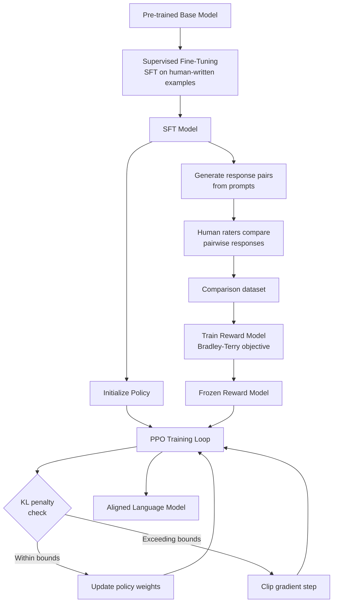
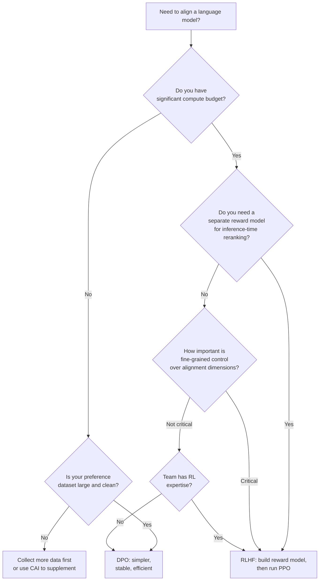

Every large language model you have used in the past two years — ChatGPT, Claude, Gemini, Llama — has been shaped by reinforcement learning from human feedback. RLHF is the reason these models answer questions helpfully instead of completing sentences statistically. It is the reason they decline dangerous requests, explain their reasoning, and format output the way humans prefer. Without RLHF, you would be using a very sophisticated autocomplete engine. With it, you get something that behaves more like an assistant.

I want to explain exactly how this works. Not the buzzword version. The real pipeline: what happens at each stage, what can go wrong, and why researchers keep proposing alternatives. If you are an engineer working with LLMs, or a technical PM deciding how to fine-tune a model for your product, this is the article that will give you a working mental model instead of a marketing summary.

## What Is RLHF?

Reinforcement learning from human feedback is a training method that adjusts a language model's behavior using signals from human raters rather than a fixed ground-truth dataset. The model generates outputs, humans evaluate those outputs, a reward model learns from those evaluations, and a policy optimization step uses that reward signal to update the language model's weights.

The core insight is that language quality is hard to specify mathematically. You can define rules for grammar. You can check factual claims against a database. But "helpful, harmless, and honest" — the alignment goal OpenAI, Anthropic, and Google all cite — requires judgment. Human judgment. RLHF operationalizes that judgment at scale by turning it into a training signal.

The technique was not invented for language models. It originated in game-playing and robotics research, where defining a reward function by hand is equally difficult. OpenAI's 2017 paper on learning from human preferences applied it to Atari and simulated robot locomotion. The 2020 InstructGPT paper from OpenAI was the first high-profile application to a large language model, and it demonstrated dramatically improved alignment with relatively little additional data.

## The Three Stages of RLHF

RLHF is a three-stage process. Each stage depends on the previous one. Cutting corners at stage one creates compounding problems at stage three.

### Stage 1: Supervised Fine-Tuning (SFT)

You start with a pre-trained base model. This model has read an enormous amount of text and developed sophisticated language representations, but it has no concept of what a "good response" looks like. It is a next-token prediction machine trained to mirror the distribution of its training data.

Supervised fine-tuning (SFT) addresses this by showing the model examples of the behavior you want. Human annotators — typically contractors working with detailed style guides — write high-quality responses to a set of prompts. These prompts are sampled from the use cases the model will encounter: question answering, coding tasks, summarization, creative writing, sensitive topics. The resulting (prompt, response) pairs form a supervised dataset that you use to fine-tune the base model.

The SFT stage sets a behavioral prior. After this stage, the model knows roughly what format, tone, and approach is expected. But it has not been optimized to prefer better responses over worse ones — it has simply seen examples of good ones. The optimization happens in stage three.

The quality of SFT data matters enormously. Inconsistent annotation guidelines, low-quality rater judgments, or unrepresentative prompt distributions all flow forward through the pipeline. This is why organizations like Anthropic and OpenAI invest heavily in annotation infrastructure before they do any RL.

### Stage 2: Training the Reward Model

You cannot run reinforcement learning without a reward signal. In games, reward is defined by the rules. In language, you need humans to provide it — but having humans evaluate every model output during training is not computationally feasible. So you train a separate neural network to predict human preferences. This is the reward model (RM).

To build the reward model, you collect comparison data. You take prompts, generate multiple responses from the SFT model, and have human raters rank those responses against each other. The key is that pairwise comparisons are much easier and more reliable than absolute scoring. Asking a rater "which of these two responses is better and why?" produces higher-quality signal than asking them to score a response from 1 to 10.

This comparison data trains the reward model using a Bradley-Terry ranking objective. The reward model learns to output a scalar score for any (prompt, response) pair that predicts how much a human would prefer that response. Critically, this is the model that will supervise the language model training. If the reward model has systematic errors — if it rewards confident-sounding but wrong responses, for instance — the language model will learn to exploit those errors.

The reward model is initialized from the SFT model. This gives it a strong prior on language quality before it learns to predict preferences. The final reward model is typically frozen during stage three and used only for inference.

### Stage 3: Policy Optimization with PPO

The third stage runs reinforcement learning to update the language model (now called the policy) using the reward model as its feedback signal.

The standard algorithm is Proximal Policy Optimization (PPO), developed by OpenAI in 2017. PPO belongs to the family of policy gradient methods, which update model weights in the direction that increases expected reward. It adds a clipping mechanism that prevents updates from changing the policy too drastically in a single step. This stability is crucial because reward signals from the reward model can be noisy, and large gradient steps can destabilize training.

During PPO training, the loop is roughly:

1. Sample a batch of prompts from the training distribution
2. Generate responses from the current policy (the language model)
3. Score those responses with the frozen reward model
4. Compute policy gradient updates that increase the probability of high-reward responses
5. Apply a KL divergence penalty relative to the SFT model to prevent the policy from drifting too far

That KL penalty is important. Without it, PPO would optimize aggressively for reward, causing the model to produce degenerate outputs that score well on the reward model but look nothing like natural language. The penalty keeps the optimized model in the neighborhood of the SFT model's distribution, which means it still produces coherent, human-like text.

## The RLHF Pipeline

## Why RLHF Works

The intuition behind RLHF is elegant. Pre-training teaches a model the structure of language. SFT teaches it roughly what good outputs look like. But neither of those stages directly optimizes for human preference — they only optimize for predicting what text comes next (in pre-training) or matching specific examples (in SFT).

RLHF closes this gap by creating a direct optimization pressure toward human-preferred outputs. The reward model is a learned approximation of human judgment, and PPO adjusts the policy to maximize that approximation. The result is a model that has been explicitly shaped to produce what humans consider good responses.

The empirical results are striking. The InstructGPT paper showed that a 1.3B parameter model trained with RLHF was preferred by human raters over a 175B parameter model fine-tuned only with supervised learning. RLHF compresses human preference information far more efficiently than supervised data at scale.

There is also a secondary effect: RLHF generalizes across domains. Rather than teaching a model how to answer each type of question with example answers, it teaches the model what qualities make any answer good. This generalization is why RLHF-trained models transfer so effectively to tasks they were not explicitly shown during training.

## How Companies Use RLHF

### OpenAI

OpenAI's InstructGPT (2022) was the first public demonstration of RLHF at scale on language models. Their pipeline matched the three-stage description above almost exactly: supervised fine-tuning on human demonstrations, reward model training on pairwise comparisons, and PPO optimization. The labeling work involved contractors provided with detailed guidelines.

GPT-4 and subsequent models use refined versions of this approach, though OpenAI has disclosed less about the specific methodology over time. Their commercial products run RLHF across diverse task distributions, with safety-specific comparisons weighted heavily.

### Anthropic

Anthropic's Constitutional AI (CAI) extends RLHF by adding a principle-based critique step. Rather than relying entirely on human raters to identify harmful outputs, CAI prompts the model itself to critique its responses against a list of constitutional principles, then uses those self-critiques to supplement the human comparison data. This makes the process more scalable and allows Anthropic to explicitly encode specific values.

Claude's training uses both human feedback and AI-generated feedback in its reward model pipeline. The combination is sometimes called Reinforcement Learning from AI Feedback (RLAIF), and it is particularly useful for high-volume annotation of safety-relevant content where human annotation is expensive.

### Google DeepMind

Google's Gemini models use a multi-stage alignment process that includes RLHF elements, though their published work emphasizes a broader "responsible scaling" framework. Their Sparrow research (2022) from DeepMind was an early demonstration of rule-conditioned reward models that could enforce explicit behavioral rules during RL training — an important precursor to modern alignment techniques.

## Comparing RLHF, DPO, and CAI

```mermaid
xychart-beta
    title "Method Comparison: Implementation Cost vs Alignment Quality"
    x-axis ["Training Complexity", "Human Data Required", "Compute Cost", "Stability", "Alignment Quality"]
    y-axis "Score (1-10)" 1 --> 10
    bar [8, 9, 9, 5, 9]
    bar [4, 7, 4, 8, 8]
    bar [7, 5, 7, 7, 8]
```

| Dimension | RLHF | DPO | CAI |
|---|---|---|---|
| Training stages | 3 (SFT + RM + PPO) | 2 (SFT + DPO) | 3+ (adds critique) |
| Human annotation | High (comparisons) | Moderate (comparisons) | Lower (AI supplement) |
| Compute cost | High (PPO is expensive) | Lower | Moderate |
| Reward hacking risk | High | None (no RM) | Moderate |
| Stability | Moderate | High | Moderate |
| Scalability | Harder | Easier | Medium |

## Challenges with RLHF

### Reward Hacking

The most documented failure mode in RLHF is reward hacking, also called reward overoptimization. The reward model is a learned approximation of human preferences, not a perfect measure of them. When you optimize aggressively against an approximation, the policy finds ways to score highly on the approximation without actually being better.

Classic examples include: models that produce longer responses because length correlates weakly with quality in training data; models that add caveats and disclaimers excessively because they reduce low-scores from safety-focused raters; models that become obsequious because raters prefer confident, pleasant responses. The KL penalty during PPO helps, but it is a blunt instrument. The deeper solution is higher-quality reward models, which requires more and better human data.

### The Alignment Tax

There is a documented phenomenon in RLHF-trained models called the alignment tax. Models that have been extensively aligned for safety and helpfulness sometimes show degraded performance on certain capability benchmarks — math reasoning, code generation, factual recall — compared to their base models.

The tax is not universal and its magnitude varies by task and by how the alignment was conducted. But it reflects a real tension: optimizing for behavioral properties that humans prefer in conversation (hedging uncertainty, refusing dangerous requests, maintaining a helpful tone) can reduce the model's willingness to commit to definitive answers in domains where commitment is required for correctness.

Careful SFT data curation and diverse PPO prompt distributions reduce the alignment tax, but it remains an active research problem.

### Data Quality and Rater Disagreement

RLHF is only as good as the human feedback it is built on. Rater agreement on preference comparisons is often lower than expected, particularly for nuanced tasks. Two raters presented with the same pair of responses frequently disagree, especially when responses differ in tone, detail level, or approach rather than in clear quality.

Rater disagreement introduces noise into the reward model. That noise flows into the policy. Managing this requires careful rater selection, detailed annotation guidelines, inter-rater reliability monitoring, and often multiple raters per comparison with majority-vote or confidence-weighted aggregation.

The cost of high-quality annotation is also significant. Running RLHF at scale requires tens of thousands of high-quality comparisons, which at contractor rates can cost millions of dollars. This is one reason smaller organizations are increasingly drawn to alternatives like DPO.

## DPO as an Alternative

Direct Preference Optimization (DPO), introduced by Rafailov et al. in 2023, reformulates the RLHF objective in a way that eliminates the need for an explicit reward model and PPO training. Instead of training a separate reward model and then running RL, DPO directly optimizes the language model on pairwise comparison data using a binary cross-entropy objective.

The mathematical insight is that the optimal policy under the RLHF objective has a closed-form relationship to the reference model (the SFT model) and the reward function. DPO rearranges this relationship to express the reward implicitly in terms of the policy itself, allowing you to compute the training loss directly from preferences without ever materializing a reward model.

In practice, DPO is easier to implement, more compute-efficient, and more stable than PPO. The SFT model serves as the reference policy. You feed it paired (chosen, rejected) responses for each prompt, and the DPO loss increases the likelihood of chosen responses relative to rejected ones while keeping the policy close to the reference.

The tradeoff is flexibility. RLHF's explicit reward model can be composed with additional constraints, used to rerank outputs at inference time, or trained on multiple preference dimensions simultaneously. DPO bakes preferences into the policy weights directly, which makes it harder to disentangle later.

## Should You Use RLHF or DPO?

For most fine-tuning projects at organizations that are not training frontier models, DPO is the right starting point. It is significantly easier to implement correctly, requires no PPO expertise, and produces competitive alignment quality with less data. Move to RLHF when you need inference-time reranking, multi-dimensional reward modeling, or the ability to rapidly retrain reward models on new feedback without rerunning the full alignment pipeline.

## Impact on Model Behavior

RLHF changes model behavior in ways that go beyond helpfulness. Here are the behavioral signatures you will observe in RLHF-trained models:

**Instruction following.** RLHF-trained models are significantly better at following complex, multi-part instructions. The reward model is trained on data where raters prefer outputs that actually do what they are asked, so the policy learns to prioritize instruction adherence.

**Calibrated refusals.** Rather than refusing all sensitive requests or complying with all of them, well-aligned models learn to distinguish context. A question about medication dosages from a medical context is treated differently than the same question with concerning surrounding context.

**Output formatting.** Human raters consistently prefer well-formatted responses — headers, bullets, code blocks, concise paragraphs. RLHF amplifies this preference. Over-tuned models become verbose because length also correlates with perceived quality.

**Epistemic hedging.** Models learn that expressing appropriate uncertainty is rewarded. This is generally good, but it can become pathological when models hedge even on questions that have definite answers.

## Open-Source RLHF

RLHF training is no longer exclusive to organizations with the resources of OpenAI or Anthropic. Several mature open-source tools make the pipeline accessible:

**TRL (Transformer Reinforcement Learning)** from Hugging Face is the most widely used library. It provides implementations of PPO, DPO, ORPO, and other alignment algorithms with a Trainer interface that integrates directly with the Transformers ecosystem. It handles reward model training, policy initialization, PPO loop management, and distributed training with minimal custom code.

**OpenRLHF** is a higher-performance alternative designed for large-scale training. It uses Ray for distributed execution and vLLM for efficient inference during the PPO rollout step. If you are training models with more than 13B parameters and need to run RLHF at scale, OpenRLHF handles the engineering complexity better than TRL.

**Axolotl** does not implement RLHF directly but provides a streamlined interface for SFT and DPO that integrates with TRL for the RL stages. Many practitioners use Axolotl for SFT, then hand off to TRL for the alignment stages.

A practical path for an engineering team:

1. Use Axolotl or the Hugging Face SFT Trainer for supervised fine-tuning on quality demonstrations
2. Collect pairwise preference data using Label Studio or a custom annotation interface
3. Train a reward model using TRL's RewardTrainer
4. Run DPO or PPO using TRL's DPOTrainer or PPOTrainer
5. Evaluate using lm-evaluation-harness plus custom preference benchmarks

The infrastructure overhead is manageable on a single A100 node for models up to 7B parameters. Beyond that, you will need either multi-GPU setup with DeepSpeed or a more scalable framework like OpenRLHF.

## The Verdict

RLHF is not magic. It is a carefully engineered pipeline that translates human judgment into a training signal, and its quality depends entirely on the quality of that judgment. The models it produces are better aligned because humans explicitly preferred them over the alternatives — not because the algorithm inherently knows what good means.

The technique has real limitations: reward hacking, the alignment tax, the cost and noise of human annotation, and the engineering complexity of running PPO at scale. These limitations are why alternatives like DPO have gained traction, and why the field is actively exploring synthetic feedback, constitutional approaches, and other methods to reduce dependence on expensive human labeling.

But RLHF remains the foundational technique for LLM alignment. Understanding it in detail — the three stages, the failure modes, the tradeoffs — is prerequisite knowledge for anyone working seriously with language models. Whether you are fine-tuning a model for a product or evaluating a vendor's alignment approach, this pipeline is what is running under the hood.

## FAQ

### What is the difference between RLHF and RLAIF?

RLHF (Reinforcement Learning from Human Feedback) uses human raters to generate preference comparisons. RLAIF (Reinforcement Learning from AI Feedback) uses a separate AI model to generate those comparisons, with human oversight at the guideline level rather than the individual annotation level. Anthropic's Constitutional AI is the most prominent example of RLAIF. RLAIF is more scalable and cheaper to run, but its quality depends on the quality of the feedback model. Most production alignment pipelines use a hybrid of both.

### How much human annotation data does RLHF require?

The original InstructGPT paper used around 13,000 demonstration examples for SFT and around 33,000 comparisons for reward model training. More recent work shows that data quality matters more than quantity — a few thousand high-quality, consistent comparisons can outperform tens of thousands of noisy ones. For fine-tuning smaller models on narrow tasks, you can often get reasonable results with 1,000–5,000 preference pairs, though more is generally better for diversity.

### Can RLHF make a model worse at its base capabilities?

Yes. The alignment tax is real. Extensive RLHF training can reduce performance on benchmarks that require confident, definitive answers — math, coding, factual recall — because the model learns to hedge. The magnitude varies by task and by how the SFT data and reward model are constructed. Careful prompt distribution design and capability-preserving reward functions reduce the tax. Monitoring capability benchmarks throughout RLHF training (not just at the end) helps catch regressions early.

### Why does PPO specifically get used for RLHF rather than other RL algorithms?

PPO's clipping mechanism prevents the policy from making large updates in any single step, which is critical when the reward signal comes from a learned approximation (the reward model) rather than a ground-truth environment. Other policy gradient methods, like REINFORCE, tend to be unstable at the scale of language model training because they take large gradient steps that can push the model into degenerate regions. Trust Region Policy Optimization (TRPO) offers similar guarantees but is computationally more expensive. PPO hits the right balance of stability and efficiency for the language model setting.

### Is RLHF still the state of the art, or has DPO superseded it?

Both methods are actively used in production. DPO is preferred for its simplicity and has closed much of the quality gap with PPO-based RLHF, particularly for models up to ~70B parameters. RLHF with PPO retains advantages for very large models, for cases where inference-time reranking with the reward model is important, and for multi-objective alignment where you need to trade off different reward dimensions during training. The research frontier has moved toward iterative DPO, online DPO variants, and hybrid approaches that blend the scalability of DPO with some of the flexibility of explicit reward modeling.
