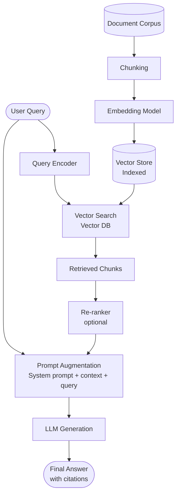
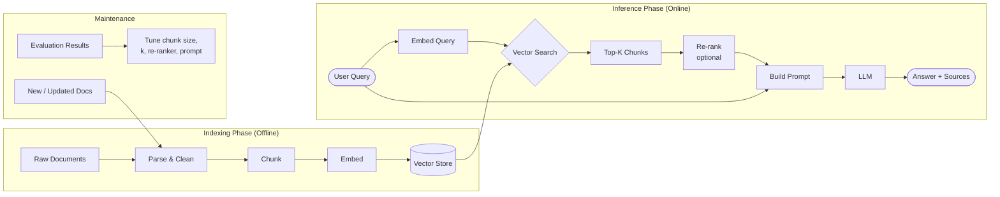
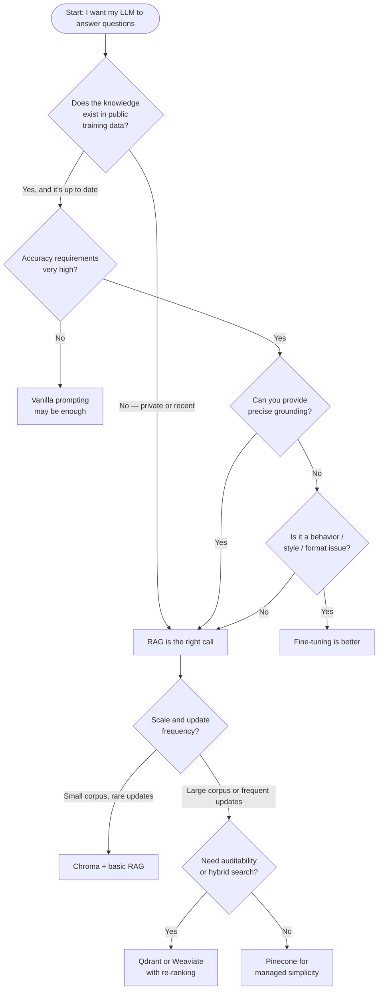

In early 2023 I watched a live demo of a GPT-4 chatbot go sideways in real time. The company had trained the model to answer questions about their internal knowledge base — three years of engineering runbooks, architecture decisions, postmortem docs. The model was confident, articulate, and wrong on roughly one in four answers. It was inventing details it had never seen because the knowledge base wasn't actually in the context. It was only described in a system prompt.

That team eventually rebuilt their system using retrieval-augmented generation, cut their hallucination rate by roughly 80%, and shipped to production three months later. RAG is not magic, but it is currently the most practical solution to the "LLMs don't know what's in your data" problem. This guide explains how it works, how to build it, and how to make it production-ready.

---

## What Is RAG?

**Retrieval-augmented generation** (RAG) is an architecture pattern that gives a language model access to external knowledge at inference time by retrieving relevant documents and injecting them into the prompt before generation.

Without RAG, an LLM answers from its parametric memory — everything compressed into its weights during training. That memory has a knowledge cutoff, knows nothing about your private data, and hallucinates when asked about things it barely remembers. With RAG, the model gets a curated slice of real, current, specific information for every query. Its job shifts from "remember the answer" to "synthesize an answer from the provided evidence."

The conceptual shift is important. Fine-tuning teaches the model new facts by updating its weights. RAG supplies facts at runtime without touching the weights. Fine-tuning is like studying for an exam; RAG is like taking the exam with an open book. For most teams, the open-book approach is faster to build, easier to update, cheaper to maintain, and produces more auditable outputs.

---

## RAG Architecture: How the Pipeline Works

Here's the complete architecture of a production RAG system, from user query to generated answer:



The pipeline has two distinct phases:

**Indexing** (offline, run once or incrementally): Documents are chunked, embedded into dense vectors, and stored in a vector database. This is the foundation the retrieval step searches against.

**Inference** (online, every query): The user's query is embedded using the same model, the vector database is searched for the closest chunks, those chunks are injected into the prompt alongside the original query, and the LLM generates a grounded answer.

Every component in this pipeline is a lever you can tune. The rest of this guide walks through each one.

---

## Why RAG Beats Fine-Tuning for Most Use Cases

This is the question I get most often. The honest answer is that they solve different problems, but RAG wins for the majority of practical production scenarios.

**Knowledge currency**: Fine-tuned weights go stale. A model fine-tuned on your docs in January doesn't know about the architectural decision you made in March. RAG reads from your live knowledge base. Update the index, update the answers.

**Auditability**: When a RAG system answers a question, you can show the user exactly which source chunks were used. That's not possible with fine-tuning — the knowledge is baked into weight parameters with no traceability.

**Data volume**: Fine-tuning requires enough high-quality training examples to move model behavior. RAG just requires documents. If you have 10,000 runbooks but only 200 Q&A pairs, RAG is the right call.

**Cost and iteration speed**: Fine-tuning a frontier model costs real money and takes hours or days. RAG infrastructure takes hours to set up initially, then updates cost the price of re-indexing changed documents.

**Where fine-tuning wins**: Style, format, tone, domain-specific reasoning patterns, tasks where you want the model to internalize a way of thinking rather than recall specific facts. Code generation fine-tunes well. Customer support tone fine-tunes well. "Answer questions about our product documentation" does not benefit much from fine-tuning that RAG can't match at lower cost.

---

## Building a RAG Pipeline: Step by Step

I'll build a minimal but functional RAG system using Python, LangChain, OpenAI embeddings, and Chroma as the vector store. The same principles apply regardless of which libraries you use.

### Step 1: Install dependencies

```python
pip install langchain langchain-openai langchain-chroma chromadb tiktoken
```

### Step 2: Load and split your documents

```python
from langchain_community.document_loaders import DirectoryLoader, TextLoader
from langchain.text_splitter import RecursiveCharacterTextSplitter

# Load all .md files from a docs directory
loader = DirectoryLoader("./docs", glob="**/*.md", loader_cls=TextLoader)
documents = loader.load()

# Split into chunks
splitter = RecursiveCharacterTextSplitter(
    chunk_size=512,
    chunk_overlap=64,
    separators=["\n\n", "\n", ". ", " ", ""],
)
chunks = splitter.split_documents(documents)
print(f"Created {len(chunks)} chunks from {len(documents)} documents")
```

### Step 3: Embed and index

```python
from langchain_openai import OpenAIEmbeddings
from langchain_chroma import Chroma

embeddings = OpenAIEmbeddings(model="text-embedding-3-small")

vectorstore = Chroma.from_documents(
    documents=chunks,
    embedding=embeddings,
    persist_directory="./chroma_db",
)
```

### Step 4: Build the retrieval chain

```python
from langchain_openai import ChatOpenAI
from langchain.chains import RetrievalQA
from langchain.prompts import PromptTemplate

PROMPT_TEMPLATE = """You are a helpful assistant. Answer the question using ONLY the context below.
If the context does not contain the answer, say "I don't have enough information to answer that."

Context:
{context}

Question: {question}

Answer:"""

prompt = PromptTemplate(
    template=PROMPT_TEMPLATE,
    input_variables=["context", "question"],
)

llm = ChatOpenAI(model="gpt-4o-mini", temperature=0)
retriever = vectorstore.as_retriever(search_kwargs={"k": 5})

qa_chain = RetrievalQA.from_chain_type(
    llm=llm,
    retriever=retriever,
    chain_type_kwargs={"prompt": prompt},
    return_source_documents=True,
)
```

### Step 5: Query it

```python
result = qa_chain.invoke({"query": "How do we handle database migrations?"})
print(result["result"])
print("\nSources:")
for doc in result["source_documents"]:
    print(f"  - {doc.metadata['source']}")
```

That's a working RAG pipeline in under 50 lines. The rest of the work — and most of the quality delta — comes from tuning each component.

---

## Chunking Strategies

Chunking is where most RAG implementations either gain or lose significant quality. The wrong chunk size is one of the most common reasons a RAG system underperforms.

**Fixed-size chunking** (what most tutorials show) splits text every N tokens with optional overlap. It's fast and simple but oblivious to document structure. A chunk might start in the middle of a sentence, split a code block, or contain half a section header and half of an unrelated paragraph.

**Recursive character splitting** (what I showed above) is better — it tries to respect natural boundaries by breaking on paragraph breaks first, then newlines, then sentences. It's the right default for unstructured text.

**Semantic chunking** embeds every sentence, measures cosine similarity to the next sentence, and splits when similarity drops below a threshold. This keeps semantically coherent ideas together. It's significantly better for documents with clear topic transitions, at the cost of being slower and more complex to implement.

**Document-structure-aware chunking** respects headings, bullet lists, code blocks, and table cells as chunk boundaries. For Markdown documentation, this is often the best approach. For PDFs, it requires careful parsing.

**My practical recommendation**: Start with `RecursiveCharacterTextSplitter` at 512 tokens with 10-15% overlap. Run your evaluation (more on this below), then experiment with semantic chunking if retrieval quality is still the bottleneck.

---

## Embedding Models

The embedding model determines the quality of your semantic search. Every chunk and every query is encoded into a dense vector; retrieval is the search for the closest vectors. A better embedding model means better retrieval, which means better answers downstream.

As of early 2026, the models I reach for most often:

| Model | Dimensions | Context | Best For |
|---|---|---|---|
| `text-embedding-3-small` (OpenAI) | 1536 | 8k tokens | Cost-efficient baseline, strong general performance |
| `text-embedding-3-large` (OpenAI) | 3072 | 8k tokens | Higher accuracy when cost isn't the constraint |
| `embed-english-v3.0` (Cohere) | 1024 | 512 tokens | Strong on shorter chunks, good reranking integration |
| `nomic-embed-text` (open-weight) | 768 | 8k tokens | Local/private deployments, competitive quality |
| `mxbai-embed-large` (open-weight) | 1024 | 512 tokens | Top open-weight option for retrieval benchmarks |

One thing that catches teams off guard: **you must use the same embedding model at index time and query time.** If you re-index with a different model, you must rebuild the entire vector store. Plan your model choice before you index at scale.

---

## Vector Databases

The vector database stores your embeddings and executes approximate nearest-neighbor (ANN) search at query time. The right choice depends on your scale, existing infrastructure, and operational tolerance.

**Chroma**: Best for local development and small-to-medium production deployments. Simple API, no external dependencies, persistent storage. I use it for any project under ~1M chunks.

**Pinecone**: Fully managed, scales to hundreds of millions of vectors without operational overhead. The right choice when you want search infrastructure without managing it. Pay-per-use pricing adds up at scale.

**Weaviate**: Open-source, supports hybrid search (vector + BM25 keyword) out of the box. Good option when you want hybrid search without building it yourself.

**Qdrant**: Open-source, high performance, excellent filtering support. My preference for self-hosted deployments that need granular metadata filtering alongside vector search.

**pgvector**: If you're already on PostgreSQL, the pgvector extension adds vector similarity search without adding a new infrastructure component. Quality is lower than purpose-built ANN databases at scale, but often good enough for smaller corpora with simpler retrieval needs.

---

## Complete RAG Workflow

Here's how indexing and inference fit together across the full system lifecycle:



---

## Advanced RAG: Re-ranking, Hybrid Search, and HyDE

Once the basic pipeline works, these three techniques produce the biggest quality improvements.

### Re-ranking

Vector search returns the top-K most semantically similar chunks. That's not the same as the K most useful chunks for answering the question. A cross-encoder re-ranker takes the query and each retrieved chunk as a pair and scores their relevance directly — more expensive than embedding search, but dramatically more accurate.

```python
from langchain.retrievers import ContextualCompressionRetriever
from langchain_cohere import CohereRerank

compressor = CohereRerank(model="rerank-english-v3.0", top_n=3)
compression_retriever = ContextualCompressionRetriever(
    base_compressor=compressor,
    base_retriever=retriever,
)
```

In my experience, adding re-ranking improves answer quality more than going from `k=5` to `k=20` in raw retrieval. Start with Cohere's reranker or a local cross-encoder from `sentence-transformers`.

### Hybrid Search

Pure vector search excels at semantic similarity but struggles with exact keywords, product names, version numbers, and acronyms. BM25 (keyword search) is the inverse — exact on keywords, blind to semantics. Hybrid search combines both, typically by summing their scores with a tunable weight.

```python
from langchain.retrievers import EnsembleRetriever
from langchain_community.retrievers import BM25Retriever

bm25_retriever = BM25Retriever.from_documents(chunks)
bm25_retriever.k = 5

ensemble_retriever = EnsembleRetriever(
    retrievers=[bm25_retriever, retriever],
    weights=[0.4, 0.6],  # tune based on your corpus
)
```

For technical documentation with specific API names, error codes, or product SKUs, hybrid search consistently outperforms pure vector retrieval. Start with 40% BM25 / 60% vector and tune from there.

### HyDE (Hypothetical Document Embedding)

HyDE is an elegant technique for improving retrieval on queries that are phrased very differently from the documents they should match. Instead of embedding the raw query, you ask the LLM to generate a hypothetical answer, embed that, and use it to search. The hypothetical answer is in the same style as the documents it should retrieve.

```python
from langchain.chains import HypotheticalDocumentEmbedder

hyde_embeddings = HypotheticalDocumentEmbedder.from_llm(
    llm=ChatOpenAI(model="gpt-4o-mini"),
    base_embeddings=embeddings,
    custom_instructions="Write a passage that would answer the following question:",
)

hyde_retriever = vectorstore.as_retriever(search_kwargs={"k": 5})
hyde_retriever.vectorstore._embedding_function = hyde_embeddings
```

HyDE works well when users ask vague or high-level questions that don't naturally match the technical language in your corpus. It adds one LLM call per query, so use it selectively on queries where retrieval quality is otherwise low.

---

## Evaluating Your RAG Pipeline

Evaluation is where RAG projects succeed or fail in the long run. Without a measurement framework, you're flying blind — you can't tell whether a change to chunk size or retrieval parameters helped or hurt.

The three metrics I track for every RAG system:

**Context Precision**: Of the chunks retrieved, what fraction were actually relevant to the question? High context precision means the retriever isn't pulling in noise.

**Context Recall**: Of the information needed to answer the question, what fraction was present in the retrieved chunks? High context recall means nothing important was missed.

**Answer Faithfulness**: Is the generated answer grounded in the retrieved context? A faithfulness score of 1.0 means every claim in the answer can be traced to the retrieved chunks.

RAGAS is the library I use most for automated RAG evaluation:

```python
from ragas import evaluate
from ragas.metrics import (
    context_precision,
    context_recall,
    faithfulness,
    answer_relevancy,
)
from datasets import Dataset

test_cases = Dataset.from_dict({
    "question": ["How do we handle database migrations?"],
    "ground_truth": ["We use Alembic for migrations, run in CI before deployment."],
    "answer": [result["result"]],
    "contexts": [[doc.page_content for doc in result["source_documents"]]],
})

scores = evaluate(test_cases, metrics=[
    context_precision,
    context_recall,
    faithfulness,
    answer_relevancy,
])
print(scores)
```

Build a test set from real user queries before you go to production. Fifty diverse, representative questions with known correct answers is enough to drive meaningful improvement decisions.

---

## Should You Use RAG? A Decision Flowchart



---

## Common RAG Failures (and Fixes)

**Wrong chunks retrieved**: The model answers confidently from irrelevant context. Fix: add re-ranking, try hybrid search, check your chunk boundaries for split semantic units.

**Missing information in retrieved context**: The answer exists in the corpus but retrieval never surfaces it. Fix: increase `k`, add BM25 hybrid search, check if the relevant content is buried in a format the embedder handles poorly (tables, code blocks).

**Model ignores retrieved context**: The model answers from its weights instead of the injected chunks. Fix: strengthen the system prompt with explicit grounding instructions ("Answer ONLY based on the provided context"), reduce temperature to 0, use a model with longer reliable context utilization.

**Chunk overlap causes duplicate information**: The answer repeats the same fact three times from overlapping chunks. Fix: reduce overlap percentage, add a deduplication step before prompt injection.

**Stale index**: The knowledge base has been updated but the vector store hasn't been re-indexed. Fix: implement incremental indexing triggered by document changes, add a metadata field for `last_indexed_at` and monitor it.

**Context window overflow**: Too many chunks push the query and system prompt out of the effective context window. Fix: re-rank and trim to top 3-5 chunks, use a model with larger context, or implement hierarchical retrieval (coarse then fine).

---

## Verdict

RAG is the right default architecture for any production LLM system that needs to answer questions about private, recent, or domain-specific information. It's faster to build than fine-tuning, produces auditable outputs, and keeps your knowledge base decoupled from your model weights so you can update either independently.

The quality ceiling is real — RAG won't save you from a terrible embedding model or a corpus of poorly maintained documents — but it's a much higher ceiling than you'll hit with parametric memory alone. Start with the basic pipeline, measure context precision and faithfulness from day one, and layer in re-ranking and hybrid search when your evaluation data shows it's worth it.

The teams I've seen get the most out of RAG are the ones that treated it as a product problem, not just an engineering problem: they maintained their knowledge base, reviewed retrieval failures regularly, and iterated on chunking strategy based on real user queries. The underlying technology is straightforward. The discipline of keeping it working well is where the real work lives.

---

## FAQ

### What's the difference between RAG and a vector database?

A vector database is one component inside a RAG system — it's the index that stores embeddings and executes similarity search. RAG is the broader architecture: chunking, embedding, retrieval, prompt augmentation, and generation together. You can have a vector database without RAG (for semantic search alone), but RAG always needs a vector database or similar retrieval mechanism.

### How many chunks should I retrieve per query?

Start with `k=5`. More chunks give the model more context but increase token cost and can dilute the most relevant information. After adding a re-ranker, you can retrieve more and trim to the top 3. The right number depends on your average chunk size and how many chunks typically contain relevant information for a given query — measure it with context recall.

### Can RAG work with structured data like databases and spreadsheets?

Yes, but the approach differs. For tables and spreadsheets, consider text-to-SQL (let the LLM generate queries against the real database) rather than embedding tabular data into chunks. Semi-structured data like JSON can be chunked if flattened into descriptive text. Pure columnar data (financial records, metrics) usually retrieves better via SQL than vector search.

### Does RAG work with multimodal content — PDFs with images, diagrams, charts?

Increasingly yes. Vision-capable models can process page images directly, and tools like LlamaParse or unstructured.io can extract structured text from complex PDFs. For charts and diagrams, OCR plus a vision model to generate a text description of the chart works reasonably well. Multimodal RAG is an active area of development and the tooling is improving quickly.

### How do I handle confidential information in a RAG system?

Metadata filtering is your primary tool. Tag every chunk at index time with access control metadata (user role, department, classification level), then filter the vector search at query time to only retrieve chunks the current user is authorized to see. Never mix chunks from different sensitivity levels in the same prompt without explicit access verification. For the most sensitive data, consider a separate index per sensitivity level rather than metadata filtering on a shared index.
