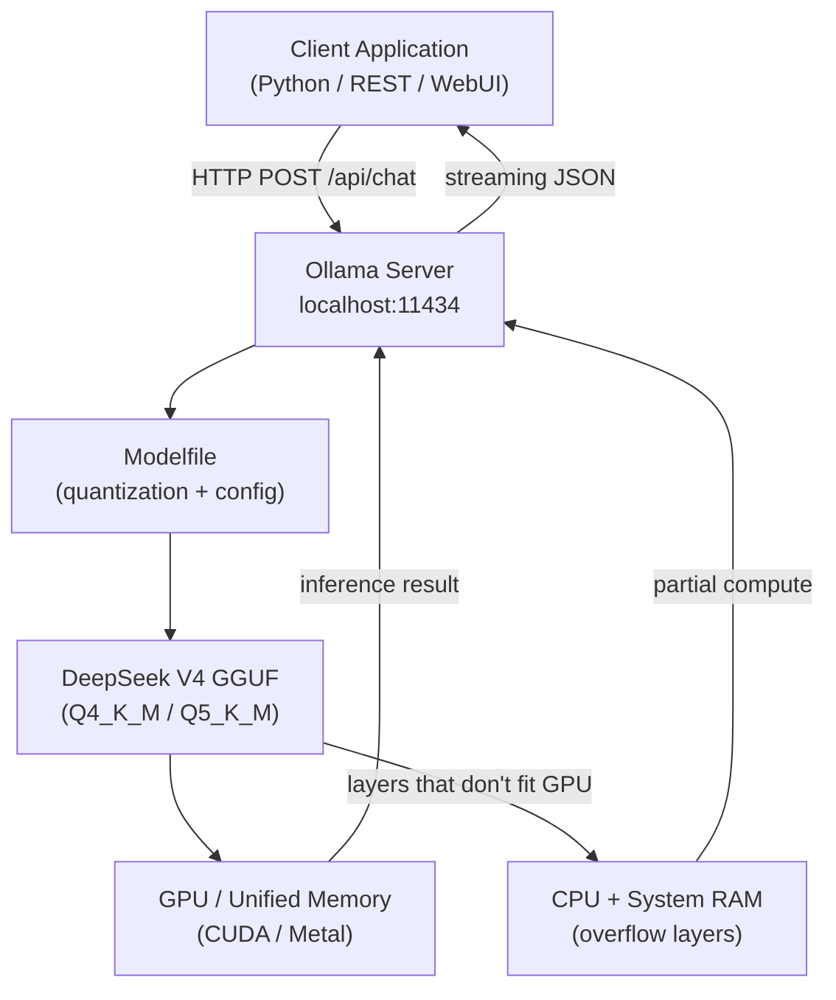
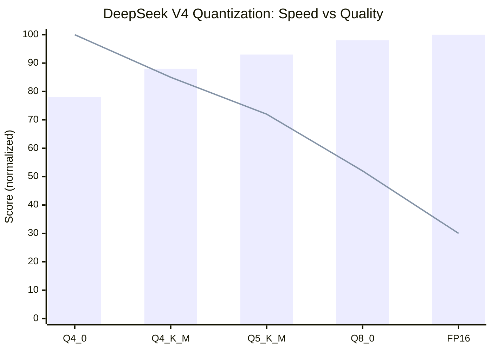
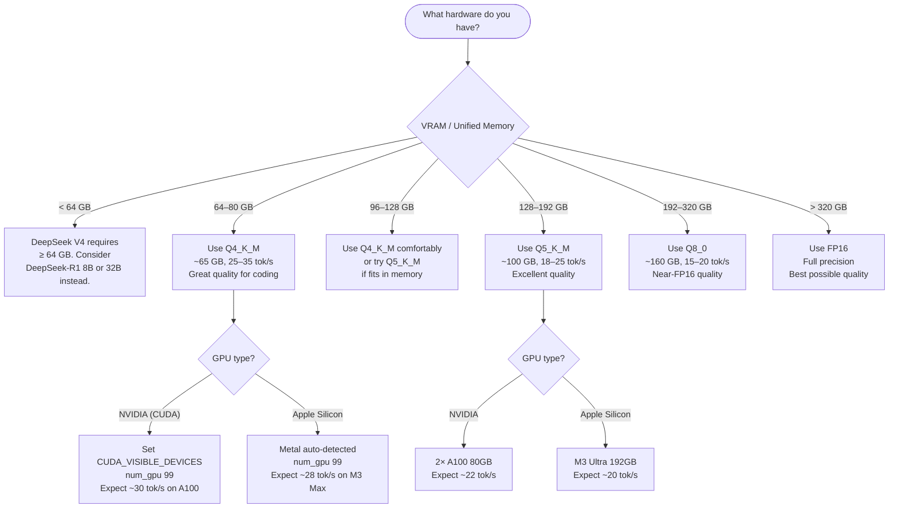

I spent two weekends getting DeepSeek V4 running on local hardware before I got the configuration dialed in. This guide compresses everything I learned into a single walkthrough so you don't have to repeat my mistakes.

DeepSeek V4 is a frontier-class mixture-of-experts model that rivals GPT-4o on coding and reasoning benchmarks — and you can run it on your own machine for free, with no API keys, no rate limits, and no data leaving your network. The catch is that it demands serious hardware and careful quantization choices. Let's go through exactly what you need.

## Why Run DeepSeek V4 Locally?

Before we get into commands, it's worth being clear about the trade-offs. Running locally is not always the right choice — but when it is, the advantages are significant.

**Privacy.** Every prompt you send to a cloud API is logged, processed, and potentially used for training or compliance review. For proprietary codebases, internal documents, or regulated data, local inference means your data never leaves your machine or network. This is the single biggest reason enterprise teams make the switch.

**Cost.** DeepSeek V4 API pricing is competitive, but at high volume — tens of millions of tokens per day — the cost adds up. Once you have the hardware, local inference has zero marginal cost per token. A team running continuous automated code review or test generation can pay back the GPU cost in weeks.

**No rate limits.** Cloud APIs enforce rate limits that are annoying for batch jobs, fine-tuning experiments, or any workflow that needs to fire many requests in parallel. Running locally means you can saturate your hardware without throttling.

**Offline capability.** Air-gapped environments, travel, and poor connectivity all become non-issues when your model is running on localhost.

The trade-off is upfront investment: you need the right hardware, and setup takes a few hours the first time.

## Hardware Requirements

DeepSeek V4 uses a mixture-of-experts architecture with 671B total parameters, but only about 37B are active per token. This makes it more efficient than a dense 671B model, but it still has large memory requirements depending on quantization.

| Quantization | VRAM Required | RAM Fallback | Recommended Hardware | Tokens/sec (A100 80GB) |
|---|---|---|---|---|
| FP16 (full) | ~320 GB VRAM | N/A | 4× A100 80GB or H100 cluster | 8–12 |
| Q8_0 | ~160 GB VRAM | ~160 GB unified RAM | 2× A100 80GB | 15–20 |
| Q5_K_M | ~100 GB VRAM | ~100 GB unified RAM | Mac M3 Ultra (192 GB) | 18–25 |
| Q4_K_M | ~65 GB VRAM | ~65 GB unified RAM | Mac M2/M3 Max (128 GB) | 25–35 |
| Q4_0 | ~55 GB VRAM | ~55 GB unified RAM | Mac M2/M3 Pro (96 GB) | 28–40 |

For most developers running this at home or on a single workstation, I recommend targeting Q4_K_M. It provides an excellent balance of quality and speed with manageable memory requirements. If you have a Mac Studio with 192 GB unified memory, Q5_K_M is worth the extra quality.

If you're on a Linux box with discrete NVIDIA GPUs, two A100 80GBs will comfortably run Q5_K_M with full GPU offload and excellent throughput.

## System Architecture

Here's how the pieces fit together when you run DeepSeek V4 locally with Ollama:



Ollama wraps llama.cpp under the hood, handles model downloading and caching, and exposes a REST API on port 11434. The Modelfile lets you set default parameters like context length, temperature, and GPU layer counts. The GGUF file is the quantized model itself, downloaded once and cached in `~/.ollama/models`.

## Installing Ollama

### macOS

```bash
# Install via the official installer
curl -fsSL https://ollama.com/install.sh | sh

# Or via Homebrew (recommended for developers)
brew install ollama

# Start the Ollama service
ollama serve
```

Ollama on macOS automatically uses Metal for GPU acceleration on Apple Silicon. No additional drivers needed.

### Linux (NVIDIA GPU)

```bash
# Install Ollama
curl -fsSL https://ollama.com/install.sh | sh

# Verify CUDA is available (should show your GPU)
nvidia-smi

# Start the server as a systemd service (recommended for production)
sudo systemctl enable ollama
sudo systemctl start ollama

# Or run in the foreground for testing
ollama serve
```

For NVIDIA GPUs, Ollama requires CUDA 12.x. Install the CUDA toolkit from NVIDIA's site if you haven't already. Ollama will automatically detect and use available GPUs.

### Windows

Download the Ollama installer from `https://ollama.com/download/windows`. It installs as a tray application and starts automatically on boot. For WSL2 users, install Ollama inside WSL2 and follow the Linux instructions — this gives better GPU passthrough performance.

### Verify the Installation

```bash
ollama --version
# ollama version 0.6.x

# Check the server is running
curl http://localhost:11434/api/tags
# {"models":[]}
```

## Running DeepSeek V4

### Pull the Model

```bash
# Q4_K_M — recommended for most hardware (65 GB download)
ollama pull deepseek-v4:671b-q4_K_M

# Q5_K_M — better quality, more VRAM (100 GB download)
ollama pull deepseek-v4:671b-q5_K_M

# Q8_0 — near full quality (160 GB download)
ollama pull deepseek-v4:671b-q8_0
```

The download will take a while depending on your connection. Ollama shows progress and resumes interrupted downloads automatically.

### Start an Interactive Session

```bash
# Start a chat session
ollama run deepseek-v4:671b-q4_K_M

# You'll see the prompt
>>> Write a Python function that implements binary search with full type hints

# Exit with /bye or Ctrl+D
```

### Run a One-Shot Prompt

```bash
ollama run deepseek-v4:671b-q4_K_M "Explain the difference between MoE and dense transformer architectures in 3 sentences"
```

### List Downloaded Models

```bash
ollama list
# NAME                          ID              SIZE    MODIFIED
# deepseek-v4:671b-q4_K_M      abc123def456    65 GB   2 minutes ago
```

## Available Quantizations Explained

Not all quantizations are equal. Here's what you actually get with each option and when to use it:

**Q4_K_M (4-bit, K-Quant, Medium)** is my daily driver. The K-Quant format uses higher precision for the most important weight matrices, which recovers a significant portion of quality lost in naive 4-bit quantization. For coding, summarization, and general reasoning, the quality gap versus FP16 is minimal in practice. Use this if you have 64–80 GB of unified memory or VRAM.

**Q5_K_M (5-bit, K-Quant, Medium)** is the sweet spot if you have the memory. The extra bit per weight noticeably improves math reasoning, instruction following on complex prompts, and multi-step reasoning chains. If you have a Mac M3 Ultra or two A100 80GBs, I'd choose this.

**Q8_0 (8-bit)** is essentially indistinguishable from FP16 for most tasks. The quantization error is so small that you'd need careful benchmarking to detect it. Worth using if memory allows, but the jump from Q5_K_M is smaller than the jump from Q4_K_M to Q5_K_M.

**FP16 (full precision)** requires roughly 320 GB of VRAM. This is only practical on large GPU clusters. For most developers, Q8_0 gives you 99%+ of FP16 quality at half the memory cost.

## Quantization Performance Comparison



The bars represent quality (normalized to FP16 = 100) and the line represents relative throughput (tokens/sec, normalized to Q4_0 = 100). There's a clear Pareto frontier at Q4_K_M and Q5_K_M — these quantizations give the best quality-per-token-of-memory and quality-per-second of any option.

## API Integration

One of Ollama's biggest advantages is its OpenAI-compatible API. Any client that talks to OpenAI's API can talk to Ollama with a one-line URL change.

### REST API

```bash
# Basic completion
curl http://localhost:11434/api/generate \
  -H "Content-Type: application/json" \
  -d '{
    "model": "deepseek-v4:671b-q4_K_M",
    "prompt": "Write a SQL query to find the top 10 customers by revenue",
    "stream": false
  }'

# Chat completion (OpenAI-compatible format)
curl http://localhost:11434/v1/chat/completions \
  -H "Content-Type: application/json" \
  -d '{
    "model": "deepseek-v4:671b-q4_K_M",
    "messages": [
      {"role": "system", "content": "You are a helpful coding assistant."},
      {"role": "user", "content": "Explain async/await in Python"}
    ],
    "temperature": 0.7,
    "stream": true
  }'
```

### Python SDK (OpenAI-compatible)

```python
from openai import OpenAI

# Point the OpenAI client at your local Ollama server
client = OpenAI(
    base_url="http://localhost:11434/v1",
    api_key="ollama",  # required by the client, but not validated by Ollama
)

response = client.chat.completions.create(
    model="deepseek-v4:671b-q4_K_M",
    messages=[
        {"role": "system", "content": "You are an expert Python developer."},
        {"role": "user", "content": "Review this function for bugs and suggest improvements:\n\ndef parse_csv(path):\n    data = open(path).read()\n    return [row.split(',') for row in data.split('\\n')]"},
    ],
    temperature=0.3,
    max_tokens=2000,
    stream=True,
)

for chunk in response:
    if chunk.choices[0].delta.content:
        print(chunk.choices[0].delta.content, end="", flush=True)
```

### Using the Ollama Python Library Directly

```python
import ollama

# Stream a response
for chunk in ollama.chat(
    model="deepseek-v4:671b-q4_K_M",
    messages=[{"role": "user", "content": "Write a Rust implementation of a concurrent queue"}],
    stream=True,
):
    print(chunk["message"]["content"], end="", flush=True)

# Embeddings (for RAG pipelines)
response = ollama.embeddings(
    model="deepseek-v4:671b-q4_K_M",
    prompt="Local AI inference with Ollama",
)
print(response["embedding"][:5])  # First 5 dimensions
```

## Advanced Configuration

### Custom Modelfile

Create a Modelfile to set persistent defaults for your use case:

```
# ~/DeepSeekV4Modelfile
FROM deepseek-v4:671b-q4_K_M

# System prompt for coding assistant
SYSTEM """
You are an expert software engineer. Provide precise, working code with brief explanations.
Always include error handling and type hints in Python code.
"""

# Parameters
PARAMETER temperature 0.2
PARAMETER top_p 0.9
PARAMETER top_k 40
PARAMETER num_ctx 32768
PARAMETER num_gpu 99
PARAMETER num_thread 8
PARAMETER repeat_penalty 1.1
```

```bash
# Create a named model from your Modelfile
ollama create deepseek-v4-coder -f ~/DeepSeekV4Modelfile

# Use it
ollama run deepseek-v4-coder
```

### Key Parameters Explained

**`num_ctx`** sets the context window size in tokens. DeepSeek V4 supports up to 128K tokens natively. Larger context uses proportionally more memory — 32K is a good default, bump to 64K or 128K only if your use case requires it.

**`num_gpu`** controls how many layers to offload to GPU. Set to `99` to offload everything that fits. If the model is too large for your VRAM, Ollama will automatically fall back to CPU for the remaining layers. You can tune this manually to optimize the GPU/CPU split.

**`num_thread`** is the CPU thread count for layers running on CPU. Set this to your physical core count (not hyperthreads) for best performance.

**`temperature`** between 0.1 and 0.3 is ideal for coding tasks. Higher values (0.7–1.0) work better for creative or brainstorming tasks.

### Environment Variables

```bash
# Increase VRAM budget (useful if Ollama underestimates available memory)
OLLAMA_MAX_VRAM=80000000000 ollama serve

# Set number of parallel request slots (for serving multiple clients)
OLLAMA_NUM_PARALLEL=2 ollama serve

# Enable verbose logging
OLLAMA_DEBUG=1 ollama serve

# Change the model storage directory
OLLAMA_MODELS=/data/ollama/models ollama serve
```

## Ollama + Open WebUI

Open WebUI gives you a full ChatGPT-style interface connected to your local Ollama instance. It takes about two minutes to set up.

```bash
# Requires Docker
docker run -d \
  --network=host \
  -v open-webui:/app/backend/data \
  -e OLLAMA_BASE_URL=http://localhost:11434 \
  --name open-webui \
  --restart always \
  ghcr.io/open-webui/open-webui:main
```

Open your browser to `http://localhost:8080`. You'll see a full chat interface with model selection, conversation history, system prompt configuration, and file upload. You can switch between your local DeepSeek V4 and any other Ollama model from the dropdown.

For multi-user setups, add authentication:

```bash
docker run -d \
  --network=host \
  -v open-webui:/app/backend/data \
  -e OLLAMA_BASE_URL=http://localhost:11434 \
  -e WEBUI_AUTH=true \
  --name open-webui \
  ghcr.io/open-webui/open-webui:main
```

## Performance Tuning Tips

**Tip 1: Maximize GPU utilization before touching anything else.** Run `nvidia-smi dmon` (Linux) or Activity Monitor GPU History (Mac) while running inference. If GPU utilization is below 90%, you're likely bottlenecked by the host-to-GPU transfer or CPU layers. Increase `num_gpu` in your Modelfile.

**Tip 2: Use Flash Attention.** If you're building from source or using a newer Ollama version that exposes it, enabling Flash Attention reduces VRAM usage for long contexts by 30–40% with no quality loss.

**Tip 3: Batch your requests.** Ollama processes requests sequentially by default. For batch workloads, use the `OLLAMA_NUM_PARALLEL` environment variable to enable concurrent inference (at the cost of higher peak VRAM).

**Tip 4: Keep context short.** Each additional token in the context increases compute linearly. If you're running automated pipelines, trim the context aggressively. Pass only the relevant code or document chunk, not entire files.

**Tip 5: Use the right temperature for the task.** Temperature 0.1–0.2 for code generation and factual tasks. Temperature 0.7–0.9 for brainstorming. Temperature 1.0+ for creative writing. Getting this wrong wastes tokens on bad candidates.

**Tip 6: Pre-warm the model.** Send a short dummy request after starting Ollama to load the model weights into GPU memory before your first real request. Cold starts add several seconds of latency.

```bash
# Pre-warm script
curl -s http://localhost:11434/api/generate \
  -d '{"model":"deepseek-v4:671b-q4_K_M","prompt":"hi","stream":false}' > /dev/null
```

## Choosing the Right Quantization for Your Hardware



## Alternatives to Ollama

Ollama is my first recommendation because it has the best developer experience and the smallest setup overhead. But it's not the only option.

**LM Studio** is a desktop GUI application for Mac, Windows, and Linux. It's excellent for non-technical users — you browse a model catalog, click Download, and click Run. The built-in chat interface is polished. The trade-off is less flexibility for programmatic use and no built-in API server in the free tier. Worth recommending to teammates who aren't comfortable with the command line.

**vLLM** is the right choice for production serving on Linux with NVIDIA GPUs. It implements PagedAttention for dramatically higher throughput under concurrent load — if you're serving 10+ users simultaneously, vLLM will handle the load far better than Ollama's sequential queue. The setup is more involved: it requires Python, CUDA, and manual configuration.

```bash
# vLLM example (requires NVIDIA GPU with CUDA)
pip install vllm
vllm serve deepseek-ai/DeepSeek-V4 \
  --tensor-parallel-size 4 \
  --quantization fp8 \
  --max-model-len 32768
```

**llama.cpp** is the lowest-level option — it's the underlying inference engine that both Ollama and LM Studio use. Running it directly gives you maximum control over every parameter, but you're responsible for managing GGUF files, building with the right CUDA flags, and writing your own API layer. I'd only go this route if you need capabilities that Ollama doesn't expose.

**text-generation-webui (oobabooga)** is a full-featured web UI with extensive model management, LoRA support, and a plugin system. It's popular in the hobbyist community for fine-tuning experiments. Performance and stability have improved significantly, but it's still more complex to set up than Ollama.

## Verdict

Running DeepSeek V4 locally with Ollama is genuinely practical in 2026 if you have the hardware. The Q4_K_M quantization delivers performance that's competitive with GPT-4o on coding tasks, runs at 25–35 tokens per second on a single A100 or a Mac M3 Max, and costs nothing after the hardware investment.

The setup process I've described here should take you from zero to a running model in under an hour, assuming your hardware meets the requirements. The Ollama REST API means you can drop this into any existing OpenAI-compatible workflow with a one-line change.

Where I'd still use the cloud API: tasks requiring 128K context on a machine with limited memory, latency-sensitive applications where 25 tok/s isn't fast enough, and any workflow where you need guaranteed uptime without managing your own infrastructure. For everything else — especially privacy-sensitive code review, internal document analysis, and development experimentation — running locally is the right call.

## FAQ

### How is DeepSeek V4 different from DeepSeek-R1?

DeepSeek V4 is the base chat model optimized for general instruction following, coding, and reasoning. DeepSeek-R1 is a reasoning-specialized variant that uses chain-of-thought processes internally to tackle complex math and logic problems. R1 is slower (it "thinks" before answering) but significantly stronger on problems requiring multi-step reasoning. For most coding assistant use cases, V4 is the better default. For math tutoring, scientific reasoning, or complex algorithm design, R1 is worth the latency cost.

### Can I run DeepSeek V4 on a consumer GPU like an RTX 4090?

The RTX 4090 has 24 GB of VRAM, which is not enough for DeepSeek V4 even at the smallest quantization. You'd need to offload most layers to CPU RAM, resulting in very slow inference (2–5 tokens/sec). For a single consumer GPU, I'd recommend DeepSeek-V4's smaller sibling DeepSeek-R1 7B or 14B, which runs excellently on 24 GB. If you want a larger model on one consumer GPU, the 32B Q4_K_M variant fits in 24 GB and delivers strong quality.

### Does Ollama support multi-GPU setups for DeepSeek V4?

Yes. On Linux with NVIDIA GPUs, Ollama automatically distributes model layers across all available GPUs when a single GPU has insufficient VRAM. Set `CUDA_VISIBLE_DEVICES=0,1` to specify which GPUs to use. Tensor parallelism (splitting layers across GPUs) isn't currently supported in Ollama — if you need that, use vLLM instead. For most multi-GPU setups where you're just trying to fit the model in memory, Ollama's layer-splitting approach works fine.

### What's the best way to use DeepSeek V4 locally for code review?

Set temperature to 0.1–0.2 for deterministic output and use a system prompt that specifies your language and standards. Pass the diff or specific function — not the entire codebase — to keep context tight. For CI integration, use the REST API from a script that runs on pull request creation. A typical code review prompt with a 2000-token diff takes about 60–90 seconds to process at 30 tokens/sec, which is perfectly usable in an asynchronous review workflow.

### How do I update DeepSeek V4 to a newer version when it's released?

Run `ollama pull deepseek-v4:671b-q4_K_M` again — Ollama will check if the manifest has changed and download only the updated layers. If you've created custom models with `ollama create`, you'll need to recreate them after pulling the new base. Your Modelfile stays unchanged; just run `ollama create your-model-name -f ~/YourModelfile` again. Old model versions remain on disk until you run `ollama rm deepseek-v4:671b-q4_K_M` to remove them.
