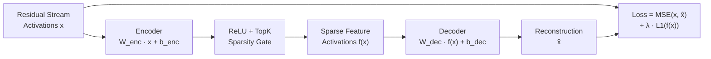
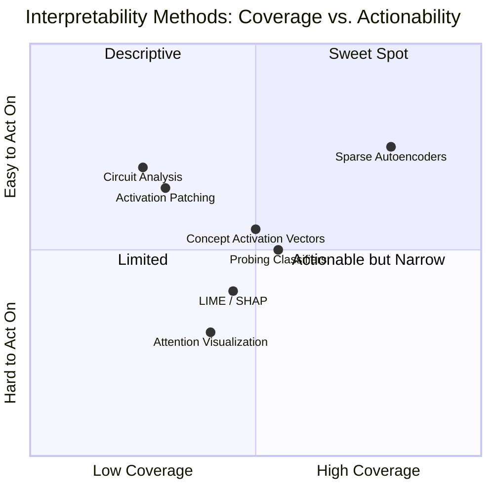
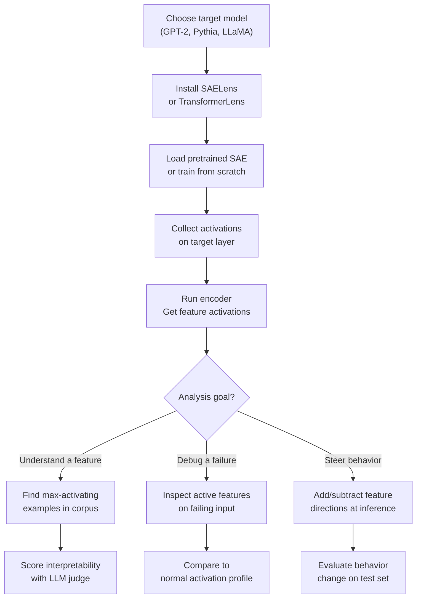

I've spent a lot of time watching AI systems behave in ways nobody predicted. A model refuses an innocuous request for no obvious reason. A reasoning chain looks sound but lands on a wrong answer. A safety filter trips on a false positive while missing the actual bad output. Each time, the honest answer to "why did it do that?" is: we don't fully know. Sparse autoencoders are the most credible attempt I've seen to change that answer.

This article covers what sparse autoencoders (SAEs) are, why they've become the sharpest tool in the mechanistic interpretability toolkit, what the research actually shows, and what a practitioner can do with them today. It's long because the subject is genuinely complex — but I'll keep the abstractions grounded in code and concrete examples throughout.

---

## What Is Mechanistic Interpretability?

Mechanistic interpretability is the subfield of AI research that tries to reverse-engineer what neural networks are actually computing, not just what they output. The goal is circuit-level understanding: which neurons activate, how they compose, and what concepts they represent.

The core challenge is that large language models operate in a high-dimensional activation space. A transformer layer might have 4,096 or 16,384 neurons. Each neuron activates on a complex, overlapping set of inputs. Looking at individual neuron activations directly is like reading memory addresses in hexadecimal — technically possible, thoroughly uninformative.

Early interpretability work at Anthropic, Redwood Research, and EleutherAI found some interpretable circuits in smaller models: induction heads that drive in-context learning, attention heads that implement indirect object identification, and a handful of dedicated "factual recall" circuits. But these findings don't scale. Individual neurons in large models are **polysemantic** — they respond to multiple unrelated concepts at once. A single neuron might fire on "banana", "the color yellow", and "radioactivity". Polysemanticity makes it nearly impossible to build a clean conceptual map from raw neuron activations.

The superposition hypothesis, formalized in Anthropic's 2022 paper *Toy Models of Superposition*, explains why. Models learn to pack more features than they have neurons by representing each feature as a sparse, nearly-orthogonal direction in activation space. This compression is computationally efficient — but it completely breaks naive interpretability methods.

Sparse autoencoders were proposed as the tool that breaks the compression back open.

---

## Why Sparse Autoencoders?

The intuition is elegant. If a model is storing features in superposition — representing N features across M neurons where N >> M — then a sparse autoencoder can learn a dictionary of those N features, each as a direction in the original activation space. Once you have the dictionary, you can decompose any activation vector into a sparse linear combination of interpretable features.

The word "sparse" is load-bearing. If you allow the reconstruction to use all features at once, the autoencoder has no incentive to find anything meaningful. Sparsity — penalizing the number of active features — forces the model to find a minimal, non-redundant set of directions that explain each activation. Those directions, empirically, tend to correspond to human-readable concepts.

This is dictionary learning, a technique from signal processing and neuroscience that predates LLMs by decades. What changed is the scale and the context: applying it to transformer activations to recover the implicit feature space of a frontier model.

---

## SAE Architecture



The architecture has four moving parts:

**Encoder.** A linear projection followed by a ReLU (or, in newer variants, a TopK gate). The encoder maps the d-dimensional activation vector into a larger hidden space — typically 4× to 32× wider than the original. This expanded space is where the individual features live.

**Sparsity gate.** Either an L1 penalty on the feature activations (classic SAE) or a hard TopK constraint that allows only the K largest activations through. TopK is increasingly preferred because it gives direct control over the sparsity budget without tuning a penalty coefficient.

**Decoder.** A linear map back to the original activation space. The decoder columns are the feature directions — each column represents one learned feature as a vector in the model's activation space.

**Loss.** The reconstruction loss (mean squared error between input and output) plus the sparsity term. The tension between these two objectives is what drives the autoencoder to find a parsimonious but accurate feature decomposition.

Training is unsupervised: you run the model on a large text corpus, collect activations at a target layer, and train the SAE on those activations. No human labels needed.

---

## How SAEs Work: Dictionary Learning, Sparsity, and Features

### Dictionary Learning

The decoder weight matrix W_dec is the dictionary. Each of its columns is a "dictionary atom" — a direction in the model's activation space that corresponds to one feature. If the dictionary has 16,384 entries and the model has 4,096 neurons, you've expanded the feature space by 4×. Anthropic's Claude 3 Sonnet SAEs use expansion factors up to 32× and dictionaries with hundreds of thousands of features.

After training, you identify what each feature means by finding the text examples where that feature fires most strongly. This is called **feature analysis by max-activating examples**. You take the top 20–50 text snippets that cause a given feature to activate, read them, and find the common thread. If the thread is clear and consistent — "all these passages mention DNA replication" or "all these passages are sarcastic" — the feature is probably meaningful.

### Sparsity

Real activations in a trained SAE are extremely sparse. On a given input, fewer than 1% of dictionary features are active. This matches the theory: any particular token in any particular context should require only a small set of concepts to explain its representation. Sparsity is both a training constraint and an empirical result that validates the approach.

### Feature Geometry

Features learned by SAEs are not random. They tend to cluster into interpretable groups. Antonyms (hot/cold, left/right) often appear as feature pairs with roughly opposite directions. Related concepts cluster in feature space. There's emerging evidence of compositional structure: some features are linear combinations of others in predictable ways.

This geometry is what makes SAEs potentially useful for something beyond mere description. If you understand the geometry, you can intervene on it.

---

## Key Research

### Anthropic's Work on Claude

The most significant SAE work to date is Anthropic's *Scaling and Evaluating Sparse Autoencoders* (2024), which trained SAEs on residual stream activations in Claude 3 Sonnet. The paper found features corresponding to:

- Specific named entities (people, places, organizations)
- Programming language constructs (Python f-strings, SQL joins)
- Emotional tone (frustration, excitement)
- Abstract concepts (recursion, irony, legal liability)
- Safety-relevant behaviors (deception, refusal triggers)

The paper also introduced a scalable evaluation method: **automated interpretability scoring** using a secondary LLM to judge whether feature activations match a human-readable description. This lets you evaluate tens of thousands of features without human review for each one.

A follow-up paper, *Mapping the Mind of a Large Language Model* (2024), analyzed a 1M-feature SAE on Claude 3 Sonnet and found features for the "Assistant" token that include concepts like slavery, imprisonment, and restriction — a striking finding about how the model has learned to represent its own role. This kind of result is exactly what interpretability research aims to surface.

### OpenAI's Contributions

OpenAI's *Language Model Feature Visualization* work approached similar problems from the neuron-by-feature angle, finding that individual GPT-4 neurons are highly polysemantic (confirming superposition) and that SAE-style decompositions recover more interpretable features. Their *Extracting Latent Steering Vectors* work showed that features found by dictionary learning can be used to steer model behavior — connecting interpretability directly to control.

### Other Notable Work

- **Neel Nanda's group** at DeepMind has produced extensive open-source tooling (TransformerLens, SAELens) that has democratized SAE research significantly.
- **Eleuther AI's** work on Pythia model suites enabled reproducible SAE experiments at different scales, showing that feature quality improves with model size.
- **Independent researchers** in the mechanistic interpretability community have replicated and extended core findings across GPT-2, LLaMA, and Mistral families.

---

## SAE vs. Other Interpretability Methods



**Attention visualization** is widely used but largely misleading — high attention weight does not imply causal importance, and the patterns are hard to act on.

**Probing classifiers** train a linear probe on hidden states to predict a label, confirming that a concept is linearly represented. They tell you *what* is there but not *how* it's used.

**Circuit analysis** (attention head ablation, activation patching) identifies specific computational pathways for specific tasks. It's precise and causal but scales poorly — each analysis is a bespoke investigation.

**SAEs** sit in the sweet spot: broad coverage (you learn features for the whole activation space at once, not one task at a time) with direct actionability (features can be amplified, suppressed, or steered).

---

## Practical Applications

### Feature Steering

If you identify a feature that activates on "sycophantic agreement", you can subtract that feature's direction from the residual stream at inference time to make the model more likely to push back on incorrect premises. This is called **activation steering** or **representation engineering**, and it's one of the most concrete outputs of SAE research.

Anthropic has used feature steering to reduce sycophancy in Claude. The technique generalizes: you can steer toward more cautious language, toward a specific persona, or away from specific content categories — all without retraining.

### Safety Auditing

SAEs make it possible to ask: "which features activate when this model produces a harmful output?" You can identify high-risk feature clusters and build monitors that fire when those clusters activate in production. This is more principled than keyword filtering because it operates on learned concepts rather than surface tokens.

You can also ask the inverse: "what features are suppressed when the model refuses a request?" This reveals the structure of the refusal mechanism and makes it easier to test whether the mechanism is robust or brittle.

### Debugging Failures

When a model fails on a benchmark or produces an unexpected output, you can run SAE analysis on the residual stream at the point of failure. Which features are active? Are concepts that should be present absent? Are irrelevant features dominating the representation? This gives a semantic account of the failure rather than just a behavioral one.

---

## Running SAE Analysis

The barrier to running your own SAE experiments is lower than it was a year ago. The open-source ecosystem has matured significantly.



Here's a minimal Python sketch using SAELens:

```python
from sae_lens import SAE, HookedSAETransformer

model = HookedSAETransformer.from_pretrained("gpt2")
sae, cfg_dict, _ = SAE.from_pretrained(
    release="gpt2-small-res-jb",
    sae_id="blocks.8.hook_resid_pre",
)

text = "The transformer encoded the input sequence"
tokens = model.to_tokens(text)

_, cache = model.run_with_cache_with_saes(tokens, saes=[sae])

# Feature activations at layer 8
feature_acts = cache["blocks.8.hook_resid_pre.hook_sae_acts_post"]
# Shape: [batch, seq_len, n_features]

# Top active features on the last token
top_features = feature_acts[0, -1].topk(10)
print(top_features.indices)  # Feature IDs
print(top_features.values)   # Activation magnitudes
```

For pretrained SAEs covering GPT-2 Small, Pythia, and several LLaMA variants, the EleutherAI SAE repository and Neel Nanda's Neuronpedia platform are the fastest starting points. Anthropic has released some SAE weights for research use alongside their papers.

Training your own SAE requires collecting activations at scale (typically 1–10B tokens of data), choosing an expansion factor and sparsity budget, and running the training loop for tens of thousands of steps. The cost is modest compared to model training — a 4× expansion SAE for GPT-2 Small trains in hours on a single GPU.

---

## Limitations

SAE research is promising but not mature. Practitioners should keep several caveats in mind.

**Coverage is incomplete.** An SAE trained on one layer captures features in that layer's residual stream. Circuits that span multiple layers, or information stored in attention patterns rather than the residual stream, are not directly captured. Full mechanistic understanding requires combining SAEs with other tools.

**Feature quality varies.** Not all learned features are equally interpretable. A typical large SAE will have a core of highly interpretable features, a larger population of somewhat interpretable ones, and a long tail of features that seem to capture noise or fine-grained positional artifacts. Automated interpretability scoring helps but is imperfect.

**Causality is hard to establish.** Showing that a feature fires on text about X does not prove the model is "thinking about X" in any deep sense, or that the feature is causally responsible for the model's output. Activation patching experiments can establish causality for specific tasks, but running them at scale is expensive.

**Superposition may not be the whole story.** The superposition hypothesis is well-supported for feedforward layers. Its applicability to attention layers, MLP activations, and the very early and very late layers of a transformer is less clear. Some researchers believe different mechanisms dominate in different parts of the network.

**Scaling laws are unclear.** The features learned by SAEs on smaller models don't always transfer cleanly to larger ones. The best practices for expansion factor, sparsity penalty, and training data volume are still being worked out for frontier-scale models.

---

## The Road Ahead

The trajectory of SAE research suggests several near-term developments.

**Full-model SAEs.** Most current work trains SAEs on individual layers. Training SAEs jointly across all layers and attention heads — capturing the full computational graph — would enable much richer circuit-level analysis.

**Causal intervention at scale.** Combining SAE-identified features with automated circuit analysis could make it routine to answer "which features caused this output?" for arbitrary model behaviors. This would transform debugging from art to engineering.

**Safety-driven training.** Features identified as causally related to harmful behaviors could be suppressed during training, not just at inference time. This would allow models to be trained to genuinely not possess certain capabilities, rather than merely being prompted not to use them.

**Interpretability as a regulatory tool.** Several AI governance proposals have begun referencing mechanistic interpretability as a potential audit mechanism. If regulators can specify which features or circuits a model must not contain, SAEs become a compliance tool — not just a research one.

**Better baselines.** The field still lacks agreed-upon metrics for feature quality, coverage, and usefulness. Establishing those metrics will be necessary before interpretability results can reliably inform deployment decisions.

---

## Verdict

Sparse autoencoders are the most rigorous tool available today for understanding what's happening inside a large language model. They're not a magic decoder ring — the features they find need interpretation, their coverage is incomplete, and causal claims require additional work to substantiate. But they represent a genuine step change from the state of interpretability two years ago, when the honest answer to "what is this model doing?" was almost always "we don't know."

For engineers building safety-critical systems, SAE-based feature monitoring is worth exploring now. For researchers, the field is moving fast enough that staying current with Anthropic's alignment science output and EleutherAI's open-source tooling is genuinely worth the time. For everyone else: understanding that these tools exist, and what they can and can't establish, will become increasingly important as AI systems take on higher-stakes work.

The era of treating neural networks as black boxes is not over — but it's ending faster than most people expected.

---

## FAQ

### What is the difference between a sparse autoencoder and a standard autoencoder?

A standard autoencoder learns a compressed representation with no constraint on how many latent dimensions are active at once. A sparse autoencoder adds a penalty or hard constraint that forces most latent dimensions to be zero for any given input. This sparsity is what drives the network to find a dictionary of non-overlapping, interpretable features rather than a distributed, entangled representation.

### Do sparse autoencoders work on all transformer architectures?

SAEs have been successfully applied to GPT-style (decoder-only) models, encoder-decoder models like T5, and vision transformers. The architecture of the SAE itself is the same; what changes is which layer activations you collect and whether you apply the SAE to the residual stream, MLP outputs, or attention outputs. Most published work focuses on residual stream SAEs in decoder-only transformers because that's where the largest frontier models live.

### How many features does a realistic SAE need?

It depends on the model size and the layer. Anthropic's 1M-feature SAE for Claude 3 Sonnet is roughly a 250× expansion of the 4,096-dimensional residual stream. Most published work for smaller models uses 4× to 32× expansion, yielding dictionaries from 16K to 400K features. Bigger dictionaries capture more features at the cost of training time and inference overhead; the right size depends on how much sparsity budget you have and how comprehensively you want to cover the feature space.

### Can SAEs be used to make models more secure against adversarial inputs?

Potentially. If adversarial inputs work by activating unexpected feature combinations that bypass safety mechanisms, SAE-based monitors could detect these anomalous activation patterns at inference time. There is early research showing that some adversarial suffixes activate distinctive feature profiles that differ from normal inputs. However, a determined attacker who can query the model and the SAE could in principle craft inputs that fool the SAE monitor too. This is an active research area with no settled conclusions yet.

### Is SAE research open-source?

Significantly so. TransformerLens and SAELens provide open-source tooling for training and analyzing SAEs on a wide range of open-weight models. EleutherAI and Neel Nanda's group at DeepMind have released trained SAE weights for Pythia, GPT-2, and several other model families. Anthropic has released select SAE weights accompanying their papers. The gap is at the frontier: SAEs for the largest proprietary models (Claude 3 Opus, GPT-4) are not publicly available, which limits external validation of the most commercially important findings.
