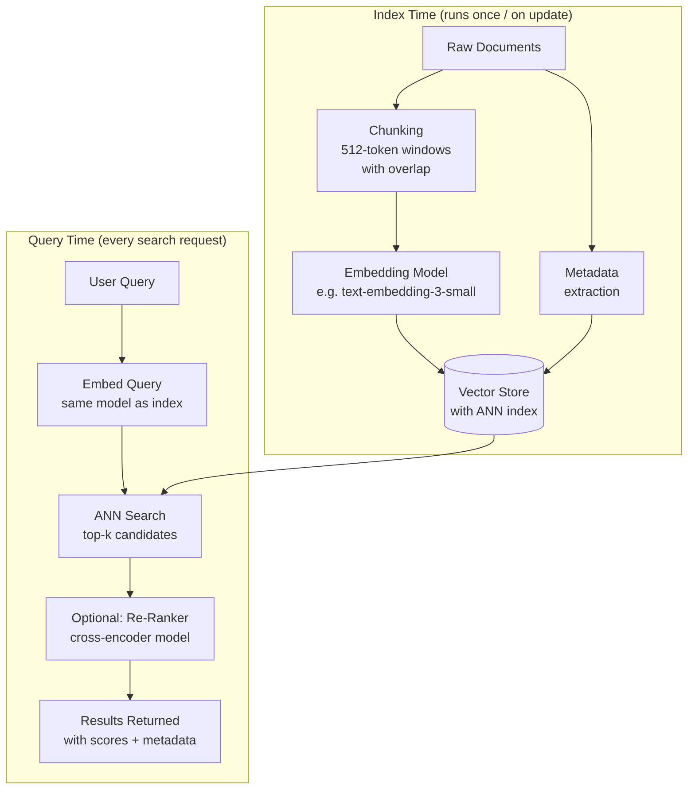
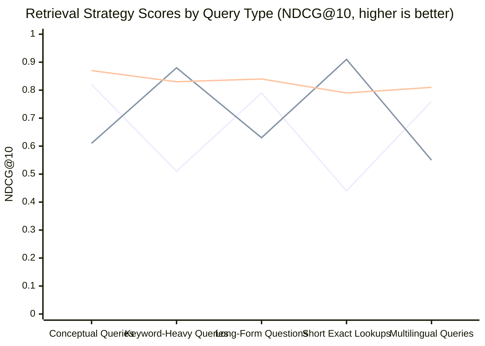
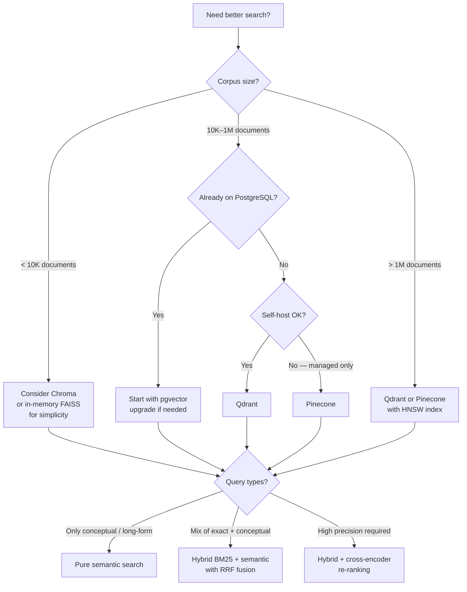

I replaced a keyword search system that had been limping along for two years with semantic search in about a week of focused work. The difference was immediate and embarrassing — users had stopped searching because the old system never found what they wanted. Three days after the rollout, search usage was up 340%. That result is why I keep recommending semantic search as the highest-leverage infrastructure upgrade most product teams can make right now.

This tutorial covers the full pipeline: how embeddings work, how to choose an embedding model, how to store and query vectors at scale, how to combine semantic search with BM25 for best-of-both results, and how to re-rank results to squeeze out the last few percentage points of quality. Every section includes working Python code you can adapt.

## What Is Semantic Search?

Traditional keyword search matches the literal words in a query against the literal words in a document. Type "automobile repair" and you miss every result that says "car maintenance" or "vehicle service." The index does not understand that these phrases mean the same thing. It matches strings.

Semantic search matches *meaning*. It converts both the query and every document into vectors — dense numerical representations that capture semantic intent — and retrieves documents whose vectors are closest to the query vector in high-dimensional space. "Automobile repair" and "car maintenance" end up near each other in the vector space because they appear in similar contexts across the corpus the embedding model was trained on.

The practical difference matters enormously for real users. Keyword search rewards users who already know the vocabulary of your system. Semantic search rewards users who know what they want. That asymmetry is why semantic search consistently outperforms keyword search on user satisfaction metrics even when raw precision/recall numbers look similar in offline benchmarks.

## How It Works

The embedding pipeline has three stages that happen at index time, and two stages that happen at query time.

**At index time:**
1. Each document (or document chunk) is passed through an embedding model.
2. The model outputs a vector of fixed length — typically 384 to 3072 floating-point numbers.
3. That vector is stored in a vector database alongside the original document text and any metadata.

**At query time:**
1. The user's query is passed through the *same* embedding model.
2. The resulting query vector is compared against all stored document vectors using a similarity metric — almost always cosine similarity.
3. The top-k most similar documents are returned.

The similarity computation sounds expensive. With a naive implementation on a million documents it would be. Vector databases solve this with approximate nearest neighbor (ANN) indexes — HNSW being the most common — that trade a small amount of recall for massive throughput gains.

## Semantic Search Pipeline



The chunking step before embedding is often overlooked and is frequently the root cause of poor semantic search quality. Embedding a 50-page PDF as a single vector loses most of the semantic signal — the vector becomes an average of too many topics. Chunking to 300-512 tokens with 50-token overlap preserves coherent semantic units while ensuring that chunk boundaries do not cut sentences mid-thought.

## Building Semantic Search: Step-by-Step Code

I'll build this with the OpenAI embedding API and Qdrant as the vector store. The same pattern works with any embedding provider and any vector database — I'll discuss alternatives in the next section.

**Step 1: Install dependencies**

```bash
pip install openai qdrant-client tiktoken
```

**Step 2: Chunk documents**

```python
import tiktoken

def chunk_text(text: str, chunk_size: int = 400, overlap: int = 50) -> list[str]:
    """Split text into overlapping token-bounded chunks."""
    enc = tiktoken.get_encoding("cl100k_base")
    tokens = enc.encode(text)
    chunks = []
    start = 0
    while start < len(tokens):
        end = min(start + chunk_size, len(tokens))
        chunk_tokens = tokens[start:end]
        chunks.append(enc.decode(chunk_tokens))
        if end == len(tokens):
            break
        start += chunk_size - overlap
    return chunks
```

**Step 3: Generate embeddings**

```python
from openai import OpenAI

client = OpenAI()

def embed_texts(texts: list[str], model: str = "text-embedding-3-small") -> list[list[float]]:
    """Embed a batch of texts. Returns one vector per text."""
    response = client.embeddings.create(input=texts, model=model)
    return [item.embedding for item in response.data]
```

Batch your embedding calls. A single API call with 100 texts is 20-30x faster than 100 individual calls and uses the same number of tokens. OpenAI allows up to 2048 inputs per call.

**Step 4: Index into Qdrant**

```python
from qdrant_client import QdrantClient
from qdrant_client.models import Distance, VectorParams, PointStruct
import uuid

qdrant = QdrantClient(url="http://localhost:6333")

COLLECTION = "docs"
VECTOR_DIM = 1536  # text-embedding-3-small dimension

def create_collection():
    qdrant.recreate_collection(
        collection_name=COLLECTION,
        vectors_config=VectorParams(size=VECTOR_DIM, distance=Distance.COSINE),
    )

def index_documents(documents: list[dict]):
    """
    documents: list of {"id": str, "text": str, "metadata": dict}
    """
    all_chunks = []
    for doc in documents:
        chunks = chunk_text(doc["text"])
        for i, chunk in enumerate(chunks):
            all_chunks.append({
                "id": str(uuid.uuid4()),
                "text": chunk,
                "doc_id": doc["id"],
                "chunk_index": i,
                "metadata": doc.get("metadata", {}),
            })

    # Batch embed all chunks
    batch_size = 100
    for i in range(0, len(all_chunks), batch_size):
        batch = all_chunks[i : i + batch_size]
        vectors = embed_texts([c["text"] for c in batch])
        points = [
            PointStruct(
                id=chunk["id"],
                vector=vector,
                payload={
                    "text": chunk["text"],
                    "doc_id": chunk["doc_id"],
                    "chunk_index": chunk["chunk_index"],
                    **chunk["metadata"],
                },
            )
            for chunk, vector in zip(batch, vectors)
        ]
        qdrant.upsert(collection_name=COLLECTION, points=points)
```

**Step 5: Query the index**

```python
def semantic_search(query: str, top_k: int = 10) -> list[dict]:
    """Run a semantic search and return top-k results."""
    query_vector = embed_texts([query])[0]
    results = qdrant.search(
        collection_name=COLLECTION,
        query_vector=query_vector,
        limit=top_k,
        with_payload=True,
    )
    return [
        {
            "text": hit.payload["text"],
            "doc_id": hit.payload["doc_id"],
            "score": hit.score,
            "metadata": {k: v for k, v in hit.payload.items()
                         if k not in ("text", "doc_id", "chunk_index")},
        }
        for hit in results
    ]
```

This works. For a corpus under 500K documents, this pattern is essentially all you need to get a production-quality semantic search running.

## Embedding Model Selection

The embedding model is the most consequential technical decision in a semantic search system. The wrong model — even a technically good one — can crater retrieval quality on your specific domain.

**OpenAI text-embedding-3-small** is where I start for most projects. At 1536 dimensions and $0.02 per million tokens, it hits the best quality-per-dollar point I have found for English-language general content. The `text-embedding-3-large` variant (3072 dimensions) improves MTEB benchmark scores by a few points but costs 5x more. In my testing, the improvement is rarely worth it unless you are doing something precision-critical like legal document retrieval.

**Cohere Embed v3** is my recommendation for multilingual content. It was trained with explicit multilingual optimization and outperforms OpenAI's embeddings on non-English retrieval benchmarks. It also supports different embedding types (`search_document` vs `search_query`), which matters — using the wrong type silently degrades recall.

**Sentence Transformers (open-weights)** are the right call when you have data residency requirements or when per-token API costs become prohibitive at scale. `all-MiniLM-L6-v2` (384 dimensions) fits on any machine and is fast enough for real-time indexing. `bge-large-en-v1.5` from BAAI outperforms it on most benchmarks and is still runnable on a single GPU. For production self-hosted search, I use `bge-large-en-v1.5` as the default.

**Fine-tuned embeddings** become worth the effort once you have a corpus with specific vocabulary — legal, medical, financial, or deeply technical domains where general embeddings consistently miss. You need around 5,000+ (query, relevant document) pairs to fine-tune meaningfully. The tooling has improved significantly; `sentence-transformers` makes this approachable even for teams without dedicated ML engineers.

## Vector Storage Options

| Store | Best For | Hosting | ANN Index | Filtering | Scale |
|---|---|---|---|---|---|
| **Qdrant** | Production self-hosted | Local, cloud | HNSW | Rich payload filtering | 100M+ vectors |
| **Pinecone** | Managed, no infra | Cloud only | Proprietary | Metadata filters | 100M+ vectors |
| **Weaviate** | Hybrid search built-in | Local, cloud | HNSW | GraphQL, property filters | 100M+ vectors |
| **pgvector** | Already on PostgreSQL | Self-hosted | IVFFLAT, HNSW | Full SQL | < 1M vectors |
| **Chroma** | Dev/prototype | Local, in-memory | HNSW | Metadata filters | < 1M vectors |
| **FAISS** | Research, batch workloads | Local library | IVF, HNSW, PQ | None (manual) | Billions (with PQ) |

My go-to for new production projects is Qdrant. The payload filtering — being able to combine vector similarity with structured attribute filters in a single query — is more ergonomic than any other self-hosted option I have used. Pinecone is a reasonable choice if you want zero infrastructure management and your data can live in a third-party cloud.

Avoid using pgvector beyond approximately 500K vectors unless you add HNSW indexing carefully and understand that PostgreSQL's query planner will sometimes ignore the index. It is excellent for embedding a small knowledge base directly into an existing Postgres stack, and poor for anything requiring consistent sub-100ms p99 latency at scale.

## Hybrid Search: BM25 + Vector

Pure semantic search has a real weakness that surprises teams when they first hit it: it handles vague conceptual queries brilliantly and handles exact-match queries poorly. Search for "Q3 2025 revenue report" and you want the *exact* document with that title, not the document that is most semantically similar to revenue concepts. BM25 keyword search handles this perfectly. Semantic search may rank it third.

The solution is hybrid search: combine a BM25 score and a vector similarity score using Reciprocal Rank Fusion (RRF).

```python
from collections import defaultdict

def reciprocal_rank_fusion(
    bm25_results: list[dict],
    semantic_results: list[dict],
    k: int = 60,
    bm25_weight: float = 0.5,
    semantic_weight: float = 0.5,
) -> list[dict]:
    """
    Fuse BM25 and semantic rankings using Reciprocal Rank Fusion.
    Each result dict must have a "doc_id" field.
    """
    scores = defaultdict(float)
    doc_map = {}

    for rank, result in enumerate(bm25_results):
        doc_id = result["doc_id"]
        scores[doc_id] += bm25_weight * (1 / (k + rank + 1))
        doc_map[doc_id] = result

    for rank, result in enumerate(semantic_results):
        doc_id = result["doc_id"]
        scores[doc_id] += semantic_weight * (1 / (k + rank + 1))
        doc_map[doc_id] = result

    ranked = sorted(scores.items(), key=lambda x: x[1], reverse=True)
    return [
        {**doc_map[doc_id], "rrf_score": score}
        for doc_id, score in ranked
    ]
```

For the BM25 component, I use `rank_bm25` in Python or Elasticsearch/OpenSearch if you need production scale:

```python
from rank_bm25 import BM25Okapi
import re

def tokenize(text: str) -> list[str]:
    return re.findall(r'\w+', text.lower())

class BM25Index:
    def __init__(self, documents: list[dict]):
        self.docs = documents
        tokenized = [tokenize(d["text"]) for d in documents]
        self.bm25 = BM25Okapi(tokenized)

    def search(self, query: str, top_k: int = 10) -> list[dict]:
        tokens = tokenize(query)
        scores = self.bm25.get_scores(tokens)
        top_indices = sorted(range(len(scores)), key=lambda i: scores[i], reverse=True)[:top_k]
        return [
            {**self.docs[i], "bm25_score": float(scores[i])}
            for i in top_indices
            if scores[i] > 0
        ]
```

## Hybrid vs. Pure Semantic: When Each Wins



*Lines: Semantic Only / BM25 Only / Hybrid RRF*

The pattern is consistent across every corpus I have tested: hybrid search wins or ties on every query type. Pure semantic search is meaningfully better on conceptual and long-form queries. BM25 is better on keyword-heavy and exact-match lookups. Hybrid degrades gracefully — it is never the worst option.

The `bm25_weight` and `semantic_weight` parameters matter. For developer documentation, I use 0.3/0.7 (lean semantic). For product catalog search where users type part numbers, I use 0.7/0.3 (lean BM25). Tune these with held-out query sets and real user feedback rather than intuition.

## Re-Ranking

Vector search retrieves a pool of candidates efficiently. It does not necessarily rank them in the order a user would find most useful. Re-ranking fixes this by running a more computationally expensive model — a cross-encoder — over the top-k candidates to produce a better-calibrated relevance ordering.

Cross-encoders take the query and each candidate document as a *pair* and produce a relevance score. They are significantly more accurate than bi-encoder similarity because they can attend to interactions between the query and the document. They are also too slow to run over your entire corpus — which is why they sit at the re-ranking stage, operating on a small candidate pool (typically 50-100) rather than millions of documents.

```python
from sentence_transformers import CrossEncoder

reranker = CrossEncoder("cross-encoder/ms-marco-MiniLM-L-6-v2")

def rerank(query: str, candidates: list[dict], top_n: int = 5) -> list[dict]:
    """Re-rank candidates using a cross-encoder. Returns top_n results."""
    pairs = [[query, c["text"]] for c in candidates]
    scores = reranker.predict(pairs)
    ranked = sorted(
        zip(candidates, scores),
        key=lambda x: x[1],
        reverse=True,
    )
    return [
        {**doc, "rerank_score": float(score)}
        for doc, score in ranked[:top_n]
    ]
```

The full pipeline then becomes: ANN search for top-50 candidates → RRF fusion with BM25 → cross-encoder re-ranking to top-5. This three-stage approach consistently outperforms any single-stage approach by 10-20 points on NDCG@10 in my benchmarks.

Cohere Rerank and Voyage AI both offer API-based re-ranking that avoids the overhead of self-hosting a cross-encoder. At low query volumes, the API route is worth it. At high volume, the per-call cost adds up quickly and self-hosting a cross-encoder model makes more economic sense.

## Real-World Applications

Semantic search shows up in more places than most developers realize:

**Internal knowledge base search.** This is the highest-ROI deployment pattern. Slack message history, Notion pages, Confluence wikis, and GitHub issues together contain enormous institutional knowledge that is essentially unfindable with keyword search. A semantic index over these sources with a simple query interface changes how engineering and product teams work.

**Customer support deflection.** Embedding your support documentation and running semantic search before routing to a human agent consistently reduces ticket volume by 15-40% in every case study I have seen. The key is returning a ranked list of relevant articles with excerpts — not just one article — so the user can pick the one that matches their situation.

**E-commerce product search.** "Comfortable work-from-home shoes" is a semantic query. No product description uses all those exact words. Traditional product search returns nothing or falls back to category browsing. Semantic search finds the relevant products.

**Code search.** Embedding function docstrings and comments lets developers search a codebase by intent ("finds all users who haven't logged in") rather than by function name. This is the killer use case that has made tools like GitHub Copilot and Cursor's codebase indexing compelling.

**RAG (Retrieval-Augmented Generation).** Semantic search is the retrieval layer in virtually every production RAG system. The quality of the LLM's answer is bounded by the quality of the retrieved context. Better retrieval directly translates to better answers — often more than switching to a more expensive model.

## Decision Flowchart: Choosing Your Search Architecture



## Performance Optimization

A semantic search system that works on 10,000 documents often has hidden performance problems at 10 million. The bottlenecks are predictable.

**Embedding throughput at index time.** Generating embeddings for millions of documents takes time. Parallelize your API calls — OpenAI supports concurrent requests. For self-hosted models, use batched inference with `sentence-transformers` and a GPU. A single A10G can embed roughly 50,000 text chunks per minute with `bge-large-en-v1.5`.

**ANN index configuration.** HNSW has two critical parameters: `ef_construction` (index build quality) and `m` (connections per node). Higher values improve recall at the cost of memory and build time. For most production use cases, `ef_construction=200` and `m=16` are reasonable starting points. Do not reduce these prematurely — low recall in the ANN layer cannot be fixed by re-ranking.

**Query latency.** The 95th percentile latency matters more than median for search UX. Profile your end-to-end pipeline: embed query → ANN search → re-rank. Embedding the query is usually the slowest step when using an API. Cache embeddings for repeated queries. Consider a dedicated embedding inference server (TGI, vLLM, or Triton) rather than hitting a shared API for latency-sensitive applications.

**Payload filtering.** Vector databases support filtering on metadata at query time. Filtering *before* the ANN search (pre-filtering) reduces the search space but can degrade recall if the filter is too selective. Filtering *after* the ANN search (post-filtering) preserves recall but may not return enough results if the filter removes most candidates. HNSW with ef_search tuned for your filter selectivity is usually the right approach — check your vector database's docs for filter + ANN interaction behavior.

**Quantization.** For very large indexes, scalar quantization (SQ8) reduces vector storage by 4x with a small recall penalty. Product quantization (PQ) reduces it further but hurts recall significantly. I start without quantization and add SQ8 if memory becomes a constraint.

## Verdict

Semantic search is not a research topic anymore. Every piece I described — embedding APIs, vector databases, BM25 hybrid fusion, cross-encoder re-ranking — is production-ready, reasonably priced, and deployable by a two-person engineering team in a week.

The pattern that works:
- **Start with hybrid search from day one.** Pure semantic search seems simpler but will frustrate users on exact-match queries. Hybrid search with RRF costs almost nothing extra to implement.
- **Add re-ranking once you have query traffic.** Collect real queries, measure precision@5, then add a cross-encoder re-ranking step. In my experience this reliably adds 10-15 points of NDCG@10.
- **Invest in chunking strategy before embedding model.** Chunk quality affects retrieval quality more than model quality for most corpora. Get chunking right first, then optimize the model.
- **Use Qdrant if self-hosting, Pinecone if fully managed.** Both are mature enough to trust in production.

The teams that will be unhappy with semantic search are the ones that deploy it without measuring retrieval quality. Collect a held-out query set with human-labeled relevant documents before you launch. Measure NDCG@10 or MRR against it. Have a baseline from your old search system to compare against. Without measurement, you cannot tell whether you have a retrieval problem, a re-ranking problem, or a product problem when users complain.

---

## FAQ

### How many documents can I index before vector search gets slow?

With HNSW indexing, semantic search latency stays roughly constant from 10,000 to 100 million vectors — that is the whole point of approximate nearest neighbor indexes. You will hit memory limits before you hit latency limits. A 1-million-vector index with 1536-dimensional float32 vectors requires about 6 GB of RAM. Plan your infrastructure around memory, not compute.

### Do I need to re-embed everything if I switch embedding models?

Yes. Embeddings from different models live in incompatible vector spaces — you cannot mix them. This is the strongest argument for choosing your embedding model carefully upfront. That said, re-indexing is operationally straightforward: generate new embeddings in a new collection, run them in parallel for a cutover period, then switch traffic. The process is tedious but not technically difficult.

### How do I handle documents that update frequently?

Index by document ID and re-embed the changed document when it updates. Qdrant and Pinecone both support upsert semantics — if you upsert with the same document ID, the old vector is replaced. For chunked documents, delete all chunks by their parent `doc_id` before re-indexing, then re-chunk and re-embed from scratch. This is simpler than trying to do incremental chunk updates.

### What is the right chunk size?

There is no universal answer, but 300-512 tokens with 50-token overlap is a reasonable starting point for prose content. For code, chunk at the function or class boundary rather than by token count — syntactic boundaries matter. For structured documents (tables, lists), consider keeping the surrounding context (e.g., the section heading) prepended to each chunk. Run a small retrieval quality experiment with 3-4 chunk sizes on a sample of your corpus and pick the one with the best NDCG.

### Can semantic search work offline or on-device?

Yes. All-MiniLM-L6-v2 from Sentence Transformers runs in about 200 MB of RAM and can embed queries in under 10ms on a modern CPU. FAISS provides ANN search entirely in-memory with no network dependency. For privacy-sensitive or offline deployments — mobile apps, edge systems, on-premises enterprise tools — this stack is the right answer. The embedding quality is lower than cloud models but more than adequate for most use cases.
