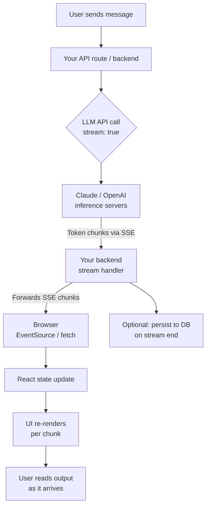
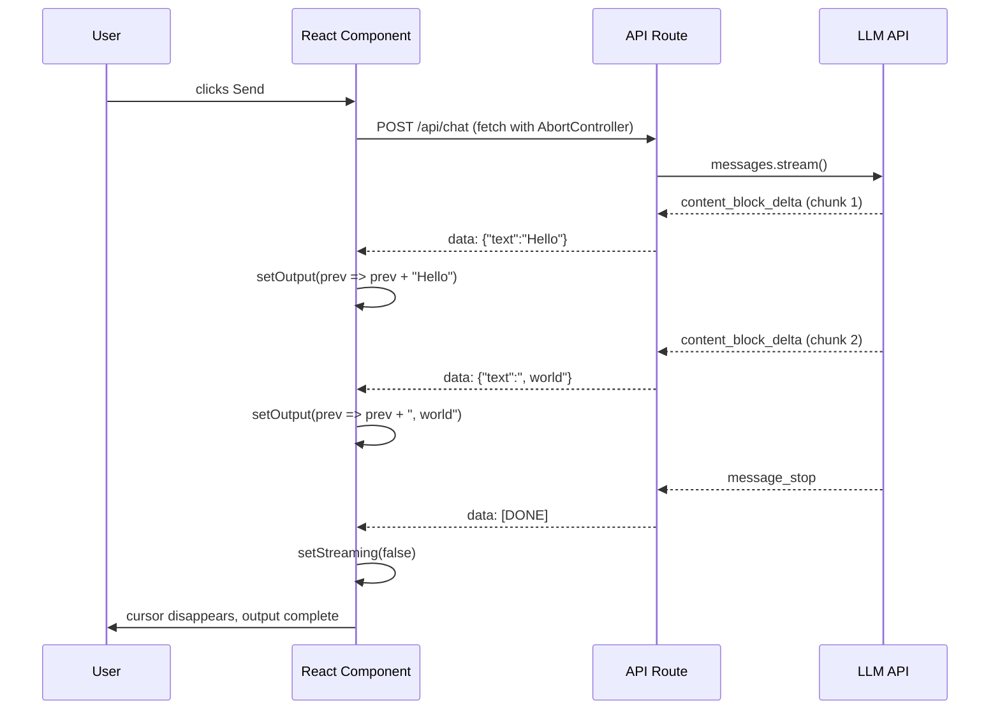
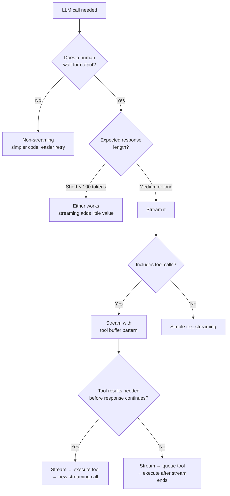

The first time I wired up a non-streaming LLM call in a chat interface, users hated it. They typed a message, clicked send, stared at a spinner for eight seconds, and then watched the entire response appear at once. It felt broken — even when the answer was good. Switching to streaming cut the perceived latency to near-zero and made the product feel alive. That one change did more for user trust than any prompt tuning I had done before.

This guide walks through everything you need to implement streaming LLM responses correctly: how the protocol works, how to hook into the Claude and OpenAI APIs, how to render streams in React, how to handle tool calls mid-stream, and what to do when things go wrong.

## Why Stream LLM Responses?

Non-streaming calls block until the model finishes generating. For a 400-token response at typical inference speeds, that is three to eight seconds of silence. Streaming sends tokens to the client as they are generated, so users see output within 200–400 ms and can start reading while the model is still writing.

The practical benefits go beyond feel:

- **Time to first token (TTFT)** drops from seconds to milliseconds. This is the metric that makes UIs feel snappy.
- **Users can bail early.** If the model starts down the wrong path, users can interrupt before it finishes, saving both wait time and token cost.
- **Backpressure handling improves.** Streaming lets you process output incrementally rather than allocating a large buffer for the full response.
- **Tool calls can fire mid-generation.** Some API designs let you detect a tool call as soon as the model commits to it, trigger the lookup in parallel, and resume streaming sooner.

The tradeoff is real: streaming adds complexity. You are now managing a long-lived connection, partial state, and recovery from mid-stream failures. Every section below addresses a piece of that complexity.

## Streaming Architecture

Before writing code, it helps to see how the pieces connect. Here is the full path a streamed response takes from model to browser.



The key insight is that **your backend is a pass-through**. It receives a stream from the LLM API and re-streams it to the browser. You can intercept chunks for logging, tool execution, or moderation, but the core pattern is forward-as-you-receive.

## Server-Sent Events (SSE)

Both the Claude and OpenAI APIs return streaming responses over HTTP using Server-Sent Events (SSE). SSE is a simple text protocol over a persistent HTTP connection. Each event looks like this:

```
data: {"type":"content_block_delta","delta":{"type":"text_delta","text":"Hello"}}

data: {"type":"content_block_delta","delta":{"type":"text_delta","text":", world"}}

data: [DONE]
```

Each line starting with `data:` carries a JSON payload. A blank line terminates an event. The special `data: [DONE]` sentinel signals the end of the stream (used by OpenAI; Claude uses a `message_stop` event instead).

SSE is one-way — server to client. It runs over ordinary HTTP/1.1 and works through most reverse proxies as long as you set the right headers. On your server, you need:

```
Content-Type: text/event-stream
Cache-Control: no-cache
Connection: keep-alive
```

The browser's built-in `EventSource` API speaks SSE natively. For POST requests (which LLM calls require), you will use `fetch` with a `ReadableStream` instead. Both approaches are covered in the React section below.

## Streaming with the Claude API

Claude's streaming API uses the `stream` parameter alongside `anthropic-beta` message streaming. The official Anthropic SDK handles the SSE plumbing for you. Here is a complete Node.js example that streams a Claude response and prints each text delta to stdout:

```typescript
import Anthropic from "@anthropic-ai/sdk";

const client = new Anthropic({ apiKey: process.env.ANTHROPIC_API_KEY });

async function streamClaude(userMessage: string): Promise<void> {
  const stream = await client.messages.stream({
    model: "claude-opus-4-5",
    max_tokens: 1024,
    messages: [{ role: "user", content: userMessage }],
  });

  // Process each text chunk as it arrives
  for await (const chunk of stream) {
    if (
      chunk.type === "content_block_delta" &&
      chunk.delta.type === "text_delta"
    ) {
      process.stdout.write(chunk.delta.text);
    }
  }

  // Await the final message for usage stats
  const finalMessage = await stream.finalMessage();
  console.log("\n\nUsage:", finalMessage.usage);
}

streamClaude("Explain how TCP handshakes work in plain English.");
```

The SDK exposes several event types you should handle:

| Event type | When it fires |
|---|---|
| `message_start` | Stream opens, contains model and initial usage |
| `content_block_start` | A new content block starts (text or tool use) |
| `content_block_delta` | A token chunk arrives |
| `content_block_stop` | Current content block finished |
| `message_delta` | Final token counts updated |
| `message_stop` | Stream complete |

For a **Next.js API route** that proxies Claude streaming to the browser, the pattern is:

```typescript
// src/app/api/chat/route.ts
import Anthropic from "@anthropic-ai/sdk";
import { NextRequest } from "next/server";

const client = new Anthropic({ apiKey: process.env.ANTHROPIC_API_KEY });

export async function POST(req: NextRequest) {
  const { messages } = await req.json();

  const encoder = new TextEncoder();

  const readable = new ReadableStream({
    async start(controller) {
      try {
        const stream = await client.messages.stream({
          model: "claude-opus-4-5",
          max_tokens: 1024,
          messages,
        });

        for await (const chunk of stream) {
          if (
            chunk.type === "content_block_delta" &&
            chunk.delta.type === "text_delta"
          ) {
            // Forward text deltas to the browser as SSE
            const sseData = `data: ${JSON.stringify({ text: chunk.delta.text })}\n\n`;
            controller.enqueue(encoder.encode(sseData));
          }
        }

        controller.enqueue(encoder.encode("data: [DONE]\n\n"));
        controller.close();
      } catch (err) {
        const errorData = `data: ${JSON.stringify({ error: String(err) })}\n\n`;
        controller.enqueue(encoder.encode(errorData));
        controller.close();
      }
    },
  });

  return new Response(readable, {
    headers: {
      "Content-Type": "text/event-stream",
      "Cache-Control": "no-cache",
      Connection: "keep-alive",
    },
  });
}
```

## Streaming with the OpenAI API

OpenAI streaming follows the same SSE pattern. The SDK wraps it with an `AsyncIterable` interface similar to Anthropic's:

```typescript
import OpenAI from "openai";

const client = new OpenAI({ apiKey: process.env.OPENAI_API_KEY });

async function streamOpenAI(userMessage: string): Promise<void> {
  const stream = await client.chat.completions.create({
    model: "gpt-4o",
    max_tokens: 1024,
    stream: true,
    messages: [{ role: "user", content: userMessage }],
  });

  for await (const chunk of stream) {
    const delta = chunk.choices[0]?.delta?.content;
    if (delta) {
      process.stdout.write(delta);
    }

    // Detect end of stream
    if (chunk.choices[0]?.finish_reason === "stop") {
      console.log("\n\nStream complete.");
    }
  }
}

streamOpenAI("What is the time complexity of merge sort?");
```

The **Next.js proxy route** for OpenAI is nearly identical to the Claude version — swap the SDK call and adjust the delta path from `chunk.delta.text` to `chunk.choices[0]?.delta?.content`:

```typescript
// src/app/api/chat-openai/route.ts
import OpenAI from "openai";
import { NextRequest } from "next/server";

const client = new OpenAI({ apiKey: process.env.OPENAI_API_KEY });

export async function POST(req: NextRequest) {
  const { messages } = await req.json();

  const encoder = new TextEncoder();

  const readable = new ReadableStream({
    async start(controller) {
      try {
        const stream = await client.chat.completions.create({
          model: "gpt-4o",
          max_tokens: 1024,
          stream: true,
          messages,
        });

        for await (const chunk of stream) {
          const delta = chunk.choices[0]?.delta?.content;
          if (delta) {
            const sseData = `data: ${JSON.stringify({ text: delta })}\n\n`;
            controller.enqueue(encoder.encode(sseData));
          }
          if (chunk.choices[0]?.finish_reason === "stop") {
            controller.enqueue(encoder.encode("data: [DONE]\n\n"));
            controller.close();
          }
        }
      } catch (err) {
        const errorData = `data: ${JSON.stringify({ error: String(err) })}\n\n`;
        controller.enqueue(encoder.encode(errorData));
        controller.close();
      }
    },
  });

  return new Response(readable, {
    headers: {
      "Content-Type": "text/event-stream",
      "Cache-Control": "no-cache",
      Connection: "keep-alive",
    },
  });
}
```

## Frontend Implementation in React

The browser side reads the SSE stream using the `fetch` API and a `ReadableStream` reader. The `EventSource` API does not support POST bodies, so `fetch` is the right tool here.

```tsx
// src/components/StreamingChat.tsx
"use client";

import { useState, useRef } from "react";

export function StreamingChat() {
  const [input, setInput] = useState("");
  const [output, setOutput] = useState("");
  const [streaming, setStreaming] = useState(false);
  const abortRef = useRef<AbortController | null>(null);

  async function sendMessage() {
    if (!input.trim() || streaming) return;

    // Allow the user to cancel mid-stream
    abortRef.current = new AbortController();
    setStreaming(true);
    setOutput("");

    try {
      const res = await fetch("/api/chat", {
        method: "POST",
        headers: { "Content-Type": "application/json" },
        body: JSON.stringify({
          messages: [{ role: "user", content: input }],
        }),
        signal: abortRef.current.signal,
      });

      if (!res.ok || !res.body) {
        throw new Error(`HTTP ${res.status}`);
      }

      const reader = res.body.getReader();
      const decoder = new TextDecoder();
      let buffer = "";

      while (true) {
        const { done, value } = await reader.read();
        if (done) break;

        buffer += decoder.decode(value, { stream: true });

        // SSE events are delimited by double newlines
        const events = buffer.split("\n\n");
        buffer = events.pop() ?? "";

        for (const event of events) {
          const line = event.replace(/^data: /, "").trim();
          if (!line || line === "[DONE]") continue;

          try {
            const parsed = JSON.parse(line);
            if (parsed.text) {
              setOutput((prev) => prev + parsed.text);
            }
            if (parsed.error) {
              setOutput((prev) => prev + `\n\n[Error: ${parsed.error}]`);
            }
          } catch {
            // Ignore malformed chunks
          }
        }
      }
    } catch (err: unknown) {
      if (err instanceof Error && err.name !== "AbortError") {
        setOutput((prev) => prev + `\n\n[Connection error: ${err.message}]`);
      }
    } finally {
      setStreaming(false);
    }
  }

  function cancel() {
    abortRef.current?.abort();
  }

  return (
    <div className="max-w-2xl mx-auto p-4 space-y-4">
      <textarea
        className="w-full border rounded p-2 resize-none"
        rows={3}
        value={input}
        onChange={(e) => setInput(e.target.value)}
        placeholder="Ask anything..."
        disabled={streaming}
      />
      <div className="flex gap-2">
        <button
          onClick={sendMessage}
          disabled={streaming || !input.trim()}
          className="px-4 py-2 bg-blue-600 text-white rounded disabled:opacity-50"
        >
          {streaming ? "Generating…" : "Send"}
        </button>
        {streaming && (
          <button
            onClick={cancel}
            className="px-4 py-2 bg-gray-200 rounded"
          >
            Cancel
          </button>
        )}
      </div>
      {output && (
        <div className="border rounded p-4 whitespace-pre-wrap font-mono text-sm">
          {output}
          {streaming && <span className="animate-pulse">▌</span>}
        </div>
      )}
    </div>
  );
}
```

Two details matter here. First, the double-newline split correctly reassembles SSE events that arrive across multiple `read()` calls — a real failure mode when chunks land in the middle of a JSON payload. Second, the `AbortController` gives users a cancel button without leaving the fetch connection dangling.

## Streaming Data Flow Diagram

Here is how state flows from model to DOM in the React implementation above:



Each chunk triggers a React state update. React batches DOM writes efficiently, so the UI does not thrash even at 30–50 chunks per second.

## Handling Tool Use in Streams

Tool use (function calling) complicates streaming because a tool call is not a text delta — it is a structured JSON block that must be fully assembled before you can execute the tool. The model may also interleave text and tool calls in the same response.

In Claude's streaming API, a tool call arrives as a `content_block_start` with `type: "tool_use"`, followed by `input_json_delta` chunks that build up the JSON arguments incrementally. You must buffer these and parse the complete JSON when `content_block_stop` arrives.

```typescript
// Handling tool use in a Claude stream
const toolInputBuffers: Record<number, string> = {};
const toolCalls: Array<{ id: string; name: string; input: unknown }> = [];

for await (const chunk of stream) {
  if (chunk.type === "content_block_start") {
    if (chunk.content_block.type === "tool_use") {
      // Initialize buffer for this tool call block
      toolInputBuffers[chunk.index] = "";
    }
  }

  if (chunk.type === "content_block_delta") {
    if (chunk.delta.type === "text_delta") {
      // Stream text to the user immediately
      process.stdout.write(chunk.delta.text);
    }
    if (chunk.delta.type === "input_json_delta") {
      // Accumulate tool call JSON — do NOT parse yet
      toolInputBuffers[chunk.index] =
        (toolInputBuffers[chunk.index] ?? "") + chunk.delta.partial_json;
    }
  }

  if (chunk.type === "content_block_stop") {
    const buffer = toolInputBuffers[chunk.index];
    if (buffer !== undefined) {
      // Now it is safe to parse
      const startEvent = /* retrieve from content_block_start */ null;
      // In a real implementation, store the tool_use block from content_block_start
      // and look it up here by index to get id and name
      try {
        const input = JSON.parse(buffer);
        toolCalls.push({ id: "tool_id", name: "tool_name", input });
      } catch {
        console.error("Malformed tool input at index", chunk.index);
      }
      delete toolInputBuffers[chunk.index];
    }
  }
}

// After stream ends, execute tool calls and continue the conversation
for (const call of toolCalls) {
  const result = await executeLocalTool(call.name, call.input);
  // Append tool result to messages and make a new streaming call
}
```

The practical rule: **buffer tool input deltas, parse on block stop, execute after stream end.** Trying to parse `input_json_delta` chunks as they arrive will fail because each chunk is a fragment, not valid JSON.

## Error Handling

Streams fail in ways that non-streaming calls do not. A connection can drop after the response starts but before it finishes. The model can hit its max-token limit mid-sentence. The upstream API can return a 529 (overloaded) after delivering two hundred tokens.

Handle these cases explicitly:

**Connection drops.** Wrap your reader loop in a try/catch. If the error is not an `AbortError`, surface it to the user and offer a retry.

**Max tokens mid-stream.** Check `finish_reason === "max_tokens"` (OpenAI) or `stop_reason === "max_tokens"` (Claude) in the final event. Append a visible truncation notice rather than silently stopping.

**API overload (429 / 529).** These typically fire before the stream starts, so catch them at the `fetch` level. Implement exponential backoff with jitter — start at 1 second, cap at 30 seconds, add `Math.random() * 500` ms of jitter to avoid synchronized retries from multiple clients.

**Malformed chunks.** The SSE buffer split approach above handles most cases, but JSON parse can still fail if the API emits a non-JSON line (rare but documented). Wrap `JSON.parse` in try/catch and log the raw line for debugging.

**Client disconnects.** On the backend, monitor `req.signal.aborted` (or the equivalent) and stop forwarding chunks when the client has gone away. Letting the backend continue consuming tokens from the LLM API after the client disconnects wastes money.

```typescript
// Backend: detect client disconnect and abort the upstream stream
const stream = await client.messages.stream({
  model: "claude-opus-4-5",
  max_tokens: 1024,
  messages,
});

// Abort upstream if client disconnects
req.signal.addEventListener("abort", () => {
  stream.abort();
});
```

## Performance Considerations

Streaming improves perceived latency, but a few implementation choices have measurable impact on real latency:

**Avoid buffering on the backend.** Every middleware layer that buffers chunks before forwarding them adds latency. In Express, set `res.flushHeaders()` immediately after writing SSE headers. In Next.js App Router, returning a `Response` with a `ReadableStream` bypasses buffering automatically.

**Keep the event payload small.** Sending only `{"text":"<delta>"}` is far cheaper to parse than forwarding the full API event object. The browser parses hundreds of these per response — payload size adds up.

**Use `Transfer-Encoding: chunked` HTTP/1.1 or HTTP/2 multiplexing.** Most modern runtimes and reverse proxies handle this automatically, but confirm that your Nginx or Cloudflare configuration does not buffer the entire response before forwarding. Nginx requires `proxy_buffering off;` in the location block for SSE routes.

**Debounce DOM updates for very fast streams.** At 50+ tokens per second, calling `setState` on every chunk is fine in React 18+ (automatic batching handles it), but if you are rendering markdown and running a syntax highlighter on each update, consider batching updates to every 50 ms with a `useRef` accumulator.

**Monitor TTFT, not just total latency.** Instrument both time to first token (from `fetch` call to first `setOutput` call) and total stream duration. A slow TTFT with a fast stream is a cold-start or network problem. A fast TTFT with slow total duration is a model throughput problem. They have different fixes.

## Decision Flowchart: Should You Stream This Call?

Not every LLM call benefits from streaming. Batch jobs, classification calls, and tool calls that run in the background should usually be non-streaming to simplify the code. Here is a practical decision tree:



The clearest signal to stream is any call where a human is actively waiting and the response will take more than about two seconds. Everything else is a case-by-case judgment.

## Testing Streams

Testing streaming endpoints requires a different approach than testing regular JSON endpoints. The response body is not fully available until the stream ends, and you often want to assert on intermediate state.

**Unit testing the stream reader.** Mock the `fetch` response with a `ReadableStream` that emits known SSE chunks:

```typescript
function createMockStream(events: string[]): ReadableStream<Uint8Array> {
  const encoder = new TextEncoder();
  return new ReadableStream({
    start(controller) {
      for (const event of events) {
        controller.enqueue(encoder.encode(`data: ${event}\n\n`));
      }
      controller.enqueue(encoder.encode("data: [DONE]\n\n"));
      controller.close();
    },
  });
}

// In your test:
const mockEvents = [
  JSON.stringify({ text: "Hello" }),
  JSON.stringify({ text: ", world" }),
];
global.fetch = jest.fn().mockResolvedValue({
  ok: true,
  body: createMockStream(mockEvents),
} as Response);
```

**Integration testing the API route.** Use a real LLM call with a short `max_tokens` limit in a test environment, or record and replay the SSE response with a fixture. The key assertion is that your reader correctly reassembles events that arrive split across `read()` calls — test this by using a `ReadableStream` that emits data in artificially small chunks (one byte at a time is the worst case).

**End-to-end tests.** Playwright can handle streaming responses. Check for intermediate DOM state using `page.waitForFunction` to poll the output element until it contains the first expected token, then assert that the final output matches the full expected response.

## Verdict

Streaming LLM responses is not a nice-to-have — it is the baseline for any user-facing AI feature. The implementation has more moving parts than a regular fetch, but the pattern is stable: SSE over HTTP, a pass-through backend route, a `ReadableStream` reader in the browser, and explicit handling for tool calls, errors, and disconnects. Once this plumbing is in place, it rarely needs to change. Every LLM feature you build afterward can reuse the same streaming layer.

Start with the Claude or OpenAI SDK stream iterator on the backend. Write the SSE proxy route. Build the React reader with an `AbortController`. Handle tool input buffering separately from text deltas. Add error surfaces that the user can actually see. Instrument TTFT. That is the full implementation — nothing in this article is theoretical, and every code block above runs in production.

## FAQ

### Can I stream through a serverless function like a Vercel Edge Function?

Yes, but you need to use the Edge runtime. The Node.js runtime on Vercel has a hard 10-second timeout that will cut off long responses. Add `export const runtime = "edge"` to your Next.js route file. The `ReadableStream` API is available in the Edge runtime and the streaming pattern works identically.

### What happens if the model hits max_tokens mid-stream?

The stream terminates with a `stop_reason` of `"max_tokens"` (Claude) or `finish_reason` of `"max_tokens"` (OpenAI). The response is silently truncated — the model will not add an ellipsis or warning. You should watch for this in your final event handler and append a visible indicator like `[response truncated]` so users know the output is incomplete.

### How do I persist streamed responses to a database?

Accumulate the full text in a variable on the backend as chunks arrive. After the stream closes (on `message_stop` or `[DONE]`), write the accumulated text to your database. Do not try to write chunks incrementally — it creates race conditions and is rarely worth the added complexity unless you need real-time persistence for crash recovery.

### Does streaming work with prompt caching on the Claude API?

Yes. Prompt caching and streaming are orthogonal features. You can set `cache_control` breakpoints on system prompts and context blocks exactly as you would in a non-streaming call. Cache hits show up in `usage.cache_read_input_tokens` in the `message_start` or `message_delta` events.

### How do I handle multiple concurrent streams from many users?

Each stream is an independent HTTP connection. At moderate scale (hundreds of concurrent users), this works fine with a single backend process because the connection is mostly idle between token deliveries. At higher scale, make sure your reverse proxy does not limit the number of concurrent keep-alive connections. Nginx's `worker_connections` and `keepalive_timeout` settings are the usual bottlenecks. Each stream also holds an open connection to the LLM API, so check your API provider's concurrent connection limits.
