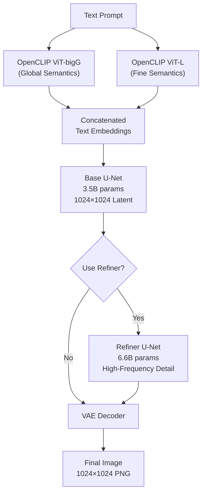
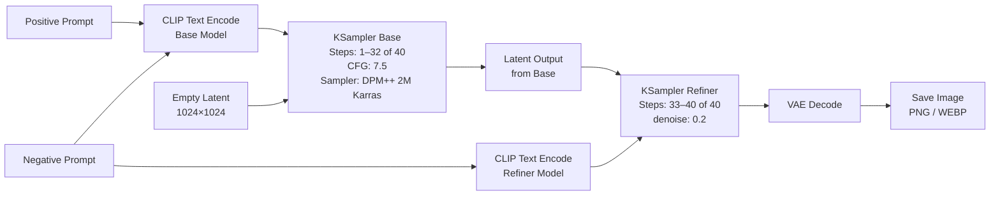
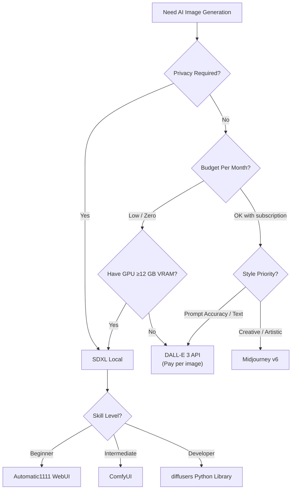

I spent three weeks running Stable Diffusion XL on my own machine before I understood what made it genuinely different from the cloud-based image generators I had been paying subscriptions for. The output quality surprised me. The control surprised me more. And the fact that I could generate 10,000 images without a single API bill surprised me most of all.

This guide covers everything I learned: architecture, hardware requirements, installation across three different interfaces, real generation workflows, and an honest comparison against Midjourney and DALL-E 3. If you want to run local image generation without wading through six outdated Reddit threads, start here.

## What Is Stable Diffusion XL?

Stable Diffusion XL (SDXL) is an open-weight latent diffusion model released by Stability AI in mid-2023. It generates images from text prompts at native 1024×1024 resolution — a significant step up from the 512×512 default of earlier SD 1.x and SD 2.x models.

The "XL" refers to the scale of the underlying U-Net architecture and the dual text encoder stack that processes your prompts. SDXL ships as two separate checkpoints — a base model and a refiner — that work together to produce images with detail, coherent composition, and realistic lighting that earlier versions struggled to achieve.

What makes SDXL attractive for local image generation specifically is that Stability AI released the weights under a permissive license. You download the model once, it runs on your GPU indefinitely, and nothing you generate leaves your machine.

## Architecture: Base Model + Refiner

SDXL departs from the single-model design of earlier Stable Diffusion releases. Understanding how the two components interact helps you tune the generation process instead of guessing at settings.

**Base model** — This is a 3.5B parameter U-Net that processes the text prompt through two separate text encoders (OpenCLIP ViT-bigG and OpenCI ViT-L). The base model generates a coarse latent at full 1024×1024 resolution. It handles global composition: subject placement, color blocking, lighting direction, and rough structure.

**Refiner model** — A smaller 6.6B parameter U-Net that specializes in high-frequency details. It takes the base model's latent output and adds fine texture, skin pores, fabric weave, hair strands, and edge sharpness. The refiner was trained specifically to operate in the final denoising steps, which is why using it outside that window produces muddy results.

**Dual text encoders** — SDXL encodes your prompt with two separate encoders and concatenates the embeddings. This gives the model a much richer semantic representation than SD 1.5's single CLIP encoder, which is why SDXL handles complex, multi-clause prompts more reliably.



The refiner is optional but worth using whenever you need photorealistic skin, complex backgrounds, or fine text rendering. For stylized or illustrated outputs, the base model alone often produces cleaner results because the refiner can over-sharpen flat art styles.

## Hardware Requirements

I'll be direct about what you actually need, not what the minimum spec sheets say.

**Minimum viable setup (functional but slow):**
- GPU: NVIDIA RTX 3060 (12 GB VRAM) or AMD RX 6800 XT (16 GB VRAM)
- RAM: 16 GB system RAM
- Storage: 25 GB free for SDXL base + refiner + VAE
- Generation time: 45–90 seconds per image at 20 steps, 1024×1024

**Recommended setup (practical daily use):**
- GPU: NVIDIA RTX 3090 / 4080 / 4090 (24 GB VRAM)
- RAM: 32 GB system RAM
- Storage: NVMe SSD, 100 GB free (leaves room for LoRAs, ControlNet models, and checkpoints)
- Generation time: 4–12 seconds per image at 20 steps, 1024×1024

**Apple Silicon (M2/M3/M4):**
- Works natively via MPS backend in diffusers or via ComfyUI with Metal support
- 16 GB unified memory handles the base model; 36 GB handles base + refiner simultaneously
- Generation time: 15–40 seconds per image — slower than a 4090 but faster than the 3060

**What to expect with 8 GB VRAM:** You can run the SDXL base model in fp16 with CPU offloading enabled, but generation times stretch to 2–5 minutes per image and refiner usage becomes impractical. It works; it's not enjoyable.

**VRAM budget for SDXL:**

| Config | VRAM Used |
|---|---|
| Base model only, fp16 | ~7 GB |
| Base + refiner, fp16 | ~14 GB |
| Base + refiner + ControlNet | ~18–20 GB |
| Base + refiner + ControlNet + LoRA | ~20–22 GB |

## Installation: Three Ways to Run SDXL

I have run SDXL through all three of the major interfaces. Here is what each one is actually like.

### ComfyUI (Recommended for Power Users)

ComfyUI uses a node-based graph editor. You build generation pipelines by connecting nodes visually, which makes complex workflows like base-plus-refiner chains, ControlNet injection, and LoRA stacking much easier to understand and modify.

```bash
# Clone the repository
git clone https://github.com/comfyanonymous/ComfyUI.git
cd ComfyUI

# Install dependencies (Python 3.10+ required)
pip install torch torchvision torchaudio --index-url https://download.pytorch.org/whl/cu124
pip install -r requirements.txt

# Download SDXL base and refiner checkpoints
# Place them in ComfyUI/models/checkpoints/
# SDXL Base:   sd_xl_base_1.0.safetensors   (~6.5 GB)
# SDXL Refiner: sd_xl_refiner_1.0.safetensors (~6.1 GB)

# Launch
python main.py --listen 0.0.0.0 --port 8188
```

Open `http://localhost:8188` in your browser. ComfyUI ships with an SDXL example workflow under the Load button. Start there, then customize. The learning curve is steeper than Automatic1111 for the first two hours, then significantly more flexible afterward.

### Automatic1111 WebUI (Best for Beginners)

A1111 is the most widely documented SDXL interface. If you find yourself copying prompts from Civitai or Reddit, every tutorial assumes you're running A1111.

```bash
# Clone the repository
git clone https://github.com/AUTOMATIC1111/stable-diffusion-webui.git
cd stable-diffusion-webui

# Place SDXL checkpoints in models/Stable-diffusion/
# sd_xl_base_1.0.safetensors
# sd_xl_refiner_1.0.safetensors

# Launch (macOS/Linux)
./webui.sh --xformers

# Launch (Windows)
webui-user.bat
```

A1111 auto-downloads dependencies on first launch. For SDXL specifically, make sure you enable the **Refiner** section in the img2img or txt2img panel and set the switch-at value to 0.8 (meaning the base model handles 80% of denoising steps before handing off to the refiner).

### diffusers (Python Library, Best for Developers)

If you want to call SDXL programmatically — inside a script, a web app, or a Jupyter notebook — the Hugging Face `diffusers` library is the cleanest path.

```bash
pip install diffusers transformers accelerate safetensors
```

```python
from diffusers import StableDiffusionXLPipeline, StableDiffusionXLImg2ImgPipeline
import torch

# Load base model
base = StableDiffusionXLPipeline.from_pretrained(
    "stabilityai/stable-diffusion-xl-base-1.0",
    torch_dtype=torch.float16,
    variant="fp16",
    use_safetensors=True,
).to("cuda")

# Load refiner
refiner = StableDiffusionXLImg2ImgPipeline.from_pretrained(
    "stabilityai/stable-diffusion-xl-refiner-1.0",
    text_encoder_2=base.text_encoder_2,
    vae=base.vae,
    torch_dtype=torch.float16,
    variant="fp16",
    use_safetensors=True,
).to("cuda")

prompt = "A portrait of an astronaut in a wheat field, golden hour, photorealistic, 8k"
negative = "blurry, low quality, deformed hands, watermark"

# Base pass
image = base(
    prompt=prompt,
    negative_prompt=negative,
    num_inference_steps=40,
    denoising_end=0.8,
    output_type="latent",
).images[0]

# Refiner pass
final = refiner(
    prompt=prompt,
    negative_prompt=negative,
    num_inference_steps=40,
    denoising_start=0.8,
    image=image,
).images[0]

final.save("output.png")
```

The `denoising_end=0.8` and `denoising_start=0.8` values are the key parameters that make base-to-refiner handoff work. Adjust them between 0.7–0.85 based on your subject matter.

## Your First Generation

Once your chosen interface is running, here is the workflow I use for a first-pass image to verify everything is working correctly.

**Prompt structure for SDXL:**

SDXL responds well to prompts organized in roughly this order: subject, setting, lighting, style, quality modifiers. Keep negative prompts short and specific — SDXL does not need the sprawling negative prompt lists that SD 1.5 relied on.

```
Positive: A red fox sitting on a snow-covered log, pine forest background, 
          soft winter light, photorealistic, sharp focus

Negative: blurry, deformed, watermark, text, low resolution
```

**Starting parameters:**
- Steps: 25–30 (SDXL converges faster than SD 1.5)
- CFG scale: 7–8 (higher values increase prompt adherence but reduce variation)
- Sampler: DPM++ 2M Karras (fast and consistent) or DDIM (more predictable)
- Resolution: 1024×1024 (native) or 1152×896 / 896×1152 for landscape/portrait

If the image looks correct, try bumping steps to 40 and enabling the refiner at switch-at 0.8. The difference in fine detail — hair, fabric, foliage — is immediately obvious.

## Generation Workflow

Here is the full SDXL generation pipeline as I run it in ComfyUI, from prompt entry to saved file:



In ComfyUI, this maps directly to a visual graph where you can inspect the latent tensor at any node, swap models mid-graph, or inject a ControlNet preprocessor between the base KSampler and the refiner KSampler.

## Advanced Techniques

### ControlNet for Composition Control

ControlNet lets you feed a reference image — an edge map, a pose skeleton, a depth map — to guide the composition of your generated image while the text prompt controls style and content.

For SDXL, you need ControlNet models specifically trained on SDXL checkpoints. The most useful are:

- **Canny** — traces edges from a reference image; great for maintaining architectural structure or product shapes
- **OpenPose** — extracts human pose skeletons; lets you repose characters without prompt gymnastics
- **Depth** — preserves spatial depth relationships from a reference photo

Install ControlNet in A1111 via the Extensions tab (search for `sd-webui-controlnet`). In ComfyUI, ControlNet nodes are built into the default installation. Place SDXL-specific ControlNet weights in `models/controlnet/`.

A typical ControlNet workflow: photograph your own hand in the pose you want, run it through the Canny preprocessor, use the edge map as your ControlNet conditioning input, and let the text prompt fill in the actual subject. The resulting image follows your composition exactly.

### LoRA Fine-Tuning and Style Transfer

LoRA (Low-Rank Adaptation) files are small checkpoint patches — typically 50–300 MB — that steer SDXL toward a specific style, character, or object without retraining the full model.

You load a LoRA by adding `<lora:filename:weight>` to your prompt in A1111, or by connecting a LoRA loader node in ComfyUI. The weight parameter controls influence strength; 0.6–0.8 is a reasonable starting range.

Good sources for SDXL-compatible LoRAs: Civitai (filter by SDXL base), and the Hugging Face Hub. Always check the base model the LoRA was trained on — an SD 1.5 LoRA will not work correctly with SDXL.

To train your own LoRA on a subject (your face, a product, a specific art style), the most accessible tool is **kohya_ss**, which provides a GUI training interface. You need 15–30 reference images and a GPU with at least 16 GB VRAM. Training takes 30–90 minutes.

### Inpainting

SDXL inpainting lets you regenerate a masked region of an existing image while leaving the rest untouched. It's indispensable for fixing hands (still the perennial weakness), replacing backgrounds, or adding objects to existing compositions.

In A1111, switch to the **img2img** tab and select **Inpaint**. Upload your image, paint a mask over the region you want to replace, write a prompt describing what should appear there, and set the denoising strength to 0.7–0.85. Lower values stay closer to the original; higher values allow more creative departure.

For inpainting that blends seamlessly with the surrounding image, keep the mask feathered (A1111 has a mask blur slider) and run the inpaint at the full 1024×1024 resolution rather than the cropped region alone.

## SDXL vs Midjourney vs DALL-E 3

I have run the same prompt set through all three. Here is my honest assessment:

| Criteria | SDXL (Local) | Midjourney v6 | DALL-E 3 |
|---|---|---|---|
| Image quality ceiling | Excellent with tuning | Excellent out of the box | Very good |
| Prompt coherence | Good | Excellent | Excellent |
| Privacy | Full — runs locally | None | None |
| Cost per image | ~$0 after hardware | ~$0.04–0.08 | ~$0.04 |
| Customization | Unlimited | None | Very limited |
| Speed | 4–90 sec (hardware-dependent) | 30–60 sec | 15–30 sec |
| NSFW content | Possible with uncensored weights | Not permitted | Not permitted |
| Setup complexity | Moderate to High | Zero | Zero |

Midjourney produces the most aesthetically polished results with the least effort. It handles vague, creative prompts better than SDXL because it was trained and tuned specifically for that experience. If you want beautiful images fast and don't need customization or privacy, Midjourney is the better daily driver.

DALL-E 3 excels at text rendering inside images and at following precise, complex instructions. It's the right tool when you need an image that matches a specific written brief closely.

SDXL wins when you need: full privacy, unlimited generations, fine-grained control over style via LoRA, composition control via ControlNet, or integration into a production pipeline. It also wins when budget is a constraint after the initial hardware investment.



## Limitations

I want to be direct about where SDXL still falls short, because overpromising is the fastest way to waste your time.

**Hands and fingers.** SDXL is significantly better than SD 1.5 but still produces malformed hands in roughly 20–30% of human generations at default settings. Fix: use ControlNet OpenPose to lock the hand position, or inpaint the hands specifically with a dedicated hand-fix LoRA.

**Text rendering.** SDXL cannot reliably render readable text inside images. Short words sometimes work. Sentences do not. For images requiring legible text, use DALL-E 3 and composite the result.

**Consistent characters.** Without LoRA training or ControlNet IP-Adapter, you cannot reliably generate the same character twice. Each generation produces a new interpretation of your prompt. Solving this requires either fine-tuning a LoRA on reference images or using IP-Adapter to condition on a reference photo.

**VRAM ceiling.** Running a full base + refiner + ControlNet stack simultaneously requires 18–22 GB VRAM. This excludes a significant portion of consumer GPU hardware.

**Community model quality variance.** Civitai has thousands of SDXL fine-tunes and LoRAs, and quality ranges from excellent to broken. Budget time to evaluate models before building workflows around them.

## Verdict

Stable Diffusion XL is the most capable open-weight image generation model available for local deployment as of mid-2026. If you have compatible hardware and are willing to spend a few hours on setup, you get a generation system that costs nothing to run, keeps all images on your machine, and can be customized to a degree that cloud services simply do not offer.

The path I recommend: start with Automatic1111 to learn the basics, graduate to ComfyUI when you want real control over generation pipelines, and switch to the diffusers library when you need to embed generation in a production system.

The combination of base-plus-refiner, ControlNet, and LoRA makes SDXL a genuinely professional tool. The output quality at 40 steps with a well-tuned LoRA and ControlNet conditioning is indistinguishable from Midjourney v6 outputs — and the process of getting there teaches you more about generative image models than any subscription service can.

---

## FAQ

### Do I need an internet connection to run SDXL?

No. Once you have downloaded the model checkpoints and installed your chosen interface, generation runs entirely offline. The only time you need internet access is when downloading new model weights, LoRAs, or ControlNet preprocessors.

### What is the difference between SDXL 1.0 and SDXL Turbo?

SDXL 1.0 is the standard model that produces high-quality images in 20–40 denoising steps. SDXL Turbo is a distilled variant that generates usable images in 1–4 steps using adversarial diffusion distillation (ADD). Turbo images are faster but slightly less detailed; the 1.0 model produces better quality when generation speed is not the primary constraint.

### Can SDXL run on a laptop GPU?

Yes, with caveats. A laptop RTX 4070 (8 GB VRAM) can run the base model in fp16 with CPU offloading. A laptop RTX 4080 or 4090 (16 GB VRAM) can run the full base + refiner stack. Expect generation times roughly 30–50% slower than their desktop counterparts due to thermal throttling and lower memory bandwidth.

### How do I use SDXL checkpoints from Civitai?

Download the `.safetensors` file and place it in the appropriate models directory: `models/Stable-diffusion/` for A1111, or `models/checkpoints/` for ComfyUI. Most Civitai SDXL fine-tunes are drop-in replacements — select the checkpoint from the interface's model selector and your existing prompts and workflows apply directly.

### Is there a meaningful quality difference between fp16 and fp32?

For visual output, no. fp16 (half-precision floating point) cuts VRAM usage roughly in half with no perceptible quality loss in the generated images. fp32 is only relevant if you are doing scientific analysis of activation values or training your own model. For inference, always use fp16 or even int8 quantization if VRAM is the bottleneck.
