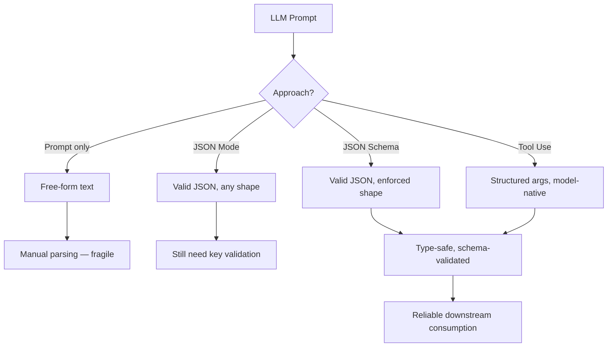
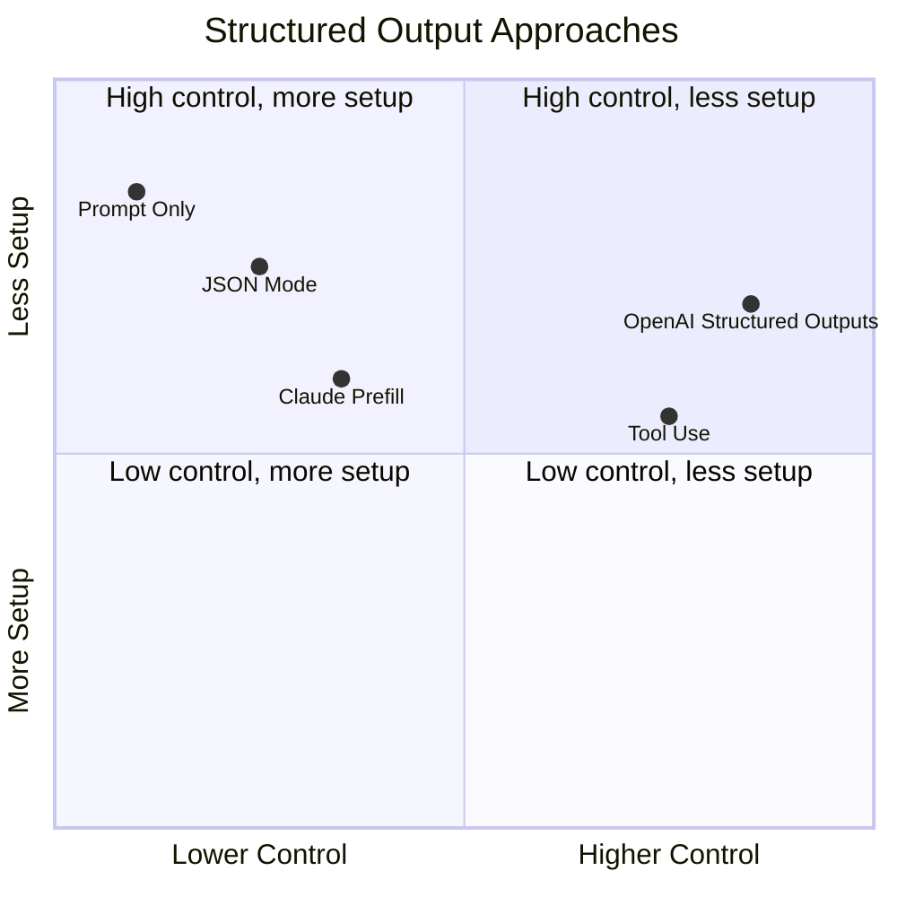
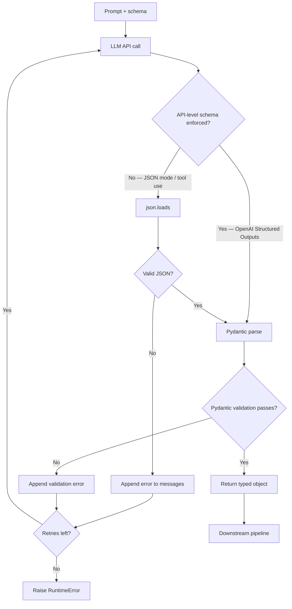

Getting an LLM to write a haiku is easy. Getting it to reliably return a JSON object with exactly the right keys, the right types, and no trailing commentary — that is the part that quietly breaks production systems. I have spent the last year wiring structured output into pipelines for data extraction, agentic workflows, and API backends, and the gap between "it works in the playground" and "it works at 2 AM in production" is entirely about how carefully you enforce structure.

This guide covers every practical approach: JSON mode, JSON Schema enforcement, tool use as a schema hack, Pydantic integration, validation strategies, and the error handling that actually saves you. No generic AI filler — just the code and the trade-offs.

## Why Structured Output Matters

Free-form LLM output is fine for chat. It is a liability for everything else. When you need to parse a model's response, store it in a database, pass it to another function, or render it in a UI, you need a contract. Without one, you spend half your engineering time writing defensive parsing code — and still get surprised by the model deciding to preface its JSON with "Sure! Here is the JSON you requested:".

The cost of unstructured output compounds fast:

- **Parsing failures** break pipelines silently or loudly depending on how fragile your code is.
- **Schema drift** means a model that worked fine last month suddenly adds a new key or changes a field name, and your downstream breaks.
- **Retry loops** eat latency and money when you have to reprompt because the model formatted things wrong.
- **Debugging is brutal** because the bug is not in your code — it is in a language model's probabilistic output.

Structured output approaches exist to close that gap. The goal is to make the model's output as predictable as a typed function return.



## JSON Mode: The Fastest On-Ramp

JSON mode is the simplest form of structure enforcement. You tell the model "output valid JSON" and it constrains its token sampling to ensure the output parses. No hallucinated trailing text, no markdown fences (usually), no half-finished objects.

### OpenAI JSON Mode

OpenAI introduced `response_format: { type: "json_object" }` in the Chat Completions API. Here is a minimal working example:

```python
from openai import OpenAI

client = OpenAI()

response = client.chat.completions.create(
    model="gpt-4o",
    response_format={"type": "json_object"},
    messages=[
        {
            "role": "system",
            "content": "You extract structured data. Always respond with valid JSON."
        },
        {
            "role": "user",
            "content": "Extract: Name, email, and company from this: 'Hi, I'm Sarah Chen at Acme Corp. Reach me at sarah@acme.io'"
        }
    ]
)

import json
data = json.loads(response.choices[0].message.content)
print(data)
# {"name": "Sarah Chen", "email": "sarah@acme.io", "company": "Acme Corp"}
```

**Critical caveat:** JSON mode guarantees syntactically valid JSON. It does not guarantee that the JSON contains the keys you expect, uses the right types, or matches any particular shape. You still need validation on the output.

### Claude Prefilling Trick

Anthropic's Claude API supports a `prefill` pattern where you inject the start of the assistant's response. By prefilling with `{`, you force the model to continue from an open brace — which strongly nudges it toward valid JSON output. This works even without an explicit JSON mode flag.

```python
import anthropic
import json

client = anthropic.Anthropic()

response = client.messages.create(
    model="claude-opus-4-5",
    max_tokens=1024,
    system="You extract structured contact data. Return only JSON, no explanation.",
    messages=[
        {
            "role": "user",
            "content": "Extract contact info: 'Ping me — James, james.t@startup.ai, works at NeuralStack'"
        },
        {
            "role": "assistant",
            "content": "{"  # prefill forces JSON continuation
        }
    ]
)

# The response continues from the "{" we prefilled
raw = "{" + response.content[0].text
data = json.loads(raw)
print(data)
# {"name": "James", "email": "james.t@startup.ai", "company": "NeuralStack"}
```

The prefill trick is surprisingly robust and works across Claude model versions. The trade-off is that it is a hack — you are exploiting the model's autoregressive nature rather than using a native API feature.

## JSON Schema Enforcement

JSON mode gets you syntactically valid JSON. JSON Schema enforcement gets you *semantically valid* JSON — the right keys, the right types, optional vs. required fields, nested objects with their own constraints.

OpenAI's Structured Outputs feature (distinct from JSON mode) lets you pass a full JSON Schema and the API will guarantee the output conforms to it, using constrained decoding:

```python
from openai import OpenAI
from pydantic import BaseModel

client = OpenAI()

class ContactInfo(BaseModel):
    name: str
    email: str
    company: str
    role: str | None = None

response = client.beta.chat.completions.parse(
    model="gpt-4o-2024-08-06",
    messages=[
        {
            "role": "system",
            "content": "Extract contact information from the text."
        },
        {
            "role": "user",
            "content": "Meet Dr. Priya Nair, CTO at QuantumLeap (priya@ql.dev)"
        }
    ],
    response_format=ContactInfo,
)

contact = response.choices[0].message.parsed
print(contact.name)    # Dr. Priya Nair
print(contact.email)   # priya@ql.dev
print(contact.role)    # CTO
```

The `.parse()` method (OpenAI SDK v1.40+) accepts a Pydantic model directly and returns a typed object — no manual JSON parsing needed. The schema is derived automatically from the Pydantic model. Under the hood, OpenAI uses constrained beam search to guarantee schema conformance at the token level.

## Tool Use for Structured Output

Before native schema enforcement existed, the standard trick was to define a fake "tool" whose parameters match your desired output schema, then force the model to call it. This still works and is often the best option for Claude, Gemini, and any model that has robust function calling but not native structured outputs.

```python
import anthropic
import json

client = anthropic.Anthropic()

tools = [
    {
        "name": "save_contact",
        "description": "Save extracted contact information",
        "input_schema": {
            "type": "object",
            "properties": {
                "name": {"type": "string", "description": "Full name"},
                "email": {"type": "string", "description": "Email address"},
                "company": {"type": "string", "description": "Company name"},
                "role": {"type": "string", "description": "Job title or role"}
            },
            "required": ["name", "email", "company"]
        }
    }
]

response = client.messages.create(
    model="claude-opus-4-5",
    max_tokens=1024,
    tools=tools,
    tool_choice={"type": "tool", "name": "save_contact"},  # force the tool call
    messages=[
        {
            "role": "user",
            "content": "Extract: 'This is Lena Müller, VP of Eng at DataBridge. lena.m@databridge.com'"
        }
    ]
)

# Tool use response has structured input
tool_use_block = next(b for b in response.content if b.type == "tool_use")
contact = tool_use_block.input
print(contact)
# {"name": "Lena Müller", "email": "lena.m@databridge.com", "company": "DataBridge", "role": "VP of Eng"}
```

`tool_choice: {"type": "tool", "name": "save_contact"}` is the important part — it forces the model to call exactly that tool rather than choosing whether to use a tool at all. The model cannot escape into free-form text.

This pattern works on any model that supports function/tool calling. It is my default for Claude-based pipelines.

## Comparison: Which Approach to Use When



| Approach | Schema Enforced | Type Safety | Model Support | Best For |
|---|---|---|---|---|
| Prompt only | No | No | All | Prototyping |
| JSON mode | Syntax only | No | OpenAI, some others | Simple extraction |
| Claude prefill | Syntax nudge | No | Claude | Quick Claude hacks |
| Tool use | Yes (JSON Schema) | Partial | OpenAI, Claude, Gemini | Cross-model pipelines |
| OpenAI Structured Outputs | Yes (full schema) | Yes (with Pydantic) | OpenAI only | Production OpenAI apps |

## Validation and Error Handling

Even with schema enforcement, you need a validation layer. Constrained decoding handles syntax and shape, but not semantic validity — an email field containing `"not-an-email"` will still pass JSON Schema unless you add a `format` constraint or validate after the fact.

Here is the validation pattern I use in production:

```python
from pydantic import BaseModel, EmailStr, field_validator, ValidationError
from openai import OpenAI
import json
import time

client = OpenAI()

class ContactInfo(BaseModel):
    name: str
    email: EmailStr  # Pydantic validates email format
    company: str
    role: str | None = None

    @field_validator("name")
    @classmethod
    def name_not_empty(cls, v: str) -> str:
        if not v.strip():
            raise ValueError("name cannot be empty")
        return v.strip()

def extract_contact(text: str, max_retries: int = 3) -> ContactInfo:
    messages = [
        {"role": "system", "content": "Extract contact info as JSON. Fields: name, email, company, role (optional)."},
        {"role": "user", "content": text}
    ]

    for attempt in range(max_retries):
        try:
            response = client.chat.completions.create(
                model="gpt-4o",
                response_format={"type": "json_object"},
                messages=messages
            )
            raw = json.loads(response.choices[0].message.content)
            return ContactInfo(**raw)

        except json.JSONDecodeError as e:
            if attempt == max_retries - 1:
                raise RuntimeError(f"JSON parse failed after {max_retries} attempts: {e}")
            messages.append({"role": "assistant", "content": response.choices[0].message.content})
            messages.append({"role": "user", "content": f"That was not valid JSON. Error: {e}. Try again."})

        except ValidationError as e:
            if attempt == max_retries - 1:
                raise RuntimeError(f"Validation failed after {max_retries} attempts: {e}")
            messages.append({"role": "assistant", "content": response.choices[0].message.content})
            messages.append({"role": "user", "content": f"Schema validation failed: {e}. Fix and retry."})

        time.sleep(0.5 * (attempt + 1))  # simple backoff

    raise RuntimeError("Unreachable")

# Usage
contact = extract_contact("Talk to Ben Okafor (ben.o@fintech.io), Head of Product at PayLayer")
print(contact.model_dump())
```

The retry loop appends the failed output and the error back into the conversation so the model understands what went wrong. This self-correction pattern reduces retry count significantly compared to blind retries from scratch.

## Pydantic Integration

Pydantic is the natural pairing for structured LLM output in Python. It handles schema generation, type coercion, custom validators, and serialization — all the things you would otherwise write by hand.

For complex schemas with nested models and conditional fields:

```python
from pydantic import BaseModel, Field
from typing import Literal
from openai import OpenAI

class Address(BaseModel):
    street: str
    city: str
    country: str = "US"

class Lead(BaseModel):
    name: str
    email: str
    company: str
    lead_score: int = Field(ge=0, le=100, description="Estimated fit score 0-100")
    source: Literal["inbound", "outbound", "referral"]
    address: Address | None = None
    tags: list[str] = Field(default_factory=list)

client = OpenAI()

response = client.beta.chat.completions.parse(
    model="gpt-4o-2024-08-06",
    messages=[
        {
            "role": "system",
            "content": "Extract lead information. Estimate lead_score based on company signals."
        },
        {
            "role": "user",
            "content": """
            Inbound lead from our website:
            Sofia Esposito, Director of AI at NebulaFinance (sofia.e@nebulafinance.com)
            Based in Milan, Italy. Mentioned they're evaluating 3 vendors.
            Tags: enterprise, fintech, EU
            """
        }
    ],
    response_format=Lead,
)

lead = response.choices[0].message.parsed
print(lead.model_dump_json(indent=2))
```

The `Field(ge=0, le=100)` constraint is reflected in the JSON Schema passed to the API — the model cannot return a value outside that range. Nested models like `Address` are handled recursively.

For generating the JSON Schema manually (useful when you need to pass it to non-OpenAI APIs):

```python
schema = Lead.model_json_schema()
print(schema)  # Full JSON Schema dict — pass this to tool definitions
```

## Validation and Error Handling Workflow



## Choosing an Approach

The decision tree I use:

**You're using OpenAI and need maximum reliability** — use OpenAI Structured Outputs with Pydantic. The constrained decoding guarantee plus typed objects is the highest-confidence path. Works well for schemas with up to ~20 fields.

**You're using Claude** — use tool use with `tool_choice` forced to your extraction tool. Define your schema as the tool's `input_schema`. This is Claude's native structured output mechanism and it is reliable.

**You need to support multiple models** — tool use is the most portable approach since function calling is standardized across OpenAI, Claude, Gemini, and most open-weight models via APIs like Ollama and vLLM.

**You're prototyping fast** — JSON mode plus a Pydantic `model_validate` call is the fastest setup. Accept that you will get occasional schema mismatches in exchange for speed.

**You're using open-weight models** — look at llama.cpp's `--json-schema` flag, vLLM's guided decoding (via `guided_json`), or Outlines for grammar-based constrained generation. These tools bring OpenAI-style schema enforcement to self-hosted models.

```python
# vLLM guided decoding example
from openai import OpenAI  # vLLM exposes OpenAI-compatible API
from pydantic import BaseModel

class Sentiment(BaseModel):
    label: Literal["positive", "negative", "neutral"]
    confidence: float
    reasoning: str

client = OpenAI(base_url="http://localhost:8000/v1", api_key="not-needed")

schema = Sentiment.model_json_schema()
response = client.chat.completions.create(
    model="meta-llama/Llama-3-8b-instruct",
    messages=[{"role": "user", "content": "Analyze: 'This API keeps breaking our pipeline'"}],
    extra_body={"guided_json": schema}  # vLLM-specific
)
```

## Common Pitfalls

**Forgetting to mention the schema in the system prompt.** Even with API-level enforcement, models perform better when the system prompt explicitly describes the expected output. "Return a JSON object with fields: name (string), email (string), company (string)" beats relying on the schema alone.

**Overly complex schemas.** Schemas with more than 30 fields, deep nesting, or many `oneOf`/`anyOf` branches hit model limitations. Constrained decoding gets slower and more prone to errors. Flatten schemas where possible and split complex extractions into multiple calls.

**Not handling `null` vs. missing keys.** JSON Schema `required` tells the model which keys must appear. But a model might return `"role": null` instead of omitting the key entirely. Your Pydantic model should use `str | None = None` not just `str` for optional fields, and your downstream code should handle both cases.

**Using JSON mode for streaming.** JSON mode responses are only valid at completion — a streaming partial JSON response is not parseable. Either disable streaming or use a streaming-aware JSON parser like `ijson`.

**Assuming schema enforcement is free.** Constrained decoding adds latency, especially for complex schemas. On OpenAI's API, Structured Outputs calls can be 10–30% slower than plain JSON mode calls. Budget for this in latency-sensitive paths.

**Not logging raw responses.** When a validation error hits production, you want the raw model output to debug it. Always log `response.choices[0].message.content` before parsing, not just the parsed result.

## Verdict

Structured output LLM is not a single feature — it is a spectrum, and where you land on it should match your production requirements.

For most teams building in 2026: start with OpenAI Structured Outputs and Pydantic if you're on OpenAI, or tool use with `tool_choice` forced if you're on Claude. Add a retry loop with error feedback. Log raw responses. Add Pydantic validators for semantic constraints. That stack handles the overwhelming majority of real extraction, classification, and agentic workflows reliably.

The prefill trick and plain JSON mode are fine for exploration, but they are not something I would wire into a production pipeline that runs thousands of times a day. The extra reliability from real schema enforcement is worth the marginal setup cost.

Open-weight models are closing the gap. vLLM's guided decoding and Outlines are genuinely production-ready for many schemas. If you're self-hosting, test them — the latency overhead is lower than you might expect.

---

## FAQ

### Does JSON mode work with streaming?

Not directly. Streaming returns partial JSON tokens that are not individually parseable. For streaming use cases you have two options: buffer the full stream before parsing (giving up the latency benefit of streaming), or use a streaming JSON parser that can handle partial documents. The `ijson` Python library handles the latter. For most extraction use cases, non-streaming is fine — the latency is dominated by the model computation, not token delivery.

### What happens if the model's schema enforcement fails anyway?

API-level schema enforcement (OpenAI Structured Outputs, vLLM guided decoding) has a very low failure rate but is not zero — edge cases in very complex schemas can still produce invalid output. Always wrap your parsing in a try/except and have a fallback. The fallback can be a retry with a simpler schema, a human review queue, or a graceful degradation that logs the failure and skips the record.

### Can I use structured output with vision models?

Yes. OpenAI's `gpt-4o` with Structured Outputs supports image inputs alongside schema enforcement. Pass the image in the `content` array as a `image_url` block, then specify `response_format` as usual. This works well for extracting data from receipts, forms, screenshots, and diagrams. Claude's vision models support tool use, so the tool-as-schema pattern works with image inputs on Anthropic's API too.

### How do I handle schemas that vary based on input?

Use a discriminated union pattern. Define a base schema with a `type` field, then define per-type schemas. With Pydantic, `Annotated[Union[TypeA, TypeB], Field(discriminator="type")]` generates the right JSON Schema. With OpenAI Structured Outputs, pass the discriminated union schema. The model reads the schema, infers which variant applies from the input, and populates the right fields. Avoid asking the model to infer the type internally — explicit discriminator fields produce far more reliable results.

### Is tool use for structured output "cheating"?

No — it is the intended design. Anthropic's documentation explicitly recommends using tool use for structured output extraction, even when you have no actual tool to call. The model treats tool arguments as a strongly-typed output channel, which is exactly what you want. The distinction between "real" tool calls and "fake" schema-extraction tool calls is invisible to the model and irrelevant to reliability.
