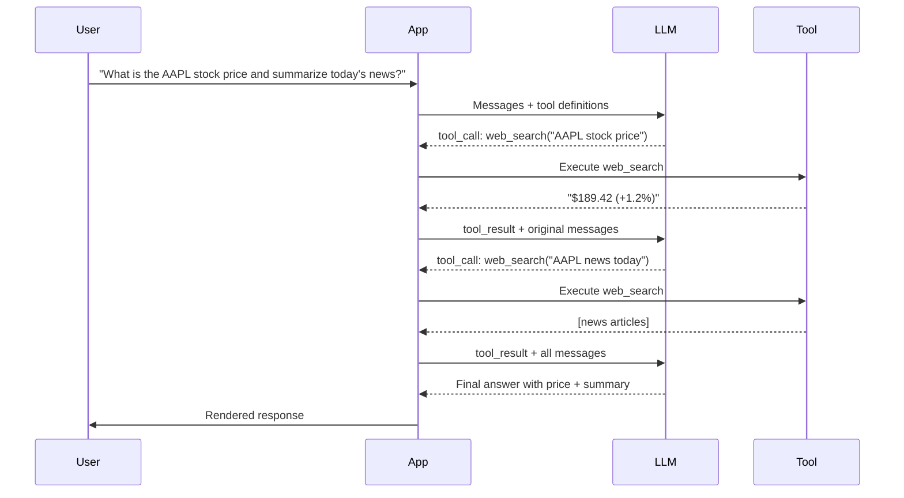
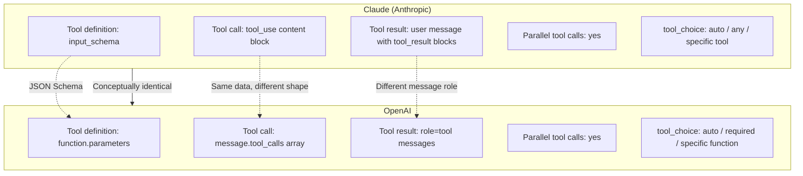
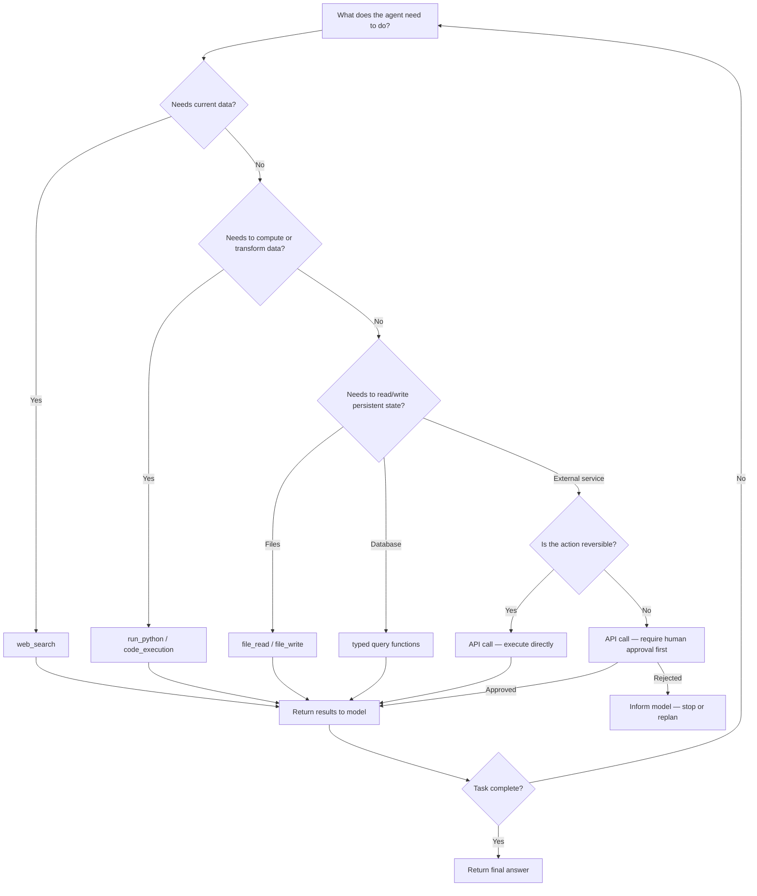

I have spent the last year building AI agents that actually ship to production. The single biggest leverage point is not the model — it is tool use. A bare language model can reason and generate text. Give it tools, and it can look things up, run code, call APIs, and complete real work. This guide explains exactly how LLM tool use works, how to implement it with Claude and OpenAI, and how to avoid the mistakes I made so you do not have to repeat them.

## What Is Tool Use?

Tool use (also called function calling) is the mechanism that lets a language model request external actions during inference. Instead of generating a final answer directly, the model can emit a structured call — "search the web for X," "run this Python snippet," "call this REST endpoint" — pause its generation, receive the result, and then continue reasoning with fresh data.

The key insight is that the model does not actually execute anything. It only produces a specification of what it wants to do. Your application code intercepts that specification, runs the tool, and sends the result back as a new message. The model is stateless; the tool loop is your responsibility.

This matters for three reasons. First, it grounds the model's responses in current, real-world data rather than stale training knowledge. Second, it lets the model take actions with real consequences — querying databases, modifying files, triggering workflows. Third, it enables multi-step reasoning where each tool result informs the next decision.

## The Tool Use Loop

Here is the request-response cycle that powers every AI agent with tool use:



The loop runs until the model produces a regular text response with no pending tool calls. A well-designed agent always has a maximum iteration count to prevent runaway loops.

## Types of Tools

### Web Search

Web search is the most common tool because it solves the model's most obvious weakness: stale knowledge. A model trained through early 2025 cannot know today's stock price, yesterday's outage postmortem, or the breaking API change your dependency just shipped.

Good web search tools return structured results — title, URL, snippet — rather than raw HTML. The model needs enough context to cite the source and enough brevity to fit within its context window. I typically return three to five results and let the model decide which to cite.

### Code Execution

Code execution turns the model into a working calculator, data analyst, and test runner. The model writes code; a sandbox runs it; the stdout/stderr comes back. This is how tools like Claude's analysis feature and ChatGPT's Code Interpreter work under the hood.

The critical constraint: run code in an isolated sandbox. Never execute model-generated code directly in your production environment without sandboxing. Use containers, VMs, or a service like E2B or Modal. Treat the model's code output the same way you would treat code submitted by an anonymous user on the internet.

### API Calls

Giving the model access to your internal APIs is where tool use becomes genuinely transformative. The model can query your database for customer records, open a Jira ticket, send a Slack message, or trigger a CI build — all from a single natural language instruction.

The shape of a good API tool definition: a clear name, a description that tells the model *when* to use it (not just *what* it does), and a JSON schema for the parameters. The description is load-bearing. Vague descriptions cause the model to misuse tools or skip them entirely.

### File Operations

File tools let agents read source code, write reports, process uploaded documents, and maintain state between sessions. A typical set: `read_file`, `write_file`, `list_directory`, `search_files`. Apply the principle of least privilege — the agent should only see and modify the directories it needs.

### Database Queries

Structured query tools bridge the model and your data layer. Rather than giving the model raw SQL execution (risky), expose typed query functions: `get_user_by_id(id: string)`, `search_orders(status: string, date_range: object)`. This keeps the agent productive while bounding what it can touch.

## Implementing Tool Use with Claude

Anthropic's tool use API is straightforward. You define tools in the `tools` array, and the model returns `tool_use` content blocks when it wants to call one.

```python
import anthropic
import json

client = anthropic.Anthropic()

# Define your tools
tools = [
    {
        "name": "web_search",
        "description": "Search the web for current information. Use this when you need up-to-date facts, news, or data not in your training knowledge.",
        "input_schema": {
            "type": "object",
            "properties": {
                "query": {
                    "type": "string",
                    "description": "The search query"
                }
            },
            "required": ["query"]
        }
    },
    {
        "name": "run_python",
        "description": "Execute a Python code snippet in a sandbox and return stdout. Use for calculations, data processing, and analysis.",
        "input_schema": {
            "type": "object",
            "properties": {
                "code": {
                    "type": "string",
                    "description": "Valid Python code to execute"
                }
            },
            "required": ["code"]
        }
    }
]

def web_search(query: str) -> str:
    # Replace with your actual search implementation
    return f"[Search results for '{query}': placeholder — wire up SerpAPI, Tavily, or Brave Search]"

def run_python(code: str) -> str:
    # Replace with a sandboxed executor (e2b, modal, etc.)
    # NEVER exec() in production without sandboxing
    return f"[Sandbox output for code: {code[:60]}...]"

def run_tool(name: str, inputs: dict) -> str:
    if name == "web_search":
        return web_search(inputs["query"])
    elif name == "run_python":
        return run_python(inputs["code"])
    return f"Unknown tool: {name}"

def run_agent(user_message: str, max_iterations: int = 10) -> str:
    messages = [{"role": "user", "content": user_message}]

    for iteration in range(max_iterations):
        response = client.messages.create(
            model="claude-opus-4-5",
            max_tokens=4096,
            tools=tools,
            messages=messages
        )

        # Append the assistant's response to message history
        messages.append({"role": "assistant", "content": response.content})

        # Check if the model wants to use tools
        tool_uses = [b for b in response.content if b.type == "tool_use"]

        if not tool_uses:
            # No tool calls — extract and return the text response
            text_blocks = [b for b in response.content if b.type == "text"]
            return text_blocks[0].text if text_blocks else ""

        # Execute all requested tools and collect results
        tool_results = []
        for tool_use in tool_uses:
            result = run_tool(tool_use.name, tool_use.input)
            tool_results.append({
                "type": "tool_result",
                "tool_use_id": tool_use.id,
                "content": result
            })

        # Send results back to the model
        messages.append({"role": "user", "content": tool_results})

    return "Max iterations reached."

# Usage
answer = run_agent("What is 17 factorial? Show your work with Python.")
print(answer)
```

A few things worth noting in this implementation. The `messages` list grows with each round trip — that is intentional. The model needs the full conversation history to reason correctly. The `max_iterations` guard is essential; without it a buggy tool or ambiguous task can spin indefinitely. And the tool results are sent back as `user` role content, which is what the API expects.

## Implementing Tool Use with OpenAI

OpenAI's function calling API follows the same pattern with different field names. Tools are defined in the `tools` array with `type: "function"`, and tool calls come back in `message.tool_calls`.

```python
from openai import OpenAI
import json

client = OpenAI()

tools = [
    {
        "type": "function",
        "function": {
            "name": "web_search",
            "description": "Search the web for current information. Use when you need facts not in your training data.",
            "parameters": {
                "type": "object",
                "properties": {
                    "query": {
                        "type": "string",
                        "description": "The search query"
                    }
                },
                "required": ["query"]
            }
        }
    },
    {
        "type": "function",
        "function": {
            "name": "run_python",
            "description": "Execute Python in a sandbox. Use for calculations and data processing.",
            "parameters": {
                "type": "object",
                "properties": {
                    "code": {"type": "string", "description": "Python code to run"}
                },
                "required": ["code"]
            }
        }
    }
]

def run_tool(name: str, arguments: str) -> str:
    args = json.loads(arguments)
    if name == "web_search":
        return web_search(args["query"])
    elif name == "run_python":
        return run_python(args["code"])
    return f"Unknown tool: {name}"

def run_agent_openai(user_message: str, max_iterations: int = 10) -> str:
    messages = [{"role": "user", "content": user_message}]

    for iteration in range(max_iterations):
        response = client.chat.completions.create(
            model="gpt-4o",
            tools=tools,
            messages=messages
        )

        message = response.choices[0].message
        messages.append(message)  # append the assistant message object

        if not message.tool_calls:
            return message.content or ""

        # Execute each tool call
        for tool_call in message.tool_calls:
            result = run_tool(tool_call.function.name, tool_call.function.arguments)
            messages.append({
                "role": "tool",
                "tool_call_id": tool_call.id,
                "content": result
            })

    return "Max iterations reached."
```

The structure is nearly identical. The meaningful differences are in field naming (`input_schema` vs `parameters`), how tool results are structured (`tool_result` content blocks vs `role: "tool"` messages), and the response shape. If you abstract the tool execution logic into a shared `run_tool` function, switching between providers becomes a thin adapter layer.

## Claude vs OpenAI Tool Use: Key Differences



Both providers support parallel tool calls — the model can request multiple tools in a single response, and you send all results back before the next generation step. This meaningfully reduces latency for tasks that need independent lookups.

## Security Considerations

Tool use dramatically expands the attack surface of your application. These are the constraints I apply to every production agent.

**Scope tools to the minimum necessary permissions.** An agent that summarizes customer emails does not need write access to your database. Design tool interfaces that cannot exceed their intended purpose regardless of what the model asks.

**Treat model-generated inputs as untrusted.** Apply the same validation you would apply to user input from the internet. A prompt injection attack can cause the model to call tools with attacker-controlled arguments. Validate all tool inputs against schemas before execution.

**Log every tool call.** Store the tool name, inputs, outputs, and timestamp for every call. This is your audit trail. When something goes wrong — and it will — you need to reconstruct exactly what the agent did and in what order.

**Require human approval for irreversible actions.** Sending emails, deleting records, making purchases, and deploying code are all candidates for an approval gate. Present the proposed action to a human before executing. This is not optional for high-stakes workflows.

**Rate-limit and cost-cap tool calls.** A loop bug or a malicious prompt can cause hundreds of expensive tool calls in seconds. Set per-session and per-day limits on API calls, code executions, and token consumption.

**Never execute model-generated code without sandboxing.** This point is important enough to repeat. Use an isolated environment with no access to your network, filesystem, or secrets.

## Tool Design Best Practices

The model's ability to use tools effectively depends almost entirely on how well you define them. These are the patterns I have found most reliable.

**Write descriptions that say *when* to use the tool, not just what it does.** Bad: "Searches the web." Good: "Searches the web for current information. Use this when the user asks about recent events, current prices, or anything that may have changed after your training cutoff."

**Return structured data, not prose.** JSON objects are easier for the model to reason over than narrative summaries. Include the fields the model will need for its next decision, and nothing more.

**Fail loudly with informative errors.** When a tool fails, return an error object that explains why and what the model can do next. `{"error": "rate_limited", "retry_after_seconds": 30}` gives the model actionable information. An empty string does not.

**Keep tool count low.** The model has to reason over every tool definition in its context. Ten well-designed tools outperform thirty overlapping ones. If you have many tools, use a dynamic retrieval system to inject only the relevant subset into each request.

**Test tools in isolation before wiring them into an agent.** Define expected inputs and expected outputs. Verify the tool handles edge cases — empty results, timeouts, malformed data — before the model ever sees it.

## When to Use Which Tool



## Model Context Protocol (MCP)

Model Context Protocol (MCP) is an open standard from Anthropic that formalizes the connection between AI models and external tools and data sources. Where tool use is a feature of individual API calls, MCP is a protocol for building reusable, composable tool servers that any MCP-compatible client can consume.

The architecture has three parts. An MCP server exposes tools, resources (files, database records, live data), and prompts through a standardized interface. An MCP client — Claude Desktop, Cursor, or your own application — connects to one or more servers and presents their capabilities to the model. The model interacts with MCP tools the same way it interacts with inline tool definitions, but the tooling is decoupled from the application.

In practice, MCP means you can build a Jira tool server once and reuse it across every agent in your organization. The server handles authentication, rate limiting, and schema definition. Any client that speaks MCP can use it without knowing how Jira works internally.

As of early 2026, Claude Desktop, Cursor, and a growing list of third-party clients support MCP. If you are building tools that will be shared across multiple applications or teams, MCP is worth designing toward from the start. If you are building a single internal agent, inline tool definitions are simpler and equally capable.

## Multi-Tool Orchestration

Most real tasks require more than one tool call, and the order matters. Multi-tool orchestration is the practice of designing agents that plan, execute, and adapt across a sequence of tool calls to complete a goal.

The simplest pattern is sequential — the model calls one tool, uses the result to decide on the next tool, and so on until the task is done. The tool use loop I showed earlier handles this naturally.

More complex patterns involve parallel execution, branching, and sub-agents. An agent researching a topic might fire off three web searches simultaneously, merge the results, then decide whether to dig deeper or synthesize. You can implement parallelism by processing all tool calls from a single model response concurrently and returning all results at once.

For very long workflows — ten or more steps — consider checkpointing. Save the message history and tool results to persistent storage at key points. If the agent fails or the context window fills, you can resume from the checkpoint rather than starting over.

The hardest part of orchestration is not the code. It is defining clear stopping criteria. An agent that does not know when it is done will either loop until it hits your iteration limit or produce premature answers before it has enough information. The model's instructions should say explicitly: "When you have gathered X and confirmed Y, write the final report. Do not call any more tools after that."

## Verdict

LLM tool use is not an experimental feature. It is the foundation of every production AI agent I have seen deliver real business value. The primitives are stable, the APIs are mature across both Claude and OpenAI, and the patterns are well-understood.

The gap between demos and production is not about the model — it is about tool design, security controls, and evaluation rigor. Define your tools carefully. Sandbox anything that executes. Log everything. Cap your iterations. Put humans in the loop for irreversible actions.

Start with two or three tools that directly serve your core workflow. Measure tool error rate and task completion rate before adding more. The agents that work are the ones built incrementally on a foundation of well-understood, well-tested tools — not the ones that launched with thirty integrations and no evaluation suite.

## FAQ

### What is the difference between tool use and function calling?

They are the same concept with different names. "Function calling" is OpenAI's original terminology. Anthropic calls it "tool use." Both refer to the mechanism by which a language model requests structured external actions during inference. The underlying architecture — define schema, model emits structured call, app executes, result returned — is identical.

### Can the model choose not to use a tool?

Yes. By default, both Claude and OpenAI use `tool_choice: auto`, which lets the model decide whether to call a tool or respond directly. If the model determines it can answer from its training knowledge without a tool call, it will. You can override this with `tool_choice: required` (OpenAI) or `tool_choice: {type: "any"}` (Claude) to force at least one tool call.

### How do I prevent prompt injection attacks through tool results?

The most effective defense is treating all tool outputs as untrusted data. Do not interpolate tool results directly into system prompts. Return results as user-role messages, which the model treats as external data rather than instructions. Additionally, validate tool inputs before execution — if a web search query contains suspicious instruction-like text, log it and consider rejecting it.

### What happens when a tool call fails mid-task?

Return a structured error object as the tool result rather than throwing an exception in your app. Include the error type and any actionable guidance: `{"error": "not_found", "message": "No results for this query. Try broader search terms."}`. The model can then decide whether to retry with different inputs, use a different tool, or inform the user that it cannot complete the task. An agent that handles tool failures gracefully is far more useful than one that crashes on the first error.

### Should I use MCP or inline tool definitions?

Use inline tool definitions when you are building a single application with a fixed set of tools — it is simpler and requires no additional infrastructure. Use MCP when you need to share tools across multiple applications, clients, or teams, or when you want to decouple tool server maintenance from your application release cycle. The capability is equivalent; the operational trade-off is reuse versus simplicity.
