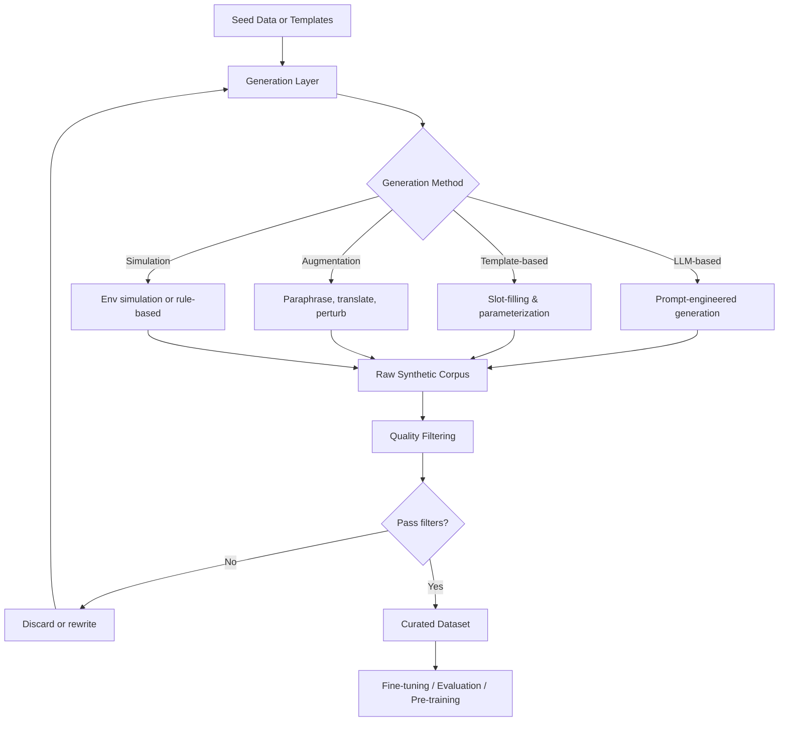
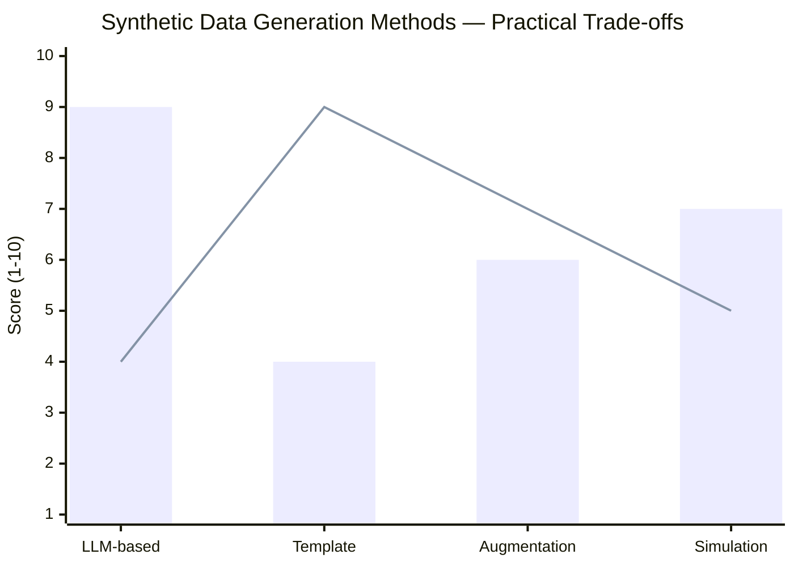
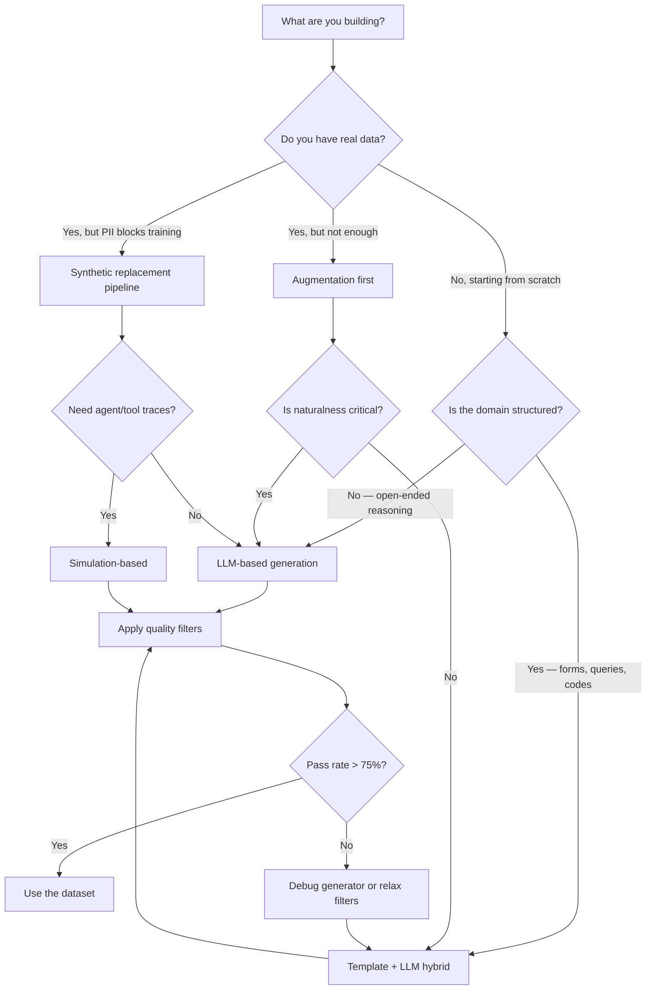

Real training data is running out — or at least the high-quality, licensed, task-specific variety is. Every team fine-tuning a model for a specialized domain eventually hits the same wall: there are not enough labeled examples, the examples they have contain PII they cannot ship to a model provider, or the distribution is skewed toward the easy cases and the model never learns to handle the hard ones.

Synthetic data generation is the answer most serious ML teams have converged on. Not because it is perfect — it is not — but because the alternatives are worse. Paying humans to annotate edge cases at scale is slow and expensive. Scraping the web gives you noise, copyright risk, and toxic content. Waiting for more real data means waiting.

I have spent the last year building synthetic data pipelines for fine-tuning and evaluation. This guide covers the full picture: what synthetic data actually is, when to use it, how to generate it at quality, and the failure modes that will cost you if you ignore them.

---

## What Is Synthetic Data?

Synthetic data is data that is artificially generated rather than collected from real-world events. In the context of LLM training, it almost always means text — instruction-response pairs, conversation transcripts, reasoning chains, code with explanations, or domain-specific documents that never existed before a model wrote them.

The key distinction is *fidelity*. Low-fidelity synthetic data looks like training data but does not represent the distribution you care about. High-fidelity synthetic data captures the statistical properties, vocabulary, reasoning patterns, and edge cases of the real domain — well enough that a model trained on it generalizes to real inputs.

Getting to high fidelity is the whole challenge. The generation part is easy. The quality control part is where most projects fail.

---

## Why Use Synthetic Data?

### Privacy

Healthcare, finance, and legal domains have enormous amounts of structured knowledge locked inside documents that cannot leave the organization. A synthetic version of a patient intake form, a loan application review, or a contract summary retains the *shape* of the real data without the PII. You can train on it, share it with vendors, and audit it without a legal review every time.

### Scale

Real labeled data scales linearly with human labor. Synthetic data scales with compute. Once you have a working generation pipeline, producing ten times as many examples costs roughly ten times as much in inference tokens — not ten times as much in calendar time and headcount.

### Cost

Frontier model annotation runs anywhere from $0.50 to $5.00 per example when you factor in review cycles. At scale, generating synthetic examples with a strong model and a validation step typically costs a fraction of that per example.

### Diversity and Coverage

Real data reflects real distributions — which means it underrepresents rare cases. Synthetic generation lets you deliberately oversample the long tail. Need your model to handle malformed input gracefully? Generate 5,000 examples of malformed input. Need it to refuse confidently on out-of-scope requests? Write the templates and generate them programmatically.

---

## Synthetic Data Pipeline Overview



The loop matters. Good pipelines do not generate once and call it done — they generate, filter, diagnose failures, fix the generator, and regenerate. Treating the pipeline as a single pass is the fastest way to end up with a dataset that looks clean and trains poorly.

---

## Generation Methods

### LLM-Based Generation

The most common approach in 2025 and 2026: use a strong frontier model to write training data for a smaller or specialized model. The technique goes by several names — self-instruct, instruction backtranslation, model-distilled data — but the core idea is the same.

You write a system prompt that describes the data format, the domain, the style, and any constraints. The model generates examples. You filter them. You train on what survives.

```python
import anthropic
import json

client = anthropic.Anthropic()

SYSTEM_PROMPT = """You are a data generation assistant. Generate realistic customer support conversations
for a B2B SaaS billing product. Each conversation should:
- Be between a support agent and a customer
- Cover one specific billing issue (incorrect charge, upgrade confusion, refund request, or cancellation)
- Be 4-8 turns long
- End with a resolution or clear escalation path
- Use natural, professional language — not scripted

Output valid JSON with keys: issue_type, conversation (list of {role, content}), resolution."""

def generate_support_examples(n: int, issue_type: str) -> list[dict]:
    examples = []
    for i in range(n):
        response = client.messages.create(
            model="claude-sonnet-4-6",
            max_tokens=1024,
            system=SYSTEM_PROMPT,
            messages=[{
                "role": "user",
                "content": f"Generate a conversation about: {issue_type}. Make example #{i+1} distinct from typical examples."
            }]
        )
        text = response.content[0].text
        try:
            example = json.loads(text)
            examples.append(example)
        except json.JSONDecodeError:
            pass  # handled in quality layer
    return examples

# Generate balanced set across issue types
issue_types = ["incorrect_charge", "upgrade_confusion", "refund_request", "cancellation"]
dataset = []
for issue in issue_types:
    dataset.extend(generate_support_examples(n=250, issue_type=issue))
```

The `Make example #{i+1} distinct` instruction is doing real work here. Without a diversity nudge, LLMs converge on the median example fast. The model knows what a "typical" support conversation looks like and gravitates toward it.

### Template-Based Generation

Templates give you control at the cost of some naturalness. You define a parameterized structure and fill in slots from curated value sets.

```python
import random
from itertools import product

TEMPLATES = [
    "What is the {policy} policy for {product_line} customers on {plan} plans?",
    "I need to {action} my {product_line} subscription. How do I do that?",
    "Can {feature} be used with {integration}?",
]

SLOTS = {
    "policy":       ["cancellation", "refund", "upgrade", "downgrade", "pause"],
    "product_line": ["Enterprise", "Business", "Starter", "Pro"],
    "plan":         ["annual", "monthly", "trial"],
    "action":       ["cancel", "upgrade", "pause", "transfer", "downgrade"],
    "feature":      ["SSO", "API access", "custom domains", "audit logs", "webhooks"],
    "integration":  ["Salesforce", "HubSpot", "Slack", "Jira", "Zapier"],
}

def generate_from_templates(n: int) -> list[str]:
    queries = []
    for _ in range(n):
        template = random.choice(TEMPLATES)
        filled = template
        for slot, values in SLOTS.items():
            if f"{{{slot}}}" in template:
                filled = filled.replace(f"{{{slot}}}", random.choice(values))
        queries.append(filled)
    return queries
```

Template generation is fast and deterministic, which makes it easy to audit. The downside is that it produces clean, well-formed examples that underrepresent the messy reality of how users actually phrase things. Use it to build skeleton coverage, then augment with LLM-generated variants.

### Augmentation

Augmentation takes existing data — real or synthetic — and transforms it to create additional training signal. Useful techniques include:

- **Paraphrase**: ask a model to rephrase each example in 3-5 different ways while preserving meaning
- **Back-translation**: translate to an intermediate language and back to introduce natural variation
- **Perturbation**: introduce realistic typos, formatting inconsistencies, or truncated inputs
- **Tone shifting**: rewrite the same content as formal, casual, or frustrated to train robustness

```python
def augment_with_paraphrase(examples: list[str], n_variants: int = 3) -> list[str]:
    augmented = []
    for ex in examples:
        response = client.messages.create(
            model="claude-sonnet-4-6",
            max_tokens=512,
            messages=[{
                "role": "user",
                "content": f"Rewrite the following question {n_variants} ways. "
                           f"Keep the meaning identical. Output one per line, no numbering.\n\n{ex}"
            }]
        )
        variants = response.content[0].text.strip().split("\n")
        augmented.extend([v.strip() for v in variants if v.strip()])
    return augmented
```

### Simulation

For agent tasks, code execution, or tool-use scenarios, you need more than text — you need a simulated environment. Simulation-based generation builds state machines or lightweight environments and records interaction traces.

A customer service bot, for instance, can be trained on conversations generated by scripting interactions between a simulated customer (with a defined goal and emotional state) and a simulated agent (following a policy). The scripts produce clean, labeled traces at scale without needing real customer data.

---

## Quality Control

Generation without quality control produces a garbage dataset very quickly. Here is the filter stack I run on every pipeline:

```python
import re
from dataclasses import dataclass
from typing import Callable

@dataclass
class QualityFilter:
    name: str
    fn: Callable[[dict], bool]
    description: str

def min_length(example: dict, min_chars: int = 50) -> bool:
    return len(example.get("content", "")) >= min_chars

def max_length(example: dict, max_chars: int = 4000) -> bool:
    return len(example.get("content", "")) <= max_chars

def no_refusal_leakage(example: dict) -> bool:
    """Catch cases where the generator refused and that refusal ended up in the dataset."""
    refusal_signals = [
        "i cannot", "i'm unable", "as an ai", "i don't have the ability",
        "i apologize, but i", "i must decline"
    ]
    text = example.get("content", "").lower()
    return not any(sig in text for sig in refusal_signals)

def valid_json_structure(example: dict, required_keys: list[str]) -> bool:
    return all(k in example for k in required_keys)

def no_pii_patterns(example: dict) -> bool:
    text = example.get("content", "")
    patterns = [
        r"\b\d{3}-\d{2}-\d{4}\b",          # SSN
        r"\b4[0-9]{12}(?:[0-9]{3})?\b",     # Visa card
        r"\b[A-Za-z0-9._%+-]+@[A-Za-z0-9.-]+\.[A-Z|a-z]{2,}\b",  # Email
    ]
    return not any(re.search(p, text) for p in patterns)

FILTERS: list[QualityFilter] = [
    QualityFilter("min_length", min_length, "Drop examples shorter than 50 chars"),
    QualityFilter("max_length", max_length, "Drop examples longer than 4000 chars"),
    QualityFilter("no_refusal_leakage", no_refusal_leakage, "Drop generator refusals"),
    QualityFilter("no_pii_patterns", no_pii_patterns, "Drop examples with PII signals"),
]

def run_quality_filters(examples: list[dict]) -> tuple[list[dict], dict]:
    passed = []
    rejection_counts = {f.name: 0 for f in FILTERS}
    for ex in examples:
        failed = False
        for f in FILTERS:
            if not f.fn(ex):
                rejection_counts[f.name] += 1
                failed = True
                break
        if not failed:
            passed.append(ex)
    return passed, rejection_counts
```

Track rejection counts by filter. If `no_refusal_leakage` is rejecting 20% of your examples, your generation prompt needs work — not your filter threshold.

---

## Generation Method Comparison



*Bar = naturalness / diversity. Line = controllability / auditability.*

LLM-based generation wins on naturalness but is hardest to control. Templates are the opposite — fully auditable but rigid. Augmentation and simulation sit in the middle and are most useful as complements to the primary method, not replacements.

---

## Building a Production Synthetic Data Pipeline

Here is the structure I use for production pipelines. The key insight is that the generator, filters, and output format are all swappable — the scaffold stays the same.

```python
import json
from pathlib import Path
from typing import Iterator

class SyntheticDataPipeline:
    def __init__(self, generator, filters: list, output_path: Path):
        self.generator = generator
        self.filters = filters
        self.output_path = output_path
        self.stats = {"generated": 0, "passed": 0, "rejected_by": {}}

    def run(self, target_count: int, batch_size: int = 50) -> None:
        self.output_path.parent.mkdir(parents=True, exist_ok=True)
        with open(self.output_path, "w") as f:
            while self.stats["passed"] < target_count:
                batch = self.generator.generate(batch_size)
                self.stats["generated"] += len(batch)
                for example in batch:
                    result = self._apply_filters(example)
                    if result["passed"]:
                        f.write(json.dumps(example) + "\n")
                        self.stats["passed"] += 1
                        if self.stats["passed"] >= target_count:
                            break
                    else:
                        reason = result["rejected_by"]
                        self.stats["rejected_by"][reason] = \
                            self.stats["rejected_by"].get(reason, 0) + 1

        print(f"Generated: {self.stats['generated']}")
        print(f"Passed:    {self.stats['passed']}")
        print(f"Pass rate: {self.stats['passed'] / self.stats['generated']:.1%}")
        print(f"Rejections: {self.stats['rejected_by']}")

    def _apply_filters(self, example: dict) -> dict:
        for f in self.filters:
            if not f.fn(example):
                return {"passed": False, "rejected_by": f.name}
        return {"passed": True, "rejected_by": None}
```

A pass rate below 60% is a signal that either the generator needs fixing or the filters are too strict. A pass rate above 95% usually means the filters are not catching real problems. Aim for 75-90%.

---

## Use Cases

**Fine-tuning for domain adaptation.** A model trained on general web text does not know your internal taxonomy, your product's error codes, or your domain's regulatory language. Synthetic data is the fastest way to inject that knowledge in a labeled, structured form without sending real documents to an external provider.

**Evaluation dataset construction.** You cannot trust a benchmark you did not create for your specific use case. Synthetic generation lets you build an evaluation set that covers the exact distribution you care about — including adversarial inputs, edge cases, and failure modes you know from experience.

**Testing before deployment.** Before a model hits production, you need to verify it handles the weird inputs real users send. Synthetic adversarial examples — prompt injections, ambiguous requests, inputs that mix languages — let you stress-test the system before it costs you in production.

**Pre-training data augmentation.** For organizations training models from scratch or continuing pre-training on domain corpora, synthetic generation can fill gaps in the domain distribution. This is common in medicine, law, and finance where public text is sparse and licensed text is expensive.

---

## When to Use Which Approach



---

## Risks

### Model Collapse

If you train a model on data generated by a model, then use that trained model to generate more data, and repeat, you get model collapse. The distribution of the data narrows with each generation — rare patterns vanish, common patterns become overrepresented, and the model eventually converges on a narrow mode that looks fluent but is statistically impoverished.

The fix is to anchor every generation loop to real data. Keep a fixed set of real seed examples that the generator always sees. Do not let synthetic data completely replace real data in your training mix — keep at least 20-30% real data if you have any.

### Bias Amplification

A generator model reproduces the biases in its own training data. If you ask a frontier model to generate customer service conversations and the model has absorbed biased associations from the web, those associations will appear in your synthetic dataset — and then get baked into the model you train.

Audit your synthetic data with the same rigor you would apply to real data. Run demographic parity checks if the domain is sensitive. Check for stereotyped patterns by sampling and reading examples manually. No automated filter catches everything.

### Reward Hacking

In RLHF pipelines, synthetic preference data can cause a reward model to overfit to surface features — length, formatting, hedging language — rather than genuine quality. Validate synthetic preference data against human preferences on a held-out sample before you commit to using it for reward modeling.

---

## Tools

**Gretel.ai** is the most mature platform for structured synthetic data. It supports tabular data, text, and code, has built-in PII detection and transformation, and provides quality metrics out of the box. The managed service reduces infrastructure overhead significantly. It is expensive at scale but worth it for teams that need compliance guarantees.

**Tonic.ai** is strong for database and API-level synthetic data — generating fake but realistic records that preserve referential integrity and statistical distributions. Less focused on LLM training text, but useful if your training data lives in relational form.

**Custom pipelines** — like the one in this article — are the right choice when your domain is specialized enough that off-the-shelf generators will not capture it. The investment is higher upfront, but you get full control over the generation prompt, the filter stack, and the output schema. For most fine-tuning projects in niche domains, this is what I end up recommending.

**NVIDIA NeMo Curator** is worth knowing about for teams doing large-scale pre-training data curation. It handles deduplication, quality classification, and filtering at billion-document scale — useful for the data pipeline even if you mix real and synthetic sources.

**Argilla** is not a generator, but it is an excellent labeling and review interface for synthetic data. Use it to set up a human review workflow on a sample of generated examples before you commit to training.

---

## Verdict

Synthetic data generation is not a shortcut — it is infrastructure. Done well, it gives you control over your training distribution that you simply cannot get from scraping or buying data. Done poorly, it produces a dataset that passes visual inspection and destroys model quality at training time.

The teams that get it right share three habits. First, they treat the generator as a component to tune and version, not a black box to run once. Second, they measure pass rates and rejection distributions obsessively, because those numbers tell you where the generator is failing before training confirms it. Third, they never fully abandon real data — synthetic generation fills gaps and extends coverage, it does not replace the signal from real-world examples.

If you are starting from scratch, begin with a hybrid: template-based generation for structure, LLM-based generation for naturalness, and a quality filter stack you can explain to a skeptic. Validate against a held-out real sample before you train anything. Then scale what works.

---

## FAQ

### How much synthetic data do I need to see improvement from fine-tuning?

It depends on the task complexity and how far the base model is from your target behavior. For narrow instruction-following tasks, 500-2,000 high-quality examples often produce measurable improvement. For domain adaptation on specialized vocabulary, you typically need 5,000-20,000 examples before the gains stabilize. More is not always better — 2,000 excellent examples outperform 20,000 mediocre ones consistently.

### Can I use synthetic data generated by Claude or GPT-4 to train a competing model?

Check the terms of service for each provider — they change. As of early 2026, OpenAI's terms prohibit using outputs to train competing models. Anthropic's terms have similar restrictions. Some open-weight model providers (Mistral, Meta Llama) are more permissive about what you train on outputs of their models. If compliance matters, use your own fine-tuned or locally-deployed model as the generator to avoid the question entirely.

### How do I know if my synthetic data is actually improving model quality?

The only reliable answer is held-out evaluation on real data. Split your real examples: use some as seed data and generation guidance, hold the rest out completely. After training, evaluate on the held-out real examples and compare to the baseline. If the model improves on real examples, the synthetic data is doing its job. If it improves on the synthetic eval set but not the real one, you have a distribution mismatch problem.

### What is the right ratio of synthetic to real data in a training mix?

There is no universal ratio, but a common starting point for fine-tuning is 70% synthetic, 30% real. For continued pre-training on domain text, teams often go 50/50. Watch for signs of model collapse — narrowing vocabulary, overconfident predictions, loss of diversity on generation tasks — and pull the synthetic ratio back if you see them.

### Can synthetic data help with RLHF, not just supervised fine-tuning?

Yes, but carefully. Synthetic preference pairs — two model outputs with a synthetic preference label — can bootstrap a reward model when human-labeled preferences are scarce. The risk is that the synthetic preferences reflect the generator's biases rather than genuine human preferences. Validate at least 10-20% of synthetic preference pairs with real human judgments before using them to train a reward model at scale.
