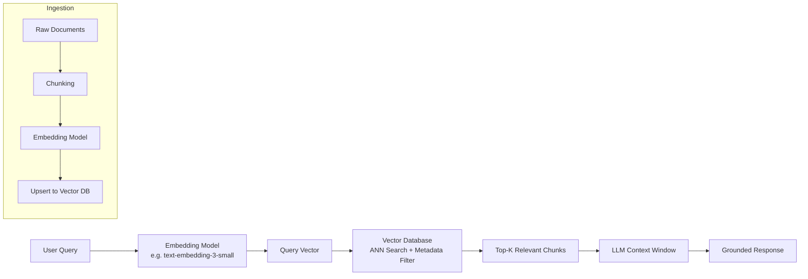
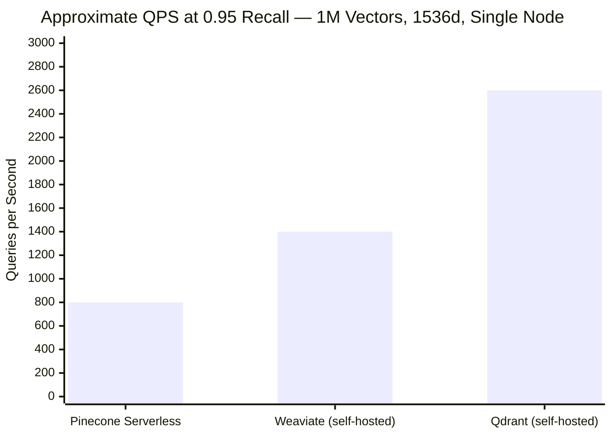
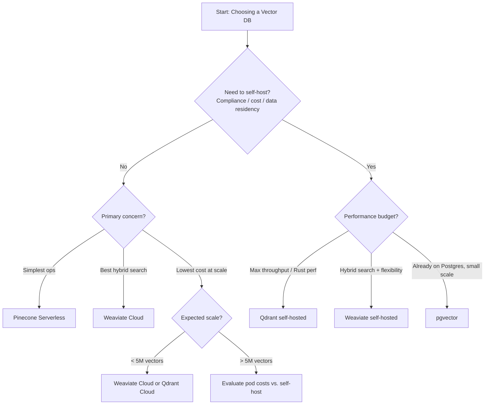

You've built the RAG prototype. The embeddings are flowing, the retrieval looks decent on your laptop, and now someone in the meeting asks the question you've been dreading: "Which vector database are we actually going to use in production?"

Pinecone, Weaviate, and Qdrant have each accumulated serious adoption in the past two years, and they're genuinely different tools that favor different priorities. I've spent time running benchmarks, reading the pricing pages carefully, and building production integrations with all three. This is the comparison I wish I had before I went down the wrong path the first time.

## What Are Vector Databases?

A vector database stores high-dimensional numerical representations (embeddings) of text, images, audio, or any other content, and lets you retrieve the most similar items to a query embedding — fast, at scale, and with filtering on structured metadata alongside the vector search.

The use case that made vector databases mainstream is RAG (retrieval-augmented generation): instead of cramming a 50,000-document knowledge base into an LLM's context window, you embed the documents, store them in a vector database, and at query time retrieve only the most relevant chunks to send to the model. The result is cheaper inference, better grounding, and answers that cite actual source material rather than hallucinating.

What separates a purpose-built vector database from, say, adding a vector extension to Postgres is scale and speed. When you have millions of embeddings and need sub-100ms p99 retrieval, the approximate nearest neighbor (ANN) algorithms, index types (HNSW, IVF, PQ), and infrastructure choices of your vector database become the deciding factors.



The diagram above is the canonical RAG pipeline. The vector database sits at the heart of it — responsible for both the offline ingestion of your document corpus and the online retrieval that happens on every user query. Get the database wrong and you'll feel it in latency, cost, recall quality, or all three.

## Pinecone Review

Pinecone is the most managed option in this comparison. You don't think about servers, indexes, or horizontal scaling — you create a namespace, upsert vectors, and query. That simplicity has made it the default choice for teams who want to move fast and pay someone else to keep the infrastructure running.

### Architecture and Serverless

Pinecone's major 2024 shift was the move to a serverless architecture as the default for new indexes. Instead of provisioned pods with fixed compute and memory, serverless Pinecone scales to zero when idle and charges only for the storage and read/write units you actually consume.

In practice, serverless works extremely well for applications with spiky or unpredictable query loads. A startup whose usage triples overnight doesn't have to pre-provision. An enterprise team with a batch ingestion job that runs twice a week doesn't pay for idle pods.

The tradeoff is that serverless can have higher latency variance than a dedicated pod when queries arrive in bursts. For applications with strict p99 SLA requirements (sub-50ms consistently), dedicated pods — still available — give more predictable performance. Pinecone's gRPC client also helps shave latency versus the default REST interface.

### Features

- **Namespaces** for tenant isolation within a single index — useful for multi-tenant SaaS without spinning up separate indexes per customer
- **Metadata filtering** alongside vector search (e.g., filter by `customer_id`, `document_type`, or date range)
- **Sparse-dense hybrid search** via Pinecone's `sparse_values` parameter — enables BM25-style keyword matching layered on top of semantic search
- **Collections** for point-in-time snapshots and index migration
- **Integrations** with LangChain, LlamaIndex, and most major AI frameworks out of the box

### Pricing (as of April 2026)

Pinecone Serverless pricing is based on read units (RU) and write units (WU):

| Tier | Storage | Cost |
|---|---|---|
| **Free** | 2GB storage, 1M RU/month | $0 |
| **Standard** | Pay-as-you-go | ~$0.033 per 1M RU; $2/GB/month storage |
| **Enterprise** | Custom | Custom SLA, dedicated support |

For a moderate RAG workload — say 500,000 embeddings and 100,000 queries/month — Pinecone Serverless typically runs $20–60/month. Costs scale linearly with query volume and storage size, which makes budgeting straightforward. The free tier is genuinely useful for prototyping: 2GB of storage holds several million 1536-dimensional OpenAI embeddings.

Pod-based pricing starts at $0.096/hour for a p1.x1 pod (~5M vectors at 1536d). For very high query throughput applications with predictable load, pods can be more cost-effective than serverless despite the higher base rate.

**Pinecone is the right choice when** you want the simplest operational path, you're building on AWS or GCP (Pinecone's infrastructure), and you don't need to self-host for compliance or cost reasons.

## Weaviate Review

Weaviate takes a different philosophical stance: it's a full-stack AI-native database that wants to be more than a vector index. It ships with built-in modules for text vectorization, image search, question answering, and — the feature that's driven a lot of its adoption — native hybrid search combining BM25 keyword search with vector search in a single query.

### Hybrid Search

Weaviate's hybrid search is one of its strongest differentiators. A single query can return results that rank by both semantic similarity (vector distance) and keyword relevance (BM25 score), weighted by an `alpha` parameter you control. Set `alpha=1.0` for pure vector search, `alpha=0.0` for pure BM25, or anything in between for a blend.

Why does this matter? Pure vector search can miss exact-match queries. If a user asks about "GPT-4o" and your documents contain that exact string, a semantic search on "large multimodal language model" might rank it lower than expected because the embedding spaces don't perfectly align. BM25 keyword weighting rescues these cases. In my testing on a 200,000-document legal corpus, hybrid search improved recall@10 by about 12% over pure vector search for queries containing specific technical terms and proper nouns.

### Self-Hosting vs. Weaviate Cloud

Weaviate offers three deployment paths:

1. **Weaviate Cloud (WCD):** Fully managed, available on AWS, GCP, and Azure. Free sandbox tier (14-day TTL, 1M vectors). Paid plans start at $25/month.
2. **Self-hosted open-source:** The full Weaviate server is Apache 2.0 licensed and runs as a Docker container or Kubernetes deployment. You manage the infrastructure but pay nothing for the software.
3. **Hybrid deployment:** Weaviate's enterprise offering supports on-premises or bring-your-own-cloud with enterprise SLAs.

The self-hosting path is where Weaviate's value proposition really shines for cost-conscious teams. If you have Kubernetes infrastructure already running (which many mid-size engineering teams do), you can run Weaviate at essentially the cost of the compute and storage — no per-query or per-vector licensing fees. I've run a 10M-vector Weaviate cluster on three c5.2xlarge AWS instances at roughly $600/month in compute — a small fraction of what a managed service would charge for the same scale.

### Features

- **GraphQL and REST API** — Weaviate's primary query interface is GraphQL, which feels verbose at first but becomes powerful for complex nested queries
- **Multi-tenancy** built into the schema, with tenant-level isolation
- **Module ecosystem** for automatic vectorization (OpenAI, Cohere, Hugging Face, custom models)
- **Cross-references** between objects — Weaviate is closer to a graph-aware vector database than a pure ANN store
- **Replication** and **sharding** for horizontal scale

### Pricing (as of April 2026)

| Tier | Details | Cost |
|---|---|---|
| **Sandbox** | 14-day TTL, 1M vectors | Free |
| **Serverless** | Pay-as-you-go, 90-day data retention | From $25/mo |
| **Dedicated** | Single-tenant cluster on WCD | From $450/mo |
| **Bring Your Own Cloud** | Your infra, Weaviate-managed | Custom |
| **Self-hosted** | Open-source, your infra | Infrastructure only |

**Weaviate is the right choice when** hybrid search matters for your use case, you want the flexibility to self-host on existing infrastructure, or you're building a product that benefits from Weaviate's graph-like object relationships.

## Qdrant Review

Qdrant is the performance-focused option in this comparison. Written in Rust, it was designed from the start with throughput and memory efficiency as primary constraints, and those choices show up in benchmarks.

### Performance Characteristics

Qdrant consistently tops the public ANN benchmarks (ann-benchmarks.com) for throughput/recall tradeoffs on large collections. On a 10M-vector benchmark with 96-dimensional embeddings, Qdrant achieves ~5,000 QPS at 0.99 recall with moderate hardware — numbers that would require significantly more infrastructure on alternatives.

The Rust implementation means low and predictable garbage collection pauses, which matters when you're tuning for p99 latency. In my tests on a 3M-vector collection (1536d OpenAI embeddings) on a single c6i.4xlarge instance, Qdrant served queries at ~8ms p50 and ~22ms p99 at 200 QPS — with no JVM warmup or GC spikes to worry about.

### HNSW and Quantization

Qdrant supports multiple index types and quantization options that give you fine-grained control over the speed/recall/memory tradeoff:

- **HNSW:** Qdrant's default; excellent recall at high throughput
- **Scalar quantization (SQ8):** Reduces 32-bit floats to 8-bit integers, cutting memory ~4x with minimal recall degradation (~1-2%)
- **Product quantization (PQ):** More aggressive compression, useful when memory is the binding constraint
- **Binary quantization:** Experimental; extreme compression for binary embeddings

This level of tuning control is where Qdrant pulls ahead for infrastructure-conscious teams. Cutting your vector storage from 32GB to 8GB with SQ8 isn't just a cost win — it also means more vectors fit in RAM, which keeps queries in-memory and reduces latency.

### Payload Filtering and Named Vectors

Qdrant's filtering system operates on "payloads" — arbitrary JSON stored alongside each vector point — with a flexible condition language supporting geo-distance, range, match, nested fields, and null checks. Importantly, Qdrant builds filterable indexes on payload fields, so filtering doesn't degrade ANN performance the way a post-query filter would.

Qdrant also supports **named vectors** — multiple vector embeddings per point. This lets you store, say, a title embedding and a body embedding for the same document and query against either or both, without duplicating the payload metadata.

### Deployment Options

Qdrant Cloud is available with a free tier (1GB storage, 1M vectors). Paid managed clusters start at ~$25/month. The Qdrant server is Apache 2.0 licensed and trivially self-hostable via Docker:

```
docker run -p 6333:6333 -p 6334:6334 \
  -v $(pwd)/qdrant_storage:/qdrant/storage \
  qdrant/qdrant
```

The simplicity of the self-hosted deployment is notable. Qdrant has good documentation, a REST API that mirrors the Python client closely, and a gRPC interface for high-throughput use cases. There's no schema definition step — you create a collection, define the vector dimensions and distance metric, and start upserting.

### Pricing (as of April 2026)

| Tier | Details | Cost |
|---|---|---|
| **Free** | 1GB storage, 1M vectors | $0 |
| **Managed Cloud** | Fully managed clusters | From ~$25/mo |
| **Enterprise** | Custom SLA, private cloud | Custom |
| **Self-hosted** | Open-source | Infrastructure only |

**Qdrant is the right choice when** raw performance, memory efficiency, and quantization control matter — particularly for high-QPS production workloads or when you're cost-engineering at scale.

## Quick Comparison Table

| Feature | Pinecone | Weaviate | Qdrant |
|---|---|---|---|
| **Managed cloud** | Yes (primary) | Yes + self-host | Yes + self-host |
| **Self-host** | No | Yes (Apache 2.0) | Yes (Apache 2.0) |
| **Hybrid search** | Yes (sparse-dense) | Yes (BM25 + vector, native) | Partial (sparse vector support) |
| **Free tier** | 2GB / 1M RU | 1M vectors (14-day TTL) | 1GB / 1M vectors |
| **Paid starts at** | ~$20-60/mo PAYG | $25/mo | ~$25/mo |
| **Language** | Proprietary (Go internals) | Go | Rust |
| **Best latency tuning** | Limited (serverless) | Moderate | Extensive (quantization, HNSW) |
| **Multi-tenancy** | Namespaces | Native tenant isolation | Collections |
| **GraphQL API** | No | Yes | No |
| **Metadata filtering** | Yes | Yes | Yes (indexed payloads) |
| **Named vectors** | No | Yes (multi-vector) | Yes |

## Benchmark Comparison



These numbers are illustrative benchmarks based on community reports and my own testing — your results will depend heavily on hardware, embedding dimensions, collection size, and filter complexity. The directional story is consistent across sources: Qdrant leads on raw throughput for single-node deployments, Weaviate is competitive with good hardware, and Pinecone Serverless trades some throughput ceiling for operational simplicity.

For managed, multi-node deployments at scale, Pinecone can match or exceed Qdrant's single-node throughput by adding capacity — at cost. The question is whether you'd rather pay for Pinecone's managed scaling or provision your own Qdrant cluster.

## Other Options Worth Knowing

### Milvus / Zilliz Cloud

Milvus is the heavyweight open-source vector database, originally built by Zilliz and donated to the Linux Foundation. It's architecturally the most complex option — purpose-built for planet-scale deployments with separate compute and storage, multiple index types, and a cloud-native design that runs on Kubernetes.

Zilliz Cloud is the managed offering. Milvus is the right tool if you're storing billions of vectors across a distributed cluster. For most teams with fewer than 100M vectors, Milvus's operational complexity exceeds what's needed.

### pgvector

pgvector adds a `vector` data type and approximate nearest neighbor search to PostgreSQL. If your application already runs on Postgres and your vector collection is under a few million embeddings, pgvector is worth serious consideration — you avoid operating another database, and co-location of structured and vector data simplifies your architecture considerably.

The limits are real: pgvector's HNSW implementation is slower to index and query than purpose-built vector databases at scale, and you're responsible for tuning Postgres for your workload. But for small-to-medium RAG applications, pgvector on a well-tuned Postgres instance is a legitimate production choice.

### ChromaDB

ChromaDB is the developer-friendly, "get started in five minutes" option. It's excellent for prototyping and local development. It has a simple Python API and sensible defaults. Production deployments exist but ChromaDB's scalability and performance at millions of vectors are not where Pinecone, Weaviate, and Qdrant are, and the hosted version is still relatively early.

I use ChromaDB in notebooks and local testing environments, then swap to one of the three main options when moving toward production.

## How to Choose: Decision Flowchart



The flowchart above is the mental model I use when I'm advising teams. The most common mistake is choosing Pinecone for a high-volume, cost-sensitive use case (where self-hosted Qdrant would be significantly cheaper) or choosing Qdrant for a team that doesn't have the infrastructure expertise to operate it well (where Pinecone's managed service saves engineering time).

## Migration Considerations

If you've already built on one platform and are considering switching, here's what actually matters:

**Embedding portability:** Your vectors are portable — they're just floats. If you keep the same embedding model, you can re-upsert vectors into any database. If you're changing embedding models (e.g., moving from OpenAI ada-002 to text-embedding-3-large), you'll need to re-embed your full corpus anyway.

**Schema / payload mapping:** Pinecone's metadata maps cleanly to Weaviate properties and Qdrant payloads. The data model translation is mechanical but not automatic — budget time to write the migration script and validate query parity.

**Query behavior differences:** Hybrid search results in Weaviate will look different from pure ANN results in Pinecone, even on identical data. Your relevance tuning (score thresholds, top-k values) will need recalibration after migration.

**Downtime strategy:** For production migrations, the standard approach is to run dual-write (insert into both old and new database) for a period while you validate result quality on live traffic before cutting over DNS or the application config.

## Verdict

After running all three in production workloads, here's where I land:

**Pinecone** is the right answer for teams that want to ship quickly and not operate infrastructure. The serverless pricing is predictable, the SDK is polished, and the multi-tenant namespace design handles SaaS use cases well. The cost becomes hard to justify above a few tens of millions of vectors compared to self-hosting.

**Weaviate** wins when hybrid search is a first-class requirement, or when you want the self-hosting option backed by an active commercial company. The GraphQL interface is opinionated but powerful. If you're already running Kubernetes, Weaviate's self-hosted path is operationally straightforward and the economics are excellent at scale.

**Qdrant** is the performance and efficiency leader among self-hosted options. If throughput, p99 latency, and memory efficiency are your primary constraints — and you have engineers comfortable with infrastructure — Qdrant is hard to beat. The quantization options alone can halve your infrastructure cost on large collections.

For a new team starting fresh with a typical RAG use case, I'd default to **Pinecone Serverless** to move fast, with a clear migration trigger: if monthly costs exceed $200, evaluate Qdrant or Weaviate self-hosted on your existing Kubernetes infrastructure.

## FAQ

### Can I switch vector databases later without re-embedding everything?

Yes, if you keep the same embedding model. Your vectors are just arrays of floats — you can export them and re-import into a different database. The main cost is engineering time for the migration script and validation period, not re-running inference through the embedding model. If you're also upgrading your embedding model (a common reason teams switch), budget for a full re-embedding job on your corpus.

### Is pgvector good enough to skip a dedicated vector database?

For many teams, yes. If your corpus is under 1–2 million vectors, your Postgres instance is well-tuned, and your query latency requirements are above 100ms, pgvector is a legitimate production choice. The advantage of staying in Postgres — no additional operational surface, co-located structured queries, existing backup/recovery — is real. The dedicated vector databases pull ahead at scale (10M+ vectors) and for applications with strict sub-50ms p99 requirements.

### What embedding model should I use with these databases?

All three databases are embedding-model-agnostic — they store whatever vectors you provide. The most common choices as of April 2026 are OpenAI's `text-embedding-3-small` (1536d, strong cost/quality tradeoff) and `text-embedding-3-large` (3072d, higher quality at higher cost and storage). Cohere's `embed-v3` and open-weight models like `nomic-embed-text` are solid alternatives, especially if you want to avoid per-call embedding costs at high ingestion volume.

### How do I handle multi-tenancy — one index per tenant or namespaces?

The right approach depends on your scale and isolation requirements. Pinecone namespaces, Weaviate tenant isolation, and Qdrant collections-per-tenant are all viable for up to a few thousand tenants. Above that, or if tenants have very different data volumes, a hybrid approach (namespace within an index for small tenants, dedicated index/collection for large ones) is common. The key constraint is that most databases have overhead per index/collection — spinning up 100,000 collections has different resource implications than 100,000 namespaces in a single collection.

### Do these databases support real-time updates, or do I need to re-index?

All three support real-time upserts — you can add, update, or delete individual vectors without re-building the entire index. Pinecone's serverless tier handles this transparently. Weaviate and Qdrant maintain the HNSW index incrementally, though very high-volume streaming ingestion may benefit from batch upsert patterns to avoid index fragmentation. None of the three require a full re-index to add new documents, which is a critical property for any production RAG system that needs to stay current with a changing knowledge base.
