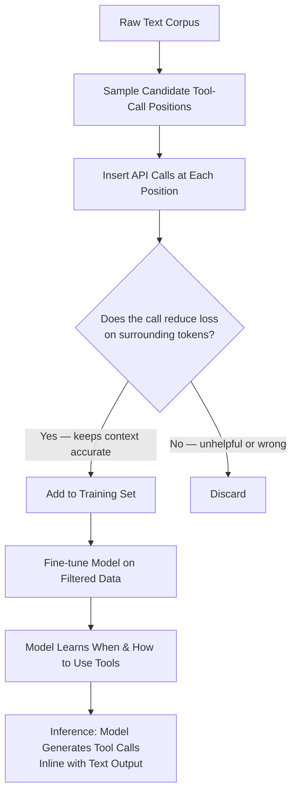
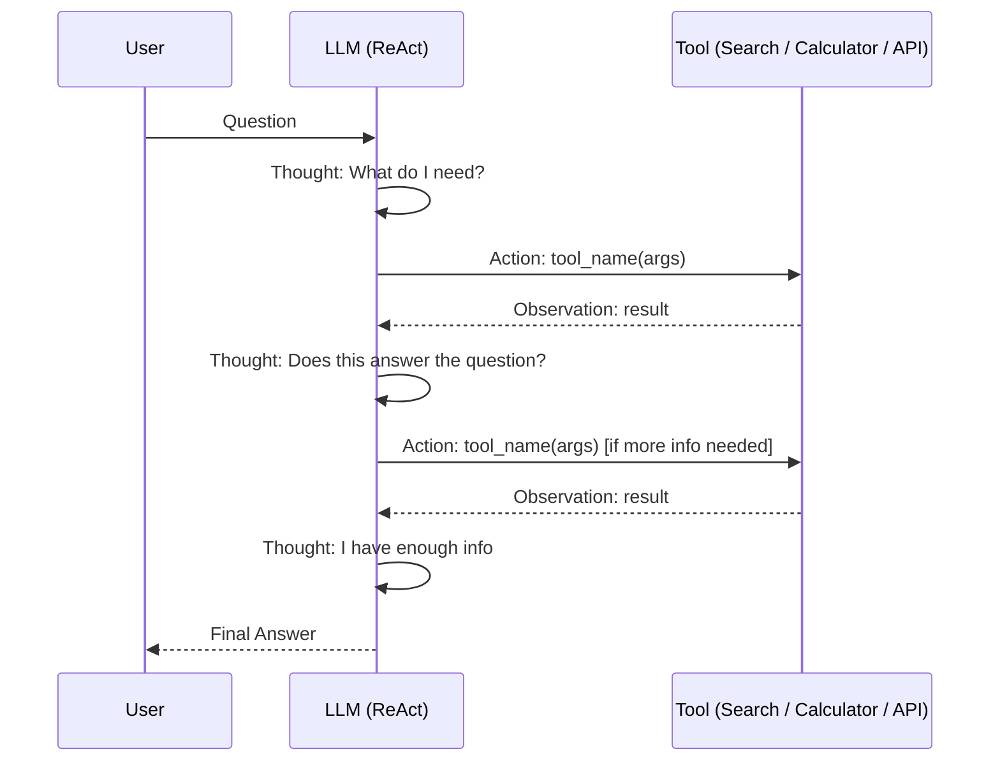
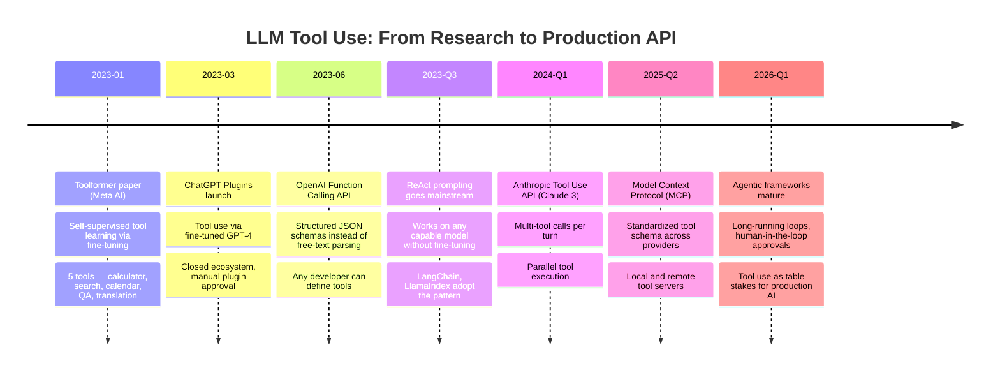

I spent a week trying to get a language model to tell me the current Bitcoin price. Every approach failed the same way: the model either hallucinated a confident-sounding number from its training data or admitted it didn't know. Neither answer was useful. That frustration led me down a rabbit hole — Toolformer, ReAct prompting, and eventually modern function calling — and I came out the other side understanding why "LLMs that use tools" is one of the most important ideas in applied AI right now.

This article explains how we got from "LLMs are smart but stuck" to systems that can search the web, run code, and call APIs in real time. If you're building anything beyond a simple chatbot, this is the architecture you need to understand.

---

## The Problem: LLMs Are Frozen in Time

A language model is, at its core, a very sophisticated pattern-matcher trained on a snapshot of text. By the time a model reaches you, its knowledge is months or years old. That creates three concrete problems that no amount of clever prompting can fully solve:

**They can't do math reliably.** Ask a large language model to multiply 7,823 by 4,991 and it will often produce a plausible-looking wrong answer. It's not calculating — it's predicting what a correct answer looks like. For anything involving arithmetic, currency conversions, or statistical computation, a model flying solo is a liability.

**They can't search.** If you ask me what happened in the news this morning, I'll tell you I don't know — because I'm a language model with a knowledge cutoff. But users keep asking anyway, and a model that guesses gets everything wrong in ways that are hard to catch.

**They can't access real-time data.** Stock prices, weather, live sports scores, current product inventory — all of it is invisible to a model without an external connection. This isn't a bug that will be fixed in the next version; it's an architectural reality.

The solution isn't to make the model smarter in isolation. It's to give the model tools and teach it when and how to use them.

---

## Toolformer: Teaching a Model to Call Its Own Tools

The Toolformer paper (Meta AI, 2023) made a genuinely surprising claim: you can teach a language model to use external tools through self-supervised learning, without labeling every training example by hand.

The core insight is elegant. Instead of asking humans to annotate millions of examples of "when should the model call a calculator?", Toolformer lets the model annotate itself. Here's the rough process:

1. Take a large corpus of text.
2. Sample candidate positions where a tool call might help (before generating the next token).
3. Try inserting a tool call at each position and see if the result actually reduces the loss on the surrounding tokens — i.e., does the retrieved information make the model's predictions more accurate?
4. Keep only the tool calls that genuinely help. Discard the ones that don't.
5. Fine-tune the model on the filtered dataset.

This is self-supervised in the truest sense. The model learns tool use not because a human said "here is when to use a calculator" but because the evidence is in the text itself: when a calculation is inserted, the model predicts the surrounding words better.

The tools Toolformer demonstrated: a calculator, a search engine, a calendar, a machine translation API, and a Wikipedia lookup. None of them required task-specific labels. The model learned that `[Calculator(7823 * 4991) → 39,048,293]` makes subsequent math-related text easier to predict than trying to recall the answer from weights.



The practical upshot: after Toolformer-style training, a model can decide mid-generation to pause, call an external API, receive the result, and continue generating — all without a human orchestrating the process step by step. The tool call is part of the output format.

The limitation? Toolformer is trained, not prompted. You need to fine-tune a model to get this behavior, which is expensive and requires the right dataset. That leads us to the second major approach: ReAct.

---

## ReAct: Reason + Act in a Loop

ReAct (Reason + Act) is a prompting pattern, not a training technique. That's what makes it so powerful for practitioners: you don't need to fine-tune anything. You describe the reasoning loop in the prompt, and a sufficiently capable model follows it.

The idea comes from a 2022 paper by Yao et al., and the name is a portmanteau of "reasoning" and "acting." The core loop has three parts:

- **Thought:** The model reasons out loud about what it needs to do next.
- **Action:** The model specifies a tool call (search, calculator, lookup, etc.).
- **Observation:** The tool runs and returns a result. The result is added to the context.
- Repeat until the model reaches a final answer.

Here's a concrete example. Suppose the question is: "What is the population of the city that hosted the 2024 Summer Olympics?"

**Thought:** I need to find out which city hosted the 2024 Summer Olympics, then look up its population.

**Action:** Search["2024 Summer Olympics host city"]

**Observation:** The 2024 Summer Olympics were held in Paris, France.

**Thought:** Now I need the population of Paris.

**Action:** Search["population of Paris 2024"]

**Observation:** The population of Paris city proper is approximately 2.1 million.

**Thought:** I have enough information to answer.

**Answer:** The 2024 Summer Olympics were hosted in Paris, which has a population of approximately 2.1 million people.

Every step is visible. Every inference is traceable. If the model went wrong, you can see exactly where.



The loop continues until the model either answers or hits a configured maximum number of steps. In production, you almost always want that cap — a model stuck in a bad reasoning loop will burn tokens and time indefinitely.

---

## ReAct vs. Chain-of-Thought

Chain-of-Thought (CoT) prompting also asks a model to reason step by step before answering. The difference is that CoT is entirely internal — the model thinks through the problem using only its own knowledge and then produces an answer. No tools, no external calls, no retrieval.

| Dimension | Chain-of-Thought | ReAct |
|---|---|---|
| **External tools** | No | Yes |
| **Real-time data** | No | Yes |
| **Verifiability** | Reasoning only | Reasoning + evidence |
| **Latency** | Lower (no tool calls) | Higher (tool round-trips) |
| **Cost** | Lower | Higher |
| **Best for** | Math reasoning, logic, planning | Search, lookup, computation |
| **Hallucination risk** | Higher for facts | Lower when tools return ground truth |

CoT is excellent for problems where the answer lives inside the model's weights: logical puzzles, code generation from a spec, summarization, translation. ReAct is better when the answer requires information the model couldn't have memorized: current events, real-time prices, private documents, or any calculation complex enough to exceed the model's arithmetic reliability.

In practice, many production systems combine both. A ReAct loop handles the tool orchestration. Within each Thought step, the model is doing CoT-style reasoning to decide what tool to call next.

---

## Implementing ReAct: A Practical Code Pattern

You don't need a framework to implement a basic ReAct loop. Here's a minimal Python pattern that works with any model that supports chat-style APIs:

```python
import json

SYSTEM_PROMPT = """You are a helpful assistant that solves problems step by step.
You have access to the following tools:

- search(query: str) -> str: Search the web for current information
- calculator(expression: str) -> float: Evaluate a math expression
- get_date() -> str: Get today's date

Use this exact format for every step:

Thought: [your reasoning about what to do next]
Action: tool_name(argument)

After seeing an Observation, continue with another Thought/Action pair
or give your final answer:

Final Answer: [your answer to the user's question]

Never guess. If you need information, use a tool to get it."""

def run_react_loop(question: str, tools: dict, max_steps: int = 8) -> str:
    messages = [
        {"role": "system", "content": SYSTEM_PROMPT},
        {"role": "user", "content": question}
    ]
    
    for step in range(max_steps):
        response = call_llm(messages)  # your model API call here
        content = response.content
        
        # Check if model reached a final answer
        if "Final Answer:" in content:
            return content.split("Final Answer:")[-1].strip()
        
        # Parse the action from the model's output
        if "Action:" in content:
            action_line = content.split("Action:")[-1].strip().split("\n")[0]
            tool_name, arg = parse_action(action_line)  # extract tool + args
            
            if tool_name in tools:
                observation = tools[tool_name](arg)
            else:
                observation = f"Error: unknown tool '{tool_name}'"
            
            # Feed the observation back into the conversation
            messages.append({"role": "assistant", "content": content})
            messages.append({
                "role": "user", 
                "content": f"Observation: {observation}"
            })
        else:
            # Model didn't follow the format — try to recover
            break
    
    return "Could not complete in the allowed steps."
```

The key insight here is that the "observation" after each tool call is fed back into the conversation as a user message. The model sees its own reasoning plus the tool result, and uses both to decide what to do next. The loop is just a while-loop around an LLM call.

This is simple enough to debug, extend, and audit. When something goes wrong, you have a full transcript of every Thought, Action, and Observation.

---

## Modern Tool Use: Function Calling in Claude and OpenAI APIs

Toolformer required fine-tuning. Early ReAct required prompt engineering and manual parsing. Modern APIs have converged on a cleaner solution: **structured function calling**.

Instead of parsing free-text `Action: search("query")` lines from the model's output, you describe your tools as typed JSON schemas. The model returns a structured tool call that you can execute directly without regex-based parsing.

Here's how it looks with the Anthropic Claude API:

```python
import anthropic

client = anthropic.Anthropic()

tools = [
    {
        "name": "search",
        "description": "Search the web for current information on any topic",
        "input_schema": {
            "type": "object",
            "properties": {
                "query": {
                    "type": "string",
                    "description": "The search query"
                }
            },
            "required": ["query"]
        }
    },
    {
        "name": "calculator",
        "description": "Evaluate a mathematical expression and return the result",
        "input_schema": {
            "type": "object",
            "properties": {
                "expression": {
                    "type": "string",
                    "description": "A valid mathematical expression, e.g. '7823 * 4991'"
                }
            },
            "required": ["expression"]
        }
    }
]

messages = [{"role": "user", "content": "What is 7823 times 4991?"}]

while True:
    response = client.messages.create(
        model="claude-opus-4-5",
        max_tokens=1024,
        tools=tools,
        messages=messages
    )
    
    if response.stop_reason == "end_turn":
        # Model finished — extract the text response
        for block in response.content:
            if hasattr(block, "text"):
                print(block.text)
        break
    
    if response.stop_reason == "tool_use":
        # Model wants to call a tool
        tool_calls = [b for b in response.content if b.type == "tool_use"]
        
        # Add the model's response (including tool call) to history
        messages.append({"role": "assistant", "content": response.content})
        
        # Execute each tool and collect results
        tool_results = []
        for tc in tool_calls:
            if tc.name == "calculator":
                result = str(eval(tc.input["expression"]))  # use a safe evaluator in production
            elif tc.name == "search":
                result = my_search_function(tc.input["query"])
            
            tool_results.append({
                "type": "tool_result",
                "tool_use_id": tc.id,
                "content": result
            })
        
        messages.append({"role": "user", "content": tool_results})
```

The structured format eliminates the fragile string parsing that plagued early ReAct implementations. The model can also call multiple tools in a single turn, and the API handles the coordination.

---

## The Evolution: From Toolformer to Modern APIs



The progression is clear: what started as a research paper requiring expensive fine-tuning is now a standard API feature that any developer can use in an afternoon.

---

## When to Use Which Pattern

**Use raw ReAct prompting when:**
- You're using a capable open-weight model (Llama 3, Mistral, Qwen) that doesn't have a native tool-calling API
- You need maximum control over the reasoning trace for debugging
- You're prototyping quickly and don't want to deal with schema definitions
- Your tool set is small and stable (fewer parsing edge cases)

**Use native function calling (Claude, OpenAI) when:**
- You're building a production system that needs reliability
- You have multiple tools and want parallel execution
- You need structured, typed outputs from tool calls
- You want to avoid the prompt engineering overhead of ReAct format maintenance

**Use a Toolformer-style fine-tuned model when:**
- You have a very specific, narrow set of tools
- You're operating at scale and need the model to decide quickly without a multi-step loop
- You have the training data and budget to fine-tune
- Latency is critical enough that a single-pass response beats a multi-step loop

For most teams in 2026, the answer is native function calling. The ReAct pattern is the conceptual foundation — understanding it makes you a better debugger when function calling misbehaves. Toolformer is the research ancestor worth knowing for the same reason.

---

## Verdict

The core insight from Toolformer still holds three years later: language models become dramatically more capable when they can reach outside their weights for ground truth. The self-supervised training approach was clever but impractical for most teams. ReAct made the same idea accessible through prompting. Modern function calling APIs made it reliable enough for production.

If you're building anything that needs current data, reliable arithmetic, or access to external systems, tool use isn't an optional upgrade — it's the architecture. Start with native function calling on a capable model, design your tools with narrow, typed schemas, log every tool call, and build a feedback loop that catches failures before users do.

The frozen-in-time problem that lost me a week on Bitcoin price lookups is a solved problem. The only question now is how well you architect the solution.

---

## FAQ

### What is the difference between ReAct prompting and an AI agent?

ReAct is a specific prompting pattern where the model alternates between Thought, Action, and Observation steps in a loop. An "AI agent" is a broader term for any system where a model takes actions autonomously over multiple steps. ReAct is one implementation of an agent loop, but agents can also use state machines, planners, or task queues. Think of ReAct as a specific algorithm that many agentic systems use internally.

### Does ReAct prompting work with smaller or open-weight models?

It depends on the model's instruction-following ability and context length. Models like Llama 3 70B, Mistral Large, and Qwen 2.5 72B follow the ReAct format reasonably well. Smaller 7B-class models struggle to maintain the format consistently across multiple steps and tend to hallucinate tool results instead of waiting for the Observation. For production use with small models, fine-tuning on ReAct-formatted examples usually helps more than prompt engineering alone.

### How do I prevent a ReAct loop from running forever?

Always set a maximum step count (typically 6–12 for most tasks) and handle the case where the model hasn't produced a Final Answer by that point. You can also add a "confidence check" — after N steps, inject a user message asking the model to summarize what it knows so far and give its best answer. In the Anthropic function calling API, `stop_sequences` and `max_tokens` provide additional guardrails at the API level.

### Is Toolformer the same as tool use in production LLMs like Claude or GPT-4?

They share the same goal but differ significantly in mechanism. Toolformer teaches tool use through fine-tuning on self-annotated data — the capability is baked into the model weights. Production tool use in Claude and GPT-4 is implemented through a combination of instruction fine-tuning and RLHF on tool-use examples, with the interface exposed via structured API contracts (JSON schemas). The Toolformer paper's self-supervised annotation pipeline is the conceptual predecessor, but the production implementations are independently trained.

### What is the Model Context Protocol (MCP) and how does it relate to tool use?

MCP is an open standard introduced by Anthropic in late 2024 that defines a common interface for how AI models communicate with external tools and data sources. Think of it as USB for AI tool integrations: instead of each application defining its own tool schema format, MCP gives you a universal plug. Tools built to the MCP spec work across different models and frameworks without re-implementation. It's not a replacement for function calling — it's a layer on top that standardizes how tool servers are discovered and connected.
