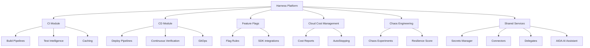
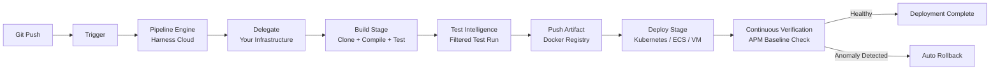
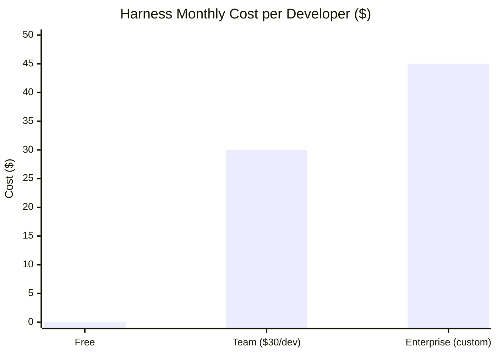

If your team is still babysitting Jenkins jobs at 2 a.m. or duct-taping GitHub Actions workflows together with bash scripts, Harness CI/CD is the platform that ends that nightmare. I've spent time evaluating modern delivery platforms, and Harness stands out as one of the most complete — and most misunderstood — options on the market. This guide covers everything: what it actually is, how each module works, how to get a pipeline running in under an hour, and whether it's worth paying for.

---

## What Is Harness?

Harness is a cloud-native software delivery platform founded in 2017. Its core product is a CI/CD suite, but "CI/CD platform" undersells it. Harness has grown into a unified DevOps operating system that covers continuous integration, continuous delivery, feature flag management, cloud cost optimization, and chaos engineering — all from a single control plane.

The company's original insight was that deployments fail in predictable patterns, and that ML models can learn those patterns faster than humans can write alert rules. That insight became **Continuous Verification**: Harness monitors deployment health against a baseline in real time, and if it detects a statistically significant anomaly — error rate spike, latency increase, drop in throughput — it automatically rolls back before users notice.

That was a meaningful differentiator in 2017. Since then, Harness has expanded dramatically. The platform now supports:

- **Any cloud**: AWS, GCP, Azure, or your own data center
- **Any infrastructure**: Kubernetes, ECS, Lambda, VMs, Helm, Terraform
- **Any Git provider**: GitHub, GitLab, Bitbucket, Azure Repos
- **Any language**: because builds run in Docker containers, the language doesn't matter
- **Any team size**: from a solo developer on the free tier to enterprises running thousands of pipelines per day

The SaaS version runs at app.harness.io. Self-hosted is available for enterprises with compliance requirements that prohibit SaaS.

---

## Platform Architecture

Harness is organized into modules that share a common account, pipeline engine, and secrets management layer. You can adopt one module and ignore the rest, or use them all together. The architecture below shows how they relate.



Every pipeline runs through the same engine regardless of which module it belongs to. That means the YAML syntax, the secrets references, the approval flows, and the RBAC rules are consistent across CI builds and CD deployments. Once you learn one pipeline, you understand them all.

---

## Key Modules

### Continuous Integration (CI)

Harness CI was built on the Drone open-source engine (acquired in 2020) and has since been significantly extended. Pipelines are defined in YAML and run on Harness-managed cloud runners, your own Kubernetes cluster, or VMs.

The standout CI feature is **Test Intelligence**. Instead of running your full test suite on every commit, Harness analyzes which tests are actually affected by the changed code and runs only those. In practice, teams report 70–90% reductions in test execution time on large codebases. The system learns over time — the more pipelines you run, the better its selection becomes.

Other CI capabilities worth knowing:

- **Layer caching**: Docker image layers and dependency caches (npm, Maven, pip, Go modules) are cached automatically
- **Parallelism**: split large test suites across multiple runners declaratively
- **Plugins**: a marketplace of pre-built steps (Slack notifications, S3 uploads, Jira ticket creation) that work like Docker containers — no SDK required
- **GitHub Actions compatibility**: import existing GitHub Actions steps directly into Harness CI pipelines

### Continuous Delivery (CD)

The CD module handles the deploy side: taking an artifact from CI and getting it running in production safely. You define a **service** (what you're deploying), an **environment** (where it's going), and an **infrastructure definition** (how it maps to actual compute).

Deployment strategies are first-class concepts:

- **Canary**: route a percentage of traffic to the new version, expand or roll back based on verification results
- **Blue/Green**: run two environments in parallel, switch traffic when ready
- **Rolling**: replace instances in waves
- **Custom**: write your own logic with shell scripts or Terraform

Harness handles the post-deployment verification automatically. Connect your APM (Datadog, New Relic, AppDynamics, Prometheus, Splunk) and define what "healthy" looks like. Harness does the rest.

### Feature Flags

The Feature Flags module lets you decouple code deployments from feature releases. Ship code to production behind a flag, then enable it for 1% of users, 10%, or a specific segment — without redeploying.

SDKs are available for JavaScript, React, Node.js, Java, Python, Go, iOS, Android, and more. Flags can be evaluated server-side or client-side. The module integrates with the CD pipeline so you can programmatically toggle flags as part of a deployment stage.

### Cloud Cost Management (CCM)

CCM gives you visibility into what you're actually spending on cloud infrastructure and tools to reduce it. The two main features:

**Cost Reports**: break down spend by service, team, environment, or any custom label. Identify the biggest waste areas without writing CloudWatch Logs queries.

**AutoStopping**: detect idle cloud resources (a dev environment that's been dormant for 8 hours, a test cluster no one is using on weekends) and stop them automatically. Harness claims teams save 30–70% on non-production cloud spend with this alone.

### Chaos Engineering

The Chaos Engineering module (based on the LitmusChaos open-source project) lets you deliberately inject failures into your system — kill a pod, throttle network bandwidth, fill a disk — and measure whether your application recovers gracefully.

Each experiment produces a **Resilience Score** that tracks how well your system handles each failure type over time. You can run chaos experiments as a pipeline stage, so chaos testing becomes part of your release process rather than a separate manual exercise.

---

## Getting Started: Account Setup and First Pipeline

Getting from zero to a running pipeline takes about 30 minutes on the free tier. Here's the actual sequence.

**1. Create an account**

Go to app.harness.io and sign up. You'll be prompted to set up an organization and a project. These are the main access control boundaries — different teams get different projects.

**2. Install a Delegate**

A **Delegate** is a lightweight agent (runs as a Docker container or Kubernetes deployment) that you install in your own infrastructure. All Harness operations — running builds, deploying to clusters, pulling secrets — flow through the Delegate. This means Harness never needs direct network access to your internal systems; the Delegate initiates outbound connections to Harness Cloud.

For a quick start, use the Harness-managed cloud runners and skip the Delegate installation. For anything touching your private infrastructure, you need one.

**3. Create Connectors**

Connectors are authenticated integrations to external systems: your Git repository, your container registry (ECR, GCR, Docker Hub), your Kubernetes cluster, your cloud provider. Each connector is stored once and referenced by name in pipeline YAML. Credentials are never hardcoded.

**4. Create a Pipeline**

Navigate to Pipelines → Create Pipeline. The visual editor lets you add stages by clicking. For CI, add a **Build** stage. For CD, add a **Deploy** stage. Switch to the YAML editor at any time — changes in one view are reflected in the other instantly.

A minimal CI pipeline that builds and pushes a Docker image looks like this:

```yaml
pipeline:
  name: my-service-ci
  identifier: my_service_ci
  stages:
    - stage:
        name: Build
        identifier: Build
        type: CI
        spec:
          cloneCodebase: true
          execution:
            steps:
              - step:
                  name: Build and Push Image
                  identifier: build_push
                  type: BuildAndPushDockerRegistry
                  spec:
                    connectorRef: my_docker_hub
                    repo: myorg/my-service
                    tags:
                      - <+pipeline.sequenceId>
```

**5. Run and iterate**

Trigger a run manually. Watch the pipeline graph update in real time — each step shows logs, duration, and status. Fix what breaks. Add more steps. Connect a CD stage to deploy what you just built.

---

## Pipeline Concepts: Stages, Steps, Delegates, and Connectors

Understanding four concepts unlocks the entire platform.

**Stages** are the major phases of a pipeline — Build, Test, Deploy, Verify, Approval. Each stage runs independently and can be targeted at different infrastructure. A single pipeline can have a Build stage running on a cloud runner, a Deploy stage running through a Delegate in your AWS account, and an Approval stage that pauses for a human to click a button.

**Steps** are the individual actions within a stage: run a shell script, build a Docker image, deploy a Helm chart, send a Slack notification. Steps can run sequentially or in parallel within a stage.

**Delegates** are the execution agents. They poll Harness Cloud for tasks and execute them locally. You can run multiple Delegates for high availability and tag them for routing specific pipelines to specific infrastructure.

**Connectors** are authenticated connections to external systems. They use Harness Secrets Manager (or integrate with HashiCorp Vault, AWS Secrets Manager, GCP Secret Manager) so credentials are never stored in pipeline YAML.



This flow is the core value proposition of Harness in one diagram: code lands, tests run intelligently, artifact is built and pushed, deployment happens with automated safety verification, and rollback is triggered automatically if something goes wrong — no human intervention required.

---

## AIDA: Harness AI Development Assistant

AIDA (AI Development Assistant) is Harness's integrated AI layer, built on top of large language models. It's not a chatbot bolted on the side — it's woven into the pipeline authoring and debugging experience.

What AIDA actually does:

**Pipeline generation**: Describe what you want to build in plain English — "a Node.js CI pipeline that runs tests, builds a Docker image, and deploys to my staging Kubernetes cluster" — and AIDA generates the YAML. It's not perfect, but it gets you 80% of the way there in 30 seconds.

**Error analysis**: When a pipeline step fails, AIDA analyzes the error output and suggests fixes. If your build failed because a dependency version is incompatible, AIDA identifies that and suggests the compatible version. If your deployment failed because a Kubernetes resource quota was exceeded, AIDA explains what to change.

**Log summarization**: Production pipelines generate thousands of lines of output. AIDA summarizes what actually matters — which step failed, why, and what the recommended remediation is.

**Policy suggestions**: AIDA can audit your pipeline YAML against security best practices and flag issues — hardcoded credentials, missing approval gates before production deployments, overly permissive service account bindings.

AIDA is available on Team and Enterprise plans. It's not available on the free tier.

---

## Pricing

Harness pricing is module-based. You pay for what you use. The three main tiers:

**Free**
- CI: 2,000 build minutes per month
- CD: unlimited deployments to non-production environments, 5 services
- Feature Flags: up to 25,000 monthly active users
- 3 users
- Community support only
- No AIDA

**Team** — $30 per developer per month (billed annually, roughly $37/month billed monthly)
- CI: unlimited build minutes
- CD: unlimited deployments, unlimited services
- Feature Flags: up to 1M MAUs
- Continuous Verification
- AIDA access
- Standard support with SLA

**Enterprise** — custom pricing
- Everything in Team
- Self-hosted deployment option
- SSO, SCIM provisioning, advanced RBAC
- Custom audit trails and compliance reporting
- Dedicated support and customer success manager
- SLA guarantees on pipeline execution



The $30/developer/month Team price is competitive for what it covers. Jenkins is free but you're paying in engineering time — a conservative estimate is 1–2 engineer-days per month per team maintaining Jenkins infrastructure, which at $150/hour blows past the Harness cost quickly. GitHub Actions charges per CI minute above the free tier ($0.008/minute for Linux runners), so high-volume CI shops often find Harness cheaper despite the per-seat cost.

---

## Harness vs Jenkins vs GitHub Actions

This is the comparison most teams actually need to make.

| Capability | Harness | Jenkins | GitHub Actions |
|---|---|---|---|
| Setup time | 30 min | 2–8 hours | 15 min |
| CI build minutes | Unlimited (Team) | Unlimited (self-hosted) | 2,000 free / $0.008 per min |
| CD orchestration | Native, full-featured | Plugins, fragile | Limited, plugin-dependent |
| Kubernetes deployments | First-class | Jenkins X or plugins | Requires custom YAML |
| Deployment strategies | Canary, Blue/Green, Rolling | Plugin-dependent | Manual implementation |
| Automatic rollback | Built-in (CV) | Not built-in | Not built-in |
| Feature flags | Built-in module | Third-party | Third-party |
| Cloud cost visibility | Built-in (CCM) | None | None |
| Chaos engineering | Built-in module | Third-party | Third-party |
| AI assistance | AIDA (Team+) | None | Copilot (GitHub only) |
| Self-hosted option | Enterprise tier | Always | GitHub Enterprise |
| Maintenance burden | Low (SaaS) | High | Low (SaaS) |
| Pricing model | Per developer | Free (infrastructure cost) | Per CI minute + seats |

**Jenkins** wins if you need maximum customization and have a dedicated platform engineering team to maintain it. The plugin ecosystem is vast, everything is configurable, and you own the infrastructure. The tradeoff is that Jenkins infrastructure becomes a full-time job at scale. Security patches, plugin compatibility, master HA — it never ends.

**GitHub Actions** wins for teams that live in GitHub and have relatively simple CI needs. The integration with pull requests, code review, and GitHub's security features is seamless. Where it struggles is complex multi-service deployments, production delivery workflows, and anything requiring sophisticated rollback logic.

**Harness** wins for teams that want a complete delivery platform without the maintenance overhead. The per-developer pricing is the barrier, but if you're already spending engineering time on Jenkins maintenance or hitting GitHub Actions limits, the math often works out. The key advantage is that Harness covers the entire delivery lifecycle — you're not stitching together four different tools.

---

## Who Should Use Harness?

Harness is a strong fit for:

**Teams migrating off Jenkins**: If Jenkins is your current CI/CD tool and it's causing pain, Harness is the most direct migration path. The visual pipeline editor makes it easier to translate Jenkins jobs, and the Delegate architecture means you don't have to re-expose your internal infrastructure.

**Kubernetes-first engineering teams**: If you're deploying to Kubernetes, Harness's native support for Helm, Kustomize, and raw manifests — combined with canary deployments and automatic rollback — is hard to match. The CD module was built with Kubernetes in mind.

**Regulated industries**: The audit trail, approval gates, governance policies, and RBAC in Harness Enterprise are built for compliance requirements in finance, healthcare, and government. Jenkins requires extensive customization to reach the same level.

**Mid-size to large engineering organizations**: The free tier is fine for experimentation. Real value starts at team scale (10+ developers) where the per-seat cost is offset by reduced maintenance burden and faster deployment cycles.

Harness is probably not the right fit for:

- **Solo developers or very small teams** who can get by with GitHub Actions free tier
- **Teams with simple, linear pipelines** that don't need canary deployments or automatic rollback
- **Organizations with strict air-gap requirements** who can't use SaaS at all (though Harness Enterprise self-hosted addresses this)

---

## Verdict

Harness is genuinely impressive as a platform. The breadth of what it covers — CI, CD, feature flags, cloud cost management, chaos engineering, AI assistance — under one consistent interface is unmatched in the market. The pipeline engine is solid, the Kubernetes support is excellent, and Continuous Verification is a real differentiator for teams that take production reliability seriously.

The $30/developer/month Team price is not cheap, but it's fair for what you get. The free tier is generous enough to evaluate the platform properly before committing.

If you're currently running Jenkins and spending meaningful engineering time on it, the ROI calculation on Harness usually closes quickly. If you're on GitHub Actions and bumping into its CD limitations, Harness is the natural next step. If you're starting fresh, I'd default to Harness for any team that expects to grow.

The AI features (AIDA) are useful but not transformative yet — they're in the "saves 10 minutes per debugging session" category, not "replaces your platform engineer" category. They'll improve over time.

---

## Frequently Asked Questions

**What exactly is a Harness Delegate and do I need one?**
A Delegate is a lightweight agent that you deploy in your own infrastructure — as a Docker container or a Kubernetes deployment. It acts as the bridge between Harness Cloud and your internal systems, executing pipeline tasks locally and reporting results back. You don't need one if you're using Harness-managed cloud runners for CI-only workloads. You do need one if you're deploying to your own Kubernetes cluster, a private cloud account, or any internal infrastructure that Harness can't reach directly from the internet.

**How does Harness Continuous Verification actually work?**
When you enable CV on a deployment stage, Harness connects to your APM (Datadog, New Relic, Prometheus, etc.) and establishes a baseline of key metrics — error rate, latency, request throughput — from a recent healthy period. After deployment, it monitors the same metrics for a configurable window (typically 15–30 minutes). If the post-deployment metrics deviate from the baseline by more than a configured threshold, Harness automatically triggers a rollback to the previous artifact version. No alert rule writing required.

**Can I use Harness with my existing GitHub Actions workflows?**
Yes. Harness CI can import and run GitHub Actions steps natively, so you don't have to rewrite existing Actions-based steps. You can also trigger Harness pipelines from GitHub Events (push, pull request, tag) using webhooks, making Harness an additive layer on top of your existing GitHub setup rather than a full replacement.

**What is Test Intelligence and how much does it actually speed up builds?**
Test Intelligence is Harness's ML-powered test selection feature. It analyzes your codebase's call graph to determine which tests are actually affected by a given code change, then runs only those tests instead of the full suite. Harness's published data shows an average 70% reduction in test execution time. The accuracy depends on how well-structured your test suite is — if tests are tightly coupled and hard to isolate, the gains will be smaller. It improves with each pipeline run as the model learns your codebase's patterns.

**Is Harness SOC 2 compliant?**
Yes. Harness holds SOC 2 Type II certification, which covers security, availability, and confidentiality. The Enterprise self-hosted option lets organizations that can't use SaaS platforms for compliance reasons run the Harness control plane within their own environment. Harness also supports HIPAA and FedRAMP-aligned configurations for healthcare and government customers on Enterprise plans.
