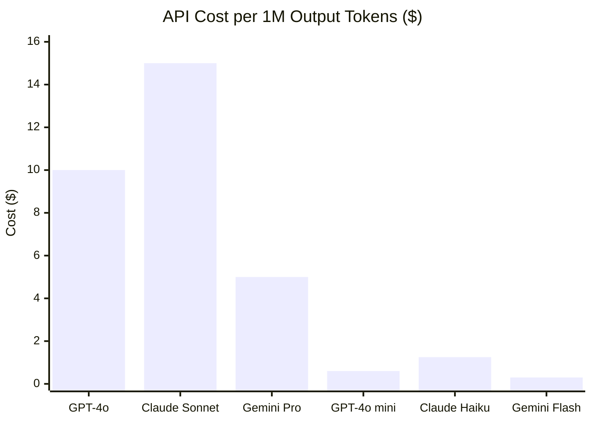
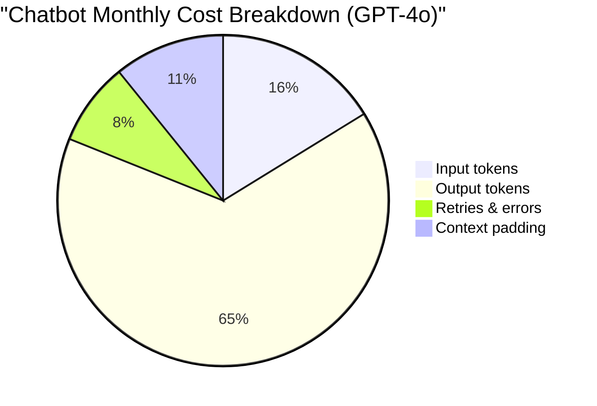
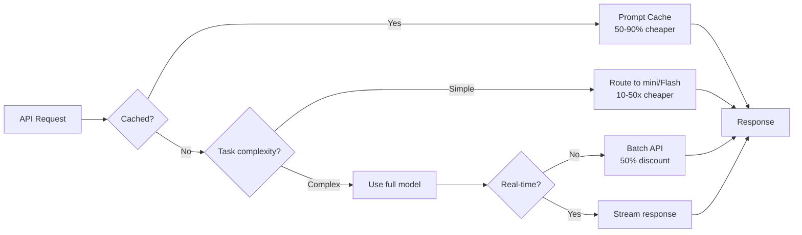

Picking an LLM API used to mean picking a vendor and hoping for the best. Today you have three serious options — Anthropic Claude, OpenAI, and Google Gemini — and the pricing differences between them can swing your monthly bill by 10x or more depending on which models you choose and how you use them.

The problem is that comparing prices is genuinely confusing. Every provider charges separately for input and output tokens. Some models have tiered pricing based on context length. Batch APIs have their own rates. And the "cheap" model in one provider's lineup can still cost more than the premium model in another's for certain workloads.

This guide cuts through all of that. We'll look at the actual per-token prices, run real cost calculations for common production workloads, and tell you exactly which API wins for which use case.

---

## Quick Price Comparison

The table below covers the main production-ready models from each provider. Prices are per 1 million tokens.

| Model | Provider | Input (per 1M tokens) | Output (per 1M tokens) | Context Window |
|---|---|---|---|---|
| GPT-4o | OpenAI | $2.50 | $10.00 | 128K |
| GPT-4o mini | OpenAI | $0.15 | $0.60 | 128K |
| o1 | OpenAI | $15.00 | $60.00 | 200K |
| o1-mini | OpenAI | $3.00 | $12.00 | 128K |
| Claude 3.5 Sonnet | Anthropic | $3.00 | $15.00 | 200K |
| Claude 3 Opus | Anthropic | $15.00 | $75.00 | 200K |
| Claude 3 Haiku | Anthropic | $0.25 | $1.25 | 200K |
| Gemini 1.5 Pro | Google | $1.25 | $5.00 | 1M (2M paid) |
| Gemini 1.5 Flash | Google | $0.075 | $0.30 | 1M |

A few things jump out immediately. Gemini 1.5 Flash is dramatically cheaper than everything else at the low end. Claude 3 Opus and OpenAI o1 are roughly comparable and both expensive. The mid-range is where the interesting tradeoffs live: GPT-4o vs Claude 3.5 Sonnet vs Gemini 1.5 Pro.

---

## OpenAI API Pricing

OpenAI has the widest model lineup and the most ecosystem tooling, but you'll pay a premium for it in most tiers.

**GPT-4o** is OpenAI's flagship general-purpose model at $2.50 input / $10.00 output per 1M tokens. It supports vision, function calling, JSON mode, and has a 128K context window. For most production workloads that don't need extended reasoning, this is the OpenAI default.

**GPT-4o mini** is the budget option at $0.15 / $0.60 per 1M tokens — a 16x reduction from GPT-4o on input. Quality is noticeably lower on complex reasoning tasks, but for classification, extraction, or light summarization, it punches well above its price.

**o1** is OpenAI's reasoning model, designed for problems that benefit from chain-of-thought computation. At $15.00 / $60.00 per 1M tokens, it's priced for specialized use. Output tokens are charged at 4x the input rate, reflecting the extended internal reasoning the model does. Unless you specifically need multi-step mathematical reasoning or complex code analysis, o1 is usually overkill.

**o1-mini** brings reasoning capability down to $3.00 / $12.00 per 1M tokens. Better value than full o1 for STEM tasks, but still 20x the price of GPT-4o mini.

OpenAI also offers a Batch API for asynchronous workloads that gives you 50% off on GPT-4o and GPT-4o mini, bringing those prices to $1.25 / $5.00 and $0.075 / $0.30 respectively. If your workflow can tolerate 24-hour turnaround, this is significant.

---

## Anthropic Claude API Pricing

Anthropic's pricing is straightforward: three models, clear positioning, no hidden tiers (though prompt caching has its own structure we'll cover later).

**Claude 3.5 Sonnet** at $3.00 / $15.00 per 1M tokens is Anthropic's workhorse. The output price is 50% higher than GPT-4o's, which matters on output-heavy workloads like long-form generation. But Claude 3.5 Sonnet consistently outperforms GPT-4o on coding benchmarks and tends to follow complex instructions more reliably. For software engineering tasks, the higher output price often comes with fewer retries.

**Claude 3 Opus** at $15.00 / $75.00 per 1M tokens is the most expensive model in this comparison. At this point, most teams using Claude 3.5 Sonnet are getting better benchmark results for a fraction of the price, so Opus is increasingly a legacy choice for teams that evaluated and deployed before 3.5 Sonnet was available.

**Claude 3 Haiku** at $0.25 / $1.25 per 1M tokens is the budget Claude. It's noticeably less capable than Sonnet on reasoning tasks, but for high-volume classification, extraction, or structured data tasks with well-specified prompts, it performs well and the price is competitive with GPT-4o mini.

One important differentiator: Anthropic's prompt caching feature lets you cache up to 90% of a long system prompt and pay only $0.30 / $1.50 per 1M tokens for cached reads (10% of the base price). For applications with large, stable system prompts — RAG context, tool schemas, long documents — this can cut input costs dramatically.

---

## Google Gemini API Pricing

Google's pricing strategy is aggressive at the budget tier and competitive in the mid-range, especially with the 1M token context window.

**Gemini 1.5 Flash** at $0.075 / $0.30 per 1M tokens is the cheapest production-quality model in this comparison by a significant margin. It's 50% cheaper than GPT-4o mini on input and 50% cheaper on output. Quality is comparable to GPT-4o mini for straightforward tasks, with the added advantage of a 1M token context window — useful if you're processing long documents without chunking.

**Gemini 1.5 Pro** at $1.25 / $5.00 per 1M tokens is where Google's pricing becomes genuinely interesting. It's half the price of GPT-4o on input and half the price on output, while offering a substantially longer context window. Benchmark performance is generally below GPT-4o and Claude 3.5 Sonnet on complex tasks, but for summarization, extraction, and question-answering over long documents, it's a strong cost-effective choice.

Note that Gemini 1.5 Pro pricing is tiered for requests over 128K tokens: input goes to $2.50 / $10.00 per 1M tokens (matching GPT-4o's base price). If you're actually using the long context window, factor in the premium.

Google also offers a free tier through Google AI Studio that's useful for development and low-volume applications, and Vertex AI pricing can differ from Google AI Studio pricing for enterprise customers.

---

## Real Cost Examples

Let's run the numbers on three workloads that come up constantly in production AI applications.

### Scenario 1: Summarize 100,000 Documents Per Month

Assume each document is 2,000 tokens input and produces a 300-token summary. That's 200M input tokens and 30M output tokens per month.

| Model | Input Cost | Output Cost | Monthly Total |
|---|---|---|---|
| GPT-4o | $500 | $300 | **$800** |
| GPT-4o mini | $30 | $18 | **$48** |
| Claude 3.5 Sonnet | $600 | $450 | **$1,050** |
| Claude 3 Haiku | $50 | $37.50 | **$87.50** |
| Gemini 1.5 Pro | $250 | $150 | **$400** |
| Gemini 1.5 Flash | $15 | $9 | **$24** |

For bulk document summarization, Gemini 1.5 Flash wins decisively. Even Claude 3 Haiku and GPT-4o mini are 3-4x more expensive. If quality benchmarks are acceptable (test this on your documents), Flash can reduce a $1,000/month bill to $24.

### Scenario 2: Generate 1,000 Code Snippets Per Day (30,000/month)

Assume a 500-token prompt (instructions + context) and 800-token output per snippet. That's 15M input tokens and 24M output tokens per month.

| Model | Input Cost | Output Cost | Monthly Total |
|---|---|---|---|
| GPT-4o | $37.50 | $240 | **$277.50** |
| GPT-4o mini | $2.25 | $14.40 | **$16.65** |
| Claude 3.5 Sonnet | $45 | $360 | **$405** |
| Claude 3 Haiku | $3.75 | $30 | **$33.75** |
| Gemini 1.5 Pro | $18.75 | $120 | **$138.75** |
| Gemini 1.5 Flash | $1.13 | $7.20 | **$8.33** |

Code generation is output-heavy, which amplifies the high output prices of GPT-4o and Claude 3.5 Sonnet. If you're generating code at scale and the budget model quality is acceptable for your use case, Flash or GPT-4o mini are the obvious choices. But for production code generation where quality and instruction-following matter, Claude 3.5 Sonnet's higher reliability often means fewer retries — factor in that your effective retry rate can add 10-30% to the token count with cheaper models.

### Scenario 3: Customer Support Chatbot with 10,000 Daily Messages

Assume 15 messages per conversation, 300 tokens each (mix of user and assistant). A 500-token system prompt per conversation. Daily: 10,000 conversations, 4.5M message tokens + 5M system prompt tokens = 9.5M input tokens; 3M output tokens. Monthly: 285M input, 90M output.

| Model | Input Cost | Output Cost | Monthly Total |
|---|---|---|---|
| GPT-4o | $712.50 | $900 | **$1,612.50** |
| GPT-4o mini | $42.75 | $54 | **$96.75** |
| Claude 3.5 Sonnet (with caching) | ~$90* | $1,350 | **~$1,440** |
| Claude 3 Haiku (with caching) | ~$7.50* | $112.50 | **~$120** |
| Gemini 1.5 Pro | $356.25 | $450 | **$806.25** |
| Gemini 1.5 Flash | $21.38 | $27 | **$48.38** |

*Assumes 90% of input tokens are cached system prompt at 10% price. Claude's caching is significant for chatbots with stable system prompts — it cuts a $1,350 input bill to ~$135.

For a customer support chatbot, Gemini 1.5 Flash comes out cheapest again at $48/month. Claude 3 Haiku with caching is competitive at ~$120/month and may deliver better output quality on nuanced support scenarios.

---

## Hidden Costs Most Teams Miss

The per-token prices above are real, but they're not the whole story.

**Rate limits and burst capacity.** All three providers have rate limits on tokens per minute and requests per minute. When you hit them, your application either queues requests (adding latency) or fails (requiring retries). OpenAI's rate limits are the most documented and the most flexible with paid tiers. Google's limits on Gemini 1.5 Pro can be surprisingly restrictive for high-throughput workloads. Plan your architecture around rate limits before you commit to a provider.

**Retry costs from unreliable outputs.** Budget models fail to follow complex instructions more often than premium models. If your application needs structured JSON output and you're using a cheaper model, you'll see parse failures that require retries. A 20% retry rate means a 20% cost premium on top of the base price. On complex tasks, Claude 3.5 Sonnet's stronger instruction-following can actually be cheaper than Claude 3 Haiku if Haiku requires constant retries.

**Context window waste.** It's easy to pad prompts with "just in case" context that the model doesn't use. Every token in a 200K context is billed even if the model only needed the last 2K tokens. Profile your actual context utilization. Teams routinely find they're sending 10x more context than the model requires.

**Prompt engineering time.** Getting a budget model to match the output quality of a premium model often requires significantly more prompt engineering. That engineering time has a real cost. If your team spends 40 hours getting GPT-4o mini to produce the quality you get from Claude 3.5 Sonnet out of the box, that's rarely worth the per-token savings.

**Data egress and infrastructure.** If you're on AWS and sending data to OpenAI, you may incur data egress costs. Teams using Vertex AI for Gemini can keep data within Google Cloud infrastructure, which can matter for compliance and can reduce or eliminate egress fees.

---

## Cost Optimization Tips

**Use prompt caching aggressively.** Anthropic's prompt caching is the most mature implementation. If your application has a system prompt longer than 1,024 tokens that stays stable across requests, enable caching immediately. The 90% cost reduction on cached tokens pays for itself on the first day of traffic. OpenAI also offers a caching mechanism for frequently-used prefixes. Build your prompts with cacheable sections at the beginning.

**Route by task complexity.** Not every request needs your best model. Build a classifier (which can itself be a cheap model) that routes simple queries to GPT-4o mini or Gemini Flash and complex queries to GPT-4o or Claude 3.5 Sonnet. Most production workloads have a bimodal distribution: 60-70% of requests are simple, 30-40% are complex. Routing correctly can cut costs by 40-50% with no quality degradation.

**Use batch APIs for async workloads.** OpenAI's batch API gives you 50% off for 24-hour turnaround. Google has similar async pricing. Any workload that isn't user-facing and interactive — nightly processing, bulk analysis, training data generation — should be using the batch API.

**Trim your prompts.** Remove whitespace, shorten examples, and audit every sentence in your system prompt. Token counting is deterministic — you can measure exactly what you're spending. Strip boilerplate. "You are a helpful assistant" is 5 tokens you can usually delete. On a high-volume application, this matters.

**Set output token limits.** Most providers let you cap output length via `max_tokens`. Set this to the maximum your application actually needs, not the model maximum. This prevents runaway outputs and reduces cost on cases where the model would otherwise generate unnecessary content.

**Evaluate cheaper models periodically.** The LLM landscape shifts quickly. A model that was clearly inferior six months ago may now meet your quality bar at a fraction of the cost. Schedule quarterly evaluations against your test suite using the latest budget models.

---

## Which API Gives the Best Value?

Value depends entirely on your workload. Here's a framework by use case:

**High-volume, low-complexity tasks (classification, extraction, routing):** Gemini 1.5 Flash wins. It's the cheapest production-ready model by a significant margin and its quality is sufficient for well-specified tasks. GPT-4o mini is a close second if you're already in the OpenAI ecosystem.

**Code generation and software engineering tasks:** Claude 3.5 Sonnet wins on quality. The higher price is often offset by fewer retries and stronger instruction-following. For lower budgets, GPT-4o is a solid alternative. Avoid budget models for complex code generation unless you have extensive evaluation data showing they meet your quality bar.

**Long document processing (>50K tokens):** Gemini 1.5 Pro or Flash, depending on complexity. The 1M token context window eliminates chunking complexity, and the pricing is competitive. For very long documents where quality matters, Gemini 1.5 Pro at $1.25/$5.00 undercuts GPT-4o and Claude 3.5 Sonnet substantially.

**Conversational AI with stable system prompts:** Claude 3 Haiku with prompt caching. The combination delivers surprisingly competitive total cost with good conversational quality. Claude 3.5 Sonnet with caching is also excellent if you need higher quality.

**Complex reasoning, math, and analysis:** OpenAI o1 or Claude 3.5 Sonnet. o1 wins on certain mathematical and logical reasoning tasks; Claude 3.5 Sonnet wins on general reasoning and instruction-following. Test both on your specific tasks before committing.

**Budget is the primary constraint:** Gemini 1.5 Flash for any workload where quality is acceptable. GPT-4o mini for OpenAI ecosystem compatibility. Both are dramatically cheaper than everything else.

---

## Our Recommendation

There is no single best API — but here's what we'd tell a team starting from scratch today:

**Start with Gemini 1.5 Flash** for any workload you haven't validated yet. The cost is so low that experimentation is cheap. Evaluate quality on your actual use case before assuming you need something better.

**Use Claude 3.5 Sonnet** for code generation, document analysis that requires nuanced understanding, and any application where output quality directly affects user outcomes. The higher price is justified when quality matters and retries are costly.

**Use GPT-4o** when you need a well-documented API with wide ecosystem support, vision capabilities, and predictable behavior. It's not the cheapest or the highest-quality, but it's the most battle-tested in production.

**Enable prompt caching** regardless of which provider you use. Anthropic's is the most mature; OpenAI's is improving. The cost reduction on cached prefixes is one of the highest-ROI optimizations available.

**Build a routing layer** once you have data on your traffic distribution. Most production applications can save 40-50% by routing simple requests to cheaper models without any perceptible quality change for end users.

The pricing numbers above are correct as of April 2026 but will change. Check each provider's pricing page before making budget commitments — this market moves fast, and prices have historically trended downward as competition increases. The cost gap between providers is likely to compress over time; the quality differentiation is what will matter in the long run.
