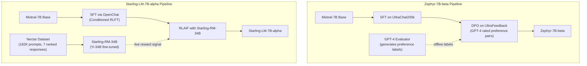
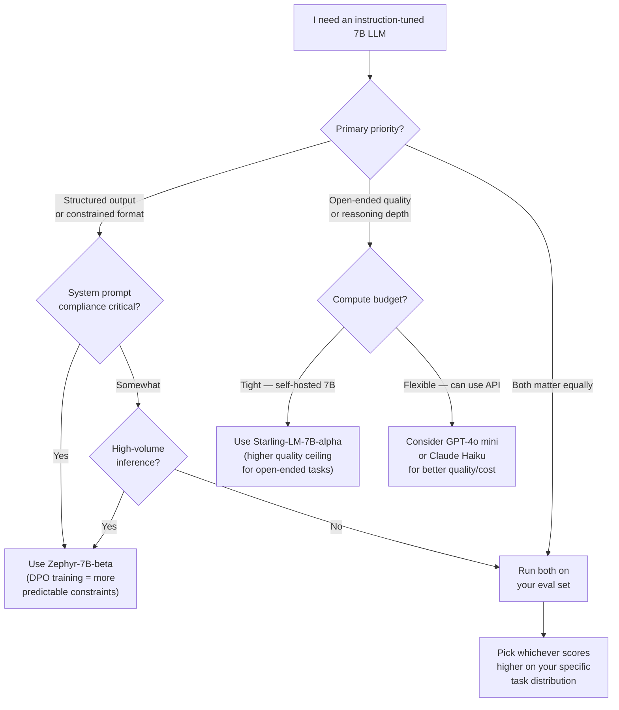

I spent a week in late 2025 running the same instruction set through six different open-weight models to find the best one for a production chatbot with a tight budget and a hard latency requirement. Zephyr-7B-beta kept outpunching its weight class. It was faster than I expected, it followed multi-step instructions more reliably than the base Mistral model it was built on, and it didn't refuse half my test prompts the way some RLHF-tuned models did. Then I ran Starling-LM-7B-alpha through the same battery and found a different profile — higher ceiling on open-ended generation, but slightly more verbose and less deterministic on constrained tasks.

Both models are worth understanding. Not because they're the newest things on the leaderboard — they're not — but because they represent two genuinely different philosophies for turning a capable base model into a reliable instruction follower. Understanding those philosophies makes you a better consumer of any fine-tuned LLM, including the ones that will ship next month.

## What Are Instruction-Tuned Models?

A base LLM — something like Mistral-7B or Llama 3 8B straight from pretraining — is a next-token prediction machine. Feed it a string of text and it will predict what comes next, based on patterns learned from hundreds of billions of tokens of internet text. That's it. It has no concept of "answer this question" or "follow these rules" or "be helpful but not harmful."

Instruction tuning changes that. The process takes the base model and exposes it to a dataset of (instruction, response) pairs, then trains it to produce the kind of response a human would consider good for that instruction. After instruction tuning, the model understands the difference between a system prompt and a user message, knows to respond to questions rather than just continue them, and has some concept of appropriate refusal.

But instruction tuning alone, via standard supervised fine-tuning (SFT), has a ceiling. The model learns to mimic the format of good responses, but it doesn't develop a strong preference for *correct* responses over *plausible-sounding* ones. That's where alignment methods — RLHF, DPO, RLAIF — come in. These techniques teach the model to prefer outputs that humans (or a learned reward model) rate more highly.

Zephyr and Starling both start from instruction-tuned bases and then apply different alignment approaches to push further. The differences in those approaches explain most of what you'll see in their benchmark profiles and real-world behavior.

## Zephyr Overview: DPO on UltraChat

Zephyr-7B-beta was released by Hugging Face's H4 team in October 2023. It's built on Mistral-7B and trained using a two-stage process that was notable at the time for achieving strong alignment without the expensive human labeling pipeline that RLHF traditionally requires.

**Stage 1: Supervised Fine-Tuning on UltraChat**

The first stage fine-tunes Mistral-7B on UltraChat200k, a filtered subset of the UltraChat dataset. UltraChat is a large synthetic dataset of multi-turn conversations generated by GPT-3.5-turbo. It covers a wide range of topics and conversation styles. The filtering step (to get the "200k" subset) removed low-quality or repetitive examples, giving Zephyr a solid instructable foundation before alignment begins.

This SFT stage alone produces a model that's already meaningfully better at following instructions than raw Mistral-7B. But the interesting part is what comes next.

**Stage 2: Direct Preference Optimization (DPO)**

Instead of training a separate reward model and running reinforcement learning (the classic RLHF pipeline), Zephyr uses **Direct Preference Optimization (DPO)**. DPO was introduced in a 2023 paper by Rafailov et al. and reformulates the RLHF objective as a supervised learning problem. You give the model pairs of responses — a preferred one and a rejected one — and directly optimize it to assign higher probability to the preferred response.

The preference data comes from **UltraFeedback**, a dataset where a large number of model responses were evaluated by GPT-4 and scored for instruction-following, honesty, helpfulness, and truthfulness. Each prompt in UltraFeedback has responses from multiple models (including GPT-4, Claude, and smaller open models), and GPT-4 rated them comparatively.

DPO's practical advantages are significant: no separate reward model to train, no RL instability, lower compute cost, and the whole pipeline is reproducible with standard supervised learning infrastructure. The H4 team reported training the entire Zephyr-7B-beta in a fraction of the compute that comparable RLHF runs require.

The result is a 7B model that — on chat benchmarks available at release — outperformed Llama 2 70B Chat and was competitive with GPT-3.5-turbo on many instruction-following tasks. That was a striking result for a 7B model in 2023, and it validated DPO as a credible alternative to full RLHF for alignment.

## Starling Overview: RLAIF with a Learned Reward Model

Starling-LM-7B-alpha was released by the LMSYS and Berkeley teams shortly after Zephyr, in November 2023. It uses the same base model (Mistral-7B, fine-tuned through OpenChat's SFT stage first) but takes a different approach to alignment: **Reinforcement Learning from AI Feedback (RLAIF)** with a dedicated reward model.

**The Reward Model: Nectar + Starling-RM**

The LMSYS team built a large preference dataset called **Nectar** — 182,000 prompts, each with 7 ranked responses generated by a mix of models including GPT-4, GPT-3.5-turbo, Claude, and others. A human labeling process assigned preference rankings across those responses. From Nectar, they trained **Starling-RM-34B**, a dedicated 34B reward model fine-tuned from Yi-34B.

That reward model is then used to provide feedback signals during the RL training of the 7B language model. Instead of DPO's direct preference pairs, Starling uses the reward model to score candidate responses and updates the language model's policy to maximize predicted reward — the classic RL-from-reward-model approach, but where the feedback comes from an AI system rather than direct human raters (hence "AI feedback").

**Why a 34B Reward Model for a 7B Policy?**

This is a deliberate design choice. A larger, more capable reward model can assess response quality more accurately than a smaller one. By using a 34B evaluator to train a 7B generator, you get a quality ceiling well above what the 7B model could achieve if it were evaluating its own outputs. This asymmetry is one reason Starling scores particularly well on open-ended generation quality benchmarks where nuanced judgment matters.

The tradeoff is cost: training a 34B reward model is substantially more expensive than DPO's preference-pair approach. But for groups with the compute resources, it produces a reward signal that generalizes better to novel prompts.

## Training Pipeline Comparison

The architectural difference between these two approaches is worth visualizing before we get to benchmarks.



The key structural difference: Zephyr's alignment signal is **static** — GPT-4 labels are computed offline, frozen into UltraFeedback, and then consumed by DPO. Starling's alignment signal is **dynamic** — the reward model generates scores on-the-fly during RL training and can evaluate responses it hasn't seen before. That's why Starling tends to generalize better on novel prompt types while Zephyr is more predictable on prompt types well-represented in UltraFeedback.

## Benchmark Performance

Let's look at the numbers. These are from the original papers and the Open LLM Leaderboard measurements at time of release in late 2023, plus MT-Bench scores which remain the most useful proxy for real instruction-following quality.

| Benchmark | Zephyr-7B-beta | Starling-LM-7B | Llama 2 70B Chat | GPT-3.5-turbo |
|---|---|---|---|---|
| **MT-Bench** | 7.34 | **8.09** | 6.27 | 7.94 |
| **AlpacaEval (win rate)** | 90.6% | **91.0%** | 92.7% | — |
| **MMLU** | 61.4% | 63.7% | **69.8%** | 70.0% |
| **TruthfulQA** | 57.0% | 60.0% | 45.6% | — |
| **HellaSwag** | 84.2% | 83.6% | **85.9%** | — |
| **ARC Challenge** | 62.0% | 60.9% | **65.4%** | — |

A few things stand out from this table:

**MT-Bench favors Starling.** MT-Bench measures multi-turn instruction following with GPT-4 as the judge. Starling's 8.09 puts it above GPT-3.5-turbo's 7.94 — a genuinely impressive result for a 7B model. The 34B reward model's broader coverage of response quality pays off here.

**Zephyr is competitive on constrained tasks.** ARC Challenge and HellaSwag test factual reasoning and commonsense respectively. These are not instruction-following benchmarks — they test knowledge and reasoning. Zephyr's DPO training doesn't hurt knowledge retention, and it stays competitive with Starling on these.

**Llama 2 70B is still ahead on knowledge benchmarks.** MMLU and HellaSwag both favor the larger model. Neither Zephyr nor Starling closes the full gap with a model 10x larger on knowledge-intensive tasks. The alignment gains are real, but they don't add new knowledge.

**TruthfulQA is interesting.** Both fine-tuned 7B models beat Llama 2 70B Chat substantially (57-60% vs 45.6%). This suggests the alignment training genuinely improves honesty and resistance to misleading questions — it's not just a formatting improvement.

```mermaid
xychart-beta
    title "Benchmark Comparison (higher = better)"
    x-axis ["MT-Bench /10", "MMLU %", "TruthfulQA %", "ARC %"]
    y-axis "Score" 0 --> 100
    bar [73.4, 61.4, 57.0, 62.0]
    bar [80.9, 63.7, 60.0, 60.9]
    bar [62.7, 69.8, 45.6, 65.4]
```



*Bars: Zephyr-7B-beta (blue), Starling-LM-7B-alpha (orange), Llama 2 70B Chat (green). MT-Bench scores multiplied by 10 to fit the same scale.*

## Running Locally

Both models are small enough to run on consumer hardware. Here's the practical setup.

### Zephyr-7B-beta with Ollama

The fastest path on Mac or Linux:

```bash
# Install Ollama if you haven't
curl -fsSL https://ollama.ai/install.sh | sh

# Pull Zephyr
ollama pull zephyr

# Run it
ollama run zephyr
```

Zephyr uses the ChatML prompt format. When hitting it via API or Python:

```python
from transformers import pipeline
import torch

pipe = pipeline(
    "text-generation",
    model="HuggingFaceH4/zephyr-7b-beta",
    torch_dtype=torch.bfloat16,
    device_map="auto",
)

messages = [
    {
        "role": "system",
        "content": "You are a helpful assistant. Answer questions accurately and concisely.",
    },
    {
        "role": "user",
        "content": "What is Direct Preference Optimization and why is it useful for LLM alignment?"
    },
]

prompt = pipe.tokenizer.apply_chat_template(
    messages,
    tokenize=False,
    add_generation_prompt=True
)

outputs = pipe(
    prompt,
    max_new_tokens=512,
    do_sample=True,
    temperature=0.7,
    top_k=50,
    top_p=0.95,
)
print(outputs[0]["generated_text"])
```

**Hardware requirements:**
- Quantized (Q4): ~4.5 GB VRAM — runs on any modern GPU, including Apple M-series with 8 GB unified memory
- bf16: ~14 GB VRAM — needs a 16 GB GPU or Apple M2 Pro/Max/Ultra
- Typical inference speed: 20–40 tokens/sec on M2 Pro, 60–100 tokens/sec on RTX 4090

### Starling-LM-7B-alpha with Transformers

Starling uses the OpenChat 3.5 prompt format:

```python
from transformers import AutoModelForCausalLM, AutoTokenizer
import torch

model_name = "berkeley-nest/Starling-LM-7B-alpha"
tokenizer = AutoTokenizer.from_pretrained(model_name)
model = AutoModelForCausalLM.from_pretrained(
    model_name,
    torch_dtype=torch.float16,
    device_map="auto"
)

# Starling uses OpenChat format
def format_prompt(user_message, system_message=None):
    if system_message:
        return f"GPT4 Correct System: {system_message}<|end_of_turn|>GPT4 Correct User: {user_message}<|end_of_turn|>GPT4 Correct Assistant:"
    return f"GPT4 Correct User: {user_message}<|end_of_turn|>GPT4 Correct Assistant:"

prompt = format_prompt(
    "Explain the difference between DPO and RLHF for LLM fine-tuning."
)

inputs = tokenizer(prompt, return_tensors="pt").to(model.device)
with torch.no_grad():
    outputs = model.generate(
        **inputs,
        max_new_tokens=512,
        temperature=0.7,
        do_sample=True,
        eos_token_id=tokenizer.eos_token_id,
    )

response = tokenizer.decode(outputs[0][inputs.input_ids.shape[1]:], skip_special_tokens=True)
print(response)
```

One practical note: Starling's prompt format differs from Zephyr's. If you're switching between the two in the same codebase, abstract the prompt formatting into a model-specific wrapper. Feeding Zephyr the OpenChat format (or vice versa) degrades output quality noticeably — the models were trained to expect their specific token sequences.

## Use Cases

These models are not good for everything, but they're excellent for specific things. Here's where I'd reach for each one.

**Zephyr shines at:**

- **Structured output generation** — asking it to produce JSON, YAML, or formatted lists reliably. The DPO training on high-quality examples makes it consistent at respecting output format constraints.
- **Constrained question answering** — tasks where the system prompt specifies rules (e.g., "only use information from the provided context," "always answer in three bullet points"). Zephyr holds its system prompt constraints better than Starling in my testing.
- **High-volume inference on a budget** — at 7B parameters, it's fast and cheap. If you're hitting this via a self-hosted endpoint at scale, the latency profile matters, and Zephyr's predictability is an asset.
- **Customer-facing chat where predictability matters** — Zephyr's refusal behavior is more consistent than Starling's, making it easier to audit and constrain for production chatbots.

**Starling shines at:**

- **Open-ended generation** — creative writing, brainstorming, and multi-turn conversations where nuance matters. The 34B reward model's quality ceiling shows up here.
- **Complex multi-step reasoning** — ask Starling to reason through a problem step by step and it tends to maintain coherence across longer chains. MT-Bench scores reflect this.
- **Developer tooling** — code generation and explanation. Starling was trained on diverse coding prompts in Nectar, and it handles ambiguous programming questions well.
- **Research and summarization** — where the quality of the output matters more than strict format adherence.

## Decision Flowchart



The flowchart above reflects what I actually do in practice. For most teams choosing between these two models, the answer is: run both on 50–100 examples from your actual workload, score the outputs, and let the data decide. The philosophical differences between DPO and RLAIF only translate into real workflow differences if your task is clearly in one camp or the other.

## Zephyr vs Starling vs Llama 3 8B Instruct

Since you're probably evaluating these against newer options, it's worth placing them in context of what's available now.

| Model | Method | MT-Bench | MMLU | Context Window | License |
|---|---|---|---|---|---|
| **Zephyr-7B-beta** | DPO | 7.34 | 61.4% | 32K | Apache 2.0 |
| **Starling-LM-7B-alpha** | RLAIF | 8.09 | 63.7% | 8K | CC-BY-NC-4.0 |
| **Llama 3 8B Instruct** | RLHF (Meta) | ~8.1 | 68.4% | 128K | Llama 3 Community |
| **Mistral 7B Instruct v0.3** | SFT | ~7.6 | 60.1% | 32K | Apache 2.0 |
| **Qwen2.5 7B Instruct** | DPO+RLHF | ~8.3 | 74.2% | 128K | Apache 2.0 |

The honest assessment: **Llama 3 8B Instruct and Qwen2.5 7B Instruct have largely superseded Zephyr and Starling** for new projects in 2026. Both offer better benchmark numbers, substantially longer context windows, and strong instruction-following without the caveats of the earlier models.

That said, there are reasons to still reach for Zephyr specifically:

- **Apache 2.0 license** — no commercial restrictions, unlike Starling's CC-BY-NC license or Llama 3's community license with its own terms. For products that need clean IP, Zephyr's license is unambiguous.
- **Stability** — Zephyr-7B-beta has been in production at enough companies that its failure modes are well-understood. Newer models sometimes surprise you.
- **DPO understanding** — if you're fine-tuning further (e.g., applying LoRA + DPO to a domain-specific dataset), starting from Zephyr gives you a model that's already familiar with the DPO-aligned behavior space. This can make your fine-tuning more efficient.

Starling's case is harder to make in 2026 unless you specifically need its reward model approach for research purposes. The CC-BY-NC license restricts commercial use, and the context window limitation (8K vs 128K for Llama 3) is a real constraint for anything involving long documents.

## Limitations

Being honest about what these models can't do saves you debugging time later.

**Zephyr-7B-beta limitations:**

- **Knowledge cutoff in 2023** — doesn't know about anything after its training data. Don't ask it about recent events without RAG.
- **No tool use or function calling** — not natively supported. You'd need a fine-tuning step or prompt engineering to get structured tool calls.
- **32K context, but degrades at long context** — while the context window is 32K tokens, quality degrades noticeably on tasks requiring synthesis across the full window. Reliable working range is more like 8–12K tokens.
- **Can still hallucinate confidently** — DPO alignment improves helpfulness and honesty metrics, but it doesn't eliminate hallucination. Always ground factual tasks with retrieved context.
- **Weaker on math** — arithmetic and multi-step math reasoning is a weak point for both models compared to models specifically trained with math data.

**Starling-LM-7B-alpha limitations:**

- **CC-BY-NC license** — cannot be used in commercial products without a license from the original authors. This is a hard blocker for many production deployments.
- **8K context window** — significantly shorter than Zephyr's 32K or modern models' 128K. Long-document tasks are off the table without chunking.
- **More verbose** — Starling tends toward longer responses than Zephyr. This is fine for quality but increases token count and latency in production.
- **Less predictable on constrained format tasks** — the RLAIF training optimizes for quality, which sometimes means the model prefers a longer, more nuanced response over a short, format-compliant one.

## Verdict

If I had to make a clean recommendation for a team evaluating these two models today:

**Use Zephyr-7B-beta if:**
- You need a permissively licensed (Apache 2.0) 7B model for commercial use
- Your task involves following strict system prompt constraints or producing structured outputs
- You want a well-understood, stable model for production

**Use Starling-LM-7B-alpha if:**
- You're doing research on RLAIF methods and want to study or extend the pipeline
- Your task is open-ended generation where quality ceiling matters and commercial use isn't required
- You're building on top of the OpenChat ecosystem

**Use Llama 3 8B Instruct or Qwen2.5 7B Instruct for new projects in 2026:**
- Better benchmarks across the board
- Much longer context windows (128K tokens)
- Strong community support and active development
- Llama 3's community license is permissive enough for most commercial use

Zephyr was a landmark when it shipped — it proved that DPO could produce a 7B model that beat Llama 2 70B at instruction following. Starling proved that a well-trained reward model could push even further. Both were important research contributions that influenced how the field thinks about alignment for open-weight models. The techniques they pioneered — DPO in particular — are now standard components of every major open-weight model's training pipeline.

Understanding why they work the way they do makes you a better builder, even if you end up running Llama 3 or Qwen in production.

---

## Frequently Asked Questions

### What is the Zephyr LLM and who made it?

Zephyr-7B-beta is a 7B parameter instruction-tuned language model released by Hugging Face's alignment team (the H4 team) in October 2023. It's built on Mistral-7B and trained with supervised fine-tuning on UltraChat200k followed by Direct Preference Optimization (DPO) on the UltraFeedback dataset. It was notable for achieving GPT-3.5-turbo-level instruction following at 7B parameters, which was unprecedented at the time of release.

### What is the difference between DPO and RLHF for instruction-tuned LLMs?

RLHF (Reinforcement Learning from Human Feedback) trains a separate reward model from human preference data, then uses reinforcement learning to optimize the language model's policy to maximize predicted reward. DPO (Direct Preference Optimization) skips the separate reward model entirely. Instead, it directly optimizes the language model on preference pairs (a preferred response and a rejected response) using a supervised objective derived from the RLHF reward function. DPO is simpler, cheaper, and more stable to train, while RLHF with a large reward model can achieve a higher quality ceiling because the reward model can generalize more flexibly to novel prompts.

### Can I use Zephyr or Starling commercially?

Zephyr-7B-beta is released under the Apache 2.0 license, which permits commercial use without restriction. Starling-LM-7B-alpha is released under a CC-BY-NC 4.0 license, which prohibits commercial use. If you need a commercially deployable model, Zephyr is the safer choice between the two. Llama 3 8B Instruct's community license also permits most commercial uses for companies under a certain scale — check Meta's specific terms.

### How do Zephyr and Starling compare to newer models like Llama 3 8B?

On most benchmarks measured at equivalent dates, Llama 3 8B Instruct matches or exceeds both Zephyr-7B-beta and Starling-LM-7B-alpha, particularly on knowledge benchmarks (MMLU) and reasoning tasks. The bigger practical difference is the context window: Llama 3 8B supports 128K tokens vs Zephyr's 32K and Starling's 8K. For new projects in 2026, Llama 3 8B Instruct or Qwen2.5 7B Instruct are better choices for most applications. Zephyr remains relevant primarily for its Apache 2.0 license and its established track record in production deployments.

### What prompt format does Zephyr use, and does it matter?

Yes, it matters significantly. Zephyr uses the ChatML format with `<|system|>`, `<|user|>`, and `<|assistant|>` tokens. Starling uses the OpenChat format with `GPT4 Correct User:` and `GPT4 Correct Assistant:` prefixes. Using the wrong prompt format degrades output quality noticeably — the model was trained to recognize its specific token sequences as structural signals. Always use the official chat template via `tokenizer.apply_chat_template()` in the Hugging Face Transformers library rather than constructing prompts manually, and verify you're loading the correct tokenizer for each model.
