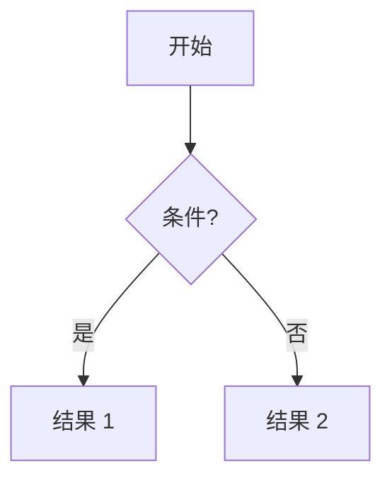
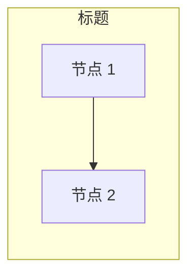
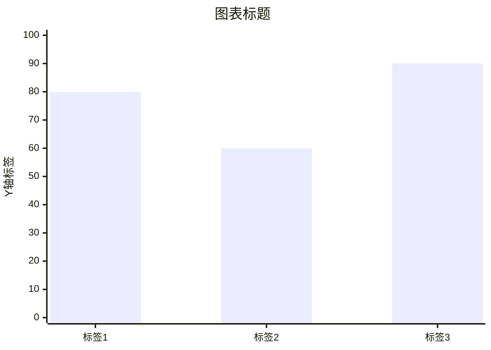
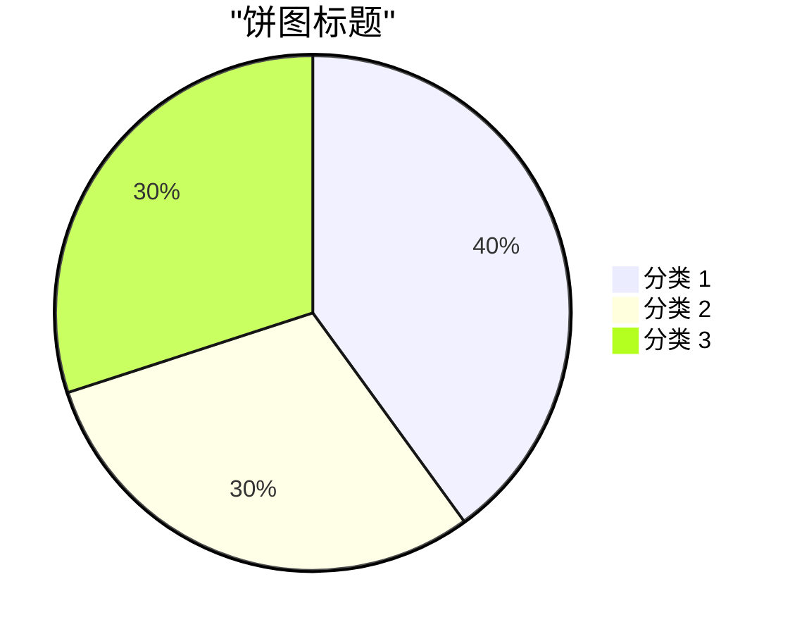

# AI Tools Hub SEO 优化与 Google Ads 盈利策略

## 网站信息

- 域名：https://aiatoolshub.site
- 定位：AI tool 文章站，靠 Google Ads 盈利
- AdSense Publisher ID：ca-pub-7116442036465415
- 部署平台：Vercel
- 技术栈：Next.js 16 + Markdown 文章 + Mermaid 图表

## 已完成的 SEO 修复（2026-04-29）

### P0
- **sitemap.xml**：`src/app/sitemap.ts`，动态生成所有文章和分类页 URL
- **robots.txt**：`src/app/robots.ts`，允许全站爬取，屏蔽 /search，指向 sitemap
- **文章日期分散**：100 篇文章从 2025-11 到 2026-04 均匀分布（原来全部是 2026-04-26）

### P1
- **metadataBase**：layout.tsx 设置 `https://aiatoolshub.site`
- **Canonical URL**：全局 `alternates.canonical`
- **Twitter Card**：`summary_large_image`
- **内容质量**：97 篇文章去除标题在正文中的机械重复

### P2
- **Blog 列表页**：`src/app/blog/page.tsx`，/blog 入口展示全部文章
- **RSS Feed**：`src/app/feed.xml/route.ts`
- **结构化数据**：首页 WebSite JSON-LD + 分类页 CollectionPage JSON-LD
- **Nav 导航**：新增 Blog 链接
- **RSS `<link>`**：head 中添加 RSS alternate link

### P3
- **Search 页 noindex**：防止搜索页被索引

## Google Search Console

- Sitemap 已提交，状态"成功"，发现 110 个网页
- 新文章发布后，在 Search Console 顶部"检查任意网址"输入 URL → 点击"请求编入索引"，可加速到 24-48 小时内被索引
- 每日配额约 10-20 次，只对新文章使用

## Google Ads 盈利策略

### 内容策略
- 写**高商业价值关键词**的文章（对比、替代品、定价），不要写纯技术原理科普
- 判断标准：Google 搜索该词是否有广告出现（有广告 = 高 CPC）
- 优先写月搜索量 500-5000、竞争中低的长尾词
- 每周稳定发 2-3 篇

### 广告优化
- 开启 AdSense 自动广告
- 文章保持 1500+ 词，Google 能插入更多广告
- 添加锚定广告（Anchor ads）
- 避免广告过密影响排名

### 流量增长
- Reddit（r/artificial, r/ChatGPT）、Hacker News、Twitter/X 分享引流
- 建立内链体系：每篇文章链接 3-5 篇相关文章
- 争取外链：投稿、Product Hunt
- 目标：月均 UV 10,000+ → AdSense 约 $300-1000/月
- 长期目标：月 PV 50,000+ 后切换到 Mediavine/Raptive（RPM 是 AdSense 3-5 倍）

## 高 CPC 关键词清单

### Tier 1: 商业对比类（CPC $3-10）

| 关键词 | 预估 CPC | 月搜索量 | 文章标题建议 |
|---|---|---|---|
| chatgpt vs claude | $4-8 | 15K+ | ChatGPT vs Claude: Which AI Is Better in 2026? |
| jasper ai alternatives | $6-10 | 5K | 7 Best Jasper AI Alternatives (Free & Paid) |
| github copilot vs cursor | $4-7 | 8K | GitHub Copilot vs Cursor: Honest Developer Review |
| claude api pricing | $5-9 | 3K | Claude API Pricing Breakdown: Is It Worth It? |
| best ai coding assistant | $4-8 | 10K | Best AI Coding Assistants for Developers 2026 |
| grammarly vs chatgpt | $5-8 | 6K | Grammarly vs ChatGPT for Writing: Which Saves More Time? |
| notion ai vs chatgpt | $4-7 | 4K | Notion AI vs ChatGPT: Which Productivity Tool Wins? |
| midjourney vs dall-e | $3-6 | 8K | Midjourney vs DALL-E 3: AI Image Generation Compared |

### Tier 2: "Best X for Y" 列表类（CPC $2-6）

| 关键词 | 预估 CPC | 月搜索量 | 文章标题建议 |
|---|---|---|---|
| best ai tools for small business | $5-8 | 6K | 10 Best AI Tools for Small Business (2026) |
| best ai writing tools | $4-7 | 12K | Best AI Writing Tools: Tested & Ranked |
| best ai for customer service | $5-10 | 3K | Best AI Chatbots for Customer Service |
| best ai email assistant | $3-6 | 4K | Best AI Email Assistants to Save Hours Per Week |
| best ai tools for marketing | $4-8 | 7K | Best AI Marketing Tools That Actually Work |
| best ai video generator | $3-5 | 10K | Best AI Video Generators: Free vs Paid |
| best ai for excel | $3-6 | 5K | Best AI Tools for Excel & Spreadsheets |
| best ai scheduling assistant | $4-7 | 2K | Best AI Scheduling Tools for Teams |

### Tier 3: Pricing / 商业意图类（CPC $3-8）

| 关键词 | 预估 CPC | 月搜索量 | 文章标题建议 |
|---|---|---|---|
| openai api cost calculator | $5-9 | 4K | OpenAI API Cost Calculator: How Much Will You Spend? |
| chatgpt enterprise pricing | $6-10 | 3K | ChatGPT Enterprise Pricing: Full Breakdown |
| ai chatbot pricing comparison | $5-8 | 2K | AI Chatbot Pricing Compared: 8 Platforms Side by Side |
| claude pro worth it | $4-7 | 3K | Is Claude Pro Worth $20/Month? Honest Review |
| cursor ai pricing | $3-6 | 5K | Cursor AI Pricing Plans Explained |
| ai api cost comparison | $4-8 | 2K | AI API Cost Comparison: GPT vs Claude vs Gemini |

### Tier 4: "How to" 商业教程类（CPC $2-5）

| 关键词 | 预估 CPC | 月搜索量 | 文章标题建议 |
|---|---|---|---|
| how to build ai chatbot | $3-6 | 8K | How to Build an AI Chatbot (Step-by-Step) |
| how to use claude api | $3-5 | 4K | How to Use Claude API: Complete Tutorial |
| how to automate with ai | $3-6 | 3K | How to Automate Your Workflow with AI |
| how to use chatgpt for business | $4-7 | 6K | How to Use ChatGPT for Business: Practical Guide |
| how to fine tune llm | $2-4 | 3K | How to Fine-Tune an LLM for Your Use Case |
| how to use ai for seo | $4-8 | 5K | How to Use AI for SEO: Tools & Strategy |

### 优先写的 Top 10

1. **best ai tools for small business** — CPC 高、搜索量大、中小站能竞争
2. **jasper ai alternatives** — 替代品类购买意图极强
3. **chatgpt vs claude** — 搜索量巨大，已有相关文章可优化
4. **best ai writing tools** — 搜索量大，广告主多
5. **ai api cost comparison** — 已有这篇，优化内容即可
6. **how to use ai for seo** — 和自身定位高度匹配
7. **best ai coding assistant** — 开发者群体 CPC 高
8. **claude pro worth it** — 低竞争长尾词，容易排上去
9. **cursor ai pricing** — 热门工具，搜索量增长快
10. **best ai for customer service** — 企业级关键词 CPC 最高

## 文章改写方法论（模板）

### 问题诊断

原始 100 篇文章存在严重的 AI 生成痕迹：
1. **所有文章结构完全一样**：What It Really Means → Where It Creates Value → A Practical Architecture → How to Evaluate Quality → Implementation Plan → Common Mistakes → Recommended Stack → Decision Checklist → FAQ → Final Takeaway
2. **FAQ 5 个问题完全相同**："Is this only for advanced AI teams?" / "What is the biggest risk?" / "How long does adoption take?" / "Should we build or buy?" / "How should success be measured?"
3. **正文内容 95% 一样**：只是替换了几个关键词，一篇 "Claude vs ChatGPT" 的文章里完全没有提到两个产品的任何实际差异
4. **标题在正文中机械重复**：每篇 12 次以上

### 改写原则

1. **每篇文章必须有独特的章节结构**，不能使用统一模板
2. **内容必须与标题主题直接相关**：对比文章要有真实的功能对比，评测文章要有实际使用体验
3. **文章开头用 hook 吸引读者**，不要用 "This topic is..."
4. **加入具体数据**：真实定价、上下文窗口大小、基准测试分数
5. **使用第一人称编辑语气**："In our testing..."、"What surprised us..."
6. **加入视觉元素**：Mermaid 图表（流程图、架构图、对比图、饼图）

### 按文章类型的改写结构模板

#### 对比类文章（"X vs Y"）
```
- Hook 开场（2-3 句）
- TL;DR（blockquote 快速结论）
- Quick Comparison（对比表格）
- 功能维度 1（具体对比 + Mermaid 图）
- 功能维度 2
- 功能维度 3
- Pricing Breakdown（定价表 + Mermaid 定价架构图）
- Who Should Pick Which?（按场景推荐）
- Our Verdict（明确结论）
- FAQ（3-5 个与主题相关的独特问题）
```

#### 买家指南 / 列表类文章（"Best X"）
```
- Hook 开场
- Our Top Picks（blockquote 快速推荐）
- 各工具独立评测（每个含：功能概述、定价、Best for、Pros/Cons、结论）
- Head-to-Head Comparison（大对比表 + Mermaid 对比图）
- How to Choose（Mermaid 决策树流程图）
- Open-Source Alternatives（简要提及）
- Final Recommendations
```

#### 产品评测类文章（"X Review"）
```
- Hook 开场
- What Is X?（简介）
- Key Features（核心功能 + Mermaid 功能架构图）
- Setup / Getting Started
- Real-World Usage（使用体验日记风格 + Mermaid 工作流程图）
- X vs 竞品（简要对比）
- Pricing（定价分析 + Mermaid 定价图）
- The Rough Edges（诚实缺点）
- Who Should Use X?
- Pros/Cons Summary
- The Verdict（评分 + 推荐）
```

#### 定价对比类文章（"X Pricing / Cost"）
```
- Hook 开场
- Quick Price Comparison（大定价表 + Mermaid 柱状图）
- 各厂商独立定价分析
- Real Cost Examples（3 个场景的实际成本计算 + Mermaid 饼图）
- Hidden Costs（隐藏成本分析）
- Cost Optimization Tips（Mermaid 优化流程图）
- Which Gives Best Value?
- Our Recommendation
```

### Mermaid 图表技术实现

#### 架构说明
- `src/components/MermaidDiagram.tsx`：客户端组件，用 `mermaid.render()` 渲染 SVG
- `src/components/MarkdownContent.tsx`：客户端组件，包装 ReactMarkdown，拦截 ` ```mermaid ` 代码块
- `src/app/blog/[slug]/page.tsx`：使用 `<MarkdownContent>` 替代直接 `<ReactMarkdown>`

#### Markdown 中使用 Mermaid

在文章 .md 文件中直接写 mermaid 代码块即可，会自动渲染：

##### 流程图（决策树、工作流）
````

````

##### 架构图（产品功能、市场格局）
````

````

##### 柱状图（基准测试、价格对比）
````

````

##### 饼图（成本分布、市场份额）
````

````

### 改写操作流程

1. 读取目标文章，保留 frontmatter（title, date, slug, heroImage, tags）
2. 重写 description 为 120-155 字符的真实 meta description
3. 按照文章类型选择对应结构模板
4. 写 2000-3000 词的原创内容，包含具体产品细节
5. 每篇插入 3 个 Mermaid 图表（流程图/架构图/柱状图/饼图混合使用）
6. 确保每篇文章的章节结构、FAQ 问题、开头风格都不同
7. `npm run build` 验证

### 已改写的 5 篇文章（2026-04-29）

| 文件 | 类型 | 词数 | Mermaid 图 |
|------|------|------|------------|
| `2026-01-06-claude-vs-chatgpt-better-for-developers.md` | 对比类 | 2772 | 决策流程图 + 基准柱状图 + 定价架构图 |
| `2026-02-02-github-copilot-vs-cursor-ai-coding-tool-comparison.md` | 对比类 | 2225 | 功能架构图 + Agent 流程图 + 定价对比图 |
| `2025-11-30-ai-coding-assistants-complete-buyers-guide-2026.md` | 买家指南 | 3237 | 市场格局图 + 功能评分图 + 选型决策树 |
| `2026-01-12-cursor-ai-code-editor-developers-love.md` | 产品评测 | 2274 | 功能架构图 + Composer 流程图 + 定价方案图 |
| `2026-04-25-ai-apis-cost-comparison-claude-openai-gemini.md` | 定价对比 | 2792 | 价格柱状图 + 成本饼图 + 优化策略流程图 |

### 待改写的文章（95 篇）

剩余 95 篇仍使用旧模板结构，需要按以上方法逐步改写。优先改写高 CPC 关键词对应的文章。
